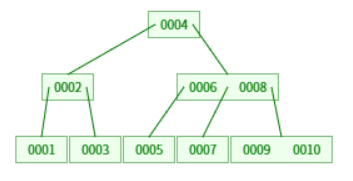

# 索引详解

**通俗定义：**索引是帮助MySQL**高效获取数据且已排序**的数据结构。

## 基础数据结构

**基础数据结构：**平衡二叉树、红黑树、==**B-Tree**==、==**B+Tree**==以及Hash表。

### 二叉树

比如现有一张表如下：

| 磁盘地址 | ID     | NUM    |
| -------- | ------ | ------ |
| 0x07     | 1      | 34     |
| 0x87     | 2      | 77     |
| 0x6A     | 3      | 5      |
| 0x99     | 4      | 91     |
| 0x76     | 5      | 22     |
| 0xD1     | 6      | 89     |
| 0xFE     | 7      | 23     |
| ......   | ...... | ...... |

现在如果要给**NUM**列用平衡二叉树做索引，如图所示：


如果我们要去搜寻**89**这个值，全表扫描需要进行6次搜索判断才能找到，但是此时只需要2次搜索判断，这里就能体现建立索引**高效获取数据**，如果仔细观察，从左往右看，会发现数据是从大到小进行排列的，进而**已排序**的特点也显示了出来，但是在数据库索引中没有平衡二叉树结构，接下来举一个反例，如果我们给**ID**列用平衡二叉树做索引，如图所示：


当我们要去搜索**1**这个值，全表扫描只需要进行1次搜索判断就可找到，但是在平衡二叉树中需要搜索3次，而且这不仅仅是平衡二叉树的缺点，对于顺序结构的数据而言，二叉树普遍都具有这样的不确定性。

### 红黑树

为了尽可能避免上述那样的不确定性，红黑树或许就可以进行功能改良，如图所示：


此时虽然去搜索**1**这个值还是不及全表扫描，但是当搜索其他值时都比全表扫描要更快，只可惜数据库索引中也没有使用红黑树做索引基础结构，最主要的原因是在数据量巨大的情况下树的高度会非常庞大，不仅是红黑树有这样的问题，上述平衡二叉树，甚至是二叉树都具有这样的问题。及时出现了严重问题，也再一次印证“高效获取数据且已排序”的特点。

### B-Tree

这个时候B-Tree（B树）就站了出来，他也是目前数据库索引中会用到的（其实只是会，但不多的这么一个角色），接下来看看B-Tree如何构建上面这个**ID**列：



简而言之，就是不要使用“二叉”，而是“N叉”，从数据库这个实际场景出发，B-Tree理论可以把千万条数据用3层或者4层数据扇叶维护起来，上图仅仅是单从数据的角度进行分析，下图就展示了数据库中实际的使用示例：


**特点如下：**

1、叶子节点都具有相同的深度且都没有下一级指针（这点可以和B+Tree进行对比来看）。

2、所有索引的元素都不重复，即没有数据冗余（这一点需要和B+Tree做对比才能解释，这里就理解成树中不会维护相同的索引值）。

3、节点中的数据索引从左到右递增排列。

4、所有节点均同时维护索引值和其对应的数据（这一点也需要和B+Tree做对比）。

先说说**优点**：

1、将搜索次数进行了可控限制，即上述说到的3层或者4层，也就意味着最多搜索3次或者4次。总所周知实际电脑磁盘上是具有扇叶的，B-Tree和其他二叉树的区别就在于把维护元素转变为了维护扇叶，扇叶上可以具有多个元素（当然哈，这里的扇叶只是一种概念，和实际的扇叶没多大关系）。

2、完全符合**高效获取数据且已排序**的特点，每次一搜索都会向内存中加载一个扇叶，还能对每个扇叶或者扇叶之间的数据进行大小的比对（这里不要有疑惑，向内存中加载一个数据进行处理和向内存中加载一个扇叶数据进行处理性能差别微乎其微，不要杠，不要举异常极端的例子）。

### B+Tree

如果要说B-Tree的缺点那就必须先把**B+Tree**（B加树）抬出来进行一番对比，还是上面以ID列为基础建立索引：


从这里就可以对比B-Tree中提到的特点1和特点2，B+Tree中的叶子节点是具有下一级指针的，且指向值最接近的比自身大的数。而且数据是有冗余的，比如第二层的0003和第三层的0003其实是一个索引值，看似变复杂了，接下来看看数据库中B+Tree具体如何展现：


**特点如下：**

1、非叶子节点不存储数据，只存储索引，这样确实造成了冗余，但是可以极大释放更多空间来存储更多索引。

2、叶子节点中包含了所有索引及其对应的数据。

3、在数据库中，B+Tree的叶子节点形成了一个双向链表，而不再是普通的单向链表。

这里做一个有趣的实验，我们先查询一下在MySQL数据库中每个扇叶最大存放空间是多少？

```sql
SHOW GLOBAL STATUS LIKE 'Innodb_page_size';
```

答案是16KB（这个值是生产环境实验所得，不用纠结为什么是16KB）：


就以上图为例进行一个计算，一个非叶子节点存储索引值大小设置为8B，节点指针设置为6B，那么一个扇叶可以存放$(16×1024)/(8+6)≈1170$个索引，就算树的高度为3，第一层扇叶存放1170个索引，指向第二层1170个扇叶。再假设第三层每个扇叶中索引、指针和数据大小相加为1KB（对于一条数据库数据来说1KB已经很大了），第三层每个扇叶也可以存放16个数据节点，稍作计算即可得出一个惊人结论：数据库中索引数据结构所管理的数据量存在理论值为$1170×1170×16=21902400$。简单点说一张表可以用索引维护2000W条数据，如果B+Tree有四层呢？

==**B+Tree是重点中的重点，一定要熟悉其大致结构和特点。**==

### Hash表

和B+Tree相比，Hash表结构就是另一类数据库中所支持的索引基础数据结构，以**NUM**列数据为基础建立索引结构如图所示：


**特点如下：**

1、对索引值的Key值进行一次Hash计算就可以定位出数据存储的位置，很多时候Hash表索引比B+Tree索引更加高效。

2、老生常谈的Hash冲突问题，即Hash这样的摘要算法不可能描述所有值，必定会存在两个值Hash值相同，此时查询就会变得不可靠，但是也有一定的解决方案：链式地址（上图所示）、开放寻址、平方探测以及再哈希法。

3、也是一个致命问题，Hash表索引仅能够满足“=”，“IN”这样的等值查询，无法支持范围查询，而范围查询也正是B+Tree的强项，因为数据库中的B+Tree根节点数据有双向指针的，如果要进行范围查询，只需要检索到最大值和最小值，再利用指针进行范围判断即可。

## 数据库表引擎

一般听到最多的说法应该是数据库引擎，但是这里的引擎最终是作用于表上，所以严谨来讲应该是数据库表引擎。目前MySQL中最主流的引擎有**InnoDB**和**MyISAM**两类（其实现在属于InnoDB一家独大啦），下面全是基于MySQL8进行分析。

### MyISAM引擎

其实引擎之间最明显的一个特点就是磁盘上存储文件的存在形式，这里有两张表，一张是InnoDB引擎所驱动的表，另一张是MyISAM引擎所驱动的表：


现在先来看一下MyISAM引擎数据在磁盘上的存储形式：


`.MYD` 格式文件中存储的是表中的实际数据，`.MYI` 格式文件中存储的是表中的索引数据，可以看出来在MyISAM引擎驱动的表文件中，索引和数据是分离的，此时有一个专有名词来形容这种情况——**非聚集索引**，具体怎么解释呢，先看下图：


B+Tree部分表示的就是索引文件，蓝色表格部分表示的就是数据文件，索引流程大致是这样：MySQL先尽可能通过索引文件去查询数据所在的地址，假设需要查询Col1值为15的数据信息，则索引文件最后可以搜索到0x07这个地址，随后MySQL会根据0x07地址去数据文件中查询真实的数据信息，查询结果为[15,34,Bob]，这种情况也有一个专有名词来形容——**回表操作**，即无法通过一次查询把真实数据索引出来的情况，由此可见回表操作在MyISAM引擎所驱动的表中天然存在且至少一次。要明白回表本质就是增加一次I/O操作，肯定是不及内存操作效率高的。

### InnoDB引擎

接下来对比InnoDB引擎实际磁盘文件形式：


很显然，InnoDB引擎所驱动的表就只有一个磁盘文件，里面同时包含了数据和索引，再看实际存储图例之前首先明确InnoDB引擎实现的一部分特点：

1、表数据文件本身就是按照B+Tree组织的一个索引结构文件。

2、InnoDB所驱动的表天然自带一个主键ID，如果建表的时候没有设置主键，那么会默认主键为`rowID`，主键是InnoDB引擎组织B+Tree树结构的关键，这同时也说明其天然带有一个“主键索引”。

3、主键索引时，叶子节点包含了完整的数据记录，这个记录中通常不止该条数据中的所有字段属性，可能还包含一些表属性。

接下来带着上述特点观察下面两张图，第一张是主键索引示例图，第二张是二级键索引示例图：


根据示例图可以明显看出平时工作中使用到的`xxxById`操作在执行查询操作时可以一次性把一整条数据查出，因此不会发生回表操作，效率极高。如果我们建立了二级键，通过`xxxByName`操作去查询，首先会通过B+Tree索引树找到该条数据的主键ID，然后再回表操作，通过主键B+Tree索引树找到该条数据的完整信息。

接下来可以思考下面这些问题：

**1、为什么建议InnoDB引擎驱动的表建表时必须设置主键，并且推荐整型的递增主键？**

这个问题有三个要点，第一是必须设置主键，第二是整型主键，第三是递增主键。

“必须设置主键”可以使主键索引结构保持可控，如果不设置，索引树中依旧会存放`rowID`作为主键值，也就是索引树中会无形多存放一份`rowID`，最终就是得不偿失，表的可维护性差。

“整型主键”很好理解，举例来说，对比1234和1235两数大小的效率肯定是比对比"1234"和"1235"两字符串大小的效率高很多的，毕竟字符串对比遵循ASCII编码逐位比较的原则进行的，这也侧面说明了UUID并不适合作为InnoDB引擎驱动的表主键。

“递增主键”很有说法，这要回到索引的定义中最重要的要点之一：已排序，在B+Tree的构建过程中会存在分裂和重排序等操作，如果在构建主键索引时主键是递增的，那么分裂和重排序所影响的部分是可控且最小的，下面第一张动图是递增主键排序过程，第二张动图是无序主键排序过程，对比一下就知道了：


**2、为什么非主键索引结构（比如二级键索引结构）叶子节点存储的是主键值？**

其实这个问题很好解释，由于在InnoDB引擎所驱动的表中最重要的索引结构就是主键索引，所以在其他索引结构中均存放主键的值可以便于拿到主键去进行主键索引查询完整信息，进而非主键索引就可以不用存储多余重复的数据信息，简而言之说官方一点就是**保持数据一致性和节省存储空间**，这也会体现出一个问题，就是非主键索引并不能一次查询出完整数据，依旧会执行回表操作。

**3、联合索引的底层存储结构长什么样子？**

首先需要明白什么是联合索引，最好理解的联合索引就是复合主键，在Navicat中的建表形式如下图：


然后再来看底层存储示例图，根据图片做出一定解释：


实际建索引如下图所示：


此时就可以给 `('name','age','position')` 看成一个元组，元组不可变的特性也就维持了字段的顺序，即第一位是`name`，第二位是`age`，第三位是`position`，这里就需要引出一个重要概念叫做**“最左前缀原则”**，它在一定程度上会决定一个查询条件是否使用该索引，最理想的状态如下：

```sql
where name=? and age=? and position=?
```

这样的顺序，不仅可以刚好覆盖索引列，不多不少，还完全满足元组顺序，符合“最左前缀原则”，再比如：

```sql
where name=? and age=?
```

也能激活索引，因为覆盖大部分索引列，且满足元组顺序，符合“最左前缀原则”。

回过头来，此时这个元组就可以看作为一个“主键”，如何使用这个特殊的“主键”结构呢？下面有三条SQL语句，可以判断一下哪一条SQL语句会通过索引进行查询：

```sql
# 会激活索引
SELECT * FROM `t_testinnodb` WHERE t_testinnodb.`name` = 'Bill' AND t_testinnodb.`age` = 30 AND t_testinnodb.`position` = 'dev'; 

# 会激活索引
SELECT * FROM `t_testinnodb` WHERE t_testinnodb.`name` = 'Bill' AND t_testinnodb.`age` = 30 AND t_testinnodb.`position` = 'dev' AND t_testinnodb.`birthday` = '2024-11-05'; 

# 会激活索引
SELECT * FROM `t_testinnodb` WHERE t_testinnodb.`name` = 'Bill' AND t_testinnodb.`age` = 30; 

# 会部分激活索引，因为查询条件中包含索引中不存在的列项
SELECT * FROM `t_testinnodb` WHERE t_testinnodb.`name` = 'Bill' AND t_testinnodb.`age` = 30 AND t_testinnodb.`birthday` = '2024-11-05'; 

# 会部分激活索引，因为不完全满足最左前缀原则
SELECT * FROM `t_testinnodb` WHERE t_testinnodb.`name` = 'Bill' AND t_testinnodb.`position` = 'dev'; 

# 会部分激活索引，因为不完全满足最左前缀原则
SELECT * FROM `t_testinnodb` WHERE t_testinnodb.`name` = 'Bill' AND t_testinnodb.`position` = 'dev' AND t_testinnodb.`birthday` = '2024-11-05'; 

# 会部分激活索引，因为查询条件没有覆盖大部分索引列
SELECT * FROM `t_testinnodb` WHERE t_testinnodb.`name` = 'Bill';

# 会部分激活索引，因为查询条件没有覆盖大部分索引列
SELECT * FROM `t_testinnodb` WHERE t_testinnodb.`name` = 'Bill' AND t_testinnodb.`birthday` = '2024-11-05';

# 不会激活索引，因为完全不满足最左前缀原则
SELECT * FROM `t_testinnodb` WHERE t_testinnodb.`age` = 30 AND t_testinnodb.`position` = 'dev'; 

# 不会激活索引，因为完全不满足最左前缀原则
SELECT * FROM `t_testinnodb` WHERE t_testinnodb.`age` = 30 AND t_testinnodb.`position` = 'dev' AND t_testinnodb.`birthday` = '2024-11-05'; 

# 不会激活索引，因为完全不满足最左前缀原则
SELECT * FROM `t_testinnodb` WHERE t_testinnodb.`age` = 30; 

# 会激活索引，虽然完全不满足最左前缀原理，但是所有查询字段恰好全部覆盖，优化器会自动将字段进行排序
SELECT * FROM `t_testinnodb` WHERE t_testinnodb.`age` = 30 AND t_testinnodb.`position` = 'dev' AND t_testinnodb.`name` = 'Bill'; 
```

到此为止不仅解释了联合索引底层长什么样子，还拓展了“最左前缀原则”的概念实现，接下来还有一个点需要说明，在这个例子中，B+Tree叶子节点存储的是`birthday`数据，这仅是为了体现联合索引的表现形式，绝大多数情况下非主键索引还是存储主键的，这个普世原则永远不会改变，所以联合索引就是非聚集索引，依旧需要进行回表操作，最终用主键索引去查询结果。

## 总结

上述内容完美解释了一下6个问题：

1、索引数据结构通常有哪些？

2、千万级数据表如何使用B+Tree索引快速查找？

3、聚集索引和非聚集索引是什么？

4、为什么总是推荐使用递增主键作为索引？

5、联合索引底层数据结构是什么样子？

6、MySQL最左前缀优化原则是怎么回事？