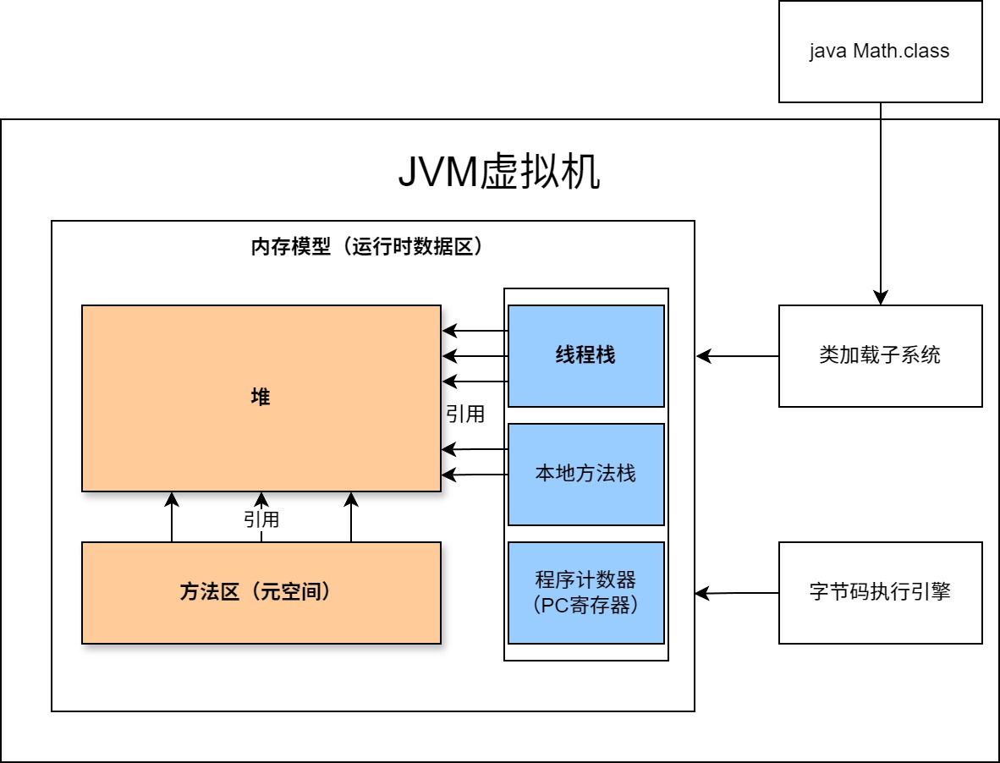
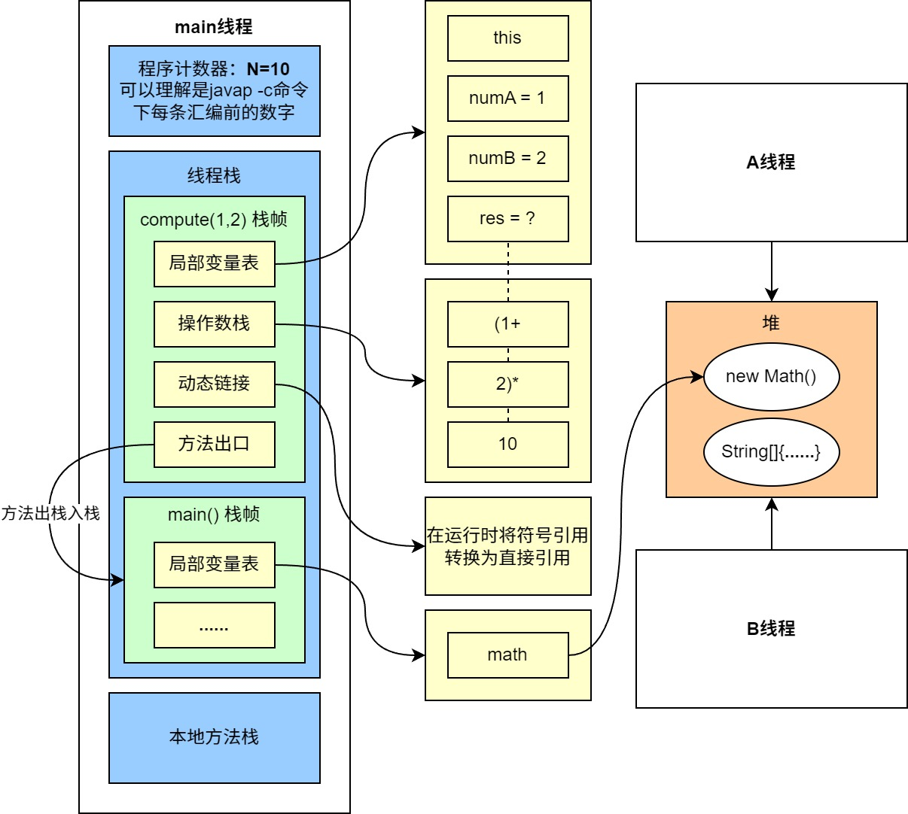
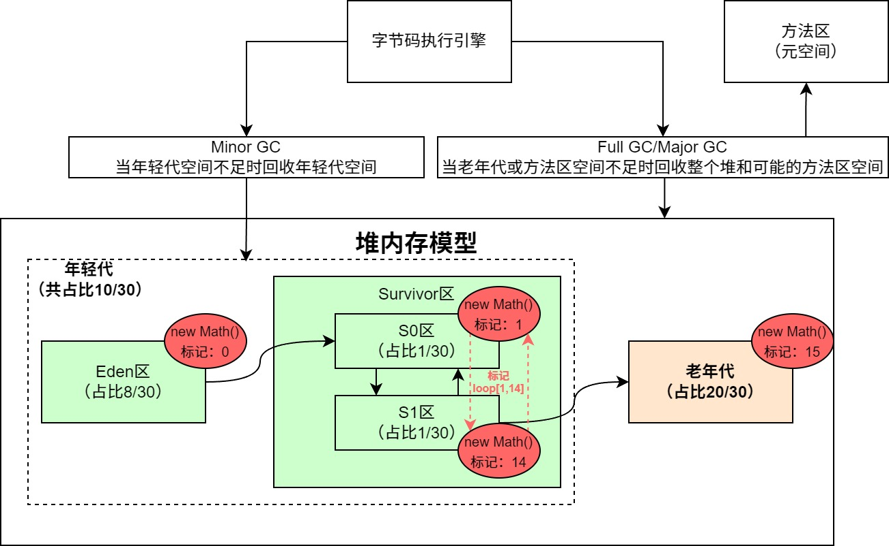
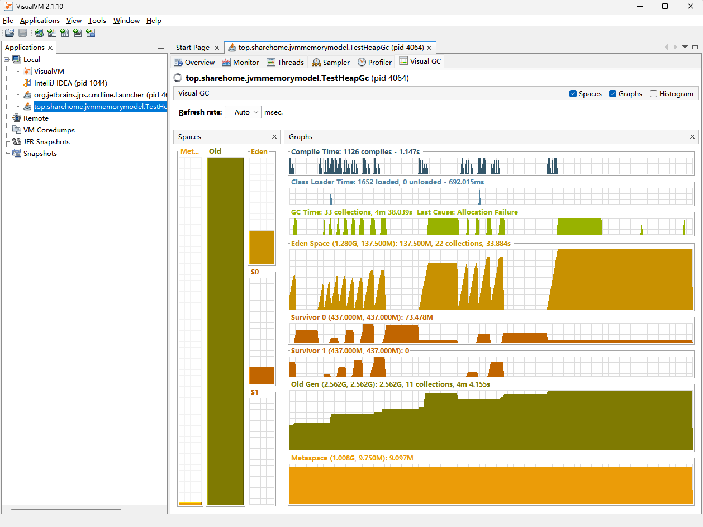
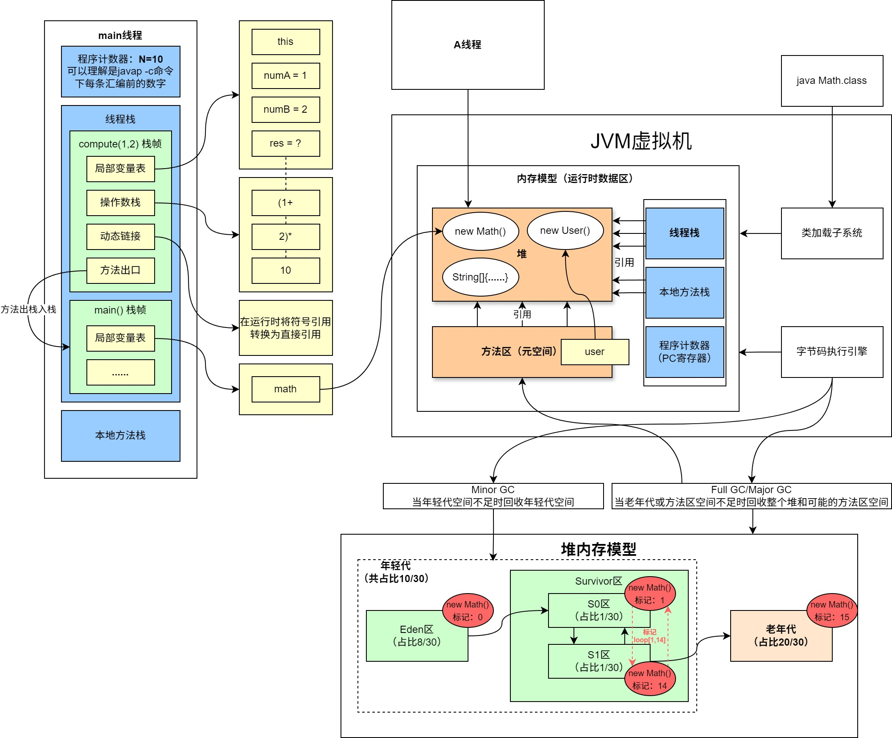

# JVM内存模型深度剖析与优化

以下所有讨论内容均已Java 8为基础进行。

## JDK体系结构

可以了解一下整个JDK中所包含的大概内容和体系结构，如图所示：


## JVM整体结构及内存模型

在这里先准备一个类及其对应的`javap -c`命令信息，类信息具体如下：

```java
package top.sharehome.jvmmemorymodel;


/**
 * 数学类
 *
 * @author AntonyCheng
 */
public class Math {

    public static final int INIT_NUM = 1900;

    public static User user = new User();

    /**
     * 加法方法
     */
    public int compute(int a, int b) {
        int numA = a;
        int numB = b;
        int res = (numA + numB) * 10;
        return res;
    }

    /**
     * 主函数
     */
    public static void main(String[] args) {
        Math math = new Math();
        math.compute(1, 2);
    }

}
```

`javap -c`命令信息如下：

```java
public class top.sharehome.jvmmemorymodel.Math {
  public static final int INIT_NUM;

  public static top.sharehome.jvmmemorymodel.User user;

  public top.sharehome.jvmmemorymodel.Math();
    Code:
       0: aload_0
       1: invokespecial #1                  // Method java/lang/Object."<init>":()V
       4: return

  public int compute(int, int);
    Code:
       0: iload_1
       1: istore_3
       2: iload_2
       3: istore        4
       5: iload_3
       6: iload         4
       8: iadd
       9: bipush        10
      11: imul
      12: istore        5
      14: iload         5
      16: ireturn

  public static void main(java.lang.String[]);
    Code:
       0: new           #2                  // class top/sharehome/jvmmemorymodel/Math
       3: dup
       4: invokespecial #3                  // Method "<init>":()V
       7: astore_1
       8: aload_1
       9: iconst_1
      10: iconst_2
      11: invokevirtual #4                  // Method compute:(II)I
      14: pop
      15: return

  static {};
    Code:
       0: new           #5                  // class top/sharehome/jvmmemorymodel/User
       3: dup
       4: invokespecial #6                  // Method top/sharehome/jvmmemorymodel/User."<init>":()V
       7: putstatic     #7                  // Field user:Ltop/sharehome/jvmmemorymodel/User;
      10: return
}
```

`javap -c`和`javap -v`的区别就是后者会显示比前者更具体的编译信息。接下来可以参考[JVM指令大全](./JVM指令大全.md)先熟悉以下JVM中的”汇编语言“是怎么回事儿，然后来看下面这一张JVM整体结构及内存模型图：



细节探讨之前先解释一下各个区域的特点：

1、**线程栈**和**本地方法栈**可以看作一类数据区，这两者区别就在于本地方法栈中存放的是native关键字所修饰的方法。它们主要的工作就是以”栈“数据结构为基础去存放Java中的方法信息和部分引用信息，这样一个方法被存入之后就被称为一个栈帧，一个栈帧中还有**局部变量表**、**操作数栈**、**动态链接**、**方法出口**（一会儿有详细探讨）。

2、**方法区**也叫做元空间，主要存放类中的常量、静态变量、值的引用信息以及类信息，比如Math类中的”INIT_NUM“常量值以及”user“的引用值。

3、**堆**就是大部分数据真实存在的地方，从上图以及第1、2个特点看，线程栈和本地方法栈中引用信息真实引用的值就存放在堆中，比如Math类中的”new User()“值以及”new Math()“值。

4、蓝色部分，即线程栈、本地方法栈以及程序计数器可以看作是一个整体，只要开启一个线程，每个线程就会有独立且隔离的线程栈、本地方法栈以及程序计数器。

5、橙色部分，即堆和方法区（元空间）是可被线程共享的。

接下来根据上面的特点以线程为单位进行更细节的描述：



由上图可以看出局部变量是存放在线程栈栈帧的局部变量表中，多个线程就会有多个程序计数器、线程栈以及本地方法栈，并且**将对象引用实际地址以及数组地址存放在堆**中。接下来以堆的角度来看看JVM中垃圾回收的情况：



对上图也需要一些说明：

1、对于进入堆中的对象/数组都会被打上一个标记，初始值是0，优先被分配到Eden区。每当Eden区空间不足时都会触发一次Minor GC，它不仅会清理整个年轻代中待回收的对象/数组，还会把存活的对象/数组转移至S0区，同时将对象/数组标记自增为1。之后的每次Minor GC，只要Survivor区中每次存活的对象/数组都会在S0区和S1区中来回转移，直到对象/数组标记自增到14，下一次Minor GC就会把对象/数组标记为14的转移到老年代，同时将标记自增为15。当老年代空间不足时就会触发Full GC，循环往复，一直到抛出OOM（内存溢出）异常就表示已经没有多余的可用内存空间。如果想要可视化整个过程，可以前往[Java Visual VM官网地址](https://visualvm.github.io/index.html)下载JVM工具进行测试，注意下载完成之后需要前往`Tools ==> Plugins ==> Available Plugins`安装Visual GC插件，具体测试代码如下：

```java
package top.sharehome.jvmmemorymodel;

import java.util.ArrayList;

/**
 * 测试堆内存模型和GC过程
 * 需要搭配Java Visual VM工具
 *
 * @author AntonyCheng
 */
public class TestHeapGc {

    public static void main(String[] args) throws InterruptedException {

        ArrayList<User> list = new ArrayList<>();

        while (true) {
            for (int i = 0; i < 100000; i++) {
                list.add(new User());
            }
            Thread.sleep(100);
        }
    }

}

```

测试内容如下：



当老年代(Old Gen)所有空间被占满且无法再进行Full GC时，系统会抛出OOM异常并且结束程序，同时释放所有占用空间（这个什么时候抛出OOM异常会因JVM参数和机器配置的不同而不同）。

2、通常来说Minor GC都会比Full GC效率高，耗时低，从上图也能看出，有一个GC Times，它所表示的就是垃圾回收的时间，耗时长的通常正在发生Full GC。所以避免频繁的Full GC就成了JVM内存调优的一个核心思想。

**结合上面所有的内容，将整个JVM内存模型归纳到一个图中，具体如下：**



## JVM内存参数设置

