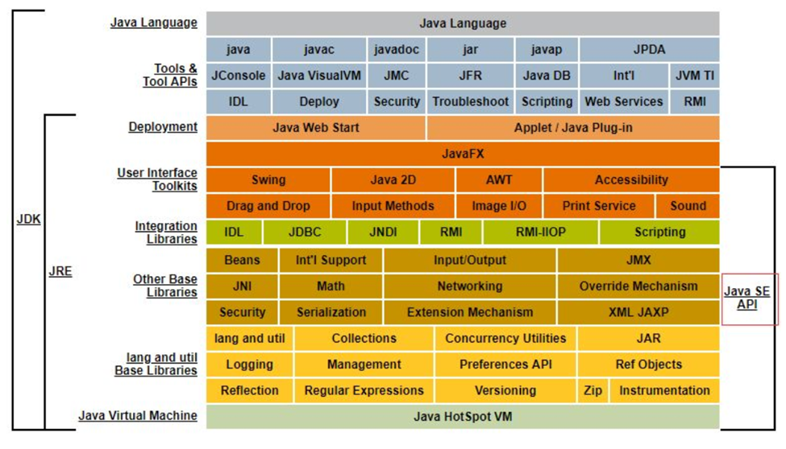

# JVM内存模型深度剖析与优化

以下所有讨论内容均已Java 8为基础进行。

## JDK体系结构

可以了解一下整个JDK中所包含的大概内容和体系结构，如图所示：



## JVM整体结构及内存模型

在这里先准备一个类及其对应的`javap -c`命令信息，类信息具体如下：

```java
package top.sharehome.jvmmemorymodel;


/**
 * 数学类
 *
 * @author AntonyCheng
 */
public class Math {

    public static final int INIT_NUM = 1900;

    public static User user = new User();

    /**
     * 加法方法
     */
    public int compute(int a, int b) {
        int numA = a;
        int numB = b;
        int res = (numA + numB) * 10;
        return res;
    }

    /**
     * 主函数
     */
    public static void main(String[] args) {
        Math math = new Math();
        math.compute(1, 2);
    }

}
```

`javap -c`命令信息如下：

```java
public class top.sharehome.jvmmemorymodel.Math {
  public static final int INIT_NUM;

  public static top.sharehome.jvmmemorymodel.User user;

  public top.sharehome.jvmmemorymodel.Math();
    Code:
       0: aload_0
       1: invokespecial #1                  // Method java/lang/Object."<init>":()V
       4: return

  public int compute(int, int);
    Code:
       0: iload_1
       1: istore_3
       2: iload_2
       3: istore        4
       5: iload_3
       6: iload         4
       8: iadd
       9: bipush        10
      11: imul
      12: istore        5
      14: iload         5
      16: ireturn

  public static void main(java.lang.String[]);
    Code:
       0: new           #2                  // class top/sharehome/jvmmemorymodel/Math
       3: dup
       4: invokespecial #3                  // Method "<init>":()V
       7: astore_1
       8: aload_1
       9: iconst_1
      10: iconst_2
      11: invokevirtual #4                  // Method compute:(II)I
      14: pop
      15: return

  static {};
    Code:
       0: new           #5                  // class top/sharehome/jvmmemorymodel/User
       3: dup
       4: invokespecial #6                  // Method top/sharehome/jvmmemorymodel/User."<init>":()V
       7: putstatic     #7                  // Field user:Ltop/sharehome/jvmmemorymodel/User;
      10: return
}
```

`javap -c`和`javap -v`的区别就是后者会显示比前者更具体的编译信息。接下来可以参考[JVM指令大全](./JVM指令大全.md)先熟悉以下JVM中的”汇编语言“是怎么回事儿，然后来看下面这一张JVM整体结构及内存模型图：


细节探讨之前先解释一下各个区域的特点：

1、**线程栈**和**本地方法栈**可以看作一类数据区，这两者区别就在于本地方法栈中存放的是native关键字所修饰的方法。它们主要的工作就是以”栈“数据结构为基础去存放Java中的方法信息和部分引用信息，这样一个方法被存入之后就被称为一个栈帧，一个栈帧中还有**局部变量表**、**操作数栈**、**动态链接**、**方法出口**（一会儿有详细探讨）。

2、**方法区**也叫做元空间，主要存放类中的常量、静态变量、值的引用信息以及类信息，比如Math类中的”INIT_NUM“常量值以及”user“的引用值。

3、**堆**就是大部分数据真实存在的地方，从上图以及第1、2个特点看，线程栈和本地方法栈中引用信息真实引用的值就存放在堆中，比如Math类中的”new User()“值以及”new Math()“值。

4、蓝色部分，即线程栈、本地方法栈以及程序计数器可以看作是一个整体，只要开启一个线程，每个线程就会有独立且隔离的线程栈、本地方法栈以及程序计数器。

5、橙色部分，即堆和方法区（元空间）是可被线程共享的。

接下来根据上面的特点以线程为单位进行更细节的描述：


由上图可以看出局部变量是存放在线程栈栈帧的局部变量表中，多个线程就会有多个程序计数器、线程栈以及本地方法栈，并且**将对象引用实际地址以及数组地址存放在堆**中。接下来以堆的角度来看看JVM中垃圾回收的情况：


对上图也需要一些说明：

对于进入堆中的对象/数组都会被打上一个标记，初始值是0，优先被分配到Eden区。每当Eden区空间不足时都会触发一次Minor GC，它不仅会清理整个年轻代中待回收的对象/数组，还会把存活的对象/数组转移至S0区，同时将对象/数组标记自增为1。之后的每次Minor GC，只要Survivor区中每次存活的对象/数组都会在S0区和S1区中来回转移，直到对象/数组标记自增到14，下一次Minor GC就会把对象/数组标记为14的转移到老年代，同时将标记自增为15（其实也有直接从Eden区转移到老年代的情况，这些在下一章节会有详细讨论）。当老年代空间不足时就会触发Full GC，循环往复，一直到抛出OOM（内存溢出）异常就表示已经没有多余的可用内存空间。如果想要可视化整个过程，可以前往[Java Visual VM官网地址](https://visualvm.github.io/index.html)下载JVM工具进行测试，注意下载完成之后需要前往`Tools ==> Plugins ==> Available Plugins`安装Visual GC插件，具体测试代码如下：

```java
package top.sharehome.jvmmemorymodel;

import java.util.ArrayList;

/**
 * 测试堆内存模型和GC过程
 * 需要搭配Java Visual VM工具
 *
 * @author AntonyCheng
 */
public class TestHeapGc {

    public static void main(String[] args) throws InterruptedException {

        ArrayList<User> list = new ArrayList<>();

        while (true) {
            for (int i = 0; i < 100000; i++) {
                list.add(new User());
            }
            Thread.sleep(100);
        }
    }

}

```

测试内容如下：


当老年代(Old Gen)所有空间被占满且无法再进行Full GC时，系统会抛出OOM异常并且结束程序，同时释放所有占用空间（这个什么时候抛出OOM异常会因JVM参数和机器配置的不同而不同）。

2、通常来说Minor GC都会比Full GC效率高，耗时低，从上图也能看出，有一个GC Times，它所表示的就是垃圾回收的时间，耗时长的通常正在发生Full GC。而且垃圾回收本身会触发**STW**机制，即暂停应用线程来清理堆空间中的垃圾对象，它的目的是为了在内存管理和其他需要全局一致性的操作中，确保应用程序的线程不会对堆中的对象进行修改，提供一个一致性快照，如果是Minor GC，STW的时间通常在几毫秒到几十毫秒之间，影响并不算很大，但是如果是Full GC，就可能达到几百毫秒甚至是几秒。所以避免频繁的Full GC就成了JVM内存调优的一个核心思想。

**结合上面所有的内容，将整个JVM内存模型归纳到一个图中，具体如下：**


## JVM内存参数设置

JVM内存模型到这里其实就已经讨论完毕了，接下来需要根据上面的内容对JVM进行内存参数的优化，JVM中的数据绝大多数存在于堆中，它也是内存占比最高的一个区域，所以有非常多可自定义的参数，具体参数如图：


还需再结合Spring Boot程序的JVM参数设置来具体说明一下各个参数：

```shell
java ‐Xms2048M ‐Xmx2048M ‐Xmn1024M ‐Xss512K ‐XX:MetaspaceSize=256M ‐XX:MaxMetaspaceSize=256M ‐jar spring-boot-init-template.jar
```

1、`-Xms2048M`：指定JVM启动时分配的**初始堆内存大小**为2048MB（2GB）。

2、`‐Xmx2048M`：指定JVM堆内存的**最大值**为2048MB，这个值和`-Xms`设置为一样时，可以减少内存动态调整带来的开销。

3、`‐Xmn1024M`：指定JVM堆内存中**新生代内存**（Young Generation）的大小为1024MB。

4、`‐Xss512K`：指定每个线程的**栈大小**为512KB，如果线程较多或栈调用深度较大，可以适当调整。

5、`‐XX:MetaspaceSize=256M`：指定JVM的**元空间初始大小**为256MB，元空间无固定初始化大小，该值也是元空间触发Full GC的初始阈值默认是21M，达到该值就会触发Full GC进行类型卸载，同时收集器会对该值进行调整：如果释放了大量的空间，就适当降低该值；如果释放了很少的空间，那么在不超过`-XX:MaxMetaspaceSize`（如果设置了的话） 的情况下， 适当提高该值。

6、`‐XX:MaxMetaspaceSize=256M`：指定JVM的**元空间最大大小**为256MB，默认是-1，即不限制，或者说只受限于本地内存大小。

**特别注意：**

1、由于调整元空间的大小需要Full GC，这是非常昂贵的操作，如果应用在启动的时候发生大量Full GC，通常都是由于老年代或元空间发生了大小调整，基于这种情况，一般建议在JVM参数中将MetaspaceSize和MaxMetaspaceSize设置成一样的值，并设置得比初始值要大，对于8G物理内存的机器来说，一般会将这两个值都设置为256M。

2、针对于`-Xss`参数，如果值越小，那么就说明一个线程栈中能分配的栈帧就越少，但是反过来说JVM整体能够开启的线程数就会多。比如一共要执行100个方法，将`-Xss`参数设置大一点，让每个线程栈能分配50个方法，这样仅需2个线程就能够执行完成；反之将`-Xss`参数设置小一点，每个线程栈只能分配20个方法，那么就需要JVM调度5个线程才能执行完成。

**接下来针对JVM内存参数调优举一个例子，如图所示**：


对于上图中所描述到的Eden区直接转移到老年代做一个说明，假设目前针对“4核8G”对JAR包进行程序启动，有关命令如下：

```shell
java -Xms3072M -Xmx3072M -Xss1M -XX:MetaspaceSize=512M -XX:MaxMetaspaceSize=512M -jar spring-boot-init-template.jar
```

根据Eden区、S0区、S1区以及老年代所在堆中的内存占比关系，可以得出画出以下内存模型图：


此时每秒60MB的对象一旦输入堆中，正常情况第14秒会将Eden区占满，此时会触发Minor GC，将这14*60MB对象回收。但是根据STW机制，如果在程序运行过程中第14秒的60MB对象在程序中整被引用，这60MB对象就不会被垃圾回收，正常来说它会被转移至S0区等待下一次Minor GC。但是在上面已经提到过在JVM中存在一些特殊情况会直接将其转移至老年代（具体会在下一章节中讨论），这里就刚好符合一种：**对象动态年龄判断**，简单点说就是当S0或S1区中内存占用超过50%时，就有可能将内存中的部分内容直接转移至老年代。那放在这个例子中，当14秒时S0区可能会被放入60MB内容，此时`60MB>0.1GB*50%`，这就触发了对象动态年龄判断机制，进而在高并发的情况下就可能频繁的发生Full GC。

针对这个场景，Alibaba曾有一道面试题，就是**如何让其几乎不发生Full GC**？其实很简单，最直接的方式就是增加Survivor区域的内存空间以提高对象动态年龄判断的阈值，将JVM启动命令修改如下即可：

```shell
java -Xms3072M -Xmx3072M -Xmn2048M -Xss1M -XX:MetaspaceSize=512M -XX:MaxMetaspaceSize=512M -jar spring-boot-init-template.jar
```

即将新生代的内存提高至2048MB，从而打破新老年代1：2的比例局面以撑大Survivor区内存，此时各个区域具体内存如下：

- 老年代：1GB
- Eden区：1.6GB
- S0区：0.2GB
- S1区：0.2GB

这样就可以保证上述情况在Minor GC后不触发对象动态年龄判断机制（`60MB<0.2GB*50%`），在这个业务场景下已经足够了，也就让其几乎不发生Full GC。

