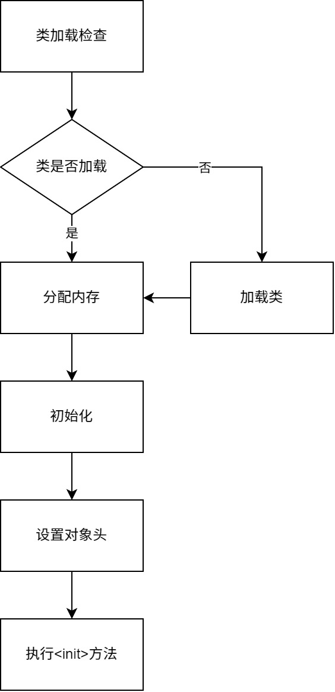
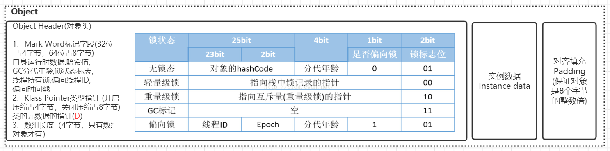

# JVM对象创建与内存分配机制深度剖析

## 对象的创建

对象创建的主要流程如图所示：



接下来逐步分析一下上述流程（除了”加载类“）的各个阶段。

### 类加载检查

JVM遇到一条new指令时，首先会去检查这个指令的参数是否能在常量池中定位到一个类的符号引用，并且检查这个符号引用代表的类是否已被加载、解析和初始化过。如果没有，那必须先执行相应的类加载过程。new指令对应到语言层面上讲就是：new关键字、对象克隆、对象序列化等。

### 分配内存

在类加载检查通过后，接下来虚拟机将为新生对象分配内存。对象所需内存的大小在类加载完成后便可完全确定，为对象分配空间的任务等同于把 一块确定大小的内存从Java堆中划分出来。此时就需要解决两个问题：

**1、如何划分内存？**

一般有两种方法，第一种是**“指针碰撞”（Bump the Pointer）法**：

这也是JVM中默认的划分内存的方式，如果Java堆中的内存是绝对规整的，所有用过的内存都放在一边，空闲的内存放在另一边，中间放着一个指针作为分界点，那所分配内存就仅仅是把那个指针向空闲空间那边挪动一段与对象大小相等的距离，类似于文件的“尾部追加”写入。

第二种是**“空闲列表”（Free List）法**：

如果Java堆中的内存并不是规整的，已使用的内存和空闲的内存相互交错，那就没有办法简单地进行指针碰撞了，虚拟机就必须维护一个列表，记录上哪些内存块是可用的，在分配的时候从列表中找到一块足够大的空间划分给对象实例，并更新列表上的记录。

**2、如何解决并发问题？**

这也有两种方法，第一种是**CAS（compare and swap）**：

JVM会采用”CAS+失败重试“的方式保证更新操作的原子性来对分配内存空间的动作进行同步处理。

第二种是**本地线程分配缓冲（Thread Local Allocation Buffer，TLAB）**：

JVM会把内存分配的动作按照线程划分在不同的空间之中进行，即每个线程在堆中预先分配一小块内存。通过`-XX:+/-UseTLAB`参数来设定虚拟机是否使用TLAB（JVM会默认开启`-XX:+UseTLAB`），`-XX:TLABSize`可以指定TLAB大小。

### 初始化

内存分配完成后，虚拟机需要将分配到的内存空间都初始化为零值（不包括对象头）， 如果使用TLAB，这一工作过程也可以提前至TLAB分配时进行。这一步操作保证了对象的实例字段在Java代码中可以不赋初始值就直接使用，程序能访问到这些字段的数据类型所对应的零值，比如int类型的零值就是0。

### 设置对象头

初始化零值之后，虚拟机要对对象进行必要的设置，例如这个对象是哪个类的实例、如何才能找到类的元数据信息、对象的哈希码、对象的GC分代年龄等信息。这些信息存放在对象的对象头Object Header之中。

在HotSpot虚拟机中，对象在内存中存储的布局可以分为3块区域：对象头（Header）、 实例数据（Instance Data）和对齐填充（Padding）。 HotSpot虚拟机的对象头包括两部分信息，第一部分用于存储对象自身的运行时数据， 如哈希码（HashCode）、GC分代年龄、锁状态标志、线程持有的锁、偏向线程ID、偏向时间戳等。对象头的另外一部分是类型指针，即对象指向它的类元数据的指针，虚拟机通过这个指针来确定这个对象是哪个类的实例，先看下面这张图，描述了32位机器下对象内存的分布：



根据上图，其中一些概念需要详细说明一下：

1、**对象头一般包含Mark Word、Klass Pointer、数组长度（仅对数组对象适用）**。

2、**Mark Word**是用于存储对象运行时状态的重要数据结构，具体内容如上蓝色表格所示，其中的分代年龄就是在上一章节中描述对象从Eden区 => S0区 <=> S1区 => 老年代中那个0-15的标识数字。

3、**Klass Pointer**是指向方法区中类元信息的指针，注意是Klass，而不是Class，因为在HotSpot C++源码中是Klass，方法区中的类元信息实际是C++所维护、驱动及管理的。

4、64位机器和32位机器相比也包含了上面这些东西，区别就在于64位机器扩大了其中的某些空间以及多了一些unused空间，具体可以查看HotSpot C++源码中的注释：

```c++
// 32 bits:
// ‐‐‐‐‐‐‐‐
// hash:25 ‐‐‐‐‐‐‐‐‐‐‐‐>| age:4 biased_lock:1 lock:2 (normal object)
// JavaThread*:23 epoch:2 age:4 biased_lock:1 lock:2 (biased object)
// size:32 ‐‐‐‐‐‐‐‐‐‐‐‐‐‐‐‐‐‐‐‐‐‐‐‐‐‐‐‐‐‐‐‐‐‐‐‐‐‐‐‐‐‐>| (CMS free block)
// PromotedObject*:29 ‐‐‐‐‐‐‐‐‐‐>| promo_bits:3 ‐‐‐‐‐>| (CMS promoted object)
//
// 64 bits:
// ‐‐‐‐‐‐‐‐
// unused:25 hash:31 ‐‐>| unused:1 age:4 biased_lock:1 lock:2 (normal object)
// JavaThread*:54 epoch:2 unused:1 age:4 biased_lock:1 lock:2 (biased object)
// PromotedObject*:61 ‐‐‐‐‐‐‐‐‐‐‐‐‐‐‐‐‐‐‐‐‐>| promo_bits:3 ‐‐‐‐‐>| (CMS promoted object)
// size:64 ‐‐‐‐‐‐‐‐‐‐‐‐‐‐‐‐‐‐‐‐‐‐‐‐‐‐‐‐‐‐‐‐‐‐‐‐‐‐‐‐‐‐‐‐‐‐‐‐‐‐‐‐‐>| (CMS free block)
//
// unused:25 hash:31 ‐‐>| cms_free:1 age:4 biased_lock:1 lock:2 (COOPs && normal object)
// JavaThread*:54 epoch:2 cms_free:1 age:4 biased_lock:1 lock:2 (COOPs && biased object)
// narrowOop:32 unused:24 cms_free:1 unused:4 promo_bits:3 ‐‐‐‐‐>| (COOPs && CMS promoted object)
// unused:21 size:35 ‐‐>| cms_free:1 unused:7 ‐‐‐‐‐‐‐‐‐‐‐‐‐‐‐‐‐‐>| (COOPs && CMS freeblock)
```

5、在对象末尾可能还会有一个**Padding对齐**，目的是为了保证对象大小始终是8字节的倍数，因为在64位机器中一次会处理64位数据，大小正好是8字节，这样可以使机器处理效率最优化。

6、**指针压缩**主要是处理64位机器中存在的内存浪费问题，效果是尽可能将64位的数据压缩成32位数据进行存储，当使用时再解压为64位数据进行处理。从Java 8之后，指针压缩就是默认打开的，相关的JVM配置参数就是`-XX:+/-UseCompressedOops`，即启动指针压缩`-XX:+UseCompressedOops`（Java 8之后默认），禁止指针压缩`-XX:-UseCompressedOops`。再深究一下指针压缩存在的主要原因和作用是什么？

1. 在64位平台的HotSpot中使用32位指针，内存使用会多出1.5倍左右，使用较大指针在主内存和缓存之间移动数据，占用较大宽带，同时GC也会承受较大压力。
2. 为了减少64位平台下内存的消耗，启用指针压缩功能。
3. 在JVM中，32位地址最大支持4G内存（2的32次方），可以通过对对象指针的压缩编码、解码方式进行优化，使得JVM只用32位地址就可以支持更大的内存配置（小于等于32G）。
4. 堆内存小于4G时，不需要启用指针压缩，JVM会直接去除高32位地址，即使用低虚拟地址空间。
5. 堆内存大于32G时，压缩指针会失效，会强制使用64位(即8字节)来对java对象寻址，这就会出现1的问题，所以堆内存不要大于32G为好

最后再实操使用一个可以查看实际对象大小的依赖工具：

```xml
<dependency>
	<groupId>org.openjdk.jol</groupId>
	<artifactId>jol‐core</artifactId>
	<version>0.9</version>
</dependency>
```

代码如下：

```java
package top.sharehome.jvmnewobject;

import org.openjdk.jol.info.ClassLayout;

/**
 * 使用jol-core计算对象大小
 *
 * @author AntonyCheng
 */
public class JolSample {

    public static void main(String[] args) {
        ClassLayout classLayout1 = ClassLayout.parseClass(Object.class);
        System.out.println(classLayout1.toPrintable());
        System.out.println();
        ClassLayout classLayout2 = ClassLayout.parseInstance(new int[]{});
        System.out.println(classLayout2.toPrintable());
        System.out.println();
        ClassLayout classLayout3 = ClassLayout.parseInstance(new User());
        System.out.println(classLayout3.toPrintable());
    }

    public static class User {
        private int id;
        private String name;
        private byte gender;
        private Object other;
    }

}
```

当使用`java -XX:+UseCompressedOops`开启指针压缩时，打印结果如下：

```
java.lang.Object object internals:
OFF  SZ   TYPE DESCRIPTION               VALUE
  0   8        (object header: mark)     N/A
  8   4        (object header: class)    N/A
 12   4        (object alignment gap)    # 这个地方就是Padding对齐的结果
Instance size: 16 bytes
Space losses: 0 bytes internal + 4 bytes external = 4 bytes total


[I object internals:
OFF  SZ   TYPE DESCRIPTION               VALUE
  0   8        (object header: mark)     0x0000000000000001 (non-biasable; age: 0)
  8   4        (object header: class)    0xf800016d
 12   4        (array length)            0
 16   0    int [I.<elements>             N/A
Instance size: 16 bytes
Space losses: 0 bytes internal + 0 bytes external = 0 bytes total


top.sharehome.jvmnewobject.JolSample$User object internals:
OFF  SZ               TYPE DESCRIPTION               VALUE
  0   8                    (object header: mark)     0x0000000000000001 (non-biasable; age: 0)
  8   4                    (object header: class)    0xf800cd1a
 12   4                int User.id                   0
 16   1               byte User.gender               0
 17   3                    (alignment/padding gap)   
 20   4   java.lang.String User.name                 null
 24   4   java.lang.Object User.other                null
 28   4                    (object alignment gap)    
Instance size: 32 bytes
Space losses: 3 bytes internal + 4 bytes external = 7 bytes total
```

当使用`java -XX:-UseCompressedOops`禁止指针压缩时，打印结果如下：

```
java.lang.Object object internals:
OFF  SZ   TYPE DESCRIPTION               VALUE
  0   8        (object header: mark)     N/A
  8   8        (object header: class)    N/A
Instance size: 16 bytes
Space losses: 0 bytes internal + 0 bytes external = 0 bytes total


[I object internals:
OFF  SZ   TYPE DESCRIPTION               VALUE
  0   8        (object header: mark)     0x0000000000000001 (non-biasable; age: 0)
  8   8        (object header: class)    0x0000022a88fe0b68
 16   4        (array length)            0
 20   4        (alignment/padding gap)   
 24   0    int [I.<elements>             N/A
Instance size: 24 bytes
Space losses: 4 bytes internal + 0 bytes external = 4 bytes total


top.sharehome.jvmnewobject.JolSample$User object internals:
OFF  SZ               TYPE DESCRIPTION               VALUE
  0   8                    (object header: mark)     0x0000000000000001 (non-biasable; age: 0)
  8   8                    (object header: class)    0x0000022a896b6048
 16   4                int User.id                   0
 20   1               byte User.gender               0
 21   3                    (alignment/padding gap)   
 24   8   java.lang.String User.name                 null
 32   8   java.lang.Object User.other                null
Instance size: 40 bytes
Space losses: 3 bytes internal + 0 bytes external = 3 bytes total
```

观察结果即可得出指针压缩的效果。