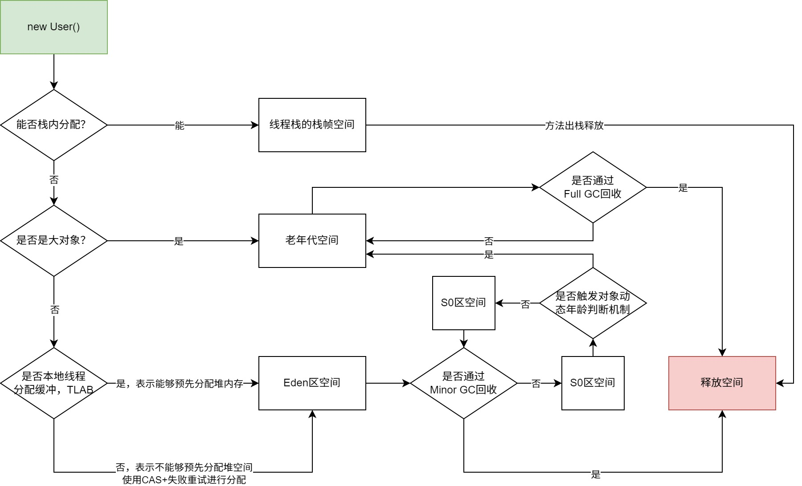
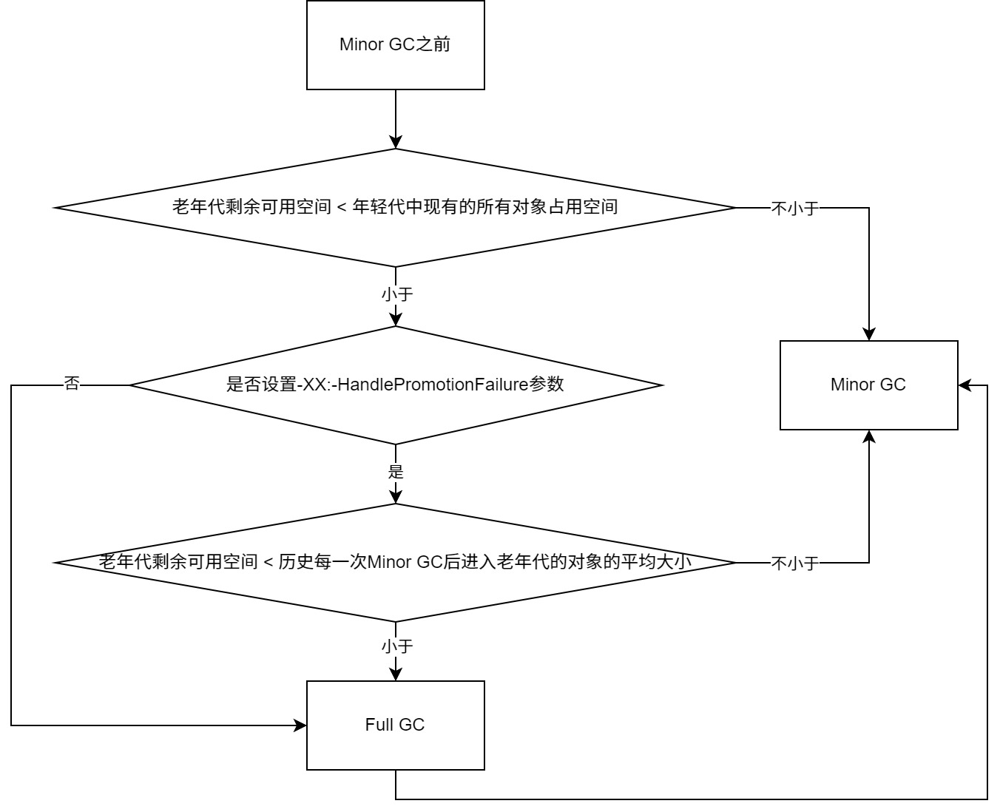
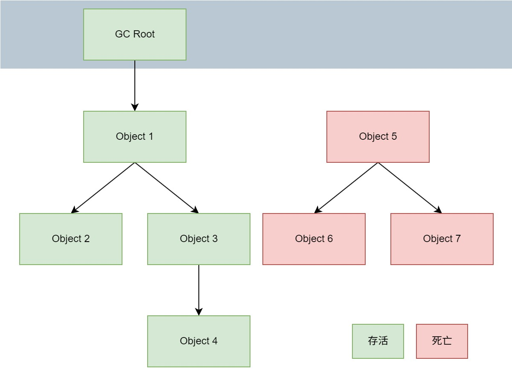

# JVM对象创建与内存分配机制深度剖析

以下所有讨论内容均已Java 8为基础进行。

## 对象的创建

对象创建的主要流程如图所示：


接下来逐步分析一下上述流程（除了”加载类“）的各个阶段。

### 类加载检查

JVM遇到一条new指令时，首先会去检查这个指令的参数是否能在常量池中定位到一个类的符号引用，并且检查这个符号引用代表的类是否已被加载、解析和初始化过。如果没有，那必须先执行相应的类加载过程。new指令对应到语言层面上讲就是：new关键字、对象克隆、对象序列化等。

### 分配内存

在类加载检查通过后，接下来虚拟机将为新生对象分配内存。对象所需内存的大小在类加载完成后便可完全确定，为对象分配空间的任务等同于把 一块确定大小的内存从Java堆中划分出来。此时就需要解决两个问题：

**1、如何划分内存？**

一般有两种方法，第一种是**“指针碰撞”（Bump the Pointer）法**：

这也是JVM中默认的划分内存的方式，如果Java堆中的内存是绝对规整的，所有用过的内存都放在一边，空闲的内存放在另一边，中间放着一个指针作为分界点，那所分配内存就仅仅是把那个指针向空闲空间那边挪动一段与对象大小相等的距离，类似于文件的“尾部追加”写入。

第二种是**“空闲列表”（Free List）法**：

如果Java堆中的内存并不是规整的，已使用的内存和空闲的内存相互交错，那就没有办法简单地进行指针碰撞了，虚拟机就必须维护一个列表，记录上哪些内存块是可用的，在分配的时候从列表中找到一块足够大的空间划分给对象实例，并更新列表上的记录。

**2、如何解决并发问题？**

这也有两种方法，第一种是**CAS（compare and swap）**：

JVM会采用”CAS+失败重试“的方式保证更新操作的原子性来对分配内存空间的动作进行同步处理。

第二种是**本地线程分配缓冲（Thread Local Allocation Buffer，TLAB）**：

JVM会把内存分配的动作按照线程划分在不同的空间之中进行，即每个线程在堆中预先分配一小块内存。通过`-XX:+/-UseTLAB`参数来设定虚拟机是否使用TLAB（JVM会默认开启`-XX:+UseTLAB`），`-XX:TLABSize`可以指定TLAB大小。

### 初始化

内存分配完成后，虚拟机需要将分配到的内存空间都初始化为零值（不包括对象头）， 如果使用TLAB，这一工作过程也可以提前至TLAB分配时进行。这一步操作保证了对象的实例字段在Java代码中可以不赋初始值就直接使用，程序能访问到这些字段的数据类型所对应的零值，比如int类型的零值就是0。

### 设置对象头

初始化零值之后，虚拟机要对对象进行必要的设置，例如这个对象是哪个类的实例、如何才能找到类的元数据信息、对象的哈希码、对象的GC分代年龄等信息。这些信息存放在对象的对象头Object Header之中。

在HotSpot虚拟机中，对象在内存中存储的布局可以分为3块区域：对象头（Header）、 实例数据（Instance Data）和对齐填充（Padding）。 HotSpot虚拟机的对象头包括两部分信息，第一部分用于存储对象自身的运行时数据， 如哈希码（HashCode）、GC分代年龄、锁状态标志、线程持有的锁、偏向线程ID、偏向时间戳等。对象头的另外一部分是类型指针，即对象指向它的类元数据的指针，虚拟机通过这个指针来确定这个对象是哪个类的实例，先看下面这张图，描述了32位机器下对象内存的分布：


根据上图，其中一些概念需要详细说明一下：

1、**对象头一般包含Mark Word、Klass Pointer、数组长度（仅对数组对象适用）**。

2、**Mark Word**是用于存储对象运行时状态的重要数据结构，具体内容如上蓝色表格所示，其中的分代年龄就是在上一章节中描述对象从Eden区 => S0区 <=> S1区 => 老年代中那个0-15的标识数字。

3、**Klass Pointer**是指向方法区中类元信息的指针，注意是Klass，而不是Class，因为在HotSpot C++源码中是Klass，方法区中的类元信息实际是C++所维护、驱动及管理的。

4、64位机器和32位机器相比也包含了上面这些东西，区别就在于64位机器扩大了其中的某些空间以及多了一些unused空间，具体可以查看HotSpot C++源码中的注释：

```c++
// 32 bits:
// ‐‐‐‐‐‐‐‐
// hash:25 ‐‐‐‐‐‐‐‐‐‐‐‐>| age:4 biased_lock:1 lock:2 (normal object)
// JavaThread*:23 epoch:2 age:4 biased_lock:1 lock:2 (biased object)
// size:32 ‐‐‐‐‐‐‐‐‐‐‐‐‐‐‐‐‐‐‐‐‐‐‐‐‐‐‐‐‐‐‐‐‐‐‐‐‐‐‐‐‐‐>| (CMS free block)
// PromotedObject*:29 ‐‐‐‐‐‐‐‐‐‐>| promo_bits:3 ‐‐‐‐‐>| (CMS promoted object)
//
// 64 bits:
// ‐‐‐‐‐‐‐‐
// unused:25 hash:31 ‐‐>| unused:1 age:4 biased_lock:1 lock:2 (normal object)
// JavaThread*:54 epoch:2 unused:1 age:4 biased_lock:1 lock:2 (biased object)
// PromotedObject*:61 ‐‐‐‐‐‐‐‐‐‐‐‐‐‐‐‐‐‐‐‐‐>| promo_bits:3 ‐‐‐‐‐>| (CMS promoted object)
// size:64 ‐‐‐‐‐‐‐‐‐‐‐‐‐‐‐‐‐‐‐‐‐‐‐‐‐‐‐‐‐‐‐‐‐‐‐‐‐‐‐‐‐‐‐‐‐‐‐‐‐‐‐‐‐>| (CMS free block)
//
// unused:25 hash:31 ‐‐>| cms_free:1 age:4 biased_lock:1 lock:2 (COOPs && normal object)
// JavaThread*:54 epoch:2 cms_free:1 age:4 biased_lock:1 lock:2 (COOPs && biased object)
// narrowOop:32 unused:24 cms_free:1 unused:4 promo_bits:3 ‐‐‐‐‐>| (COOPs && CMS promoted object)
// unused:21 size:35 ‐‐>| cms_free:1 unused:7 ‐‐‐‐‐‐‐‐‐‐‐‐‐‐‐‐‐‐>| (COOPs && CMS freeblock)
```

5、在对象末尾可能还会有一个**Padding对齐**，目的是为了保证对象大小始终是8字节的倍数，因为在64位机器中一次会处理64位数据，大小正好是8字节，这样可以使机器处理效率最优化。

6、**指针压缩**主要是处理64位机器中存在的内存浪费问题，效果是尽可能将64位的数据压缩成32位数据进行存储，当使用时再解压为64位数据进行处理。从Java 8之后，指针压缩就是默认打开的，相关的JVM配置参数就是`-XX:+/-UseCompressedOops`，即启动指针压缩`-XX:+UseCompressedOops`（Java 8之后默认），禁止指针压缩`-XX:-UseCompressedOops`。再深究一下指针压缩存在的主要原因和作用是什么？

1. 在64位平台的HotSpot中使用32位指针，内存使用会多出1.5倍左右，使用较大指针在主内存和缓存之间移动数据，占用较大宽带，同时GC也会承受较大压力。
2. 为了减少64位平台下内存的消耗，启用指针压缩功能。
3. 在JVM中，32位地址最大支持4G内存（2的32次方），可以通过对对象指针的压缩编码、解码方式进行优化，使得JVM只用32位地址就可以支持更大的内存配置（小于等于32G）。
4. 堆内存小于4G时，不需要启用指针压缩，JVM会直接去除高32位地址，即使用低虚拟地址空间。
5. 堆内存大于32G时，压缩指针会失效，会强制使用64位(即8字节)来对java对象寻址，这就会出现1的问题，所以堆内存不要大于32G为好

最后再实操使用一个可以查看实际对象大小的依赖工具：

```xml
<dependency>
	<groupId>org.openjdk.jol</groupId>
	<artifactId>jol‐core</artifactId>
	<version>0.9</version>
</dependency>
```

代码如下：

```java
package top.sharehome.jvmnewobject;

import org.openjdk.jol.info.ClassLayout;

/**
 * 使用jol-core计算对象大小
 *
 * @author AntonyCheng
 */
public class JolSample {

    public static void main(String[] args) {
        ClassLayout classLayout1 = ClassLayout.parseClass(Object.class);
        System.out.println(classLayout1.toPrintable());
        System.out.println();
        ClassLayout classLayout2 = ClassLayout.parseInstance(new int[]{});
        System.out.println(classLayout2.toPrintable());
        System.out.println();
        ClassLayout classLayout3 = ClassLayout.parseInstance(new User());
        System.out.println(classLayout3.toPrintable());
    }

    public static class User {
        private int id;
        private String name;
        private byte gender;
        private Object other;
    }

}
```

当使用`java -XX:+UseCompressedOops`开启指针压缩时，打印结果如下：

```
java.lang.Object object internals:
OFF  SZ   TYPE DESCRIPTION               VALUE
  0   8        (object header: mark)     N/A
  8   4        (object header: class)    N/A
 12   4        (object alignment gap)    # 这个地方就是Padding对齐的结果
Instance size: 16 bytes
Space losses: 0 bytes internal + 4 bytes external = 4 bytes total


[I object internals:
OFF  SZ   TYPE DESCRIPTION               VALUE
  0   8        (object header: mark)     0x0000000000000001 (non-biasable; age: 0)
  8   4        (object header: class)    0xf800016d
 12   4        (array length)            0
 16   0    int [I.<elements>             N/A
Instance size: 16 bytes
Space losses: 0 bytes internal + 0 bytes external = 0 bytes total


top.sharehome.jvmnewobject.JolSample$User object internals:
OFF  SZ               TYPE DESCRIPTION               VALUE
  0   8                    (object header: mark)     0x0000000000000001 (non-biasable; age: 0)
  8   4                    (object header: class)    0xf800cd1a
 12   4                int User.id                   0
 16   1               byte User.gender               0
 17   3                    (alignment/padding gap)   
 20   4   java.lang.String User.name                 null
 24   4   java.lang.Object User.other                null
 28   4                    (object alignment gap)    
Instance size: 32 bytes
Space losses: 3 bytes internal + 4 bytes external = 7 bytes total
```

当使用`java -XX:-UseCompressedOops`禁止指针压缩时，打印结果如下：

```
java.lang.Object object internals:
OFF  SZ   TYPE DESCRIPTION               VALUE
  0   8        (object header: mark)     N/A
  8   8        (object header: class)    N/A
Instance size: 16 bytes
Space losses: 0 bytes internal + 0 bytes external = 0 bytes total


[I object internals:
OFF  SZ   TYPE DESCRIPTION               VALUE
  0   8        (object header: mark)     0x0000000000000001 (non-biasable; age: 0)
  8   8        (object header: class)    0x0000022a88fe0b68
 16   4        (array length)            0
 20   4        (alignment/padding gap)   
 24   0    int [I.<elements>             N/A
Instance size: 24 bytes
Space losses: 4 bytes internal + 0 bytes external = 4 bytes total


top.sharehome.jvmnewobject.JolSample$User object internals:
OFF  SZ               TYPE DESCRIPTION               VALUE
  0   8                    (object header: mark)     0x0000000000000001 (non-biasable; age: 0)
  8   8                    (object header: class)    0x0000022a896b6048
 16   4                int User.id                   0
 20   1               byte User.gender               0
 21   3                    (alignment/padding gap)   
 24   8   java.lang.String User.name                 null
 32   8   java.lang.Object User.other                null
Instance size: 40 bytes
Space losses: 3 bytes internal + 0 bytes external = 3 bytes total
```

观察结果即可得出指针压缩的效果。

## 对象内存分配

同样先来看对象内存分配流程图：



上图中也有一些值得讨论的点，具体如下。

### 对象栈内分配

从之前的讨论中可以得知Java对象都是在堆上进行分配的，当该对象没有被引用的时候，需要依靠GC进行回收内存，如果对象数量较多的时候就会给GC带来较大的压力，也间接影响了应用的性能。所以为了减少临时对象在堆中，JVM通过确定该对象是否被外部访问进行**对象逃逸分析**，如果不会逃逸就可以将该对象在栈内分配内存，噶那么该对象所占的内存空间就可以随方法的出栈而释放，进而减轻垃圾回收的压力。

**什么是对象逃逸分析呢？**

就是分析一个对象的动态作用域，当一个对象在方法中被定义之后，它可能被外部方法所引用，最简单的例子就是方法返回值被外部引用，而该返回值正好是new出来的一个对象，此时就说这个对象逃逸了，相关示例代码如下：

```java
package top.sharehome.jvmnewobject;

/**
 * 演示对象逃逸
 *
 * @author AntonyCheng
 */
public class Escape {

    /**
     * new User()对象能够逃逸成功
     */
    public User escape() {
        User user = new User();
        user.setId(1);
        user.setName("AntonyCheng");
        return user;
    }

    /**
     * new User()对象逃逸失败
     */
    public void noEscape(){
        User user = new User();
        user.setId(1);
        user.setName("AntonyCheng");
    }

    public static void main(String[] args) {
        Escape escape = new Escape();
        // 一定要被引用才能被视为逃逸成功
        User escapedUser = escape.escape();
        escape.noEscape();;
    }

}
```

很显然escape方法中的user对象被返回且被main方法中变量所引用，所以逃逸成功，与之对应的内存会被分配至堆中；但是noEscape方法中的user对象没有被返回，作用域仅在其所在方法内，所以逃逸失败，与之对应的内存会被分配至栈中，随着方法出栈其内存空间被释放。

JVM对于这种情况可以通过开启逃逸分析参数`-XX:+DoEscapeAnalysis`来优化对象内存分配位置，这个参数在Java 8中就默认开启了，如果要关闭使用参数`-XX:-DoEscapeAnalysis`。这里又需要引入一个概念叫**标量替换**，因为栈内分配这种方案是通过标量替换而实现的。

**什么是标量替换呢？**

通过逃逸分析确定该对象不会被外部访问，并且对象可以被进一步分解时，JVM不会创建该对象，而是将该对象成员变量分解若干个被这个方法使用的成员变量所代替，这些代替的成员变量在栈帧或寄存器上分配空间，这样就不会因为没有一大块连续空间导致对象内存不够分配。开启标量替换参数`-XX:+EliminateAllocations`，Java 8中默认开启了，如果要关闭使用参数`-XX:-EliminateAllocations`。

**什么是标量？与之相对的聚合量又是什么呢？**

标量即不可被进一步分解的量，而JAVA的基本数据类型就是标量（如：int，long等基本数据类型以及引用类型等），标量的对立就是可以被进一步分解的量，而这种量称之为聚合量。而在Java中，对象就是可以被进一步分解的聚合量。

栈内分配，标量替换示例代码如下：

```java
package top.sharehome.jvmnewobject;

/**
 * 栈内分配（标量引用）
 * 该方法就是调用1亿次alloc()方法，如果是分配到堆上需要大概1GB的内存，如果Eden区小于该值必然会发生GC
 * 注意：-XX:+PrintGC参数就是打印GC日志。
 * 使用如下参数就不会发生GC：
 * -Xmx15m -Xms15m -XX:+DoEscapeAnalysis -XX:+PrintGC -XX:+EliminateAllocations
 * 使用如下参数就会发生大量GC：
 * -Xmx15m -Xms15m -XX:-DoEscapeAnalysis -XX:+PrintGC -XX:+EliminateAllocations
 * -Xmx15m -Xms15m -XX:+DoEscapeAnalysis -XX:+PrintGC -XX:-EliminateAllocations
 *
 * @author AntonyCheng
 */
public class IntraStackAllocation {

    public static void main(String[] args) {
        long start = System.currentTimeMillis();
        for (int i = 0; i < 100000000; i++) {
            alloc();
        }
        long end = System.currentTimeMillis();
        System.out.println("耗时：" + (end - start));
    }

    private static void alloc() {
        User user = new User();
        user.setId(1);
        user.setName("AntonyCheng");
    }

}
```

当使用`java -Xmx15m -Xms15m -XX:+DoEscapeAnalysis -XX:+PrintGC -XX:+EliminateAllocations`命令时：

```
耗时：6

Process finished with exit code 0
```

当使用`java -Xmx15m -Xms15m -XX:-DoEscapeAnalysis -XX:+PrintGC -XX:+EliminateAllocations`命令时：

```
......
[GC (Allocation Failure)  4872K->776K(15872K), 0.0004421 secs]
[GC (Allocation Failure)  4872K->776K(15872K), 0.0003769 secs]
[GC (Allocation Failure)  4872K->776K(15872K), 0.0005465 secs]
[GC (Allocation Failure)  4872K->776K(15872K), 0.0005897 secs]
[GC (Allocation Failure)  4872K->776K(15872K), 0.0004462 secs]
耗时：678

Process finished with exit code 0
```

当使用`java -Xmx15m -Xms15m -XX:+DoEscapeAnalysis -XX:+PrintGC -XX:-EliminateAllocations`命令时：

```
......
[GC (Allocation Failure)  4948K->852K(15872K), 0.0005816 secs]
[GC (Allocation Failure)  4948K->852K(15872K), 0.0003659 secs]
[GC (Allocation Failure)  4948K->852K(15872K), 0.0003524 secs]
[GC (Allocation Failure)  4948K->852K(15872K), 0.0003034 secs]
[GC (Allocation Failure)  4948K->852K(15872K), 0.0004804 secs]
耗时：636

Process finished with exit code 0
```

**总结：栈内分配同时依赖于逃逸分析和标量替换。**

### 对象Eden区分配

根据以往的内容可知，大量的对象会被分配在Eden区，当Eden区满了之后会触发Minor GC，大概会有99%以上的对象会成为垃圾被回收掉，剩余存活的对象会被转移到为空的那块Survivor区，下一次Eden区满了后又会触发Minor GC，把Eden区和Survivor区垃圾对象回收，把剩余存活的对象一次性挪动到另外一块为空的Survivor区，因为新生代的对象都是朝生夕死的，存活时间很短，所以JVM默认的8:1:1（Eden:S0:S1）的比例是很合适的，即让Eden区尽量大，Survivor区够用即可。

JVM默认会开启一个参数`-XX:+UseAdaptiveSizePolicy`，它会导致这个8:1:1比例自动根据机器实际情况而变化，如果不想这个比例有变，可以设置`-XX:-UseAdaptiveSizePolicy`。

接下来会讨论一些打破常识的情况，即不按照“Eden区 => S0区 <=> S1区 => 老年代”这个顺序进行内存转移。

**1、大对象直接进入老年代**

大对象是指那些需要大量连续内存空间的对象，如大数组或长字符串。JVM 参数`-XX:PretenureSizeThreshold=10000（单位是字节）`可以设置大对象的阈值，当对象的大小超过该阈值时，会直接分配到老年代，而不是年轻代。此参数主要在`Serial`和`ParNew`垃圾收集器中生效，在`G1`垃圾收集器中，虽然参数的效果与`Serial`和`ParNew`类似，但该参数在`Parallel GC`和其他垃圾收集器中无效。所以一般要设置`-XX:PretenureSizeThreshold=XXX -XX:+UseSerialGC`或者`-XX:PretenureSizeThreshold=XXX -XX:+UseParNewGC`就可以生效。

**为什么要这样设计呢？**

为了避免为大对象分配内存时的复制操作而降低效率。

**2、长期存活的对象将进入老年代**

既然虚拟机采用了分代收集的思想来管理内存，那么内存回收时就必须能识别哪些对象应放在新生代，哪些对象应放在老年代中。为了做到这一点，虚拟机给每个对象一个对象年龄（Age）计数器。

如果对象在 Eden 出生并经过第一次 Minor GC 后仍然能够存活，并且能被Survivor区容纳的话，将被移动到 Survivor区空间中，并将对象年龄设为1。对象在Survivor区中每熬过一次Minor GC，年龄就增加1岁，当它的年龄增加到一定程度（默认为15岁，CMS收集器默认6岁，不同的垃圾收集器会略微有点不同），就会被晋升到老年代中。对象晋升到老年代的年龄阈值，可以通过参数`-XX:MaxTenuringThreshold`来设置。

**3、对象动态年龄判断**

当前放对象的Survivor区域里（S0或者S1），一批对象的总大小大于这块区域内存大小的50%（这个值可以通过设置参数`-XX:TargetSurvivorRatio`指定)，那么此时大于等于这批对象年龄最大值的对象，就可以直接进入老年代，例如S0或S1区域里现在有一批对象，年龄1+年龄2+年龄N的多个年龄对象总和超过了这块区域内存的50%，此时就会把年龄N及其以上的对象都放入老年代。这个规则其实是希望那些可能是长期存活的对象尽早进入老年代。对象动态年龄判断机制一般是在Minor GC之后触发的。

**4、老年代空间分配担保机制**

年轻代每次Minor GC之前JVM都会计算下老年代剩余可用空间，如果这个可用空间小于年轻代里现有的所有对象大小之和（包括垃圾对象）就会去判断参数`-XX:-HandlePromotionFailure`（Java 8默认设置）是否被设置，如果设置了这个参数，就会看看老年代的可用内存是否大于之前每一次Minor GC后进入老年代的对象的平均大小。如果发现小于老年代内存或者参数没有设置，那么就会触发一次Full GC，对老年代和年轻代同时进行垃圾回收，如果回收完还是没有足够空间存放新的对象就会发生OOM异常。当然，如果Minor GC之后剩余存活的需要挪动到老年代的对象大小还是大于老年代可用空间，那么也会触发Full GC，Full GC完之后如果还是没有空间放Minor GC之后的存活对象，则也会发生OOM异常。具体可以参考下面这个流程图：



## 对象内存回收

堆中几乎放着所有的对象实例，对堆垃圾回收前的第一步就是要判断哪些对象已经死亡（即不能再被任何途径使用的对象）。

### 引用计数法（不采用）

给对象中添加一个引用计数器，每当有一个地方引用它，计数器就加1；当引用失效，计数器就减1；任何时候计数器为0的对象就是不可能再被使用的。**这个方法实现简单，效率高，但是目前主流的虚拟机中并没有选择这个算法来管理内存，其最主要的原因是它很难解决对象之间相互循环引用的问题。**所谓对象之间的相互引用问题，如下面代码所示：除了对象objA和objB相互引用着对方之外，这两个对象之间再无任何引用。但是它们因为互相引用对方，导致它们的引用计数器都不为0，于是引用计数算法无法通知GC回收器回收它们。

```java
package top.sharehome.jvmnewobject;

/**
 * 引用计数法示意类
 *
 * @author AntonyCheng
 */
public class ReferenceCountingGc {

    Object instance = null;

    public static void main(String[] args) {
        ReferenceCountingGc objA = new ReferenceCountingGc();
        ReferenceCountingGc objB = new ReferenceCountingGc();
        objA.instance = objB;
        objB.instance = objA;
        objA = null;
        objB = null;
    }

}
```

### 可达性分析算法

将“GC Roots”对象作为起点，从这些节点开始向下搜索引用的对象，找到的对象都标记为非垃圾对象，其余未标记的对象都是垃圾对象，GC Roots根节点包括线程栈的本地变量、静态变量、本地方法栈的变量等。具体参考如下图所示：



### 常见引用类型

Java的引用类型一般分为四种：**强引用**、**软引用**、弱引用、虚引用。

**1、强引用**

普通的变量引用。

```java
public static User user = new User();
```

**2、软引用**

将对象用SoftReference软引用类型的对象包裹，正常情况不会被回收，但是GC做完后发现释放不出空间存放新的对象，则会把这些软引用的对象回收掉。软引用可用来实现内存敏感的高速缓存。

```java
public static SoftReference<User> user = new SoftReference<User>(new User());
```

软引用在实际中有重要的应用，例如浏览器的后退按钮。按后退时，这个后退时显示的网页内容是重新进行请求还是从缓存中取出呢？这就要看具体的实现策略了：

（1）如果一个网页在浏览结束时就进行内容的回收，则按后退查看前面浏览过的页面时，需要重新构建。

（2）如果将浏览过的网页存储到内存中会造成内存的大量浪费，甚至会造成内存溢出。

**3、弱引用**

将对象用WeakReference软引用类型的对象包裹，弱引用跟没引用差不多，GC会直接回收掉，很少用。

```java
public static WeakReference<User> user = new WeakReference<User>(new User());
```

**4、虚引用**

虚引用也称为幽灵引用或者幻影引用，它是最弱的一种引用关系，几乎不用。

### finalize()方法最终判定对象是否存活

即使在可达性分析算法中不可达的对象，也并非是“非死不可”的，这时候它们暂时处于“缓刑”阶段，要真正宣告一个对象死亡，至少要经历再次标记过程。标记的前提是对象在进行可达性分析后发现没有与GC Roots相连接的引用链。

**1、第一次标记并进行一次筛选**

筛选的条件是此对象是否有必要执行finalize()方法。当对象没有重写finalize()方法，对象将直接被回收。

**2、第二次标记**

如果这个对象重写了finalize()方法，finalize()方法是对象脱逃死亡命运的最后一次机会，如果对象要在finalize()中成功拯救自己，只要重新与引用链上的任何的一个对象建立关联即可，譬如把自己赋值给某个类变量或对象的成员变量，那在第二次标记时它将移除出“即将回收”的集合。如果对象这时候还没逃脱，那基本上它就真的被回收了。

**注意**：一个对象的finalize()方法只会被执行一次，也就是说通过调用finalize()方法自我救命的机会就一次。

示例代码如下：

```java
package top.sharehome.jvmnewobject;

import java.util.ArrayList;
import java.util.List;
import java.util.UUID;

/**
 * finalize()方法进行自救
 *
 * @author AntonyCheng
 */
public class FinalizeSaveMyself {

    public static void main(String[] args) {
        List<Object> list = new ArrayList<>();
        int i = 0;
        int j = 0;
        while (true) {
            list.add(new Me(i++, UUID.randomUUID().toString()));
            new Me(j--, UUID.randomUUID().toString());
        }
    }

}

class Me {
    private int id;
    private String name;

    public Me(int id, String name) {
        this.id = id;
        this.name = name;
    }

    public int getId() {
        return id;
    }

    public void setId(int id) {
        this.id = id;
    }

    public String getName() {
        return name;
    }

    public void setName(String name) {
        this.name = name;
    }

    @Override
    public String toString() {
        return "id=" + id + ",name=" + name;
    }

    @Override
    protected void finalize() throws Throwable {
        System.out.println(this);
    }
    
}
```

### 如何判断一个类是无用的类

方法区主要回收的是无用的类，那么如何判断一个类是无用的类的呢？

类需要同时满足下面3个条件才能算是“无用的类”：

- 该类所有的实例都已经被回收，也就是Java堆中不存在该类的任何实例。
- 加载该类的ClassLoader已经被回收（很难实现，除非是自定义加载器）。
- 该类对应的java.lang.Class对象没有在任何地方被引用，无法在任何地方通过反射访问该类的方法。