# 垃圾回收器ParNew&CMS与底层三色标记算法详解

在Java 8中，JVM垃圾回收器默认是`Parallel&Parallel(Old)`组合，但实际业务优化场景下一般会将垃圾回收器设置为`ParNew&CMS`组合，接下来一步一步基于Java 8来进行讨论。

## 垃圾回收算法

垃圾回收算法包含三种：**标记-复制、标记-整理、标记-清楚**，如下图所示：

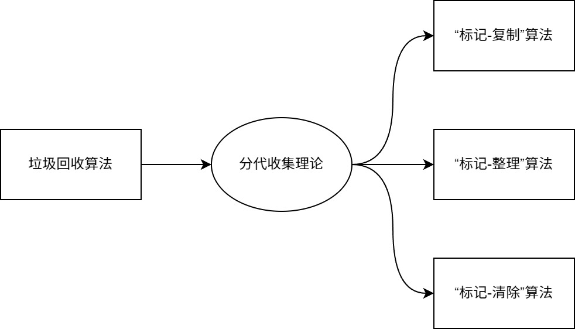

**什么是分代收集理论？**

当前虚拟机的垃圾收集都采用分代收集算法，根据对象存活周期的不同将内存分为几块。一般将堆内存分为新生代、老年代和元空间，这样就可以根据各个年代的特点选择合适的垃圾收集算法。比如在新生代中，每次收集都会有大量对象（近99%）死去，所以可以选择复制算法，只需要付出少量对象的复制成本就可以完成每次垃圾收集。而老年代的对象存活几率是比较高的，而且没有额外的空间对它进行分配担保，所以我们必须选择“标记-清除”或“标记-整理”算法进行垃圾收集。这里需要注意，“标记-清除”或“标记-整理”算法会比“标记-复制”算法慢10倍以上。

### “标记-复制”算法

为了解决效率问题，“标记-复制”收集算法出现了。它可以将内存分为大小相同的两块，每次使用其中的一块。当这一块的内存使用完后，就将还存活的对象复制到另一块去，然后再把使用的空间一次清理掉。这样就使每次的内存回收都是对内存区间的一半进行回收。示例图如下：

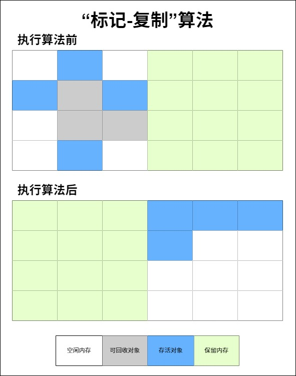

### “标记-清除”算法

该算法分为“标记”和“清除”阶段：标记存活的对象， 统一回收所有未被标记的对象（一般选择这种）；也可以反过来，标记出所有需要回收的对象，在标记完成后统一回收所有被标记的对象 。这是最基础的收集算法，比较简单，但是会带来两个明显的问题：

1、效率问题（如果需要标记的对象太多，效率不高）

2、空间问题（标记清除后会产生大量不连续的碎片）

示例图如下：

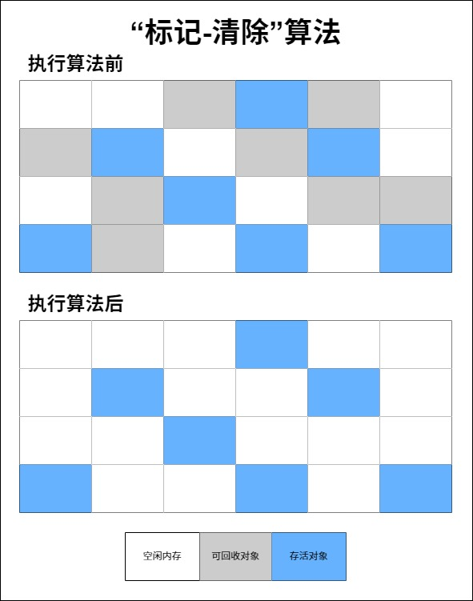

### “标记-整理”算法

这是根据老年代的特点专门设计的一种标记算法，标记过程仍然与“标记-清除”算法一样，但后续步骤不是直接对可回收对象回收，而是让所有存活的对象向一端移动，然后直接清理掉端边界以外的内存。示例图如下：


## 垃圾回收器

如果说垃圾回收算法是内存回收的方法论，那么垃圾回收器就是内存回收的具体实现。但是迄今为止还没有可以说是最好的垃圾回收器出现，现在能做的就是**根据具体应用场景选择适合自己的垃圾回收器**。以年轻代和老年代作为区分，目前主流垃圾回收器如图所示：

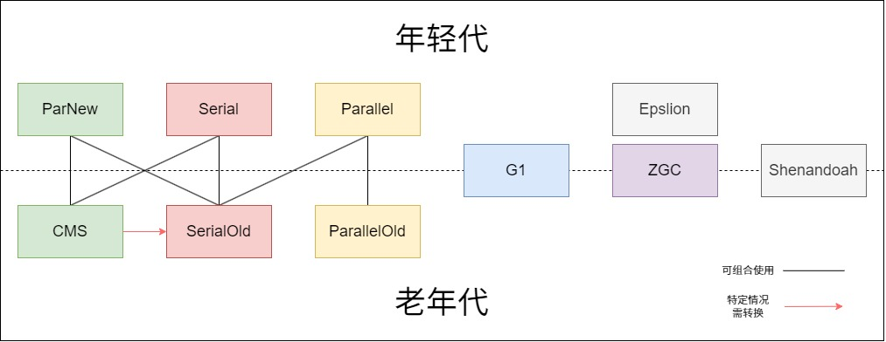

在上图中颜色相同的垃圾回收器表示对应的最搭配垃圾回收器，但是相互之间允许存在搭配使用，即连线配对的垃圾回收器，本章节主要讨论ParNew、CMS、Serial、SerialOld、Parallel以及ParallelOld垃圾回收器，G1和ZGC垃圾回收器会在下一章节进行讨论，Epslion和Shenandoah垃圾回收器了解即可。

### Serial&SerialOld垃圾回收器

**JVM启用相关参数：`-XX:+UseSerialGC -XX:+UseSerialOldGC`**

**Serial垃圾回收器是最基础、历史最悠久的垃圾回收器，它的特点就是“串行化”**，这个“串行化”并不仅仅指只用一条垃圾回收线程去完成垃圾回收工作，更重要的是它在工作过程中必须暂停其他的线程（包括应用程序线程和垃圾回收线程，其实就是STW），直到它垃圾回收结束。**新生代中的Serial垃圾回收采用“标记-复制”算法**，具体的工作示例图如下：

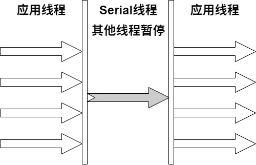

见名知意，**SerialOld垃圾回收器是Serial垃圾回收器的老年代版本**，它有两大作用，第一个是Java 5及其之前版本可以和Parallel垃圾回收器搭配使用，另一个是作为CMS垃圾回收器的转换方案。**老年代中的SerialOld垃圾回收采用“标记-整理”算法**。

综上可以看出该垃圾回收器效率是很低的，“单线程+STW”的组合会给用户带来非常不好的体验，但是Serial垃圾回收器也有优于其他垃圾回收器的地方，由于没有其他线程交互的开销，自然可以获得非常高的单线程回收效率。

### Parallel&ParallelOld垃圾回收器

**JVM启用相关参数：`-XX:+UseParallelGC -XX:+UseParallelOldGC`**

**Parallel垃圾回收器其实就是Serial垃圾回收器的多线程版本**，除了使用多线程进行垃圾回收之外，其他行为（控制参数、回收算法、回收策略等）和Serial垃圾回收器类似，默认的回收线程数和电脑CPU核数相同，当然也可以使用参数`-XX:ParallelGCThreads`指定回收线程数，但是一般不推荐修改。Parallel垃圾回收器关注点是吞吐量，即CPU中用于运行应用代码的时间与CPU总消耗时间的比值，目的是高效的使用CPU，而后面讨论的CMS等垃圾回收器更多关注的是用户线程的停顿时间，提高用户体验。**新生代中的Parallel垃圾回收采用“标记-复制”算法**，具体的工作示例图如下：

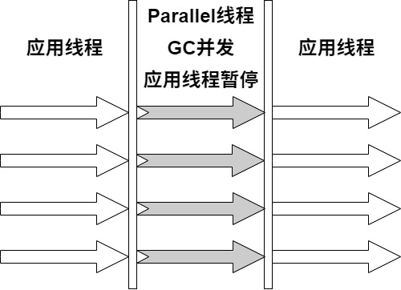

**ParallelOld垃圾回收器是Parallel垃圾回收器的老年代版本，使用多线程和“标记-整理”算法**，在关注吞吐量以及压榨CPU资源的场景下，可以优先考虑这对回收器，**在Java 8中，JVM默认的新生代和老年代垃圾回收器就是它们。**

### ParNew垃圾回收器

**JVM启用相关参数：`-XX:+UseParNewGC`**

**ParNew垃圾回收器跟Parallel垃圾回收器很相似，区别主要在于它可以和CMS垃圾回收器配合使用，在新生代中也使用“标记-复制”算法**，具体的工作示例图如下：

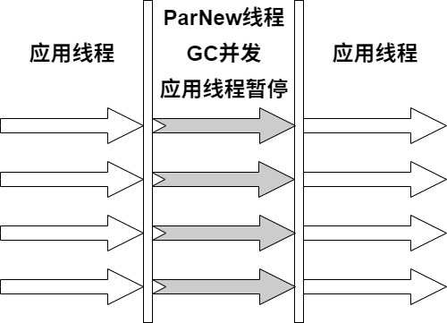

该垃圾回收器是运行在Server模式（主要针对服务器端应用程序，尤其是需要长时间运行并且对性能要求较高的场景）下的JVM垃圾回收的首要选择，除了Serial垃圾回收器外，只有它可以和CMS垃圾回收器配合工作，而CMS垃圾回收器可以看作是真正意义上的并发回收器。

### CMS垃圾回收器

**JVM启用相关参数：`-XX:+UseConcMarkSweepGC`**

CMS（Concurrent Mark Sweep）收集器是一种以获取最短回收停顿时间为目标的收集器。它非常符合在注重用户体验的应用上使用，它是HotSpot虚拟机第一款真正意义上的并发收集器，它第一次实现了让垃圾收集线程与用户线程同时工作（基本上）。

从名字中的Mark Sweep这两个词可以看出，**CMS收集器是基于“标记-清除”算法实现的**，它的运作过程相比于前面几种垃圾回收器来说更加复杂一些。整个过程分为五个步骤：

1、初始标记：暂停所有的其他线程（STW），并且记录下GC Roots直接能够引用的对象，这一步的速度非常快。

2、并发标记：并发标记阶段就是从GC Roots的直接关联对象开始遍历整个对象图的过程， 这个过程耗时较长但是不需要停顿用户线程， 可以与垃圾收集线程一起并发运行。因为用户程序继续运行，可能会有导致已经标记过的对象状态发生改变。

3、重新标记：重新标记阶段就是为了修正并发标记期间因为用户程序继续运行而导致标记产生变动的那一部分对象的标记记录（主要是处理漏标问题），这个阶段的停顿时间一般会比初始标记阶段的时间稍长，远远比并发标记阶段时间短。主要用到三色标记里的增量更新算法（见下面会详细讨论）做重新标记。

4、并发清除：开启用户线程，同时GC线程开始对未标记的区域做清扫。这个阶段如果有新增对象（包含浮动垃圾）会被标记为黑色不做任何处理（见下面三色标记算法中的讨论)。

5、并发重置：重置本次GC过程中的标记数据。

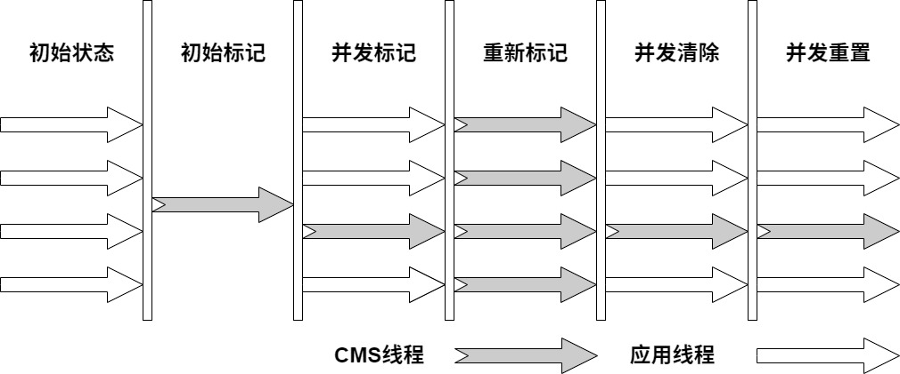

根据上图可以看出，CMS垃圾回收器具有并发收集、低停顿的特点，但是它也有下面这几个明显的缺点：

1、对CPU的资源交互频繁，主要体现在会和应用线程抢占资源。

2、如果在并发标记和并发清除阶段又产生垃圾，这样的垃圾就是浮动垃圾，CMS垃圾回收器无法处理这样的垃圾，只能等待下一次GC再清除。

3、CMS垃圾回收器主要使用“标记-清除”算法，该算法会导致产生大量空间碎片，当然也可以通过参数`-XX:+UseCMSCompactAtFullCollection`让JVM在执行完标记清除后在做整理。

4、执行过程中存在不确定性，也许存在上一次垃圾回收还没有执行完，紧接着有触发垃圾回收的情况，特别是在并发标记和并发清除的阶段，因为系统一边运行一边回收垃圾，很有可能在回收垃圾过程中再触发一次Full GC垃圾回收，这个也被称为“Concurrent Mode Failure”，即并发模式失效，此时就会触发STW，并且老年代会转换为SerialOld垃圾回收器来进行回收。

CMS的相关核心参数

1、`-XX:+UseConcMarkSweepGC`：启用CMS；

2、`-XX:ConcGCThreads`：并发的GC线程数；

3、`-XX:+UseCMSCompactAtFullCollection`：Full GC之后做压缩整理（减少碎片）；

4、`-XX:CMSFullGCsBeforeCompaction`：多少次Full GC之后压缩一次，默认是0，代表每次Full GC后都会压缩一次；

5、`-XX:CMSInitiatingOccupancyFraction`: 当老年代使用达到该比例时会触发Full GC（默认是92，即92%）；

6、`-XX:+UseCMSInitiatingOccupancyOnly`：表示只使用设定的回收阈值，如果不指定，JVM仅在第一次使用设定值，后续则会自动调整；

7、`-XX:+CMSScavengeBeforeRemark`：在CMS前启动一次Minor GC，降低CMS标记阶段(也会对年轻代一起做标记，如果在Minor GC就干掉了很多对垃圾对象，标记阶段就会减少一些标记时间)时的开销，一般CMS的GC耗时80%都在标记阶段；

8、`-XX:+CMSParallellnitialMarkEnabled`：表示在初始标记的时候多线程执行，缩短STW；

9、`-XX:+CMSParallelRemarkEnabled`：在重新标记的时候多线程执行，缩短STW。

## 高并发场景优化

现在再回过头来看以前提到过的一个高并发场景，现在使用ParNew&CMS的组合来对其进行JVM参数优化，场景示例图如下：

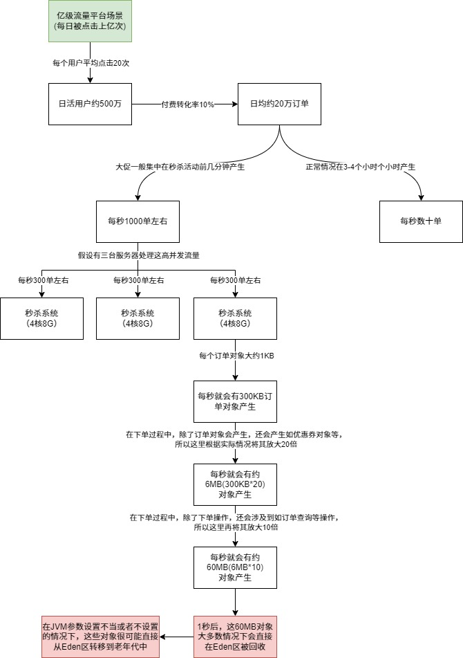

从前面章节内容中可以看出，对于8G内存，一般的JVM参数配置如下：

```shell
java -Xms3072M -Xmx3072M -Xss1M -XX:MetaspaceSize=512M -XX:MaxMetaspaceSize=512M -jar spring-boot-init-template.jar
```

这样设置由于可能触发动态对象年龄判断机制而导致频繁的Full GC，当时给优化成如下JVM参数：

```shell
java -Xms3072M -Xmx3072M -Xmn2048M -Xss1M -XX:MetaspaceSize=512M -XX:MaxMetaspaceSize=512M -jar spring-boot-init-template.jar
```

修改完成之后具体的内存模型如下图所示：

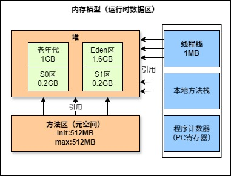

这样就解决了由于对象动态年龄判断机制导致的对象频繁进入老年代的问题，其实很多优化无非就是让短期存活的对象尽量都留在年轻代里，不要进入老年代，这样在Minor GC的时候这些对象都会被回收，不会进到老年代从而导致Full GC。

对于对象年龄应该为多少才移动到老年代比较合适这个问题，上图中可以看出一次Minor GC要间隔大约28（1.6GB/60MB）秒，大多数对象一般在几秒内就会变为垃圾，完全可以将默认的对象年龄15岁改小一点，使用参数`-XX:MaxTenuringThreshold`，比如降低到5岁，那么意味着对象要经过5次Minor GC才会进入老年代，整个时间大约也有2.5分钟了，如果对象这么长时间都没被回收，完全可以认为这些对象是会存活的比较长的对象，可以移动到老年代，而不是继续一直占用Survivor区空间。为了保证上诉计算的时间保持稳定，可能需要指明Eden区和Survivor区的比例，即8:1:1，使用参数`-XX:SurvivorRatio=8`即可。

对于多大的对象直接进入老年代（参数`-XX:PretenureSizeThreshold`）这个问题，这个一般可以结合系统分析有没有什么大对象生成，预估下大对象的大小，一般来说设置为1M就差不多了，很少有超过1M的大对象，这些对象一般就是系统初始化分配的缓存对象，比如大的缓存List，Map之类的对象。

再结合ParNew&CMS垃圾回收器，就可以把JVM运行参数调整如下：

```shell
java -Xms3072M -Xmx3072M -Xmn2048M -Xss1M -XX:MetaspaceSize=512M -XX:MaxMetaspaceSize=512M -XX:SurvivorRatio=8 -XX:MaxTenuringThreshold=5 -XX:PretenureSizeThreshold=1M -jar spring-boot-init-template.jar
```

对于JDK8默认的垃圾回收器是`-XX:+UseParallelGC`（年轻代）和`-XX:+UseParallelOldGC`（老年代），如果内存较大（一般超过4个G就算比较大的内存)，系统对停顿时间比较敏感，可以使用ParNew&CMS组合进行优化（`-XX:+UseParNewGC -XX:+UseConcMarkSweepGC`）。

对于老年代CMS的参数如何设置可以思考下，当前这个系统有哪些对象可能会长期存活躲过5次以上Minor GC最终进入老年代？无非就是那些Spring容器里的Bean，线程池对象，一些初始化缓存数据对象等，这些加起来也就数十MB。还有就是可能存在某次Minor GC完成之后还有超过100MB~200MB的对象存活，那么就会直接进入老年代，比如突然某一秒瞬间要处理五六百单，那么每秒生成的对象可能有一百多MB，再加上整个系统可能压力剧增，一个订单要好几秒才能处理完，下一秒可能又有很多订单过来。

可以估算下大概每隔五六分钟出现一次这样的情况，那么大概半小时到一小时之间就可能因为老年代满了触发一次Full GC，Full GC的触发条件还有之前提到的老年代空间分配担保机制，但是历次的Minor GC挪动到老年代的对象大小肯定是非常小的，所以几乎不会在Minor GC触发之前由于老年代空间分配担保失败而产生Full GC，而且在半小时后发生Full GC，这时候已经过了秒杀的最高峰期，后续可能几小时才做一次Full GC。

对于碎片整理，因为都是一小时或几小时才做一次Full GC，是可以每做完一次就开始碎片整理，或者两到三次之后再做一次也行，参数为`-XX:CMSFullGCsBeforeCompaction`。综上，只要年轻代参数设置合理，老年代CMS的参数设置基本都可以用默认值，最终优化的参数如下所示：

```shell
java -Xms3072M -Xmx3072M -Xmn2048M -Xss1M -XX:MetaspaceSize=512M -XX:MaxMetaspaceSize=512M -XX:SurvivorRatio=8 -XX:MaxTenuringThreshold=5 -XX:PretenureSizeThreshold=1M -XX:+UseParNewGC -XX:+UseConcMarkSweepGC -XX:CMSInitiatingOccupancyFraction=92 -XX:+UseCMSCompactAtFullCollection -XX:CMSFullGCsBeforeCompaction=3 -jar spring-boot-init-template.jar
```

## 底层算法之三色标记

**CMS垃圾回收器的底层算法就是三色标记**，在并发标记的过程中，由于应用线程还在继续运行，对象间的引用可能发生变化，多标和漏标的情况就有可能发生，漏标的问题主要引入了三色标记算法来解决。

三色标记算法是把GC Roots可达性分析遍历对象图过程中遇到的对象，按照“是否访问过”这个条件标记成以下三种颜色：

1、黑色对象：表示对象已经被垃圾回收器访问过，且这个对象的所有引用都已经扫描过，黑色对象是安全存活的，如果有其他对象引用指向了黑色对象，无须重新扫描一遍。先说一个结论：黑色对象不可能直接（不经过灰色对象） 指向某个白色对象。

2、灰色对象：表示对象已经被垃圾回收器访问过，但这个对象上至少存在一个引用还没有被扫描过。

3、白色对象：表示对象尚未被垃圾回收器访问过。 显然在可达性分析刚刚开始的阶段， 所有的对象都是白色的， 若在分析结束的阶段，仍然是白色的对象， 即代表不可达。

下图是一个三色标记的示例图：

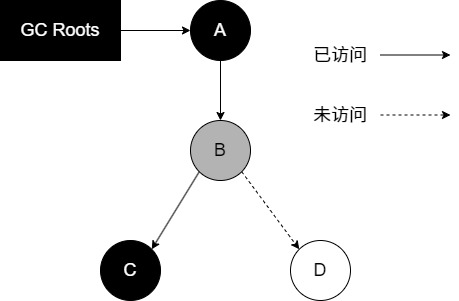

上面内容提到过，在CMS垃圾回收过程中会出现两个问题，第一个是浮动垃圾，第二个是漏标。接下来依次说明三色标记如何解决这两个问题。

### 浮动垃圾问题

在并发标记过程中，如果由于方法运行结束导致部分局部变量（GC Root）被销毁，这个GC Root引用的对象之前又被扫描过（被标记为非垃圾对象），那么本轮GC不会回收这部分内存。这部分本应该回收但是没有回收到的内存，被称之为“浮动垃圾”。浮动垃圾并不会影响垃圾回收的正确性，只是需要等到下一轮垃圾回收中才被清除。针对并发标记（还有并发清理）开始后产生的新对象，通常的做法是直接全部当成黑色，本轮不会进行清除，这种现象就是“多标”。这部分对象在垃圾回收期间可能也会变为垃圾，这也算是浮动垃圾的一部分。

### 漏标问题（重要）

简单点说就本应该标记成黑色和灰色的对象没有被标记，会导致被引用的对象被当成垃圾误删除，下面用一个代码示例和一张示例图来说明这个问题：

```java
package top.sharehome.gcandthreecolorremark;

/**
 * 三色标记示例代码
 *
 * @author AntonyCheng
 */
public class ThreeColorRemark {

    public static void main(String[] args) {
        A a = new A();
        // 开始并发标记
        D d = a.b.d;  // 1、读操作
        a.b.d = null; // 2、写操作
        a.d = d;      // 3、写操作
    }

}

class A {
    B b = new B();
    D d = null;
}

class B {
    C c = new C();
    D d = new D();
}

class C {
}

class D {
}
```

针对上面的代码可以画出如下示例图：

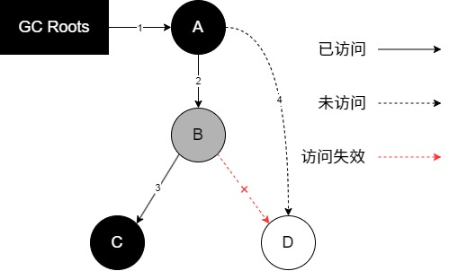

针对图片举例说明一下，由于应用线程和垃圾回收线程是并发运行的，并发标记过程中B对象引用了D对象，但要扫描D对象时突然取消B对象对D对象的引用，紧接着让A对象去引用D对象，那么此时A对象是黑色对象，D对象是白色对象，在重新标记过程中不会再次访问黑色对象及其引用的对象，那么当并发清除时，D对象就会面临被清除的风险，这个就是漏标。

针对这个问题一般有两种解决方案：**增量更新（Incremental Update）和原始快照（Snapshot At The Beginning，SATB）**。

**增量更新**就是当黑色对象插入新的指向白色对象的引用关系时， 就将这个新插入的引用记录下来， 等并发扫描结束之后， 再将这些记录过的引用关系中的黑色对象为根， 重新扫描一次。 这可以简化理解为， 黑色对象一旦新插入了指向白色对象的引用之后， 它就变回灰色对象了。

**原始快照**就是当灰色对象要删除指向白色对象的引用关系时， 就将这个要删除的引用记录下来， 在并发扫描结束之后， 再将这些记录过的引用关系中的灰色对象为根， 重新扫描一次，这样就能扫描到白色的对象，将白色对象直接标记为黑色（目的就是让这种对象在本轮GC清理中能存活下来，待下一轮GC的时候重新扫描，这个对象也有可能是浮动垃圾）。

**以上无论是对引用关系记录的插入还是删除， CMS垃圾回收器的记录操作都是通过写屏障实现的。**那么什么是写屏障呢？它的底层实现在HotSpot中据详细体现，这里用伪代码来描述一下这个概念。在Java代码中进行赋值操作时，C++源码会实现类似于下面这个方法：

```c++
/**
* @param field 某对象的成员变量，如 a.b.d
* @param new_value 新值，如 null
*/
void oop_field_store(oop* field, oop new_value) {
	*field = new_value; // 赋值操作
}
```

所谓的写屏障，其实就是指在赋值操作前后，加入一些处理（可以参考AOP的概念）：

```c++
void oop_field_store(oop* field, oop new_value) {
	pre_write_barrier(field); // 写屏障-写前操作
	*field = new_value;
	post_write_barrier(field, value); // 写屏障-写后操作
}
```

上面的写前操作就可以看作实现了原始快照（SATB）：

```c++
void pre_write_barrier(oop* field) {
	oop old_value = *field; // 获取旧值
	remark_set.add(old_value); // 记录原来的引用对象
}
```

而写后操作就可以看作实现了增量更新：

```c++
void post_write_barrier(oop* field, oop new_value) {
	remark_set.add(new_value); // 记录新引用的对象
}
```

**与写屏障相对应的一个概念就是读屏障**，大概的伪代码如下：

```c++
oop oop_field_load(oop* field) {
	pre_load_barrier(field); // 读屏障-读取前操作
	return *field;
}

// 当Java代码中执行D d = a.b.d，当读取成员变量时，会触发C++这个函数
void pre_load_barrier(oop* field) {
	oop old_value = *field;
	remark_set.add(old_value); // 记录读取到的对象
}
```

### 总结

涉及到可达性分析的垃圾回收器几乎都借鉴了三色标记的算法思想，尽管实现的方式不尽相同：比如白色/黑色集合一般都不会出现（但是有其他体现颜色的地方）、灰色集合可以通过栈/队列/缓存日志等方式进行实现、遍历方式可以是广度/深度遍历等等。

对于读写屏障，以Java HotSpot VM为例，其并发标记时对漏标的处理方案如下：

- CMS：写屏障 + 增量更新
- G1、Shenandoah：写屏障 + SATB
- ZGC：读屏障

工程实现中，读写屏障还有其他功能，比如写屏障可以用于记录跨代/区引用的变化，读屏障可以用于支持移动对象的并发执行等。功能之外，还有性能的考虑，所以对于选择哪种，每款垃圾回收器都有自己的想法。

**为什么G1用SATB？CMS用增量更新？**

SATB相对增量更新效率会高（当然SATB可能造成更多的浮动垃圾），因为不需要在重新标记阶段再次深度扫描被删除引用对象，而CMS对增量引用的根对象会做深度扫描，G1因为很多对象都位于不同的内存区（下一章会有详细讨论），CMS就一块老年代区域，重新深度扫描对象的话G1的代价会比CMS高，所以G1选择SATB不深度扫描对象，只是简单标记，等到下一轮GC再深度扫描。

## 记忆集与卡表（了解）

在新生代做GC Roots可达性扫描过程中可能会碰到跨代引用的对象，这种如果又去对老年代再去扫描效率太低了。

为此，在新生代可以引入记录集（Remember Set）的数据结构（记录从非收集区到收集区的指针集合），避免把整个老年代加入GC Roots扫描范围。事实上并不只是新生代、 老年代之间才有跨代引用的问题， 所有涉及部分区域收集（Partial GC） 行为的垃圾收集器， 典型的如G1、 ZGC和Shenandoah收集器， 都会面临相同的问题。

垃圾收集场景中，收集器只需通过记忆集判断出某一块非收集区域是否存在指向收集区域的指针即可，无需了解跨代引用指针的全部细节。

HotSpot使用一种叫做“卡表”（Cardtable）的方式实现记忆集，也是目前最常用的一种方式。关于卡表与记忆集的关系， 可以类比为Java语言中HashMap与Map的关系。

卡表是使用一个字节数组实现：CARD_TABLE[]，每个元素对应着其标识的内存区域一块特定大小的内存块，称为“卡页”。HotSpot使用的卡页是2^9大小，即512字节。

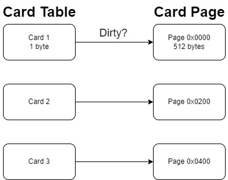

一个卡页中可包含多个对象，只要有一个对象的字段存在跨代指针，其对应的卡表的元素标识就变成1，表示该元素变脏，否则为0.GC时，只要筛选本收集区的卡表中变脏的元素加入GCRoots里。

**卡表的维护**

卡表变脏上面已经说了，但是需要知道如何让卡表变脏，即发生引用字段赋值时，如何更新卡表对应的标识为1。Hotspot使用写屏障维护卡表状态。