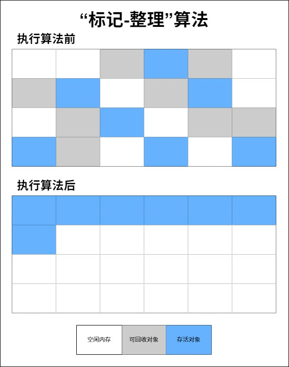

# 垃圾回收器ParNew&CMS与底层三色标记算法详解

在Java 8中，JVM垃圾回收器默认是`Parallel&Parallel(Old)`组合，但实际业务优化场景下一般会将垃圾回收器设置为`ParNew&CMS`组合，接下来一步一步基于Java 8来进行讨论。

## 垃圾回收算法

垃圾回收算法包含三种：**标记-复制、标记-整理、标记-清楚**，如下图所示：

**什么是分代收集理论？**

当前虚拟机的垃圾收集都采用分代收集算法，根据对象存活周期的不同将内存分为几块。一般将堆内存分为新生代、老年代和元空间，这样就可以根据各个年代的特点选择合适的垃圾收集算法。比如在新生代中，每次收集都会有大量对象（近99%）死去，所以可以选择复制算法，只需要付出少量对象的复制成本就可以完成每次垃圾收集。而老年代的对象存活几率是比较高的，而且没有额外的空间对它进行分配担保，所以我们必须选择“标记-清除”或“标记-整理”算法进行垃圾收集。这里需要注意，“标记-清除”或“标记-整理”算法会比“标记-复制”算法慢10倍以上。

### “标记-复制”算法

为了解决效率问题，“标记-复制”收集算法出现了。它可以将内存分为大小相同的两块，每次使用其中的一块。当这一块的内存使用完后，就将还存活的对象复制到另一块去，然后再把使用的空间一次清理掉。这样就使每次的内存回收都是对内存区间的一半进行回收。示例图如下：

### “标记-清除”算法

该算法分为“标记”和“清除”阶段：标记存活的对象， 统一回收所有未被标记的对象（一般选择这种）；也可以反过来，标记出所有需要回收的对象，在标记完成后统一回收所有被标记的对象 。这是最基础的收集算法，比较简单，但是会带来两个明显的问题：

1、效率问题（如果需要标记的对象太多，效率不高）

2、空间问题（标记清除后会产生大量不连续的碎片）

示例图如下：

### “标记-整理”算法

这是根据老年代的特点专门设计的一种标记算法，标记过程仍然与“标记-清除”算法一样，但后续步骤不是直接对可回收对象回收，而是让所有存活的对象向一端移动，然后直接清理掉端边界以外的内存。示例图如下：

## 垃圾回收器

如果说垃圾回收算法是内存回收的方法论，那么垃圾回收器就是内存回收的具体实现。但是迄今为止还没有可以说是最好的垃圾回收器出现，现在能做的就是**根据具体应用场景选择适合自己的垃圾回收器**。以年轻代和老年代作为区分，目前主流垃圾回收器如图所示：

在上图中颜色相同的垃圾回收器表示对应的最搭配垃圾回收器，但是相互之间允许存在搭配使用，即连线配对的垃圾回收器，本章节主要讨论ParNew、CMS、Serial、SerialOld、Parallel以及ParallelOld垃圾回收器，G1和ZGC垃圾回收器会在下一章节进行讨论，Epslion和Shenandoah垃圾回收器了解即可。

### Serial&SerialOld垃圾回收器

**JVM启用相关参数：`-XX:+UseSerialGC -XX:+UseSerialOldGC`**

**Serial垃圾回收器是最基础、历史最悠久的垃圾回收器，它的特点就是“串行化”**，这个“串行化”并不仅仅指只用一条垃圾回收线程去完成垃圾回收工作，更重要的是它在工作过程中必须暂停其他的线程（包括应用程序线程和垃圾回收线程，其实就是STW），直到它垃圾回收结束。**新生代中的Serial垃圾回收采用“标记-复制”算法**，具体的工作示例图如下：

见名知意，**SerialOld垃圾回收器是Serial垃圾回收器的老年代版本**，它有两大作用，第一个是Java 5及其之前版本可以和Parallel垃圾回收器搭配使用，另一个是作为CMS垃圾回收器的转换方案。**老年代中的SerialOld垃圾回收采用“标记-整理”算法**。

综上可以看出该垃圾回收器效率是很低的，“单线程+STW”的组合会给用户带来非常不好的体验，但是Serial垃圾回收器也有优于其他垃圾回收器的地方，由于没有其他线程交互的开销，自然可以获得非常高的单线程回收效率。

### Parallel&ParallelOld垃圾回收器

**JVM启用相关参数：`-XX:+UseParallelGC -XX:+UseParallelOldGC`**

**Parallel垃圾回收器其实就是Serial垃圾回收器的多线程版本**，除了使用多线程进行垃圾回收之外，其他行为（控制参数、回收算法、回收策略等）和Serial垃圾回收器类似，默认的回收线程数和电脑CPU核数相同，当然也可以使用参数`-XX:ParallelGCThreads`指定回收线程数，但是一般不推荐修改。Parallel垃圾回收器关注点是吞吐量，即CPU中用于运行应用代码的时间与CPU总消耗时间的比值，目的是高效的使用CPU，而后面讨论的CMS等垃圾回收器更多关注的是用户线程的停顿时间，提高用户体验。**新生代中的Parallel垃圾回收采用“标记-复制”算法**，具体的工作示例图如下：

**ParallelOld垃圾回收器是Parallel垃圾回收器的老年代版本，使用多线程和“标记-整理”算法**，在关注吞吐量以及压榨CPU资源的场景下，可以优先考虑这对回收器，**在Java 8中，JVM默认的新生代和老年代垃圾回收器就是它们。**

### ParNew垃圾回收器

**JVM启用相关参数：`-XX:+UseParNewGC`**

**ParNew垃圾回收器跟Parallel垃圾回收器很相似，区别主要在于它可以和CMS垃圾回收器配合使用，在新生代中也使用“标记-复制”算法**，具体的工作示例图如下：

该垃圾回收器是运行在Server模式（主要针对服务器端应用程序，尤其是需要长时间运行并且对性能要求较高的场景）下的JVM垃圾回收的首要选择，除了Serial垃圾回收器外，只有它可以和CMS垃圾回收器配合工作，而CMS垃圾回收器可以看作是真正意义上的并发回收器。

### CMS垃圾回收器

**JVM启用相关参数：`-XX:+UseConcMarkSweepGC`**

CMS（Concurrent Mark Sweep）收集器是一种以获取最短回收停顿时间为目标的收集器。它非常符合在注重用户体验的应用上使用，它是HotSpot虚拟机第一款真正意义上的并发收集器，它第一次实现了让垃圾收集线程与用户线程（基本上）同时工作。

从名字中的Mark Sweep这两个词可以看出，**CMS收集器是基于“标记-清除”算法实现的**，它的运作过程相比于前面几种垃圾收集器来说更加复杂一些。整个过程分为五个步骤：

1、初始标记：暂停所有的其他线程（STW），并且记录下GC Roots直接能够引用的对象，这一步的速度非常快。

2、并发标记：并发标记阶段就是从GC Roots的直接关联对象开始遍历整个对象图的过程， 这个过程耗时较长但是不需要停顿用户线程， 可以与垃圾收集线程一起并发运行。因为用户程序继续运行，可能会有导致已经标记过的对象状态发生改变。

3、重新标记：重新标记阶段就是为了修正并发标记期间因为用户程序继续运行而导致标记产生变动的那一部分对象的标记记录（主要是处理漏标问题），这个阶段的停顿时间一般会比初始标记阶段的时间稍长，远远比并发标记阶段时间短。主要用到三色标记里的增量更新算法（见下面会详细讨论）做重新标记。

4、并发清理：开启用户线程，同时GC线程开始对未标记的区域做清扫。这个阶段如果有新增对象会被标记为黑色不做任何处理（见下面三色标记算法中的讨论)。

5、并发重置：重置本次GC过程中的标记数据。

