# 垃圾回收器G1&ZGC详解

**说明**：本章节依然以Java 8为基准，描述Java 9中的G1垃圾回收器以及Java 11及其之后的ZGC垃圾回收器。说是详解，其实就是对这两种垃圾回收器做一个特性探讨，接下来内容大多数都是从以下参考收集而来：

- [深入理解Java虚拟机：JVM高级特性与最佳实践（第3版）](../../1.性能优化/9.从JDK源码级别彻底剖析JVM类加载机制/JVM部分的参考资料/深入理解Java虚拟机：JVM高级特性与最佳实践（第3版）周志明.pdf)
- [ZGC垃圾回收器参考资料](./ZGC垃圾回收器参考资料)
- [OpenJDK 23 Wiki](https://wiki.openjdk.org/display/zgc/Main#Main-JDK23)
- [新一代垃圾回收器ZGC的探索与实践](https://tech.meituan.com/2020/08/06/new-zgc-practice-in-meituan.html)
- [Java Hotspot G1 GC的一些关键技术](https://tech.meituan.com/2016/09/23/g1.html)

**一般来说G1垃圾回收器和ZGC垃圾回收器使用默认的JVM参数即可，参数调整意义不大，还容易适得其反。**

## G1垃圾回收器

**JVM启用相关参数：`-XX:+UseG1GC`**

G1（Garbage-First）是一款面向服务器的垃圾回收器，主要针对配备多颗处理器及大容量内存的机器。以极高概率满足GC停顿时间要求的同时，还具备高吞吐量性能特征。

在传统的CG垃圾回收器中都会将连续的内存空间划分为新生代、老年代以及元空间（Java 8之前是永久代），这种划分的特点是各代的存储地址是连续的，具体示例图如下所示：

但是从G1垃圾回收器开始就需要“忘记”这样连续的内存结构，因为在G1垃圾回收器中使用了**不连续的分代存储**地址，具体示例图如下所示：

G1垃圾回收器将Java堆划分为多个大小相等的独立区域（Region），JVM最多可以有2048个Region。一般Region大小等于堆大小除以2048，比如堆大小为4096M，则Region大小为2M，当然也可以用参数`-XX:G1HeapRegionSize`手动指定Region大小，但是推荐默认的计算方式。G1垃圾回收器保留了年轻代和老年代的概念，但不再是物理隔阂了，它们都是Region的集合。默认年轻代对堆内存的占比是5%，如果堆大小为4096M，那么年轻代占据200MB左右的内存，对应大概是100个Region，可以通过`-XX:G1NewSizePercent`设置新生代初始占比，在系统运行中，JVM会不停的给年轻代增加更多的Region，但是最多新生代的占比不会超过60%，可以通过`-XX:G1MaxNewSizePercent`调整。年轻代中的Eden和Survivor对应的Region空间比例也跟之前一样，默认8:1:1，假设年轻代现在有1000个Region，Eden区对应800个，S0对应100个，S1对应100个。一个Region可能之前是年轻代，如果Region进行了垃圾回收，之后可能又会变成老年代，也就是说Region的区域功能可能会动态变化。

G1垃圾回收器对于对象什么时候会转移到老年代跟之前的垃圾回收器原则一样，唯一不同的是对大对象的处理在上图中可以注意到还有一些Region标明了H，它代表Humongous，表示这些Region存储的是大对象（Humongous Object，H-obj）。在G1垃圾回收器中，大对象的判定规则就是一个大对象超过了一个Region大小的50%，比如按照上面算的，每个Region是2M，只要一个大对象超过了1M，就会被放入Humongous中，而且一个大对象如果太大，可能会横跨多个Humongous Region来存放。Humongous区专门存放短期巨型对象，不用直接进老年代，可以节约老年代的空间，避免因为老年代空间不够的GC开销。Full GC的时候除了回收年轻代和老年代之外，也会将Humongous区一并回收。

G1垃圾回收器的运作过程大致可划分为以下四个步骤，如图所示：

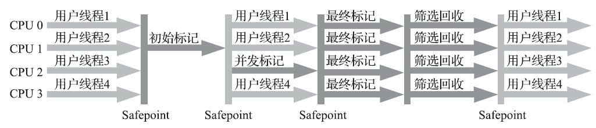

1、初始标记（Initial Marking，存在STW）：仅仅只是标记一下GC Roots能直接关联到的对象，并且修改TAMS指针的值，让下一阶段用户线程并发运行时，能正确地在可用的Region中分配新对象。这个阶段需要停顿线程，但耗时很短，而且是借用进行Minor GC的时候同步完成的，所以G1垃圾回收器在这个阶段实际并没有额外的停顿。

2、并发标记（Concurrent Marking，存在STW）：从GC Root开始对堆中对象进行可达性分析，递归扫描整个堆里的对象图，找出要回收的对象，这阶段耗时较长，但可与用户程序并发执行。当对象图扫描完成以后，还要重新处理SATB记录下的在并发时有引用变动的对象（和CMS垃圾回收器的并发标记类似）。

3、最终标记（Final Marking）：对用户线程做另一个短暂的暂停，用于处理并发阶段结束后仍遗留下来的最后那少量的SATB记录（和CMS垃圾回收器的重新标记类似）。

4、筛选回收（Cleanup，存在STW）：筛选回收阶段首先对各个Region的回收价值和成本进行排序，根据用户所期望的GC停顿时间（可以用JVM参数`-XX:MaxGCPauseMillis`指定）来制定回收计划，比如说老年代此时有1000个Region都满了，但是因为根据预期停顿时间，本次垃圾回收可能只能停顿200毫秒，那么通过之前回收成本计算得知，可能回收其中800个Region刚好需要200ms，那么就只会回收800个Region（Collection Set，要回收的集
合），尽量把GC导致的停顿时间控制在我们指定的范围内。这个阶段其实也可以做到与用户程序一起并发执行，但是因为只回收一部分Region，时间是用户可控制的，而且停顿用户线程将大幅提高回收效率。不管是年轻代或是老年代，回收算法主要用的是复制算法，将一个Region中的存活对象复制到另一个Region中，这种不会像CMS垃圾回收器那样回收完，因为有很多内存碎片还需要整理一次，G1垃圾回收器采用复制算法回收几乎不会有太多内存碎片。（注意：CMS垃圾回收器回收阶段是跟用户线程一起并发执行的，G1垃圾回收器因为内部实现太复杂暂时没实现并发回收，不过到了Shenandoah垃圾回收器实现了并发回收，Shenandoah垃圾回收器可以看成是G1垃圾回收器的升级版本，而G1垃圾回收器可以可以看成是CMS垃圾回收器的升级版本）。

G1垃圾回收器器在后台维护了一个优先列表，每次根据允许的回收时间，优先选择回收价值最大的Region（这也就是它的名字Garbage-First的由来），比如一个Region花200ms能回收10M垃圾，另外一个Region花50ms能回收20M垃圾，在回收时间有限情况下，G1当然会优先选择后面这个Region回收。这种使用Region划分内存空间以及有优先级的区域回收方式，保证了G1垃圾回收器在有限时间内可以尽可能高的回收效率。

G1垃圾回收器被视为Java 7之后版本JVM的一个重要进化里程碑，它有如下特点：

1、并行与并发：G1垃圾回收器能充分利用CPU、多核环境下的硬件优势，使用多个CPU（或CPU核心）来缩短Stop-The-World停顿时间。部分其他垃圾回收器原本需要停顿Java线程来执行GC动作，G1垃圾回收器仍然可以通过并发的方式让Java程序继续执行。

2、分代回收：虽然G1垃圾回收器可以不需要其他垃圾回收器配合就能独立管理整个JVM堆内存，但是还是保留了分代的概念。

3、空间整合：与CMS垃圾回收器的“标记-清理”算法不同，G1垃圾回收器从整体来看是基于“标记-整理”算法实现的，但从局部上来看是基于“标记-复制”算法实现的。

4、可预测的停顿：这是G1垃圾回收器相对于CMS垃圾回收器的另一个大优势，降低停顿时间是两种垃圾回收器共同的关注点，但G1垃圾回收器除了追求低停顿外，还能建立可预测的停顿时间模型，能让使用者明确指定在一个长度为M毫秒的时间片段（通过参数`-XX:MaxGCPauseMillis`指定）内完成垃圾回收。

毫无疑问，可以由用户指定期望的停顿时间是G1垃圾回收器最突出的一个功能，设置不同的期望停顿时间，可使得G1垃圾回收器在不同应用场景中取得吞吐量和延迟之间的最佳平衡。不过这里设置的“期望值”必须是符合实际的，不能异想天开，毕竟G1垃圾回收器是要冻结用户线程来复制对象的，这个停顿时间再怎么低也得有个限度。它默认的停顿目标为200ms，一般来说， 回收阶段占到数十到一百甚至接近两百毫秒都很正常，但如果把停顿时间调得非常低，譬如设置为20ms，可能出现的结果就是由于停顿目标时间太短，导致每次选出来的回收集只占堆内存很小的一部分，垃圾回收器回收的速度逐渐跟不上分配器分配的速度，导致垃圾慢慢堆积。很可能一开始回收器还能从空闲的堆内存中获得一些喘息的时间，但应用运行时间一长就不行了，最终引发Full GC反而降低性能，所以通常把期望停顿时间设置为100ms-300ms是比较合理的。

### G1垃圾回收方式分类

1、Minor GC：在G1垃圾回收器种，Minor GC并不是说现有的Eden区放满了就会马上触发，G1垃圾回收器会计算下现在Eden区回收大概要多久时间，如果回收时间远远小于参数`-XX:MaxGCPauseMills`设定的值（默认200ms），那么就会增加年轻代的Region，继续给新对象存放，不会马上做Minor GC，直到下一次Eden区放满，G1计算回收时间接近参数`-XX:MaxGCPauseMills`设定的值（默认200ms），那么就会触发Minor GC。

2、Mixed GC：这不是Full GC，老年代的堆占有率达到参数`-XX:InitiatingHeapOccupancyPercent`设定的值则触发，回收所有的年轻代和部分老年代（根据期望的GC停顿时间确定老年代垃圾回收的优先顺序）以及大对象区，正常情况下，G1垃圾回收器是先做Mixed GC，主要使用“标记-复制”算法，需要把各个Region中存活的对象拷贝到别的Region里去，拷贝过程中如果发现没有足够的空闲Region能够承载拷贝对象，就会触发一次Full GC。

3、Full GC：停止系统程序，然后采用单线程进行标记、清理和压缩整理，空闲出来一批Region空间来供下一次Mixed GC使用，这个过程是非常耗时的（Shenandoah垃圾回收器优化成多线程回收）。

### G1垃圾回收器参数设置

`-XX:+UseG1GC`：使用G1垃圾回收器；

`-XX:ParallelGCThreads`：指定GC工作的线程数量；

`-XX:G1HeapRegionSize`：指定分区大小（1MB~32MB，且必须是2的N次幂），默认将整堆划分为2048个分区；

`-XX:MaxGCPauseMillis`：目标暂停时间（默认200ms）；

`-XX:G1NewSizePercent`：新生代内存初始空间（默认整堆5%）；

`-XX:G1MaxNewSizePercent`：新生代内存最大空间；

`-XX:TargetSurvivorRatio`：Survivor区的填充容量（默认50%），Survivor区域里的一批对象（年龄1+年龄2+年龄n的多个年龄对象）总和超过了Survivor区域的50%，此时就会把年龄n（含）以上的对象都放入老年代；

`-XX:MaxTenuringThreshold`：最大年龄阈值（默认15）；

`-XX:InitiatingHeapOccupancyPercent`：老年代占用空间达到整堆内存阈值（默认45%），则执行新生代和老年代的混合回收（Mixed GC），比如我们之前说的堆默认有2048个Region，如果有接近1000个Region都是老年代的Region，则可能就要触发Mixed GC了；

`-XX:G1MixedGCLiveThresholdPercent`（默认85%）：region中的存活对象低于这个值时才会回收该Region，如果超过这个值，存活对象过多，回收的的意义不大；

`-XX:G1MixedGCCountTarget`：在一次回收过程中指定做几次筛选回收（默认8次），在最后一个筛选回收阶段可以回收一会，然后暂停回收，恢复系统运行，一会再开始回收，这样可以让系统不至于单次停顿时间过长；

`-XX:G1HeapWastePercent`（默认5%）：GC过程中空出来的Region是否充足阈值，在混合回收的时候，对Region回收都是基于复制算法进行的，都是把要回收的Region里的存活对象放入其他Region，然后这个Region中的垃圾对象全部清理掉，这样的话在回收过程就会不断空出来新的Region，一旦空闲出来的Region数量达到了堆内存的5%，此时就会立即停止混合回收，意味着本次混合回收就结束了。

### G1垃圾回收器优化建议

假设参数`-XX:MaxGCPauseMills`设置的值很大，导致系统运行很久，年轻代可能都占用了堆内存的60%了，此时才触发年轻代GC。

那么存活下来的对象可能就会很多，此时就会导致Survivor区域放不下那么多的对象，就会进入老年代中。

或者是年轻代GC过后，存活下来的对象过多，导致进入Survivor区域后触发了动态年龄判定规则，达到了Survivor区域的50%，也会快速导致一些对象进入老年代中。

所以G1垃圾回收器优化核心还是在于调节`-XX:MaxGCPauseMills`这个参数的值，在保证年轻代GC别太频繁的同时，还得考虑每次GC过后的存活对象有多少，避免存活对象太多快速进入老年代，频繁触发Mixed GC。

### G1垃圾回收器适用场景

1、50%以上的堆被存活对象占用；

2、对象分配和晋升的速度变化非常大；

3、垃圾回收时间特别长，超过1秒；

4、8GB以上的堆内存（建议值）；

5、停顿时间是500ms以内。

### 每秒几十万并发的系统如何优化JVM

类似Kafka的高并发消息系统应该有所耳闻，对于Kafka来说，每秒处理几万甚至几十万消息时很正常的，一般来说部署Kafka需要用大内存机器（比如64G），也就是说可以给年轻代分配个三四十G的内存用来支撑高并发处理，这里就涉及到一个问题了，以前常说的对于Eden区的Minor GC是很快的，这种情况下它的执行还会很快吗？很显然不可能，因为内存太大，处理还是要花不少时间的，假设30-40G内存回收可能最快也要几秒钟，按Kafka这个并发量放满30-40G的Eden区可能也就一两分钟，那么意味着整个系统每运行一两分钟就会因为Minor GC卡顿几秒钟没法处理新消息，显然是不行的。那么对于这种情况如何优化了，这时就可以使用G1垃圾回收器，设置`-XX:MaxGCPauseMills`为50ms，假设50ms能够回收3-4G内存，然后50ms的卡顿其实完全能够接受，用户几乎是无感知的，那么整个系统就可以在卡顿几乎无感知的情况下一边处理业务一边回收垃圾。

G1垃圾回收器天生就适合这种大内存机器的JVM运行，可以比较完美的解决大内存垃圾回收时间过长的问题。

## ZGC垃圾回收器

**JVM启用相关参数：`-XX:+UseZGC`**

ZGC垃圾回收器是一款Java 11中新加入的具有实验性质的低延迟垃圾回收器，ZGC可以说源自于是Azul System公司开发的C4（Concurrent Continuously Compacting Collector）垃圾回收器。

ZGC垃圾回收器目前平台支持如下：

| 平台            | 是否支持 | 起始版本                           | 备注                                                         |
| :-------------- | :------- | :--------------------------------- | :----------------------------------------------------------- |
| Linux/x64       | ✅        | JDK 15 (Experimental since JDK 11) |                                                              |
| Linux/AArch64   | ✅        | JDK 15 (Experimental since JDK 13) |                                                              |
| Linux/PowerPC   | ✅        | JDK 18                             |                                                              |
| macOS/x64       | ✅        | JDK 15 (Experimental since JDK 14) |                                                              |
| macOS/AArch64   | ✅        | JDK 17                             |                                                              |
| Windows/x64     | ✅        | JDK 15 (Experimental since JDK 14) | Requires Windows version 1803 (Windows 10 or Windows Server 2019) or later. |
| Windows/AArch64 | ✅        | JDK 16                             |                                                              |

ZGC垃圾回收器有如下三个目标（[ZGC-Joker-2021.pdf](./ZGC垃圾回收器参考资料/ZGC-Joker-2021.pdf)）：

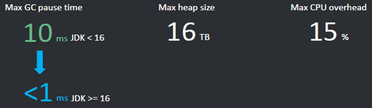

1、最大GC停顿时间最终不超<1ms；

2、支持最大16TB量级的堆；

3、最大CPU开销不超过15%。

ZGC垃圾回收器没有传统意义上的分代概念，而是通过动态调整和并行处理来高效管理内存。对象被动态放置在不同的区域中，而垃圾回收则在这些区域中进行。

### ZGC垃圾回收器内存布局

ZGC垃圾回收器是一款基于Region内存布局的，使用了**读屏障、 颜色指针**等技术来实现可并发的“标记-整理”算法的， 以低延迟为首要目标的一款垃圾回收器，具体内存布局如下：

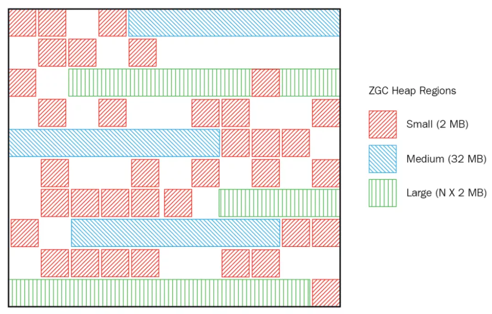

从上图可以看出ZGC垃圾回收器有大中小三类Region：

1、小型Region（Small Region）：容量固定为2MB，用于放置小于256KB的小对象。

2、中型Region（Medium Region）： 容量固定为32MB，用于放置大于等于256KB但小于4MB的对象。

3、大型Region（Large Region）：容量不固定，可以动态变化，但必须为2MB的整数倍，用于放置4MB或以上的大对象。 每个大型Region中只会存放一个大对象，这也预示着虽然名字叫作“大型Region”，但它的实际容量完全有可能小于中型Region，最小容量可低至4MB。大型Region在ZGC垃圾回收器的实现中是不会被重分配（重分配是ZGC的一种处理动作，用于复制对象的回收器阶段，稍后会介绍到）的，因为复制一个大对象的代价非常高昂。

**这里先插一个题外话，能完成上面所描述到的内存布局得益于NUMA-aware的出现，什么是NUMA-aware呢？**

NUMA对应的有UMA，UMA即Uniform Memory Access Architecture（统一内存访问架构），NUMA就是Non Uniform Memory Access Architecture（非统一内存访问架构）。UMA表示内存只有一块，所有CPU都去访问这一块内存，那么就会存在竞争问题（争夺内存总线访问权），有竞争就会有锁，有锁效率就会受到影响，而且CPU核心数越多，竞争就越激烈。NUMA的话每个CPU对应有一块内存，且这块内存在主板上离这个CPU是最近的，每个CPU优先访问这块内存，那效率自然就提高了：

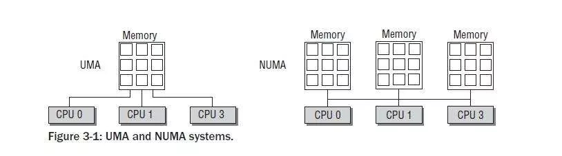

服务器的NUMA架构在中大型系统上一直非常盛行，也是高性能的解决方案，尤其在系统延迟方面表现都很优秀。ZGC垃圾回收器是能自动感知NUMA架构并充分利用NUMA架构特性的。

**什么是颜色指针呢？**

颜色指针也被称为染色指针或者着色指针，它是一种将信息存储在指针中的技术。

ZGC垃圾回收器仅支持64位系统，它把64位虚拟地址空间划分为多个子空间，如下图所示：

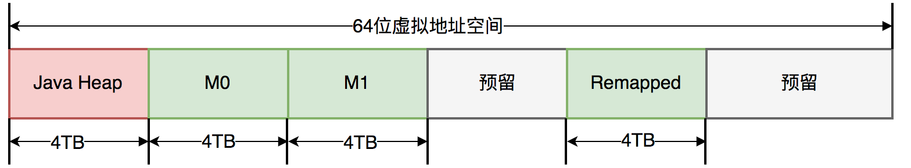

其中，[0 ~ 4TB) 对应Java堆，[4TB ~ 8TB) 称为M0地址空间，[8TB ~ 12TB) 称为M1地址空间，[12TB ~ 16TB) 预留未使用，[16TB ~ 20TB) 称为Remapped空间。

当应用程序创建对象时，首先在堆空间申请一个虚拟地址，但该虚拟地址并不会映射到真正的物理地址。ZGC垃圾回收器同时会为该对象在M0、M1和Remapped地址空间分别申请一个虚拟地址，且这三个虚拟地址对应同一个物理地址，但这三个空间在同一时间有且只有一个空间有效。ZGC垃圾回收器之所以设置三个虚拟地址空间，是因为它使用“空间换时间”思想，去降低GC停顿时间。“空间换时间”中的空间是虚拟空间，而不是真正的物理空间。

与上述地址空间划分相对应，ZGC垃圾回收器实际仅使用64位地址空间的第0\~41位，而第42\~45位存储元数据，第47~63位固定为0，如图所示：

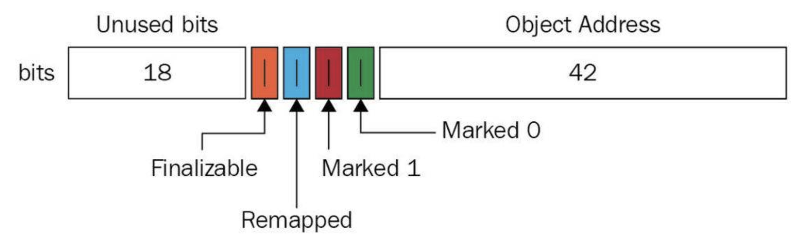

每个对象有一个64位指针，这64位被分为：

- 18位：预留给以后使用；
- 1位：Finalizable标识，此位与并发引用处理有关，它表示这个对象只能通过finalizer才能访问；
- 1位：Remapped标识，设置此位的值后，对象未指向relocation set中（relocation set表示需要GC的Region集合）；
- 1位：Marked 1标识；
- 1位：Marked 0标识，和上面的Marked 1都是标记对象用于辅助GC；
- 42位：对象的地址（所以它可以支持2^42=4T内存）：

为什么有2个Marked标记呢？

每一个GC周期开始时，会交换使用的标记位，使上次GC周期中修正的已标记状态失效，所有引用都变成未标记。

GC周期1：使用Marked 0, 则周期结束所有引用mark标记都会成为01。

GC周期2：使用Marked 1, 则期待的mark标记10，所有引用都能被重新标记。

通过对配置ZGC垃圾回收器后对象指针分析我们可知，对象指针必须是64位，那么ZGC垃圾回收器就无法支持32位操作系统，同样的也就无法支持压缩指针了（CompressedOops，压缩指针也是32位）。

颜色指针有三大如下优势：

1. 一旦某个Region的存活对象被移走之后，这个Region立即就能够被释放和重用掉，而不必等待整个堆中所有指向该Region的引用都被修正后才能清理，这使得理论上只要还有一个空闲Region，ZGC垃圾回收器就能完成回收。
2. 颜色指针可以大幅减少在垃圾回收过程中内存屏障的使用数量，ZGC垃圾回收器只使用了读屏障。
3. 颜色指针具备强大的扩展性，它可以作为一种可扩展的存储结构用来记录更多与对象标记、重定位过程相关的数据，以便日后进一步提高性能。

**什么是读屏障呢？**

读屏障在上一章节中有所讨论，之前的垃圾回收器都是采用Write Barrier（写屏障），这次ZGC垃圾回收器采用了完全不同的方案读屏障，这个是ZGC垃圾回收器一个非常重要的特性。

在标记和移动对象的阶段，每次「从堆里对象的引用类型中读取一个指针」的时候，都需要加上一个Load Barriers。那么该如何理解它呢？先看下面这一段代码：

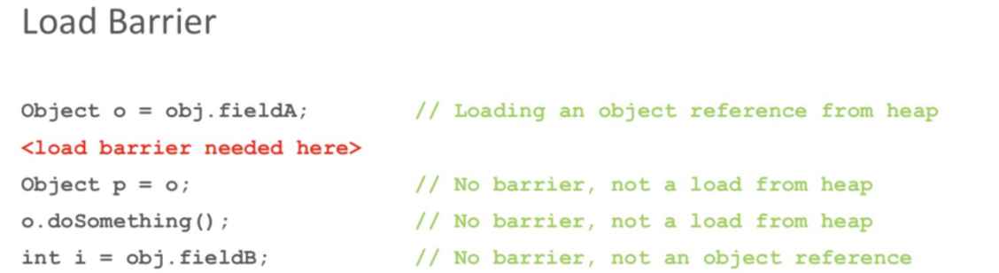

第一行代码尝试读取堆中的一个对象引用`obj.fieldA`并赋给引用`o`（f`ieldA`也是一个对象时才会加上读屏障）。如果这时候对象在GC时被移动了，接下来JVM就会加上一个读屏障，这个屏障会把读出的指针更新到对象的新地址上，并且把堆里的这个指针“修正”到原本的字段里。这样就算GC把对象移动了，读屏障也会发现并修正指针，于是应用代码就永远都会持有更新后的有效指针，而且不需要STW。那么，JVM是如何判断对象被移动过呢？就是利用上面提到的颜色指针，如果指针是Bad Color，那么程序还不能往下执行，需要「slow path」，修正指针；如果指针是Good Color，那么正常往下执行即可。

这个动作是不是非常像JDK并发中用到的CAS自旋？读取的值发现已经失效了，需要重新读取。而ZGC垃圾回收器这里是之前持有的指针由于GC后失效了，需要通过读屏障修正指针。

后面3行代码都不需要加读屏障：`Object p = o`这行代码并没有从堆中读取数据；`o.doSomething()`也没有从堆中读取数据；`obj.fieldB`不是对象引用，而是原子类型。

正是因为Load Barriers的存在，所以会导致配置ZGC的应用的吞吐量会变低。官方的测试数据是需要多出额外4%的开销：

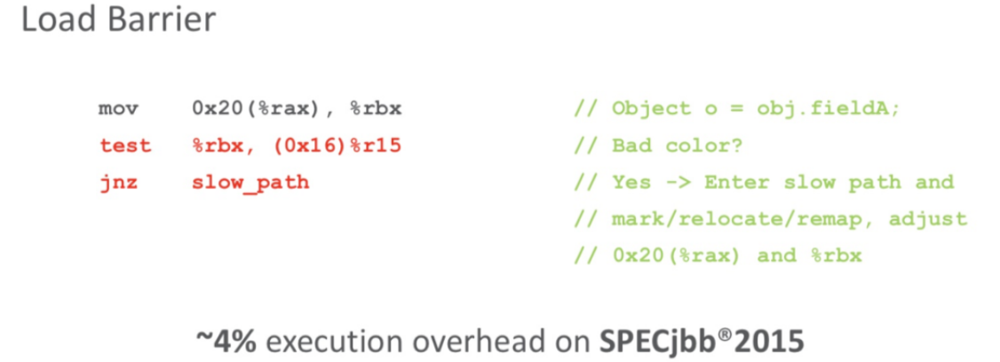

那么，判断对象是Bad Color还是Good Color的依据是什么呢？就是根据上一段提到的Colored Pointers的4个颜色位。当加上读屏障时，根据对象指针中这4位的信息，就能知道当前对象是Bad/Good Color了。

**注意**：既然低42位指针可以支持4T内存，那么能否通过预约更多位给对象地址来达到支持更大内存的目的呢？答案肯定是不可以。因为目前主板地址总线最宽只有48bit，4位是颜色位，就只剩44位了，所以受限于目前的硬件，ZGC垃圾回收器最大只能支持16T的内存，JDK13就把最大支持堆内存从4T扩大到了16T。

### ZGC垃圾回收器运行过程

ZGC的运作过程大致可划分为以下四个大的阶段：

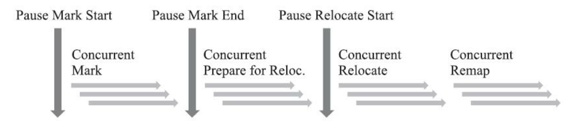

1、并发标记（Concurrent Mark）：与G1垃圾回收器一样，并发标记是遍历对象图做可达性分析的阶段，它的初始标记（Mark Start）和最终标记（Mark End）也会出现短暂的停顿，与G1垃圾回收器不同的是， ZGC垃圾回收器的标记是在指针上而不是在对象上进行的， 标记阶段会更新染色指针中的Marked 0、 Marked 1标志位。

2、并发预备重分配（Concurrent Prepare for Relocate）：这个阶段需要根据特定的查询条件统计得出本回收过程要清理哪些Region，将这些Region组成重分配集（Relocation Set）。ZGC每次回收都会扫描所有的Region，用范围更大的扫描成本换取省去G1垃圾回收器中记忆集的维护成本。

3、并发重分配（Concurrent Relocate）：重分配是ZGC垃圾回收器执行过程中的核心阶段，这个过程要把重分配集中的存活对象复制到新的Region上，并为重分配集中的每个Region维护一个转发表（Forward Table），记录从旧对象到新对象的转向关系。ZGC垃圾回收器能仅从引用上就明确得知一个对象是否处于重分配集之中，如果用户线程此时并发访问了位于重分配集中的对象，这次访问将会被预置的内存屏障（读屏障）所截获，然后立即根据Region上的转发表记录将访问转发到新复制的对象上，并同时修正更新该引用的值，使其直接指向新对象，ZGC垃圾回收器将这种行为称为指针的“自愈”（Self-Healing）能力。因为“自愈”能力，所以只有第一次访问旧对象会变慢， 一旦重分配集中某个Region的存活对象都复制完毕后，这个Region就可以立即释放用于新对象的分配，但是转发表还得留着不能释放掉， 因为可能还有访问在使用这个转发表。

4、并发重映射（Concurrent Remap）：重映射所做的就是修正整个堆中指向重分配集中旧对象的所有引用，但是ZGC垃圾回收器中对象引用存在“自愈”功能，所以这个重映射操作并不是很迫切。ZGC垃圾回收器很巧妙地把并发重映射阶段要做的工作，合并到了下一次垃圾收集循环中的并发标记阶段里去完成，反正它们都是要遍历所有对象的，这样合并就节省了一次遍历对象图的开销。一旦所有指针都被修正之后， 原来记录新旧对象关系的转发表就可以释放掉了。

### ZGC垃圾回收器现存问题

最大的问题是浮动垃圾。ZGC垃圾回收器的停顿时间是在10ms以下，但是ZGC垃圾回收器的执行时间还是远远大于这个时间的。假如ZGC垃圾回收器全过程需要执行10分钟，在这个期间由于对象分配速率很高，将创建大量的新对象，这些对象很难进入当次GC，所以只能在下次GC的时候进行回收，这些只能等到下次GC才能回收的对象就是浮动垃圾。ZGC垃圾回收器没有分代概念，每次都需要进行全堆扫描，导致一些“朝生夕死”的对象没能及时的被回收。

**解决方案：**

目前唯一的办法是增大堆的容量，使得程序得到更多的喘息时间。

### ZGC垃圾回收器参数设置

启用ZGC垃圾回收器比较简单，设置JVM参数即可：`-XX:+UseZGC`。调优也并不难，因为ZGC垃圾回收器调优参数并不多，远不像CMS垃圾回收器那么复杂。它和G1垃圾回收器一样，可以调优的参数都比较少，大部分工作JVM能很好的自动完成。下图所示是ZGC垃圾回收器可以调优的参数：

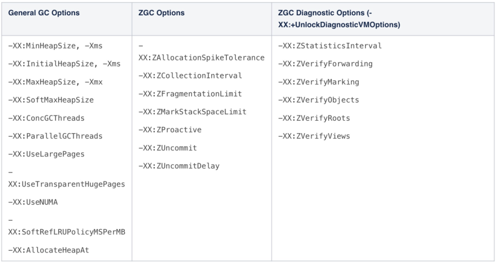

### ZGC垃圾回收器触发时间

ZGC垃圾回收器目前有4种触发GC机制：

1、定时触发，默认为不使用，可通过ZCollectionInterval参数配置；

2、预热触发，最多三次，在堆内存达到10%、20%、30%时触发，主要时统计GC时间，为其他GC机制使用；

3、分配速率，基于正态分布统计，计算内存99.9%可能的最大分配速率，以及此速率下内存将要耗尽的时间点，在耗尽之前触发GC（耗尽时间 - 一次GC最大持续时间 - 一次GC检测周期时间）；

4、主动触发，（默认开启，可通过ZProactive参数配置） 距上次GC堆内存增长10%，或超过5分钟时，对比距上次GC的间隔时间跟（49 * 一次GC的最大持续时间），超过则触发。

## 如何选择垃圾回收器

先再来看一下目前垃圾回收器的种类：

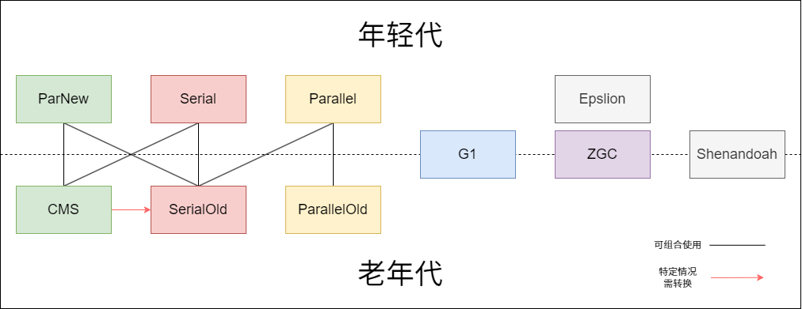

Java 8中默认使用Parallel垃圾回收器和Parallel Old垃圾回收器，Java 9中默认使用G1垃圾回收器。

1、优先调整堆的大小让服务器自己来选择；

2、如果内存小于100M，使用Serial垃圾回收器；

3、如果是单核，并且没有停顿时间的要求，Serial垃圾回收器或由JVM自己选择；

4、如果允许停顿时间超过1秒，选择Parallel垃圾回收器或者JVM自己选择；

5、如果响应时间最重要，并且不能超过1秒，使用Parallel垃圾回收器；

6、4G以下可以用Parallel垃圾回收器，4-8G可以用ParNew垃圾回收器+CMS垃圾回收器，8G以上可以用G1垃圾回收器，数百G以上用ZGC垃圾回收器。

## 安全点与安全区域

安全点就是指代码中一些特定的位置，当线程运行到这些位置时它的状态是确定的，这样JVM就可以安全的进行一些操作，比如GC等，所以GC不是想什么时候做就立即触发的，是需要等待所有线程运行到安全点后才能触发。

这些特定的安全点位置主要有以下几种：

1. 方法返回之前
2. 调用某个方法之后
3. 抛出异常的位置
4. 循环的末尾

大体实现思想是当垃圾收集需要中断线程的时候， 不直接对线程操作， 仅仅简单地设置一个标志位， 各个线程执行过程时会不停地主动去轮询这个标志， 一旦发现中断标志为真时就自己在最近的安全点上主动中断挂起， 轮询标志的地方和安全点是重合的。

**安全区域是什么呢？**

Safe Point 是对正在执行的线程设定的。

如果一个线程处于 Sleep 或中断状态，它就不能响应 JVM 的中断请求，再运行到 Safe Point 上。因此 JVM 引入了 Safe Region。

Safe Region 是指在一段代码片段中，引用关系不会发生变化。在这个区域内的任意地方开始 GC 都是安全的。
