# JVM调优工具详解及调优实战

## 基础命令

在真正调优测试之前需要启动一个Java程序应用，在此使用[spring-boot-init-template项目的v1-jdk8&11分支](https://github.com/AntonyCheng/spring-boot-init-template/tree/v1-jdk8&11)将项目启动起来，如下图所示：

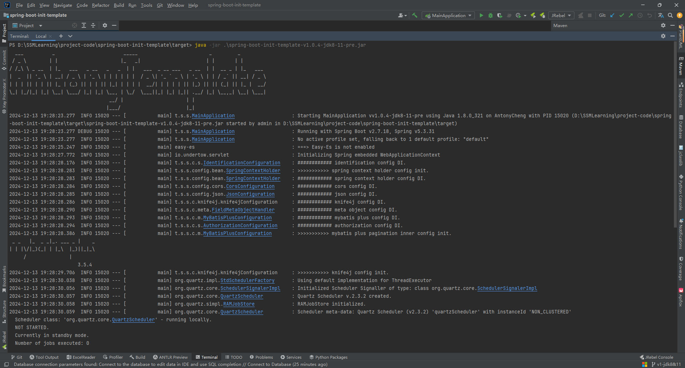

### jps

该命令用于查看该机器上所有的Java程序或者应用的线程ID：

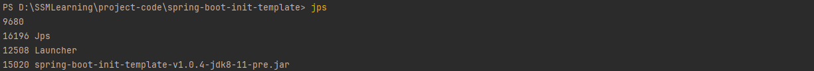

### jmap

**内存信息**：

该命令可以用来查看内存信息、实体个数以及占用内存的大小，由于该命令输出内容巨多，现将其输出到`.txt`文件里：

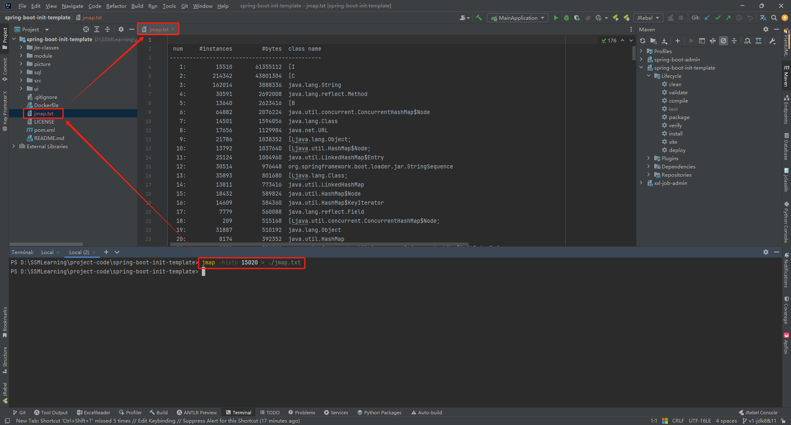

1、num：序号

2、#instances：实例数量

3、#bytes：占用空间大小（单位：B）

4、class name：类名称，其中`[C`表示`char[]`，`[S`表示`short[]`，`[I`表示`int[]`，`[B`表示`byte[]`，`[[I`表示`int[][]`。

**堆信息**：

该命令可以用来查看堆信息：

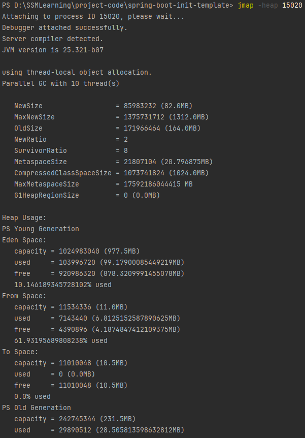

**堆内存dump文件**：

该命令还可以辅助导出堆内存dump文件，这个文件可以用来分析说明一些问题，比如内存溢出。下面有一段可能触发内存溢出的代码：

```java
package top.sharehome.jvmcommands;

import java.util.ArrayList;
import java.util.List;
import java.util.UUID;

/**
 * 内存溢出示例代码
 * 运行命令参数：-Xms5M -Xmx5M -XX:+PrintGCDetails -XX:+HeapDumpOnOutOfMemoryError -XX:HeapDumpPath=D:/jvm.dump
 *
 * @author AntonyCheng
 */
public class OomSample {

    public static void main(String[] args) {
        List<Object> list = new ArrayList<>();
        int i = 0;
        int j = 0;
        while (true) {
            list.add(new User(i++, UUID.randomUUID().toString()));
            new User(j--, UUID.randomUUID().toString());
        }
    }

}

```

此时加上`-XX:+HeapDumpOnOutOfMemoryError`和`-XX:HeapDumpPath=D:/jvm.dump`参数就能在程序内存溢出时自动向目标文件夹导出日志文件，现在按照上述命令参数将该程序运行起来：

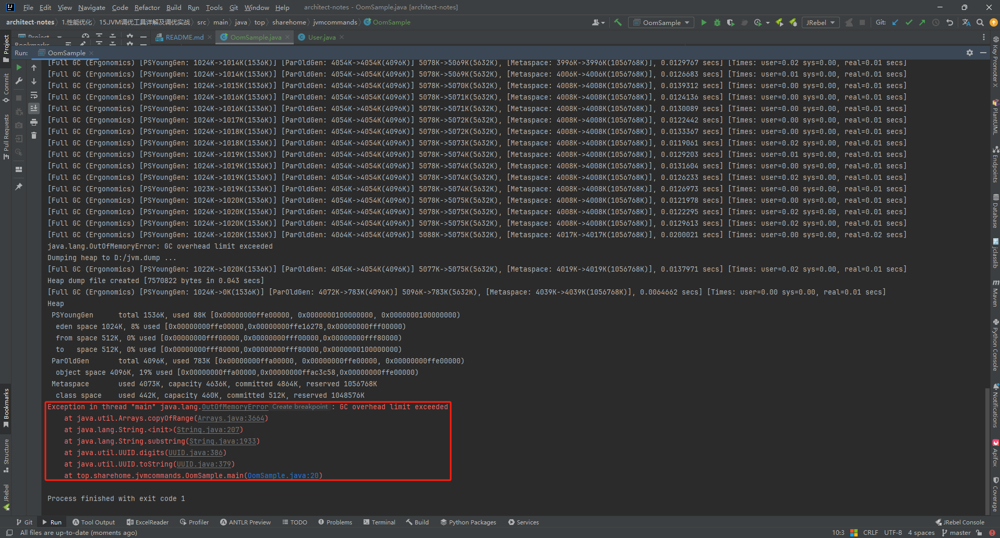

最终如愿抛出OOM异常，此时在D盘就会形成一个jvm.dump文件：

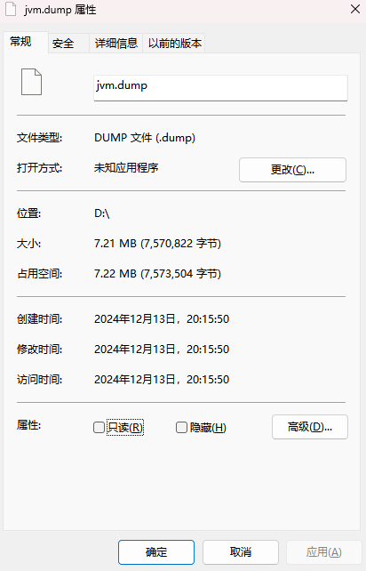

直接将其拖入visualvm虚拟机分析工具中可以看到如下信息：

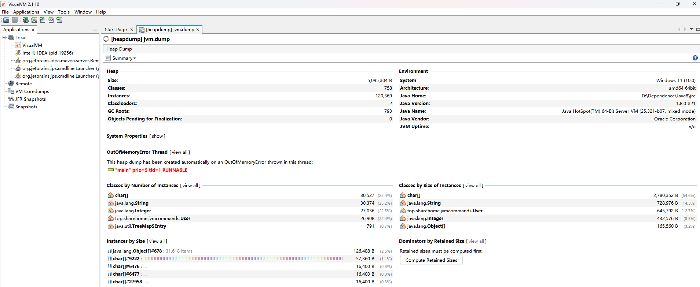

如果是针对正在运行的Java程序，使用`jmap`命令可以在运行中途导出类似的堆内存文件，但是不建议对中大型长期运行的程序使用，因为内存占比很大，可能会导不出来，具体命令如下：

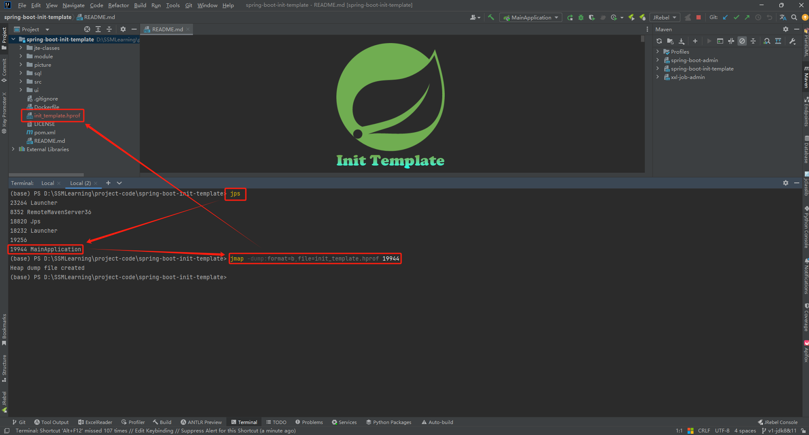

将init_template.hprof文件拖入visualvm虚拟机分析工具中可以看到如下信息：

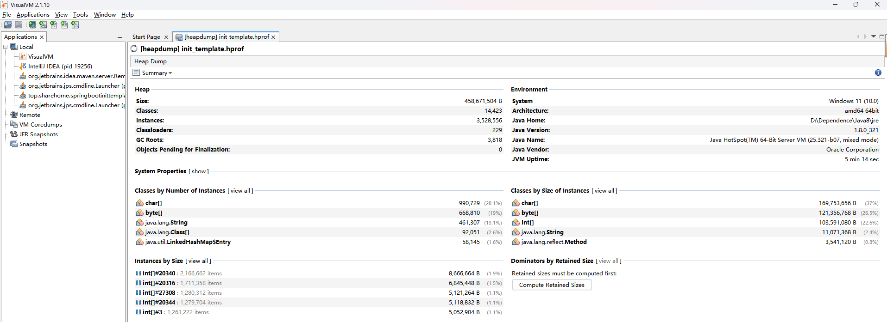

### jstack

**查找死锁进程**：

这个命令加上进程PID可以查找到死锁情况，下面有一段可以触发死锁的代码：

```java
package top.sharehome.jvmcommands;

/**
 * 进程死锁示例代码
 *
 * @author AntonyCheng
 */
public class DeadLockSample {

    private static Object lock1 = new Object();

    private static Object lock2 = new Object();

    public static void main(String[] args) {
        System.out.println("主线程开始");
        new Thread(() -> {
            synchronized (lock1) {
                try {
                    System.out.println("thread1开始");
                    Thread.sleep(5000);
                } catch (InterruptedException e) {
                }
                synchronized (lock2) {
                    System.out.println("thread1结束");
                }
            }
        }).start();
        new Thread(() -> {
            synchronized (lock2) {
                try {
                    System.out.println("thread2开始");
                    Thread.sleep(5000);
                } catch (InterruptedException e) {
                }
                synchronized (lock1) {
                    System.out.println("thread2结束");
                }
            }
        }).start();
        System.out.println("主线程结束");
    }

}
```

使用如下命令可以得到堆栈线程的部分信息：

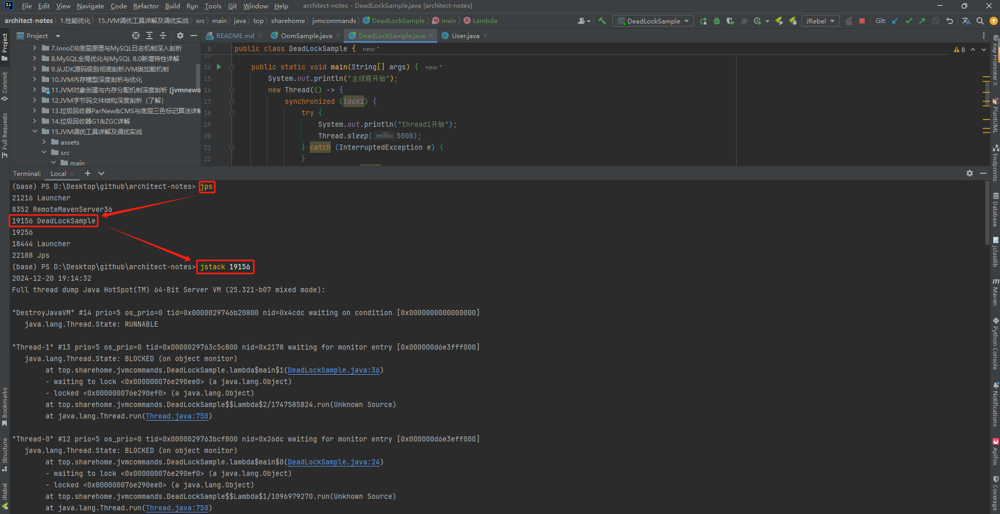

```
"Thread-1" #13 prio=5 os_prio=0 tid=0x0000029763c5c800 nid=0x2178 waiting for monitor entry [0x000000d6e3fff000]
   java.lang.Thread.State: BLOCKED (on object monitor)
        at top.sharehome.jvmcommands.DeadLockSample.lambda$main$1(DeadLockSample.java:36)
        - waiting to lock <0x000000076e290ee0> (a java.lang.Object)
        - locked <0x000000076e290ef0> (a java.lang.Object)
        at top.sharehome.jvmcommands.DeadLockSample$$Lambda$2/1747585824.run(Unknown Source)
        at java.lang.Thread.run(Thread.java:750)

"Thread-0" #12 prio=5 os_prio=0 tid=0x0000029763bcf800 nid=0x26dc waiting for monitor entry [0x000000d6e3eff000]
   java.lang.Thread.State: BLOCKED (on object monitor)
        at top.sharehome.jvmcommands.DeadLockSample.lambda$main$0(DeadLockSample.java:24)
        - waiting to lock <0x000000076e290ef0> (a java.lang.Object)
        - locked <0x000000076e290ee0> (a java.lang.Object)
        at top.sharehome.jvmcommands.DeadLockSample$$Lambda$1/1096979270.run(Unknown Source)
        at java.lang.Thread.run(Thread.java:750)
```

**"Thread-1"** ==> 线程名；

**prio=5** ==> 优先级为5；

**tid=0x0000029763c5c800** ==> 线程ID；

**nid=0x2d64** ==> 线程对应的本地线程标识NID；

**java.lang.Thread.State: BLOCKED** ==> 线程状态为阻塞。

```
Found one Java-level deadlock:
=============================
"Thread-1":
  waiting to lock monitor 0x00000297613ed328 (object 0x000000076e290ee0, a java.lang.Object),
  which is held by "Thread-0"
"Thread-0":
  waiting to lock monitor 0x00000297613eaa98 (object 0x000000076e290ef0, a java.lang.Object),
  which is held by "Thread-1"

Java stack information for the threads listed above:
===================================================
"Thread-1":
        at top.sharehome.jvmcommands.DeadLockSample.lambda$main$1(DeadLockSample.java:36)
        - waiting to lock <0x000000076e290ee0> (a java.lang.Object)
        - locked <0x000000076e290ef0> (a java.lang.Object)
        at top.sharehome.jvmcommands.DeadLockSample$$Lambda$2/1747585824.run(Unknown Source)
        at java.lang.Thread.run(Thread.java:750)
"Thread-0":
        at top.sharehome.jvmcommands.DeadLockSample.lambda$main$0(DeadLockSample.java:24)
        - waiting to lock <0x000000076e290ef0> (a java.lang.Object)
        - locked <0x000000076e290ee0> (a java.lang.Object)
        at top.sharehome.jvmcommands.DeadLockSample$$Lambda$1/1096979270.run(Unknown Source)
        at java.lang.Thread.run(Thread.java:750)

Found 1 deadlock.
```

在信息最后部分可以明显看出找到了一个死锁。除了这种方式，使用visualvm虚拟机分析工具也能轻松查看死锁情况：

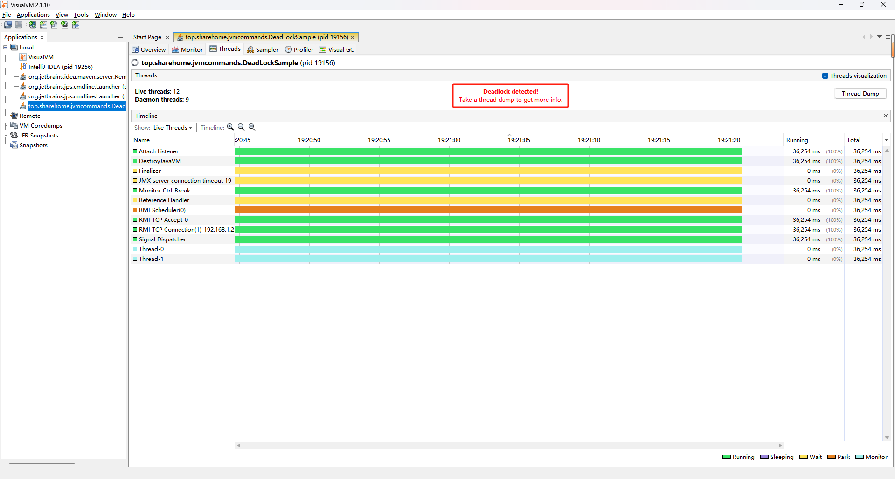

### jinfo
