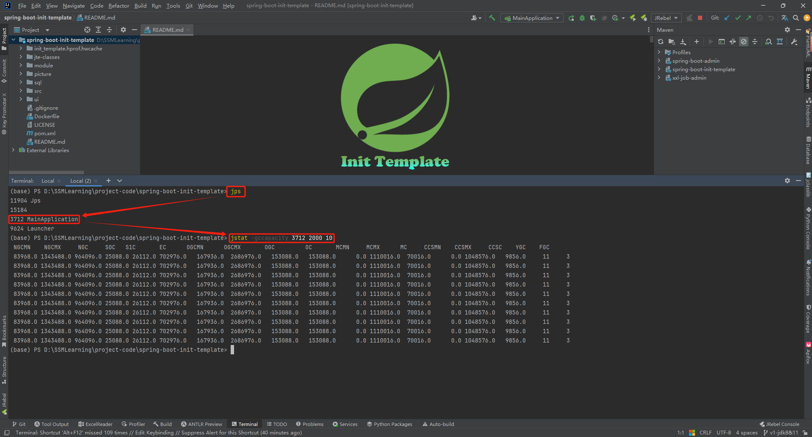

# JVM调优工具详解及调优实战

## 基础命令

在真正调优测试之前需要启动一个Java程序应用，在此使用[spring-boot-init-template项目的v1-jdk8&11分支](https://github.com/AntonyCheng/spring-boot-init-template/tree/v1-jdk8&11)将项目启动起来，如下图所示：


### jps

该命令用于查看该机器上所有的Java程序或者应用的线程ID：


### jmap

**内存信息**：

该命令可以用来查看内存信息、实体个数以及占用内存的大小，由于该命令输出内容巨多，现将其输出到`.txt`文件里：


1、num：序号

2、#instances：实例数量

3、#bytes：占用空间大小（单位：B）

4、class name：类名称，其中`[C`表示`char[]`，`[S`表示`short[]`，`[I`表示`int[]`，`[B`表示`byte[]`，`[[I`表示`int[][]`。

**堆信息**：

该命令可以用来查看堆信息：


**堆内存dump文件**：

该命令还可以辅助导出堆内存dump文件，这个文件可以用来分析说明一些问题，比如内存溢出。下面有一段可能触发内存溢出的代码：

```java
package top.sharehome.jvmcommands;

import java.util.ArrayList;
import java.util.List;
import java.util.UUID;

/**
 * 内存溢出示例代码
 * 运行命令参数：-Xms5M -Xmx5M -XX:+PrintGCDetails -XX:+HeapDumpOnOutOfMemoryError -XX:HeapDumpPath=D:/jvm.dump
 *
 * @author AntonyCheng
 */
public class OomSample {

    public static void main(String[] args) {
        List<Object> list = new ArrayList<>();
        int i = 0;
        int j = 0;
        while (true) {
            list.add(new User(i++, UUID.randomUUID().toString()));
            new User(j--, UUID.randomUUID().toString());
        }
    }

}

```

此时加上`-XX:+HeapDumpOnOutOfMemoryError`和`-XX:HeapDumpPath=D:/jvm.dump`参数就能在程序内存溢出时自动向目标文件夹导出日志文件，现在按照上述命令参数将该程序运行起来：


最终如愿抛出OOM异常，此时在D盘就会形成一个jvm.dump文件：


直接将其拖入visualvm虚拟机分析工具中可以看到如下信息：


如果是针对正在运行的Java程序，使用`jmap`命令可以在运行中途导出类似的堆内存文件，但是不建议对中大型长期运行的程序使用，因为内存占比很大，可能会导不出来，具体命令如下：


将init_template.hprof文件拖入visualvm虚拟机分析工具中可以看到如下信息：


### jstack

**查找死锁进程**：

这个命令加上进程PID可以查找到死锁情况，下面有一段可以触发死锁的代码：

```java
package top.sharehome.jvmcommands;

/**
 * 进程死锁示例代码
 *
 * @author AntonyCheng
 */
public class DeadLockSample {

    private static Object lock1 = new Object();

    private static Object lock2 = new Object();

    public static void main(String[] args) {
        System.out.println("主线程开始");
        new Thread(() -> {
            synchronized (lock1) {
                try {
                    System.out.println("thread1开始");
                    Thread.sleep(5000);
                } catch (InterruptedException e) {
                }
                synchronized (lock2) {
                    System.out.println("thread1结束");
                }
            }
        }).start();
        new Thread(() -> {
            synchronized (lock2) {
                try {
                    System.out.println("thread2开始");
                    Thread.sleep(5000);
                } catch (InterruptedException e) {
                }
                synchronized (lock1) {
                    System.out.println("thread2结束");
                }
            }
        }).start();
        System.out.println("主线程结束");
    }

}
```

使用如下命令可以得到堆栈线程的部分信息：


```
"Thread-1" #13 prio=5 os_prio=0 tid=0x0000029763c5c800 nid=0x2178 waiting for monitor entry [0x000000d6e3fff000]
   java.lang.Thread.State: BLOCKED (on object monitor)
        at top.sharehome.jvmcommands.DeadLockSample.lambda$main$1(DeadLockSample.java:36)
        - waiting to lock <0x000000076e290ee0> (a java.lang.Object)
        - locked <0x000000076e290ef0> (a java.lang.Object)
        at top.sharehome.jvmcommands.DeadLockSample$$Lambda$2/1747585824.run(Unknown Source)
        at java.lang.Thread.run(Thread.java:750)

"Thread-0" #12 prio=5 os_prio=0 tid=0x0000029763bcf800 nid=0x26dc waiting for monitor entry [0x000000d6e3eff000]
   java.lang.Thread.State: BLOCKED (on object monitor)
        at top.sharehome.jvmcommands.DeadLockSample.lambda$main$0(DeadLockSample.java:24)
        - waiting to lock <0x000000076e290ef0> (a java.lang.Object)
        - locked <0x000000076e290ee0> (a java.lang.Object)
        at top.sharehome.jvmcommands.DeadLockSample$$Lambda$1/1096979270.run(Unknown Source)
        at java.lang.Thread.run(Thread.java:750)
```

**"Thread-1"** ==> 线程名；

**prio=5** ==> 优先级为5；

**tid=0x0000029763c5c800** ==> 线程ID；

**nid=0x2d64** ==> 线程对应的本地线程标识NID；

**java.lang.Thread.State: BLOCKED** ==> 线程状态为阻塞。

```
Found one Java-level deadlock:
=============================
"Thread-1":
  waiting to lock monitor 0x00000297613ed328 (object 0x000000076e290ee0, a java.lang.Object),
  which is held by "Thread-0"
"Thread-0":
  waiting to lock monitor 0x00000297613eaa98 (object 0x000000076e290ef0, a java.lang.Object),
  which is held by "Thread-1"

Java stack information for the threads listed above:
===================================================
"Thread-1":
        at top.sharehome.jvmcommands.DeadLockSample.lambda$main$1(DeadLockSample.java:36)
        - waiting to lock <0x000000076e290ee0> (a java.lang.Object)
        - locked <0x000000076e290ef0> (a java.lang.Object)
        at top.sharehome.jvmcommands.DeadLockSample$$Lambda$2/1747585824.run(Unknown Source)
        at java.lang.Thread.run(Thread.java:750)
"Thread-0":
        at top.sharehome.jvmcommands.DeadLockSample.lambda$main$0(DeadLockSample.java:24)
        - waiting to lock <0x000000076e290ef0> (a java.lang.Object)
        - locked <0x000000076e290ee0> (a java.lang.Object)
        at top.sharehome.jvmcommands.DeadLockSample$$Lambda$1/1096979270.run(Unknown Source)
        at java.lang.Thread.run(Thread.java:750)

Found 1 deadlock.
```

在信息最后部分可以明显看出找到了一个死锁。除了这种方式，使用visualvm虚拟机分析工具也能轻松查看死锁情况：


### jinfo

**查看JVM参数**：


**查看Java系统参数**：


### jstat

该命令可以查看堆内存各个部分的使用情况以及加载类的数量，命令的格式如下：

```shell
jstat [-命令选项] [pid] [查询间隔时间(毫秒)] [查询次数]
```

这个命令比较重要，它可以实时反映一些JVM堆内存的情况。

**垃圾回收统计**：


- S0C：第一个幸存区的大小，单位KB
- S1C：第二个幸存区的大小，单位KB
- S0U：第一个幸存区的使用大小，单位KB
- S1U：第二个幸存区的使用大小，单位KB
- EC：伊甸园区的大小，单位KB
- EU：伊甸园区的使用大小，单位KB
- OC：老年代大小，单位KB
- OU：老年代使用大小，单位KB
- MC：方法区大小(元空间)，单位KB
- MU：方法区使用大小，单位KB
- CCSC：压缩类空间大小，单位KB
- CCSU：压缩类空间使用大小，单位KB
- YGC：年轻代垃圾回收次数
- YGCT：年轻代垃圾回收消耗时间，单位s
- FGC：老年代垃圾回收次数
- FGCT：老年代垃圾回收消耗时间，单位s
- GCT：垃圾回收消耗总时间，单位s

**堆内存统计**：



- NGCMN：新生代最小容量
- NGCMX：新生代最大容量
- NGC：当前新生代容量
- S0C：第一个幸存区大小
- S1C：第二个幸存区的大小
- EC：伊甸园区的大小
- OGCMN：老年代最小容量
- OGCMX：老年代最大容量
- OGC：当前老年代大小
- OC:当前老年代大小
- MCMN:最小元数据容量
- MCMX：最大元数据容量
- MC：当前元数据空间大小
- CCSMN：最小压缩类空间大小
- CCSMX：最大压缩类空间大小
- CCSC：当前压缩类空间大小
- YGC：年轻代GC次数
- FGC：老年代GC次数

**新生代垃圾回收统计**：


- S0C：第一个幸存区的大小
- S1C：第二个幸存区的大小
- S0U：第一个幸存区的使用大小
- S1U：第二个幸存区的使用大小
- TT：对象在新生代存活的次数
- MTT：对象在新生代存活的最大次数
- DSS：期望的幸存区大小
- EC：伊甸园区的大小
- EU：伊甸园区的使用大小
- YGC：年轻代垃圾回收次数
- YGCT：年轻代垃圾回收消耗时间

**新生代内存统计**：


- NGCMN：新生代最小容量
- NGCMX：新生代最大容量
- NGC：当前新生代容量
- S0CMX：最大幸存1区大小
- S0C：当前幸存1区大小
- S1CMX：最大幸存2区大小
- S1C：当前幸存2区大小
- ECMX：最大伊甸园区大小
- EC：当前伊甸园区大小
- YGC：年轻代垃圾回收次数
- FGC：老年代回收次数

**老年代垃圾回收统计**：


- MC：方法区大小
- MU：方法区使用大小
- CCSC：压缩类空间大小
- CCSU：压缩类空间使用大小
- OC：老年代大小
- OU：老年代使用大小
- YGC：年轻代垃圾回收次数
- FGC：老年代垃圾回收次数
- FGCT：老年代垃圾回收消耗时间
- GCT：垃圾回收消耗总时间

**老年代内存统计**：


- OGCMN：老年代最小容量
- OGCMX：老年代最大容量
- OGC：当前老年代大小
- OC：老年代大小
- YGC：年轻代垃圾回收次数
- FGC：老年代垃圾回收次数
- FGCT：老年代垃圾回收消耗时间
- GCT：垃圾回收消耗总时间

**元数据空间统计**：


- MCMN：最小元数据容量
- MCMX：最大元数据容量
- MC：当前元数据空间大小
- CCSMN：最小压缩类空间大小
- CCSMX：最大压缩类空间大小
- CCSC：当前压缩类空间大小
- YGC：年轻代垃圾回收次数
- FGC：老年代垃圾回收次数
- FGCT：老年代垃圾回收消耗时间
- GCT：垃圾回收消耗总时间

**堆内存各个区使用占比**：


- S0：幸存1区当前使用比例
- S1：幸存2区当前使用比例
- E：伊甸园区使用比例
- O：老年代使用比例
- M：元数据区使用比例
- CCS：压缩使用比例
- YGC：年轻代垃圾回收次数
- FGC：老年代垃圾回收次数
- FGCT：老年代垃圾回收消耗时间
- GCT：垃圾回收消耗总时间

## JVM运行情况预估

用`jstat gc -pid`命令可以计算出如下一些关键数据，有了这些数据就可以采用之前介绍过的优化思路，先给自己的系统设置一些初始性的JVM参数，比如堆内存大小，年轻代大小，Eden和Survivor的比例，老年代的大小，大对象的阈值，大龄对象进入老年代的阈值等。

**年轻代对象增长的速率**

可以执行命令`jstat -gc pid 1000 10`（每隔1秒执行1次命令，共执行10次），通过观察EU（Eden区的使用）来估算每秒Eden区大概新增多少对象，如果系统负载不高，可以把频率1秒换成1分钟，甚至10分钟来观察整体情况。注意，一般系统可能有高峰期和日常期，所以需要在不同的时间分别估算不同情况下对象增长速率。

**Young GC的触发频率和每次耗时**

知道年轻代对象增长速率我们就能推根据Eden区的大小推算出Young GC大概多久触发一次，Young GC的平均耗时可以通过 YGCT/YGC公式算出，根据结果我们大概就能知道系统大概多久会因为Young GC的执行而卡顿多久。

**每次Young GC后有多少对象存活和进入老年代**

这个因为之前已经大概知道Young GC的频率，假设是每5分钟一次，那么可以执行命令`jstat -gc pid 300000 10`，观察每次结果Eden，Survivor和老年代使用的变化情况，在每次GC后Eden区使用一般会大幅减少，Survivor和老年代都有可能增长，这些增长的对象就是每次Young GC后存活的对象，同时还可以看出每次Young GC后进去老年代大概多少对象，从而可以推算出老年代对象增长速率。

**Full GC的触发频率和每次耗时**

知道了老年代对象的增长速率就可以推算出Full GC的触发频率了，Full GC的每次耗时可以用公式FGCT/FGC计算得出。

优化思路其实简单来说就是尽量让每次Young GC后的存活对象小于Survivor区域的50%，都留存在年轻代里。尽量别让对象进入老年代。尽量减少Full GC的频率，避免频繁Full GC对JVM性能的影响。
