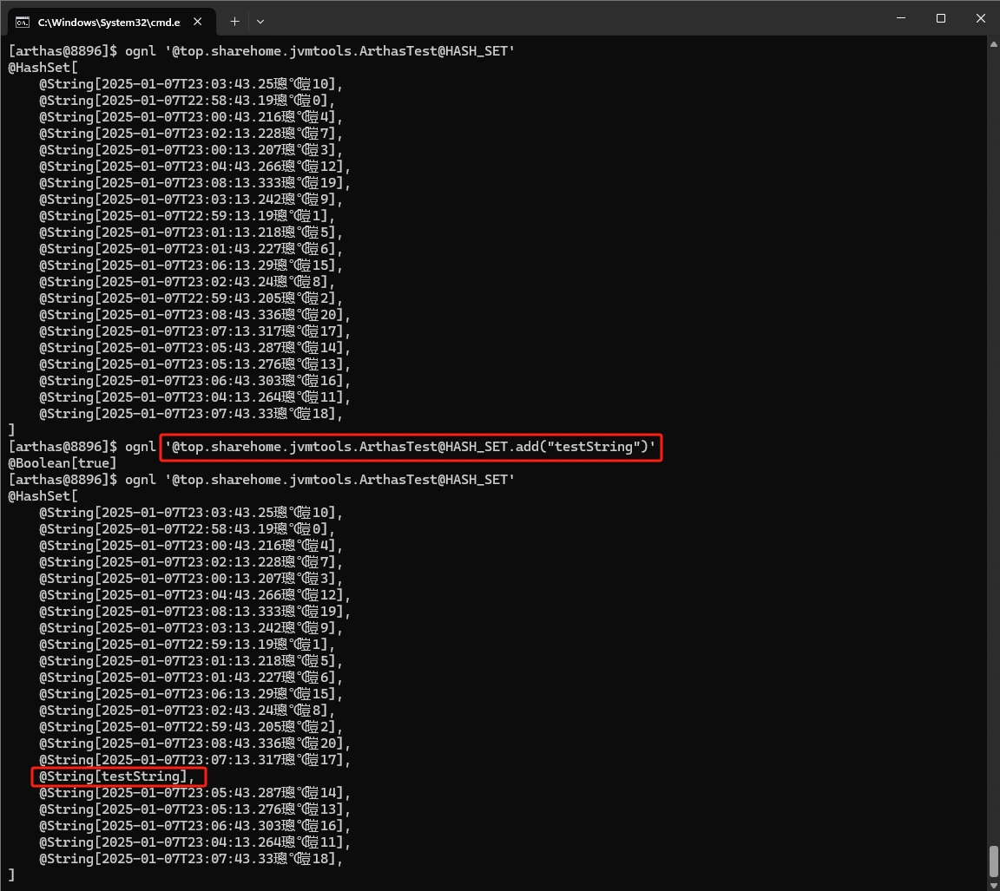

# JVM调优实战及常量池详解

## Arthas工具

Arthas是Alibaba开源的Java诊断工具，支持Java 6+（4.x 版本不再支持 Java 6和Java 7），支持 Linux/Mac/Windows系统，采用命令行交互模式，同时提供丰富的Tab自动补全功能，Arthas软件Jar包已经从官网下载至该[目录](./arthas)下。

如果进一步方便进行问题的定位和诊断，更加权威和详细的信息请查看官方文档：https://arthas.aliyun.com/doc/，接下来只对一些常用的操作命令进行演示。

首先启动下面这个测试类：

```java
package top.sharehome.jvmtools;

import java.time.LocalDateTime;
import java.time.format.DateTimeFormatter;
import java.util.HashSet;

/**
 * Arthas工具测试类
 *
 * @author AntonyCheng
 */
public class ArthasTest {

    private static final HashSet<String> HASH_SET = new HashSet<>();

    public static void main(String[] args) {
        System.out.println("程序开始:" + LocalDateTime.now().format(DateTimeFormatter.ISO_DATE_TIME));
        // 模拟 CPU 过高
        cpuHigh();
        // 模拟线程死锁
        deadThread();
        // 不断的向 hashSet 集合增加数据
        addHashSetThread();
    }

    /**
     * 不断的向 hashSet 集合添加数据
     */
    public static void addHashSetThread() {
        // 初始化常量
        new Thread(() -> {
            int count = 0;
            while (true) {
                try {
                    HASH_SET.add(LocalDateTime.now().format(DateTimeFormatter.ISO_DATE_TIME) + "计数" + count);
                    Thread.sleep(10000);
                    count++;
                } catch (InterruptedException e) {
                    e.printStackTrace();
                }
            }
        }).start();
    }

    public static void cpuHigh() {
        new Thread(() -> {
            while (true) {

            }
        }).start();
    }

    /**
     * 死锁
     */
    private static void deadThread() {
        // 创建资源
        Object resourceA = new Object();
        Object resourceB = new Object();
        // 创建线程
        Thread threadA = new Thread(() -> {
            synchronized (resourceA) {
                System.out.println(Thread.currentThread() + "获取A资源");
                try {
                    Thread.sleep(1000);
                } catch (InterruptedException e) {
                    e.printStackTrace();
                }
                System.out.println(Thread.currentThread() + "等待获取B资源");
                synchronized (resourceB) {
                    System.out.println(Thread.currentThread() + "获取B资源");
                }
            }
        });

        Thread threadB = new Thread(() -> {
            synchronized (resourceB) {
                System.out.println(Thread.currentThread() + "获取B资源");
                try {
                    Thread.sleep(1000);
                } catch (InterruptedException e) {
                    e.printStackTrace();
                }
                System.out.println(Thread.currentThread() + "等待获取A资源");
                synchronized (resourceA) {
                    System.out.println(Thread.currentThread() + "获取A资源");
                }
            }
        });
        threadA.start();
        threadB.start();
    }

}
```

运行效果如下：


紧接着直接启动Arthas工具，启动效果如下：


接着如上图所示选择`1`进程，即可进入具体的操作命令行界面：


### dashboard命令

该命令可以查看整个进程的运行情况，线程、内存、GC、运行环境信息。


### thread命令

该命令可以查看线程详细情况。


输入`thread ID`可以查看具体线程堆栈。


输入`thread -b`可以查看线程死锁。


### jad命令

输入`jad 全类名`可以反编译，这样可以方便查看线上代码是否是正确的版本。


### ognl命令

该命令可以查看线上系统变量的值，甚至可以修改变量的值。




## GC日志详解

对于Java程序应用可以通过配置参数把程序运行过程中的GC日志全部打印并保存起来，然后通过分析GC日志获取关键性指标，进而调优JVM参数。

打印GC日志方法的参数如下，其中`%t`代表时间：

```
-Xloggc:./gc-%t.log -XX:+PrintGCDetails -XX:+PrintGCDateStamps -XX:+PrintGCTimeStamps -XX:+PrintGCCause -XX:+UseGCLogFileRotation -XX:NumberOfGCLogFiles=10 -XX:GCLogFileSize=100M
```

下面是某个应用程序启动后部分GC日志，据此可以进行一系列分析：


第一行红框，是项目的配置参数。这里不仅配置了打印GC日志，还有相关的VM内存参数。第二行红框中的是在这个GC时间点发生GC之后相关GC情况。

1、对于2.909：这是从jvm启动开始计算到这次GC经过的时间，前面还有具体的发生时间日期；

2、Full GC(Metadata GC Threshold)指这是一次full gc，括号里是gc的原因， PSYoungGen是年轻代的GC，ParOldGen是老年代的GC，Metaspace是元空间的GC；

3、6160K->0K(141824K)，这三个数字分别对应GC之前占用年轻代的大小，GC之后年轻代占用，以及整个年轻代的大小；

4、112K->6056K(95744K)，这三个数字分别对应GC之前占用老年代的大小，GC之后老年代占用，以及整个老年代的大小；

5、6272K->6056K(237568K)，这三个数字分别对应GC之前占用堆内存的大小，GC之后堆内存占用，以及整个堆内存的大小；

6、20516K->20516K(1069056K)，这三个数字分别对应GC之前占用元空间内存的大小，GC之后元空间内存占用，以及整个元空间内存的大小；

7、0.0209707是该时间点GC总耗费时间。

从日志可以发现几次Full GC都是由于元空间不够导致的，所以可以将元空间调大点：

```
-Xloggc:./gc-adjust-%t.log -XX:MetaspaceSize=256M -XX:MaxMetaspaceSize=256M -XX:+PrintGCDetails -XX:+PrintGCDateStamps -XX:+PrintGCTimeStamps -XX:+PrintGCCause -XX:+UseGCLogFileRotation -XX:NumberOfGCLogFiles=10 -XX:GCLogFileSize=100M
```

调整完再看下GC日志发现已经没有因为元空间不够导致的Full GC了。

如果GC日志很多很多，可以借助一些工具来帮助分析，这里推荐[gceasy](https://gceasy.io)，可以上传GC文件，然后这个工具会利用可视化的界面来展现GC情况。具体下图所示：


## 常量池

### Class类常量池

Class常量池可以理解为是Class文件中的资源仓库。 Class文件中除了包含类的版本、字段、方法、接口等描述信息外，还有一项信息就是常量池（Constant Pool Table），用于存放编译期生成的各种字面量（Literal）和符号引用（Symbolic References）。

现在使用`javap -v`命令将Class文件解析成更可读的JVM字节码文件：


红框标出的就是Class类常量池信息，该常量池中主要存放两大类常量：**字面量和符号引用**。

#### 字面量

字面量就是指由字母、数字等构成的字符串或者数值常量，字面量只可以右值出现，所谓右值是指等号右边的值，如：`int a=1`，这里的`a`为左值，`1`为右值。在这个例子中`1`就是字面量。

```java
int a = 1;
int b = 2;
int c = "abcdefg";
int d = "abcdefg";
```

#### 符号引用

符号引用是编译原理中的概念，是相对于直接引用来说的。主要包括了以下三类常量：

- 类和接口的全限定名；
- 字段的名称和描述符；
- 方法的名称和描述符。

上面的`a`，`b`就是字段名称，就是一种符号引用，还有Math类常量池里的`Lcom/tuling/jvm/Math`是类的全限定名，`main`和`compute`是方法名称，`()`是一种UTF8格式的描述符，这些都是符号引用。

这些常量池现在是静态信息，只有到运行时被加载到内存后，这些符号才有对应的内存地址信息，这些常量池一旦被装入内存就变成运行时常量池，对应的符号引用在程序加载或运行时会被转变为被加载到内存区域的代码的直接引用，也就是我们说的动态链接了。例如`compute()`这个符号引用在运行时就会被转变为`compute()`方法具体代码在内存中的地址，主要通过对象头里的类型指针去转换直接引用。

### 字符串常量池

#### 设计思想

1、字符串的分配，和其他的对象分配一样，耗费高昂的时间与空间代价，作为最基础的数据类型，大量频繁的创建字符串，极大程度地影响程序的性能。

2、JVM为了提高性能和减少内存开销，在实例化字符串常量的时候进行了一些优化。

- 为字符串开辟一个字符串常量池，类似于缓存区；
- 创建字符串常量时，首先查询字符串常量池是否存在该字符串；
- 存在该字符串，返回引用实例，不存在，实例化该字符串并放入池中。

#### 三种字符串操作（Java 7+）

**直接赋值字符串**

```java
// s指向常量池中的引用
String s = "AntonyCheng";
```

这种方式创建的字符串对象，只会在常量池中。因为有"AntonyCheng"这个字面量，创建对象	`s`的时候，JVM会先去常量池中通过`equals(key)`方法，判断是否有相同的对象，如果有，则直接返回该对象在常量池中的引用，如果没有，则会在常量池中创建一个新对象，再返回引用。

**new String();**

```java
// s1指向内存中的对象引用
String s1 = new String("AntonyCheng");
```

这种方式会保证字符串常量池和堆中都有这个对象，没有就创建，最后返回堆内存中的对象引用。

步骤大致如下：

因为有"AntonyCheng"这个字面量，所以会先检查字符串常量池中是否存在字符串"AntonyCheng"，不存在，先在字符串常量池里创建一个字符串对象；再去内存中创建一个字符串对象"AntonyCheng"，存在的话，就直接去堆内存中创建一个字符串对象"AntonyCheng"，最后，将内存中的引用返回。

**intern()方法**

```java
String s1 = new String("AntonyCheng");
String s2 = s1.intern();
// 结果为false
System.out.println(s1 == s2); 
```

String中的`intern()`方法是一个native方法，当调用`intern()`方法时，如果池已经包含一个等于此String对象的字符串（用`equals(oject)`方法确定），则返回池中的字符串。否则将`intern()`方法返回的引用指向当前字符串`s1`（Java 6版本需要将`s1`复制到字符串常量池里）。

#### 字符串常量池位置

Java 6及之前：有永久代, 运行时常量池在永久代，运行时常量池包含字符串常量池。

Java 7：有永久代，但已经逐步“去永久代”，字符串常量池从永久代里的运行时常量池分离到堆里。

Java 8及之后：无永久代，运行时常量池在元空间，字符串常量池里依然在堆里。

#### 字符串常量池设计原理

字符串常量池底层是Hot Spot的C++实现的，底层类似一个HashTable，保存的本质上是字符串对象的引用。看一道比较常见的面试题，下面的代码创建了多少个String对象？

```java
String s1 = new String("he") + new String("llo");
String s2 = s1.intern();
System.out.println(s1 == s2);
// 在 Java 6 下输出是 false，创建了 6 个对象
// 在 Java 7 及以上的版本输出是 true，创建了 5 个对象
```

为什么输出会有这些变化呢？主要还是字符串池从永久代中脱离、移入堆区的原因，`intern()`方法也相应发生了变化：

1、在Java 6中，调用`intern()`首先会在字符串池中寻找`equal()`相等的字符串，假如字符串存在就返回该字符串在字符串池中的引用，假如字符串不存在，虚拟机会重新在永久代上创建一个实例，将StringTable的一个表项指向这个新创建的实例。


2、在Java 7及以上版本中，由于字符串池不在永久代了，`intern()`做了一些修改，更方便地利用堆中的对象。字符串存在时和Java 6一样，但是字符串不存在时不再需要重新创建实例，可以直接指向堆上的实例。


#### 字符串常量池几个常见问题

**问题一**

```java
String s0="AntonyCheng";
String s1="AntonyCheng";
String s2="Antony" + "Cheng";
System.out.println( s0==s1 ); // 结果为true
System.out.println( s0==s2 ); // 结果为true
```

分析：因为例子中的`s0`和`s1`中的”AntonyCheng”都是字符串常量，它们在编译期就被确定了，所以`s0==s1`为true；而”Antony”和”Cheng”也都是字符串常量，当一个字 符串由多个字符串常量连接而成时，自己肯定也是字符串常量，所以`s2`也同样在编译期就被优化为一个字符串常量"AntonyCheng"，所以`s2`也是常量池中”AntonyCheng”的一个引用。所以得出`s0==s1==s2`。

**问题二**

```java
String s0="AntonyCheng";
String s1=new String("AntonyCheng");
String s2="Antony" + new String("Cheng");
System.out.println( s0==s1 ); // 结果为false
System.out.println( s0==s2 ); // 结果为false
System.out.println( s1==s2 ); // 结果为false
```

分析：用`new String()`创建的字符串不是常量，不能在编译期就确定，所以`new String()`创建的字符串不放入常量池中，它们有自己的地址空间。`s0`还是常量池中"AntonyCheng”的引用，`s1`因为无法在编译期确定，所以是运行时创建的新对象”AntonyCheng”的引用，`s2`因为有后半部分 `new String(”Cheng”)`所以也无法在编译期确定，所以也是一个新创建对象”AntonyCheng”的引用。

**问题三**

```java
String a = "a1";
String b = "a" + 1;
System.out.println(a == b); // 结果为true
String a = "atrue";
String b = "a" + "true";
System.out.println(a == b); // 结果为true
String a = "a3.4";
String b = "a" + 3.4;
System.out.println(a == b); // 结果为true
```

分析：JVM对于字符串常量的"+"号连接，将在程序编译期，JVM就将常量字符串的"+"连接优化为连接后的值，拿"a"+1来说，经编译器优化后在类中就已经是a1。在编译期其字符串常量的值就确定下来，故上面程序最终的结果都为true。

**问题四**

```java
String a = "ab";
String bb = "b";
String b = "a" + bb;
System.out.println(a == b); // 结果为false
```

分析：JVM对于字符串引用，由于在字符串的"+"连接中，有字符串引用存在，而引用的值在程序编译期是无法确定的，即"a"+bb无法被编译器优化，只有在程序运行期来动态分配并将连接后的新地址赋给`b`。所以上面程序的结果也就为false。

**问题五**

```java
String a = "ab";
final String bb = "b";
String b = "a" + bb;
System.out.println(a == b); // 结果为true
```

分析：和问题四中唯一不同的是`bb`字符串加了final修饰，对于final修饰的变量，它在编译时被解析为常量值的一个本地拷贝存储到自己的常量池中或嵌入到它的字节码流中。所以此时的"a"+bb和"a"+"b"效果是一样的。故上面程序的结果为true。

**问题六**

```java
String a = "ab";
final String bb = getBB();
String b = "a" + bb;
System.out.println(a == b); // 结果为false
private static String getBB(){
    return "b";
}
```

分析：JVM对于字符串引用`bb`，它的值在编译期无法确定，只有在程序运行期调用方法后，将方法的返回值和"a"来动态连接并分配地址为`b`，故上面程序的结果为false。

**问题七**

常说String是不可变的，但是依然能够进行"+"操作，下面对于"+"操作符进行说明：

```java
String s1 = a + b + c;
```

可以通过观察其JVM指令码发现`s1`的"+"操作会变成如下操作：

```java
StringBuilder temp = new StringBuilder();
temp.append(a).append(b).append(c);
String s = temp.toString();
```

**问题八**

下面是一个对比示例，了解即可：

```java
//字符串常量池："计算机"和"技术" 堆内存：str1引用的对象"计算机技术"
//堆内存中还有个StringBuilder的对象，但是会被gc回收，StringBuilder的toString方法会new String()，这个String才是真正返回的对象引用
String str2 = new StringBuilder("计算机").append("技术").toString(); //没有出现"计算机技术"字面量，所以不会在常量池里生成"计算机技术"对象
System.out.println(str2 == str2.intern()); //true
//"计算机技术" 在池中没有，但是在heap中存在，则intern时，会直接返回该heap中的引用
//字符串常量池："ja"和"va" 堆内存：str1引用的对象"java"
//堆内存中还有个StringBuilder的对象，但是会被gc回收，StringBuilder的toString方法会new String()，这个String才是真正返回的对象引用
String str1 = new StringBuilder("ja").append("va").toString(); //没有出现"java"字面量，所以不会在常量池里生成"java"对象
System.out.println(str1 == str1.intern()); //false
//java是关键字，在JVM初始化的相关类里肯定早就放进字符串常量池了
String s1=new String("test");
System.out.println(s1==s1.intern()); //false
//"test"作为字面量，放入了池中，而new时s1指向的是heap中新生成的string对象，s1.intern()指向的是"test"字面量之前在池中生成的字符串对象
String s2=new StringBuilder("abc").toString();
System.out.println(s2==s2.intern()); //false
//同上
```

### 八种基本类型的包装类和对象池

Java中基本类型的包装类的大部分都实现了常量池技术（严格来说应该叫对象池，在堆上），这些类是Byte，Short，Integer，Long，Character，Boolean，另外两种浮点数类型的包装类则没有实现。另外Byte，Short，Integer，Long，Character这5种整型的包装类也只是在对应值小于等于127时才可使用对象池，也即对象不负责创建和管理大于127的这些类的对象。因为一般这种比较小的数用到的概率相对较大。

```java
public class Test {
	public static void main(String[] args) {
    	//5种整形的包装类Byte,Short,Integer,Long,Character的对象，
    	//在值小于127时可以使用对象池
    	Integer i1 = 127; //这种调用底层实际是执行的Integer.valueOf(127)，里面用到了IntegerCache对象池
    	Integer i2 = 127;
    	System.out.println(i1 == i2);//输出true
    	//值大于127时，不会从对象池中取对象
    	Integer i3 = 128;
    	Integer i4 = 128;
    	System.out.println(i3 == i4);//输出false
    	//用new关键词新生成对象不会使用对象池
    	Integer i5 = new Integer(127);
    	Integer i6 = new Integer(127);
    	System.out.println(i5 == i6);//输出false
    	//Boolean类也实现了对象池技术
    	Boolean bool1 = true;
    	Boolean bool2 = true;
    	System.out.println(bool1 == bool2);//输出true
    	//浮点类型的包装类没有实现对象池技术
    	Double d1 = 1.0;
    	Double d2 = 1.0;
    	System.out.println(d1 == d2);//输出false
	}
}
```

