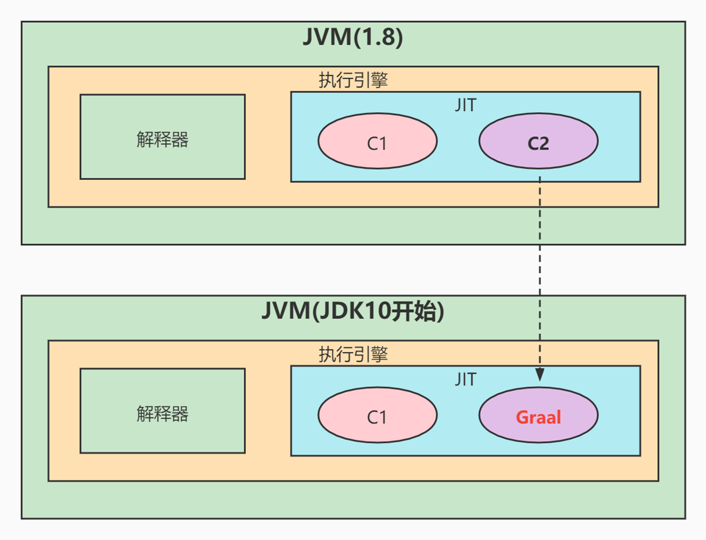
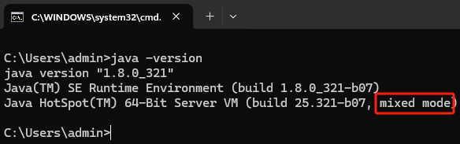
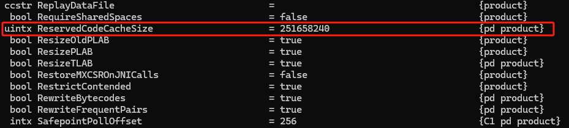

# 让Java性能提升的JIT深度剖析

## JVM的跨语言特性

跨语言特性也被称为语言无关性。JVM其实跟语言是解耦的，其运行不是翻译Java文件，而是识别Class文件，这个一般称之为字节码。还有像Groovy 、Kotlin、Scala等等语言，它们其实也是编译成字节码，所以它们也可以在JVM上面跑，这个就是JVM的跨语言特征。


## 解释执行与JIT编译器


Java程序在运行的时候，主要就是执行字节码指令，一般这些指令会按照顺序解释执行，伪代码如下：

```java
// 解释执行
public void Compile(String str) {
    // 当遇到具体字节码指令时，直接翻译成机器码
    if("iload".equals(str)){
        // 010101010101010 机器码
    }
    if("bipush".equals(str)){
        // 111010111010110 机器码
    }
    if("istore".equals(str)){
        // 001010111011110 机器码
    }
}
```

但是那些被频繁调用的代码，比如调用次数很高或者在for循环里的那些代码，如果按照解释执行，效率是非常低的。这也是Java过去被诟病性能慢的主要原因。以上这些代码都被称为热点代码，为了提高热点代码的执行效率，虚拟机在运行时将会把这些代码编译成与本地平台相关的机器码，并进行各种层次的优化。**完成这个任务的编译器，就称为即时编译器（Just In Time Compiler），简称JIT编译器。**

## C1、C2与分层编译



在JDK1.8中HotSpot虚拟机中，内置了两个JIT编译器，分别为C1编译器和C2编译器。

### C1编译器

C1编译器是一个简单快速的编译器，主要的关注点在于局部性的优化，适用于执行时间较短或对启动性能有要求的程序，例如，GUI应用对界面启动速度就有一定要求，C1也被称为Client Compiler。**C1编译器几乎不会对代码进行优化。**

### C2编译器

C2编译器是为长期运行的服务器端应用程序做性能调优的编译器，适用于执行时间较长或对峰值性能有要求的程序。根据各自的适配性，这种即时编译也被称为Server Compiler。但是C2代码已超级复杂，无人能维护，所以才会开发Java编写的Graal编译器取代C2。

### 分层编译

在 Java7之前，需要根据程序的特性来选择对应的JIT，虚拟机默认采用解释器和其中一个编译器配合工作。Java7及以后引入了分层编译，这种方式综合了C1编译器的启动性能优势和C2编译器的峰值性能优势，当然也可以通过参数强制指定虚拟机的即时编译模式。

在Java8中默认开启分层模式，通过`java -version`命令行可以直接查看到当前系统使用的编译模式（默认分层编译）：



使用`-Xint`参数强制虚拟机运行于只有解释器的编译模式：


使用`-Xcomp`强制虚拟机运行于只有JIT的编译模式：


## 热点代码

热点代码就是那些被频繁调用的代码，比如调用次数很高或者在for循环里的那些代码。这些再次编译后的机器码会被缓存起来，以备下次使用，但对于那些执行次数很少的代码来说，这种编译动作就纯属浪费。

JVM提供了一个参数`-XX:ReservedCodeCacheSize`，用来限制CodeCache的大小。也就是说，JIT编译后的代码都会放在CodeCache里。如果这个空间不足，JIT就无法继续编译，编译执行会变成解释执行，性能会降低一个数量级。同时，JIT编译器会一直尝试去优化代码，从而造成了CPU占用上升。

该空间大小可以通过`java -XX:+PrintFlagsFinal –version`查询：



### 热点探测

在HotSpot虚拟机中的热点探测是JIT优化的条件，热点探测是基于计数器的热点探测，采用这种方法的虚拟机会为每个方法建立计数器统计方法的执行次数，如果执行次数超过一定的阈值就认为它是“热点方法”。

虚拟机为每个方法准备了两类计数器：方法调用计数器（Invocation Counter）和回边计数器（Back Edge Counter）。在确定虚拟机运行参数的前提下，这两个计数器都有一个确定的阈值，当计数器超过阈值溢出了，就会触发JIT编译。

**方法调用计数器**

用于统计方法被调用的次数，方法调用计数器的默认阈值在客户端模式下是1500次，在服务端模式下是10000次，Java 8用的都是服务端模式，可使用`java –version`查询：


再通过`java -XX:+PrintFlagsFinal –version`查询被调用次数：


**回边计数器**

用于统计一个方法中循环体代码执行的次数，在字节码中遇到控制流向后跳转的指令称为“回边”（Back Edge），该值用于计算是否触发C1编译的阈值，在不开启分层编译的情况下，在服务端模式下是10700。这个是通过计算得到的，可以参考下面这个公式：
$$
回边计数器阈值=\\Compile Threshold×(OnStackReplacePercentage-InterpreterProfilePercentage)÷100
$$

- CompileThreshold：方法调用计数器阈值；
- OnStackReplacePercentage：OSR比率；
- InterpreterProfilePercentage：解释器监控比率。

这三个值都可以通过`java -XX:+PrintFlagsFinal –version`命令查询，这三个值默认值分别是10000、140、33，代入公式即：$回边计数器阈值=10000×(140-33)÷100=10700$。

### 编译优化技术

JIT编译运用了一些经典的编译优化技术来实现代码的优化，即通过一些例行检查优化，可以智能地编译出运行时的最优性能代码。

**方法内联**

方法内联的优化行为就是把目标方法的代码复制到发起调用的方法之中，避免发生真实的方法调用。例如以下方法：

```java
private int addFour(int x1, int x2, int x3, int x4){
    return addTwo(x1,x2)+addTwo(x3,x4);
}

private int addTwo(int x1, int x2){
    return x1+x2;
}
```

最终会被优化为：

```java
private int add(int x1, int x2, int x3, int x4){
    return x1+x2+x3+x4;
}
```

JVM会自动识别热点方法，并对它们使用方法内联进行优化。但要强调一点，热点方法不一定会被JVM做内联优化，如果这个方法体太大了，JVM将不执行内联操作。经常执行的方法，默认情况下，方法体大小小于325字节的都会进行内联，可以通过`java -XX:+PrintFlagsFinal –version`查询：


当然也可以通过`-XX:FreqInlineSize=N`来设置方法体大小值。

综上简单点说就是将一定长度且多次调用的方法内联编译到字节码中，以达到最快速调用方法的目的。

**锁消除**

在非线程安全的情况下，尽量不要使用线程安全容器，比如StringBuffer。由于StringBuffer中的`append()`方法被Synchronized关键字修饰，会使用到锁，从而导致性能下降。

但实际上，StringBuffer和StringBuilder的性能区别并没有想象中那么大，因为在局部方法中创建的对象只能被当前线程访问，无法被其它线程访问，这个变量的读写肯定不会有竞争，这个时候JIT编译会对这个对象的方法锁进行锁消除。