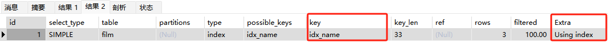

# Explain详解

深入理解了索引的理论后，接下来就进入第一个偏实践的环节，就是耳熟不（bushi）详的 **`Explain`** 工具的使用详解。

在实际工作或者生产中，这Explain工具能使用的地方并不多，但是一旦涉及到SQL优化，第一个想到的应该就是它，它的主要作用是可以模拟优化器执行查询SQL语句，进而分析语句或者解构性能瓶颈。用法也很简单，就是在 `SELECT` 语句之前增加一个 `EXPLAIN` 关键字即可，此时MySQL会在查询语句上设置一个标记，执行之后就会返回执行计划的信息，而不是真正地执行这条SQL。但是要注意，如果SQL语句 `FROM` 关键字后包含了子查询，那么会先真正执行该子查询，把结果放在临时表中在进行整条SQL语句的执行计划的返回。

这里有一个官方文档，专门详细描述MySQL的执行计划，其中使用到的工具就是Explain：https://dev.mysql.com/doc/refman/8.0/en/execution-plan-information.html

## Explain属性说明

### 前置数据准备

首先给之后要用到的数据表先创建起来，以便于之后深入Explain工具。

```sql
DROP TABLE IF EXISTS `actor`; 
CREATE TABLE `actor` (
  `id` int(11) NOT NULL,
  `name` varchar(45) DEFAULT NULL,
  `update_time` datetime DEFAULT NULL,
  PRIMARY KEY (`id`)
) ENGINE=InnoDB DEFAULT CHARSET=utf8;

INSERT INTO `actor` (`id`, `name`, `update_time`) VALUES (1,'a','2024-11-11 15:27:18'), (2,'b','2024-11-12 15:27:18'), (3,'c','2024-11-13 15:27:18');

DROP TABLE IF EXISTS `film`;
CREATE TABLE `film` (
  `id` int(11) NOT NULL AUTO_INCREMENT,
  `name` varchar(10) DEFAULT NULL,
  PRIMARY KEY (`id`),
  KEY `idx_name` (`name`)
) ENGINE=InnoDB DEFAULT CHARSET=utf8;

INSERT INTO `film` (`id`, `name`) VALUES (3,'film0'),(1,'film1'),(2,'film2');

DROP TABLE IF EXISTS `film_actor`;
CREATE TABLE `film_actor` (
  `id` int(11) NOT NULL,
  `film_id` int(11) NOT NULL,
  `actor_id` int(11) NOT NULL,
  `remark` varchar(255) DEFAULT NULL,
  PRIMARY KEY (`id`),
  KEY `idx_film_actor_id` (`film_id`,`actor_id`)
) ENGINE=InnoDB DEFAULT CHARSET=utf8;

INSERT INTO `film_actor` (`id`, `film_id`, `actor_id`) VALUES (1,1,1),(2,1,2),(3,2,1);
```

现在先尝试一下Explain工具：

```sql
EXPLAIN SELECT * FROM actor;
```


此时就能够看到执行这条SQL的一些细节，如果查询SQL语句中含有联表查询，那么就会输出多行：

```sql
EXPLAIN SELECT * FROM film AS f LEFT JOIN film_actor AS fa ON f.id = fa.film_id
```


接下来就对上述这些属性进行详细说明。

### id列

id列的编号是SELECT语句的序列号，也就是有几个SELECT语句就会有几个id编号，并且id编号值得顺序是按照SELECT语句执行的顺序增长的。

**简而言之，id列值越大，执行优先级就越高，如果id列值相同，则从上往下执行，如果id值为NULL就表示最后执行。**

比如上面那个联表查询的例子，存在两个id列值，那就说明有两条查询会被执行，但是两个id列值相同，那就不讲究谁优先执行，而是从上往下执行。

再举个例子：

```sql
# 关闭MySQL对衍生表的合并优化（先不用理解什么叫衍生表）
SET SESSION optimizer_switch='derived_merge=off';
# 执行下面这条复杂SQL语句
explain select (select 1 from actor where id = 1) from (select * from film where id = 1) der;
# 还原默认设置
SET SESSION optimizer_switch='derived_merge=on';
```


从上面的执行计划就能看出来，先执行id值为3的SQL语句（`select * from film where id = 1`），然后执行id值为2的SQL语句（`select 1 from actor where id = 1`），最后执行整条SQL语句。

### select_type列

select_type列的内容表示对应的查询语句将要执行的查询类型，最主要的有以下五种类型。

**1、simple查询**

simple查询即简单查询，即查询语句中不包含任何子查询或者联合查询（UNION），下面举一个例子：

```sql
EXPLAIN SELECT * FROM film WHERE id = 1;
```


**2、primary查询**

primary查询就是复杂查询中最外层的SELECT语句查询。

**3、subquery查询**

subquery查询就是包含在SELECT关键字之后的子查询（不包含FROM关键字之后的子查询）。

**4、derived查询**

derived查询就是包含在FROM关键字之后的子查询，MySQL会把查询结果放在一个临时表中，这个临时表也被称为**衍生表或者派生表**。

对于上面三种查询类型，可以用刚才举的一个例子来说明：

```sql
# 关闭MySQL对衍生表的合并优化（先不用理解什么叫衍生表）
SET SESSION optimizer_switch='derived_merge=off';
# 执行下面这条复杂SQL语句
explain select (select 1 from actor where id = 1) from (select * from film where id = 1) der;
# 还原默认设置
SET SESSION optimizer_switch='derived_merge=on';
```


按照执行的优先级来看，最先执行的 `select * from film where id = 1` 语句所在表是film表，该条执行语句在最外层执行语句的FROM关键字之后，所以是derived查询；其次执行的 `select 1 from actor where id = 1` 语句所在表是actor表，该条执行语句在最外层执行语句的SELECT关键字之后，所以是subquery查询；最后执行整个SQL查询语句，也就是最外层的SELECT语句，值得一提的是该语句所在表是在衍生表中，该衍生表被MySQL命名为\<derived3>表

**5、union查询**

union查询就是在UNION关键字之后的子查询，这个可以用下面这个例子来说明：

```sql
EXPLAIN SELECT 1 UNION ALL SELECT 2 UNION ALL SELECT 3;
```


### table列

从上面这些例子可以看出来，table列就表示Explain命令正在访问哪个表，它有如下特点：

1、当FROM关键字后有子查询时，即derived查询，table列是\<derivenN>格式，表示当前查询依赖id=N的查询。

2、当UNION关键字后有查询时，UNION RESULT的table列值为\<unionN,M>，N和M表示参与UNION类型的id值。

### type列

type列表示关联类型或者访问类型，即MySQL决定如何查找表中的数据以及查找数据行记录的大概范围。

先说结论，常见关联类型性能从好到坏分别是：**NULL值 > system > const > eq_ref > ref > range > index > ALL**，一般来说得保证查询最坏达到range级别，通常需要达到ref级别。

**1、NULL值**

空关联类型表示MySQL能够在优化阶段分解查询语句，在执行阶段就不用再次访问表或者索引，比如在索引列中查找最小值，可以单独在优化阶段轻易得到索引列中的最小值，在执行的时候直接返回即可。

```sql
EXPLAIN SELECT min(id) FROM film;
```


**2、system/const**

system/const关联类型表示MySQL能够对查询的某些部分进行优化，进而可以将其转化成一个常量。通常用于主键索引或唯一值索引的所有列与常数作比较的情况，由于最后结果就只匹配一行数据，仅读取一次，速度就非常快。而**system是const的一个特例**，除了要求主键索引或唯一值索引，还要求表里只有一行数据进行匹配才会用到system关联类型。

```sql
# 关闭MySQL对衍生表的合并优化（先不用理解什么叫衍生表）
SET SESSION optimizer_switch='derived_merge=off';
EXPLAIN SELECT * FROM (SELECT * FROM film WHERE id = 1) tmp;
# 还原默认设置
SET SESSION optimizer_switch='derived_merge=on';
```


现在抛出一个问题，就是如何证明MySQL优化是会把某些部分转化成一个常量呢？此时就可以用到**`SHOW WARNINGS`**命令。

```sql
# 关闭MySQL对衍生表的合并优化（先不用理解什么叫衍生表）
SET SESSION optimizer_switch='derived_merge=off';
EXPLAIN SELECT * FROM (SELECT * FROM film WHERE id = 1) tmp;
SHOW WARNINGS;
# 还原默认设置
SET SESSION optimizer_switch='derived_merge=on';	
```


此处的 `select '1' AS id,'film1' AS name from dual` 查询语句就是MySQL优化后的结果，这里可以明显看到MySQL给一些查询条件直接转成了常量列进行查询。但是此时一定要注意，此处MySQL优化后的结果不一定能够直接执行，这个可以看作只是介绍一下MySQL对于对应SQL语句的一个优化方向。

**3、re_ref**

re_ref关联类型可能是除const之外最好的关联类型了，一般出现在主键索引或者唯一值索引的索引部分被联表使用的时候，最后至多会返回一条符合条件的记录，在简单查询中不会出现这种情况。

```sql
EXPLAIN SELECT * FROM film_actor AS fa LEFT JOIN film AS f ON fa.film_id = f.id;
```


**4、ref**

相比于re_ref关联类型，ref关联类型不会完整使用唯一索引，而是使用普通索引或者唯一性索引的部分前缀，这样索引要和某个值相比较时，就可能会找到多个符合条件的行。

示例一：以name字段为普通索引的简单查询。

```sql
EXPLAIN SELECT * FROM film WHERE name = 'film1';
```


示例二：前置数据准备阶段中设置了一个idx_film_actor_id联合索引，关联的字段是film_id和actor_id，这里构建一个使用film_actor的左边前缀film_id部分的联表查询。

```sql
EXPLAIN SELECT film_id FROM film AS f LEFT JOIN film_actor AS fa ON f.id = fa.film_id;
```


**5、range**

range关联类型通常出现在in(), between ,> ,<, >=等操作中。

```sql
EXPLAIN SELECT * FROM actor WHERE id > 1;
```


**6、index**

index关联类型通常出现在通过扫描全索引就能拿到结果的情况中，一般是扫描某个二级索引，这种扫描不会从索引树根节点开始查找，而是直接对二级索引的叶子节点进行扫描和遍历，效率还是比较低的。这种关联类型一般出现在覆盖索引（这不是一种索引，仅是对索引某些情况的描述）中。要注意的一个点是，二级索引一般是比较小的，所以这种通常比类似主键索引一样的聚集索引效率要高。

```sql
EXPLAIN SELECT * FROM film;
```


**7、ALL**

ALL关联类型也就是所谓的全表扫描，扫描主键索引这样的聚集索引所有的叶子节点，这也是为什么比index关联类型效率低的原因之一。这种情况就是需要优化的SQL。

```sql
EXPLAIN SELECT * FROM actor;
```


### possible_keys列

possible_keys列主要展示对应查询语句可能会使用到哪些索引来进行查找，使用Explain工具时可能会出现NULL值得情况，这就表示没有相关的索引可以使用，这种情况下可以通过检查WHERE关键字之后的条件是否可以创造一个适当的索引来提高查询性能。

### key列

key列主要展示对应查询语句实际会使用哪个索引来进行查找，如果该列值为NULL，那么就说明没有使用索引。可能会出现possible_keys列有值，但是key列无值的情况，这通常是因为表中的数据并不多，MySQL认为使用索引效率可能没有全表查询高。

### key_len列

key_len列主要展示对应查询语句在索引时使用了多少字节的内存，通过这个值是可以计算出具体使用了索引中的哪些列的，举例来说在film_actor表中的联合索引idx_film_actor_id是由film_id和actor_id两个int类型列组成的，每个int是4个字节，现在执行如下SQL语句：

```sql
EXPLAIN SELECT * FROM film_actor WHERE film_id = 2;
```


通过key_len的结果"4"可以推断出本次查询使用了第一个列（film_id）来执行索引查找。

**key_len列值的计算规则如下：**

1、字符串类型，默认使用UTF-8字符集：

- char(n)：如果是汉字则是3n字节，其他就是n字节；
- varchar(n)：如果是汉字则是3n+2字节，其他就是n+2字节，多出来的2字节是用来存储字符串长度的，因为varchar类型是一个变长字符串。

2、数值类型

- tinyint：1字节；
- smallint：2字节；
- int：4字节；
- bigint：8字节。

3、时间类型

- date：3字节；
- timestamp：4字节；
- datetime：8字节。

4、如果字段允许为NULL，则NULL值也需要1字节进行记录。

**注意：**索引使用的最大内存是768字节，当字符串过长时，MySQL会做出一个类似于最左前缀索引的处理，将前半部分的字符提取出来进行索引操作。

### ref列

ref列主要展示key列记录的索引中，查找值所用到的列或者常量。比较常见的列值为const或者字段名称（例如：film.id）

### rows列

rows列展示需要读取并检测的行数预估值，要注意这个并不是结果集中实际的行数，仅仅是一个预测值。

### Extra列

Extra列主要展示一些额外的内容，可以把它看作是查询计划的批注，常见的比较重要的值如下。

**1、Using index：使用覆盖索引。**

首先需要理解什么是**覆盖索引**？覆盖索引并不是一种具体的索引，而是描述某些索引的具体情况，当MySQL执行计划中的key列有使用索引时，如果SELECT后面查询的列值都可以在这个索引树中找到，这种情况一般可以说是用到了覆盖索引，此时Extra列中内容一般都有Using index。所以覆盖索引一般针对的是主键索引和不会产生回表操作的非聚集索引，即整个查询结果只需要通过这个索引树就能够全部拿到，示例如下：

```sql
EXPLAIN SELECT film_id FROM film_actor WHERE film_id = 1;
```


**2、Using Where：使用WHERE语句来处理结果并且查询的列未被索引完全覆盖，或者查询的列被完全覆盖但不满足最左前缀原则。**

下面直接举一些例子来分析，film_actor表中有idx_film_actor_id索引（索引列是film_id和actor_id）:

```sql
# Extra列值：Using where; Using index    √
EXPLAIN SELECT actor_id,film_id FROM film_actor WHERE actor_id = 1;
# Extra列值：Using index                 ×
EXPLAIN SELECT actor_id,film_id FROM film_actor WHERE film_id = 1;
# Extra列值：Using where                 √
EXPLAIN SELECT actor_id,remark FROM film_actor WHERE actor_id = 1;
# Extra列值：NULL                        ×
EXPLAIN SELECT actor_id,remark FROM film_actor WHERE film_id = 1;
```

**3、Using index condition：查询的列未被索引完全覆盖，且WHERE语句中条件是索引前导列（目前理解为最左列）的范围。**

```sql
EXPLAIN SELECT * FROM film_actor WHERE film_id > 1;
```


**4、Using temporary：执行计划中需要创建一张临时表来处理查询。出现这种情况一般是要进行优化的，首先是想到用索引来优化。**

首先需要知道使用DISTINCT关键字时会产生一张临时表来实现去重操作，那么对比下面这两种情况，第一种情况如下：

```sql
EXPLAIN SELECT DISTINCT name FROM actor;
```


第二种情况如下：

```sql
EXPLAIN SELECT DISTINCT name FROM film;
```



从上面两种情况可以看出，如果遇到去重这样的情况，可以给去重列加上索引提高效率。

**5、Using filesort：文件排序将使用外部排序而不是索引排序，这种情况当数量小时还能从内存进行排序，否则就需要借助磁盘I/O完成排序，这种情况也是需要用索引来优化的。**

还是两个相似于Using temporary的例子，第一个是：

```sql
EXPLAIN SELECT * FROM actor ORDER BY name;
```


第二个是：

```sql
EXPLAIN SELECT * FROM film ORDER BY name;
```


可以看出优化思路是一样的，即给排序列加上索引提高效率。

**6、Select tables optimized away：使用某些聚合函数（比如 max、min）来访问存在索引的某个字段。**

这种情况基本会伴随着table列为NULL值时出现，性能和效率都属于第一梯队，可以说是不需要优化。

```sql
EXPLAIN SELECT min(id) FROM film;
```


## 索引常见实践

### 前置数据准备

```sql
CREATE TABLE `employees` (
  `id` int(11) NOT NULL AUTO_INCREMENT,
  `name` varchar(24) NOT NULL DEFAULT '' COMMENT '姓名',
  `age` int(11) NOT NULL DEFAULT '0' COMMENT '年龄',
  `position` varchar(20) NOT NULL DEFAULT '' COMMENT '职位',
  `hire_time` timestamp NOT NULL DEFAULT CURRENT_TIMESTAMP COMMENT '入职时间',
  PRIMARY KEY (`id`),
  KEY `idx_name_age_position` (`name`,`age`,`position`) USING BTREE
) ENGINE=InnoDB AUTO_INCREMENT=4 DEFAULT CHARSET=utf8 COMMENT='员工记录表';

INSERT INTO employees(name,age,position,hire_time) VALUES('LiLei',22,'manager',NOW());
INSERT INTO employees(name,age,position,hire_time) VALUES('HanMeimei', 23,'dev',NOW());
INSERT INTO employees(name,age,position,hire_time) VALUES('Lucy',23,'dev',NOW());
```

### 尽量全值匹配

```sql
EXPLAIN SELECT * FROM employees WHERE name= 'LiLei';
```


```sql
EXPLAIN SELECT * FROM employees WHERE name= 'LiLei' AND age = 22;
```


```sql
EXPLAIN SELECT * FROM employees WHERE  name= 'LiLei' AND  age = 22 AND position ='manager';
```


上述三种情况只有第三个是全值索引，即WHERE条件中的列恰好覆盖索引列且满足最左前缀原则，这种索引情况区分度最高，索引利用率最高，扫描的行数可能会更少，因此查询效率也会是最高。

### 索引列上尽量不做任何操作

这里的操作包含：计算、函数或者类型转换，因为这样会导致索引失效而转向全表扫描。

```sql
# type列为ref
EXPLAIN SELECT * FROM employees WHERE name = 'LiLei';
# type为ALL
EXPLAIN SELECT * FROM employees WHERE left(name,3) = 'LiLei';
```

再给hire_time增加一个普通索引：

```sql
ALTER TABLE `employees` ADD INDEX `idx_hire_time` (`hire_time`) USING BTREE;
```

然后再对其进行函数操作：

```sql
EXPLAIN SELECT * FROM employees WHERE date(hire_time) ='2018-09-30';
```


此时有一个优化点，把日期查询转化为日期时间范围查询，可能会走索引：

```sql
EXPLAIN SELECT * FROM employees WHERE hire_time >='2018-09-30 00:00:00' AND hire_time <='2018-09-30 23:59:59';
```


便于下面实践操作，这里还原索引状态：

```sql
ALTER TABLE `employees` DROP INDEX `idx_hire_time`;
```

### 索引非最右列尽量不使用范围查找

```sql
EXPLAIN SELECT * FROM employees WHERE name= 'LiLei' AND age = 22 AND position ='manager';
```


```sql
EXPLAIN SELECT * FROM employees WHERE name= 'LiLei' AND age > 22 AND position ='manager';
```


从上面的例子来看，满足最左前缀原则的情况下，如果在索引非最右列使用了范围查找，索引利用率会下降。联合索引树的特点就是在某索引列左侧列相等的情况下，该索引列才有序且其右侧列可能无序。上面例子中第二列是一个范围查询，查询结果之间无法确定是否相等，就导致遍历到第三列无法确定是否有序，所以索引失效。

### 尽量使用覆盖索引而不是SELECT *

```sql
EXPLAIN SELECT name,age FROM employees WHERE name= 'LiLei' AND age = 23 AND position ='manager';
```


```sql
EXPLAIN SELECT * FROM employees WHERE name= 'LiLei' AND age = 23 AND position ='manager';
```


### 尽量不使用否定关键字和NULL

这种情况包括：!=或<>、NOT IN、NOT EXISTS、IS NULL、IS NOT NULL，这些情况很可能会导致全表扫描。

```sql
EXPLAIN SELECT * FROM employees WHERE name NOT IN (SELECT 'LiLei');
```


### LIKE关键字尽量不以%开头

观察下面两个示例：

```sql
EXPLAIN SELECT * FROM employees WHERE name LIKE '%Lei'
```


```sql
EXPLAIN SELECT * FROM employees WHERE name LIKE 'Lei%'
```


出现上述情况的原因其实也是因为最左前缀原则，即匹配字符串时从头开始扫描和比较。

如果硬要以%开头进行模糊查询，可以选择使用覆盖索引去避免全表扫描，提升效率：

```sql
EXPLAIN SELECT name,age,position FROM employees WHERE name LIKE '%Lei';
```


### 查询条件尽量保持数据类型相同

即数据库中要求字符串，就不要传参为数字。

```sql
EXPLAIN SELECT * FROM employees WHERE name = '1000';
```


```sql
EXPLAIN SELECT * FROM employees WHERE name = 1000;
```


### 尽量少用OR或者IN

当使用OR或者IN时，MySQL不一定会使用索引，因为MySQL内部优化器会根据检索的比例、表达小等多个因素进行整体评估是否使用索引。

### 尽量拆分大数据量查询

平时工作中，有一个业务设计无形中会遵守这个原则，那就是分页查询，请看下面这个例子：

```sql
# 首先添加一个索引
ALTER TABLE `employees` ADD INDEX `idx_age` (`age`) USING BTREE ;

# 然后进行大数据量查询，发现type列值可能为ALL
EXPLAIN SELECT * FROM employees WHERE age >=1 AND age <=2000;

# 拆分查询之后，发现type列值为range
EXPLAIN SELECT * FROM employees WHERE age >=1 AND age <=1000;
EXPLAIN SELECT * FROM employees WHERE age >=1001 AND age <=2000;

# 最后还原索引
ALTER TABLE `employees` DROP INDEX `idx_age`;
```

## 索引常用方法


注意：like KK%相当于=常量，%KK和%KK% 相当于范围
