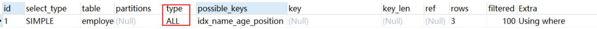
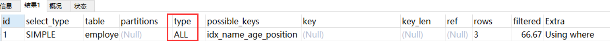
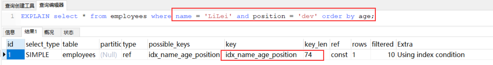
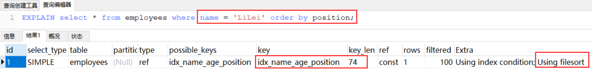
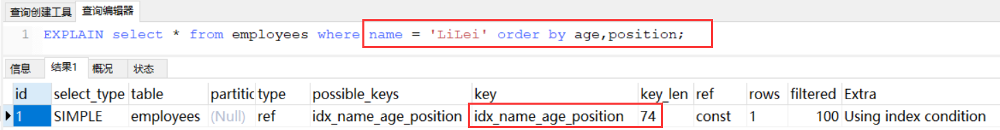
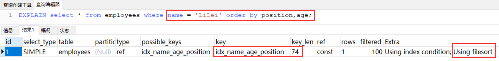
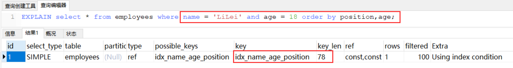
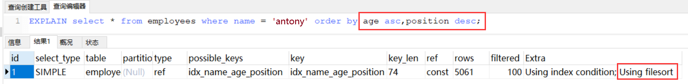
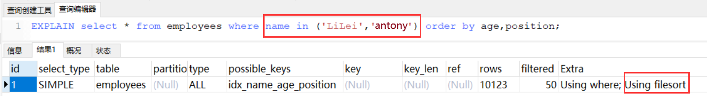
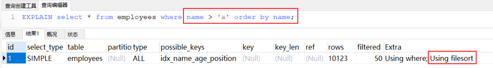

# Mysql索引优化实战（1）

接着上一章节的内容继续从实战的角度探讨一下索引的优化问题。

## 前置数据准备

```sql
CREATE TABLE `employees` (
	`id` INT ( 11 ) NOT NULL AUTO_INCREMENT,
	`name` VARCHAR ( 24 ) NOT NULL DEFAULT '' COMMENT '姓名',
	`age` INT ( 11 ) NOT NULL DEFAULT '0' COMMENT '年龄',
	`position` VARCHAR ( 20 ) NOT NULL DEFAULT '' COMMENT '职位',
	`hire_time` TIMESTAMP NOT NULL DEFAULT CURRENT_TIMESTAMP COMMENT '入职时间',
	PRIMARY KEY ( `id` ),
	KEY `idx_name_age_position` ( `name`, `age`, `position` ) USING BTREE 
) ENGINE = InnoDB AUTO_INCREMENT = 1 DEFAULT CHARSET = utf8 COMMENT = '员工记录表';
INSERT INTO employees (NAME, age, position, hire_time) VALUES ('LiLei',22,'manager',NOW());
INSERT INTO employees (NAME, age, position, hire_time) VALUES ('HanMeimei',23,'dev',NOW());
INSERT INTO employees (NAME, age, position, hire_time) VALUES ('Lucy',23,'dev',NOW());

# 插入一些示例数据
DROP PROCEDURE IF EXISTS insert_emp;
delimiter;;
CREATE PROCEDURE insert_emp () BEGIN
	DECLARE i INT;
	SET i = 1;
	WHILE( i <= 100000 ) DO
		INSERT INTO employees ( NAME, age, position ) VALUES ( CONCAT( 'antony', i ), i, 'dev' );
		SET i = i + 1;
	END WHILE;
END;;
delimiter;
CALL insert_emp ();

# 复制一个数据量少的表
CREATE TABLE `employees_copy` (
	`id` INT ( 11 ) NOT NULL AUTO_INCREMENT,
	`name` VARCHAR ( 24 ) NOT NULL DEFAULT '' COMMENT '姓名',
	`age` INT ( 11 ) NOT NULL DEFAULT '0' COMMENT '年龄',
	`position` VARCHAR ( 20 ) NOT NULL DEFAULT '' COMMENT '职位',
	`hire_time` TIMESTAMP NOT NULL DEFAULT CURRENT_TIMESTAMP COMMENT '入职时间',
	PRIMARY KEY ( `id` ),
	KEY `idx_name_age_position` ( `name`, `age`, `position` ) USING BTREE 
) ENGINE = InnoDB AUTO_INCREMENT = 1 DEFAULT CHARSET = utf8 COMMENT = '员工记录表';
INSERT INTO employees_copy (NAME, age, position, hire_time) VALUES ('LiLei',22,'manager',NOW());
INSERT INTO employees_copy (NAME, age, position, hire_time) VALUES ('HanMeimei',23,'dev',NOW());
INSERT INTO employees_copy (NAME, age, position, hire_time) VALUES ('Lucy',23,'dev',NOW());
```

这里先对上一章节的内容进行简短的一些补充。

**1、采用联合索引的情况下，如果最左索引字段使用范围查询，就不会走索引。**

```sql
EXPLAIN SELECT * FROM employees WHERE name > 'antony' AND age = 22 AND position ='manager';
```


用上面这个例子是想引出强制走索引的方法，如果遇到上面存在可能得索引，但是实际并没有走索引的情况，可以使用`force index()`来强制这条查询语句走索引，如下：

```sql
EXPLAIN SELECT * FROM employees force index(idx_name_age_position) WHERE name > 'antony' AND age = 22 AND position ='manager';
```


但是非常不建议这么做，因为在执行SQL前MySQL底层会对可能用到的索引和全表扫描两类方式进行效率计算（接下来会详细说明），说白了就是MySQL有索引可用但没用，自有它的原因，而这个原因都是有计算根据的，在绝大多数情况下都不会错。

那为什么这条SQL语句不走索引呢？大概率第一个索引字段所覆盖的范围太大，结果集太多，而导致的回表操作过于频繁，MySQL认为还不如使用全表扫描。一旦我们给范围缩小一点，把`antony`改为`LiLei`：

```sql
EXPLAIN SELECT * FROM employees WHERE name > 'LiLei' AND age = 22 AND position ='manager';
```


当然了，这条SQL语句有更加合理的方法让其走索引，那就是覆盖索引，用查询字段去覆盖索引字段，如下：

```sql
EXPLAIN SELECT name,age,position FROM employees WHERE name > 'antony' AND age = 22 AND position ='manager';
```

**2、【MySQL 5特性】IN和OR关键字在表内数据比较大的时候会走索引，否则通常全表扫描。**

这种实例可和上面那种实例可不是相反情况，上面实例全表扫描的原因是因为查询后得到的结果集太大而导致回表效率低下，这种实例全表扫描是因为表中本身包含的数据就少，在使用IN和OR这样的有限集关键字时全表的效率大概率是高于扫描索引树的，下面是在大数据表中进行查询的结果：

```sql
EXPLAIN SELECT * FROM employees WHERE name in ('LiLei','HanMeimei','Lucy') AND age = 22 AND position='manager';
```


```sql
EXPLAIN SELECT * FROM employees WHERE (name = 'LiLei' or name = 'HanMeimei') AND age = 22 AND position='manager';
```


下面是在小数据表中进行查询的结果：

```sql
EXPLAIN SELECT * FROM employees_copy WHERE name in ('LiLei','HanMeimei','Lucy') AND age = 22 AND position='manager';
```



```sql
EXPLAIN SELECT * FROM employees_copy WHERE (name = 'LiLei1' or name = 'HanMeimei') AND age = 22 AND position='manager';
```



**注意：**这是一个MySQL 5特性，在MySQL 8中使用IN和OR关键字非常大概率都会走索引，因为从MySQL 5.6之后新增了一个**索引下推（Index Condition Pushdown，ICP）**机制，这个机制在MySQL 8中适配了IN和OR这种情况，是的没错，这个机制即使是在5.6版本推出之后只是对小部分索引进行了优化，它主要作用简而言之就是减少联合索引（非聚集索引）的回表操作，下面这个实例会有详细介绍。

**3、在有对应索引的情况下，无论表大小如何，LIKE KK%一般都会走索引。**

```sql
EXPLAIN SELECT * FROM employees WHERE name like 'LiLei%' AND age = 22 AND position ='manager';
```


```sql
EXPLAIN SELECT * FROM employees_copy WHERE name like 'LiLei%' AND age = 22 AND position ='manager';
```


在这里就需要和上面第一种实例（范围查询）做一个比较，以前说到过`LIKE KK%`是一种局部的最左前缀，按照ASCII码比较的话可以把它看作是较为局限的`> KK`情况，这时就需要提及刚才已经说过的**索引下推（Index Condition Pushdown,ICP）**机制对于LIKE关键字的优化（可以类比对IN和OR关键字的优化）。

问题一：那什么是**索引下推**机制呢？

上述实例中辅助扫描用到的联合索引`(name,age,position)`，正常逻辑是按照最左前缀原则，对于`SELECT * FROM employees WHERE name like 'LiLei%' AND age = 22 AND position ='manager'`这种情况只会走name字段进行部分索引，因为根据name字段过滤完之后得到的索引行里的age和position是无序的。在MySQL 5.6版本之前，这个查询只能借助联合索引匹配到name以"LiLei"开头的索引值，然后拿到对应的主键进行逐个回表，拿到完整数据记录之后再对比age和position两个字段值是否符合查询条件；而MySQL5.6版本之后引入了索引下推机制进行优化，**可以在联合索引遍历过程中，对索引中包含的所有列先做一个判断，过滤掉不符合条件的索引值后再进行回表，这样就大幅度减少了回表次数，提高了整体效率**，上面那种情况在联合索引中匹配到name以"LiLei"开头的索引值的同时还会在索引里过滤不符合age和position这两个字段要求的索引值，然后在进行回表。对于InnoDB引擎这个机制只能用于二级索引（也就是包含联合索引在内的非聚集索引），InnoDB的主键索引叶子节点上保存的是完整数据，这个时候使用该机制并不会减少查询行数的效果。

问题二：为什么范围查找MySQL没有用到索引下推机制优化呢？

估计应该是MySQL认为范围查找过滤的结果集过大，LIKE KK%在绝大多数情况来看，过滤后的结果集比较小，所以这里MySQL选择给LIKE KK%用了索引下推优化，当然这也不是绝对的，有时LIKE KK%也不一定就会走索引下推。

## MySQL如何选择合适的索引

接下来就来详细说一说MySQL是如何选择合适的索引，或者换种问法就是MySQL是如何根据执行效率计算结果判断的，先来一个SQL语句及其Explain结果：

```sql
EXPLAIN SELECT * FROM employees WHERE name > 'a';
```


显然这里选择了全表扫描的方式，如果要优化那就使用覆盖索引的策略，这里不再演示，但是如果把查询条件改变一下，就会发现结果有所不同：

```sql
EXPLAIN SELECT * FROM employees WHERE name > 'zzz';
```


对于上面的差异，可以通过MySQL中自带的**trace工具**来找找原因，开启trace工具会影响MySQL性能，所以这里就只在本次会话中临时分析SQL语句使用：

```sql
# 开启trace
SET SESSION optimizer_trace="enabled=on",end_markers_in_json=on;
# 执行SQL
SELECT * FROM employees WHERE name > 'a';
# 紧接着立刻分析SQL
SELECT * FROM information_schema.OPTIMIZER_TRACE;
# 关闭trace
SET SESSION optimizer_trace="enabled=off";
```

得到的结果如下：


```json
{
  "steps": [
    {
      "join_preparation": { /* 第一阶段：SQL准备阶段，格式化SQL */
        "select#": 1,
        "steps": [
          {
            "expanded_query": "/* select#1 */ select `employees`.`id` AS `id`,`employees`.`name` AS `name`,`employees`.`age` AS `age`,`employees`.`position` AS `position`,`employees`.`hire_time` AS `hire_time` from `employees` where (`employees`.`name` > 'a')"
          }
        ] /* steps */
      } /* join_preparation */
    },
    {
      "join_optimization": { /* 第二阶段：SQL优化阶段 */
        "select#": 1,
        "steps": [
          {
            "condition_processing": { /* 条件处理 */
              "condition": "WHERE",
              "original_condition": "(`employees`.`name` > 'a')",
              "steps": [
                {
                  "transformation": "equality_propagation",
                  "resulting_condition": "(`employees`.`name` > 'a')"
                },
                {
                  "transformation": "constant_propagation",
                  "resulting_condition": "(`employees`.`name` > 'a')"
                },
                {
                  "transformation": "trivial_condition_removal",
                  "resulting_condition": "(`employees`.`name` > 'a')"
                }
              ] /* steps */
            } /* condition_processing */
          },
          {
            "substitute_generated_columns": {
            } /* substitute_generated_columns */
          },
          {
            "table_dependencies": [ /* 表依赖详情 */
              {
                "table": "`employees`",
                "row_may_be_null": false,
                "map_bit": 0,
                "depends_on_map_bits": [
                ] /* depends_on_map_bits */
              }
            ] /* table_dependencies */
          },
          {
            "ref_optimizer_key_uses": [
            ] /* ref_optimizer_key_uses */
          },
          {
            "rows_estimation": [ /* 预估表的访问成本 */
              {
                "table": "`employees`",
                "range_analysis": {
                  "table_scan": { /* 全表扫描情况 */
                    "rows": 99896, /* 扫描行数 */
                    "cost": 10064 /* 查询成本 */
                  } /* table_scan */,
                  "potential_range_indexes": [ /* 查询可能使用的索引 */
                    {
                      "index": "PRIMARY", /* 主键索引 */
                      "usable": false,
                      "cause": "not_applicable"
                    },
                    {
                      "index": "idx_name_age_position", /* 辅助索引 */
                      "usable": true,
                      "key_parts": [
                        "name",
                        "age",
                        "position",
                        "id"
                      ] /* key_parts */
                    }
                  ] /* potential_range_indexes */,
                  "setup_range_conditions": [
                  ] /* setup_range_conditions */,
                  "group_index_range": {
                    "chosen": false,
                    "cause": "not_group_by_or_distinct"
                  } /* group_index_range */,
                  "skip_scan_range": {
                    "potential_skip_scan_indexes": [
                      {
                        "index": "idx_name_age_position",
                        "usable": false,
                        "cause": "query_references_nonkey_column"
                      }
                    ] /* potential_skip_scan_indexes */
                  } /* skip_scan_range */,
                  "analyzing_range_alternatives": { /* 分析各个索引的使用成本 */
                    "range_scan_alternatives": [
                      {
                        "index": "idx_name_age_position",
                        "ranges": [
                          "'a' < name" /* 索引使用范围 */
                        ] /* ranges */,
                        "index_dives_for_eq_ranges": true,
                        "rowid_ordered": false, /* 使用该索引获取的记录是否按照主键排序 */
                        "using_mrr": false,
                        "index_only": false, /* 是否使用覆盖索引 */
                        "in_memory": 1,
                        "rows": 49948, /* 索引扫描行数 */
                        "cost": 17482.1, /* 索引使用成本 */
                        "chosen": false, /*是否选择该索引*/
                        "cause": "cost"
                      }
                    ] /* range_scan_alternatives */,
                    "analyzing_roworder_intersect": {
                      "usable": false,
                      "cause": "too_few_roworder_scans"
                    } /* analyzing_roworder_intersect */
                  } /* analyzing_range_alternatives */
                } /* range_analysis */
              }
            ] /* rows_estimation */
          },
          {
            "considered_execution_plans": [
              {
                "plan_prefix": [
                ] /* plan_prefix */,
                "table": "`employees`",
                "best_access_path": { /* 最优访问路径 */
                  "considered_access_paths": [ /* 最终选择的访问路径 */
                    {
                      "rows_to_scan": 99896,
                      "access_type": "scan", /* 访问类型：scan（全表扫描） */
                      "resulting_rows": 99896,
                      "cost": 10061.9,
                      "chosen": true /* 最终选择 */
                    }
                  ] /* considered_access_paths */
                } /* best_access_path */,
                "condition_filtering_pct": 100,
                "rows_for_plan": 99896,
                "cost_for_plan": 10061.9,
                "chosen": true
              }
            ] /* considered_execution_plans */
          },
          {
            "attaching_conditions_to_tables": {
              "original_condition": "(`employees`.`name` > 'a')",
              "attached_conditions_computation": [
              ] /* attached_conditions_computation */,
              "attached_conditions_summary": [
                {
                  "table": "`employees`",
                  "attached": "(`employees`.`name` > 'a')"
                }
              ] /* attached_conditions_summary */
            } /* attaching_conditions_to_tables */
          },
          {
            "finalizing_table_conditions": [
              {
                "table": "`employees`",
                "original_table_condition": "(`employees`.`name` > 'a')",
                "final_table_condition   ": "(`employees`.`name` > 'a')"
              }
            ] /* finalizing_table_conditions */
          },
          {
            "refine_plan": [
              {
                "table": "`employees`"
              }
            ] /* refine_plan */
          }
        ] /* steps */
      } /* join_optimization */
    },
    {
      "join_execution": { /* 第三阶段：SQL执行 */
        "select#": 1,
        "steps": [
        ] /* steps */
      } /* join_execution */
    }
  ] /* steps */
}
```

从上面的分析结果可以看出全表扫描查询的效率成本是小于索引查询的（10064<17482.1），这个值没有单位，就是一个相对值，用于MySQL比大小做决策。对于另一个SQL的分析这里直接放结果，全表查询的效率成本是远远大于索引查询的（10064>>0.61），产生这个情况的原因就是在表中name字段都是英文字母的情况下，'z'的ASCII值大于其他的字母，而这个表中的name字段都不是以'z'开头的，所以没有查询结果，效率极高。

## filesort优化

filesort指的就是文件排序，它通常出现在ORDER BY和GROUP BY场景中，在上一章节中讲到过Explain工具中Extra列值一旦出现了Using filesort，那就说明ORDER BY或GROUP BY之后之后的字段没有用到索引，这种情况是需要优化的，接下来看一些例子：

**示例一：**



分析：

满足最左前缀原则，中间字段不能断，因此查询用到了name索引，从key_len=74也能看出，age索引列用在排序过程中，因为Extra字段里没有Using filesort。

**示例二：**



分析：

从explain的执行结果来看：key_len=74，查询使用了name索引，由于用了position进行排序，跳过了age，不满足最左前缀原则，出现了Using filesort。

**示例三：**



分析：

查找只用到索引name，age和position用于排序，满足最左前缀原则，无Using filesort。

**示例四：**



分析：

和示例三中explain的执行结果一样，但是出现了Using filesort，因为索引的创建顺序为
（name,age,position），但是排序的时候age和position颠倒位置了。

**示例五：**



分析：

与示例四对比，在Extra中并未出现Using filesort，因为age为常量，在排序中被优化，所以索引未颠倒，不会出现Using filesort。

**示例六：**



分析：

虽然排序的字段列与索引顺序一样，且ORDER BY默认升序，这里position DESC变成了降序，导致与索引的排序方式不同，从而产生Using filesort。MySQL 8以上版本有降序索引可以支持该种查询方式。

**示例七：**



分析：

前面提到过IN和OR关键字出现，大概率是会走索引的，但是一旦出现ORDER BY或GROUP BY时，这个规则会被打破，因为根据索引树的结构，也许"LiLei"有十条数据，"antony"有九条数据，但是这十九条数据都是没有排序的，又因为结果集过大还要进行回表操作，所以MySQL就会认为索引扫描没有全表扫描效率高。

**示例八：**



分析：

这条理论上来说是可以走索引的，但是问题还是出在结果集太大，MySQL就认为全表扫描没有索引扫描效率高。

### filesort原理

filesort文件排序包括两种方式：

1、单路排序：是一次性取出满足条件行的所有字段，然后在sort buffer中进行排序；用trace工具可以看到sort_mode信息里显示<sort_key, additional_fields>或者<sort_key,packed_additional_fields>

2、双路排序（又称回表排序模式）：是首先根据相应的条件取出相应的排序字段和可以直接定位行数据的行 ID，然后在 sort buffer 中进行排序，排序完后需要再次取回其它需要的字段；用trace工具可以看到sort_mode信息里显示<sort_key, rowid>

以上两种方式各有各的好处，单路排序就是占内存多但是效率高，双路排序就是占内存少但效率低。那么MySQL是如何判断使用哪种排序模式的呢？MySQL系统变量中有一个`max_length_for_sort_data`，它默认1024字节，如果需要查询的表字段总大小小于1024，那么就是用单路排序，否则使用双路排序。切记一般情况下不要去调整这个阈值变量，说白了这是MySQL经过非常多次调优得出的结果。

下面使用trance工具来展示部分内容，以单路排序为例：

```sql
SET SESSION optimizer_trace="enabled=on",end_markers_in_json=on;
SELECT * FROM employees WHERE name = 'antony' ORDER BY position;
SELECT * FROM information_schema.OPTIMIZER_TRACE;
SET SESSION optimizer_trace="enabled=off";
```

```json
{
  "join_execution": {
    "select#": 1,
    "steps": [
      {
        "sorting_table": "employees",
        "filesort_information": [
          {
            "direction": "asc",
            "expression": "`employees`.`position`"
          }
        ] /* filesort_information */,
        "filesort_priority_queue_optimization": {
          "usable": false,
          "cause": "not applicable (no LIMIT)"
        } /* filesort_priority_queue_optimization */,
        "filesort_execution": [
        ] /* filesort_execution */,
        "filesort_summary": {
          "memory_available": 262144,
          "key_size": 40,
          "row_size": 190,
          "max_rows_per_buffer": 1323,
          "num_rows_estimate": 18446744073709551615,
          "num_rows_found": 0,
          "num_initial_chunks_spilled_to_disk": 0,
          "peak_memory_used": 0,
          "sort_algorithm": "none",
          "sort_mode": "<fixed_sort_key, packed_additional_fields>" /* 排序方式：单路排序 */
        } /* filesort_summary */
      }
    ] /* steps */
  } /* join_execution */
}
```

对于上面同一条SQL语句来描述一下单路排序和双路排序的具体过程：

1、单路排序具体过程：

（1）从索引name找到第一个满足 name = ‘antony’ 条件的主键 id；

（2）根据主键 id 取出整行，取出所有字段的值，存入 sort_buffer 内存中；

（3）从内存中的索引 name 找到下一个满足 name = ‘antony’ 条件的主键 id；

（4）重复步骤（3）直到不满足 name = ‘antony’；

（5）对 sort buffer 内存中的数据按照字段 position 进行排序；

（6）返回结果给客户端。

2、双路排序具体过程：

（1）从索引 name 找到第一个满足 name = ‘antony’ 的主键 id；

（2）根据主键 id 取出整行，把排序字段 position 和主键 id 这两个字段放到 sort buffer 内存中；

（3）从内存中的索引 name 取下一个满足 name = ‘antony’ 记录的主键 id；

（4）重复（3）直到不满足 name = ‘antony’；

（5）对 sort_buffer 内存中的字段 position 和主键 id 按照字段 position 进行排序；

（6）遍历排序好的 id 和字段 position，按照 id 的值回到原表中取出所有字段的值返回给客户端。

## 索引设计原则

1、代码先行，索引后上。


2、联合索引尽量覆盖条件。


3、不要在小基数字段上建立索引。


4、长字符串采用前缀索引。


5、当WHERE和ORDER BY索引冲突时，优先满足WHERE。


6、基于慢SQL查询做优化。