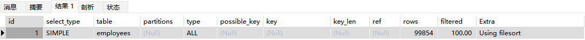

# MySQL索引优化实战（2）

## 分页查询优化

**前置数据准备**

```sql
CREATE TABLE `employees` (
	`id` INT ( 11 ) NOT NULL AUTO_INCREMENT,
	`name` VARCHAR ( 24 ) NOT NULL DEFAULT '' COMMENT '姓名',
	`age` INT ( 11 ) NOT NULL DEFAULT '0' COMMENT '年龄',
	`position` VARCHAR ( 20 ) NOT NULL DEFAULT '' COMMENT '职位',
	`hire_time` TIMESTAMP NOT NULL DEFAULT CURRENT_TIMESTAMP COMMENT '入职时间',
	PRIMARY KEY ( `id` ),
	KEY `idx_name_age_position` ( `name`, `age`, `position` ) USING BTREE 
) ENGINE = InnoDB AUTO_INCREMENT = 1 DEFAULT CHARSET = utf8 COMMENT = '员工记录表';

# 插入一些示例数据
DROP PROCEDURE IF EXISTS insert_emp;
delimiter;;
CREATE PROCEDURE insert_emp () BEGIN
	DECLARE i INT;
	SET i = 1;
	WHILE( i <= 100000 ) DO
		INSERT INTO employees ( NAME, age, position ) VALUES ( CONCAT( 'antony', i ), i, 'dev' );
		SET i = i + 1;
	END WHILE;
END;;
delimiter;
CALL insert_emp ();
```

很多时候业务系统实现分页查询会用到如下SQL语句实现：

```sql
SELECT * FROM employees LIMIT 10000, 10;
```

这条SQL表示从第10001行开始取出包括其在内的10行记录，这里看似只查询了10条记录，实际情况是使用该SQL语句会先读取前10010条记录，然后直接抛弃前10000条。因此想要查询一张数据量比较大的表的靠后数据，执行效率是非常低下的，有一个专有名词专门来形容这样的分页操作——深分页。对于这种情况有如下优化方案。

**1、针对自增且连续的主键排序的表进行分页查询**

以前置数据为例，先看如下SQL语句及其查询结果：

```sql
SELECT * FROM employees LIMIT 90000,5;
```


此时可以使用范围查询来优化无效扫描操作：

```sql
SELECT * FROM employees WHERE id > 90000 LIMIT 5;
```


这主要原因是范围查询可以使用索引，迅速定位到id=90000的记录能够有效避免大量的无效扫描，这里看Explain命令结果也能得到证实，不用范围查询的情况如下：


使用范围查询的情况如下：


但是这种情况有局限，那就是**要求主键列值有序且连续**，如果出现断层就会出现如下问题：

```sql
# 现在假设有一组id值
1 2 3 5 6 7 8 9 10

# 按照上面的思路写一条不使用范围查询的SQL如下
LIMIT 5, 2;  -- 结果是 7 8

# 写一条使用范围查询的SQL如下：
WHERE id > 5 LIMIT 2;  -- 结果是 6 7
```

**2、根据非主键列排序进行分页查询**

这种情况在实际业务上经常能遇到，比如查询用户信息，并且按照注册时间排序，然后分页操作。下面有一个SQL语句及其Explain命令结果：

```sql
EXPLAIN SELECT * FROM employees ORDER BY name LIMIT 90000,5;
```



从结果内容上看，这个不仅使用了全表扫描，而且还用到了文件排序，效率非常非常低，在上一章节中讨论过这种情况最有可能是因为结果集太大而导致的回表操作执行成本太高，由于这样的深分页操作数据量都不会小，使用所谓的覆盖索引大概率都不能对其进行直接优化， 我们先要明确这条语句慢主要是因为排序操作效率太低且返回排序后的数据集太大，所以思路就是借助衍生表先让排序快一点并且返回较少的数据集，再结合辅助索引叶子节点包含记录主键的特点可以写出如下SQL语句：

```sql
EXPLAIN SELECT * FROM employees e INNER JOIN (SELECT id FROM employees ORDER BY name LIMIT 90000,5) ed ON e.id = ed.id;
```


先让衍生表利用覆盖索引把符合要求的5条记录id值拿到，然后根据这5个id值去进行主键索引，把5条记录返回给客户端。这种思路既让其合理使用了索引，还避免了文件排序的过程。

查询结果如下：


## JOIN查询优化


## COUNT查询优化


## 一些补充

### 阿里巴巴开发手册


### MySQL数据类型的选择

