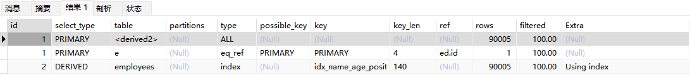

# MySQL索引优化实战（2）

## 分页查询优化

**前置数据准备**

```sql
CREATE TABLE `employees` (
	`id` INT ( 11 ) NOT NULL AUTO_INCREMENT,
	`name` VARCHAR ( 24 ) NOT NULL DEFAULT '' COMMENT '姓名',
	`age` INT ( 11 ) NOT NULL DEFAULT '0' COMMENT '年龄',
	`position` VARCHAR ( 20 ) NOT NULL DEFAULT '' COMMENT '职位',
	`hire_time` TIMESTAMP NOT NULL DEFAULT CURRENT_TIMESTAMP COMMENT '入职时间',
	PRIMARY KEY ( `id` ),
	KEY `idx_name_age_position` ( `name`, `age`, `position` ) USING BTREE 
) ENGINE = InnoDB AUTO_INCREMENT = 1 DEFAULT CHARSET = utf8 COMMENT = '员工记录表';

# 插入一些示例数据
DROP PROCEDURE IF EXISTS insert_emp;
delimiter;;
CREATE PROCEDURE insert_emp () BEGIN
	DECLARE i INT;
	SET i = 1;
	WHILE( i <= 100000 ) DO
		INSERT INTO employees ( NAME, age, position ) VALUES ( CONCAT( 'antony', i ), i, 'dev' );
		SET i = i + 1;
	END WHILE;
END;;
delimiter;
CALL insert_emp ();
```

很多时候业务系统实现分页查询会用到如下SQL语句实现：

```sql
SELECT * FROM employees LIMIT 10000, 10;
```

这条SQL表示从第10001行开始取出包括其在内的10行记录，这里看似只查询了10条记录，实际情况是使用该SQL语句会先读取前10010条记录，然后直接抛弃前10000条。因此想要查询一张数据量比较大的表的靠后数据，执行效率是非常低下的，有一个专有名词专门来形容这样的分页操作——深分页。对于这种情况有如下优化方案。

**1、针对自增且连续的主键排序的表进行分页查询**

以前置数据为例，先看如下SQL语句及其查询结果：

```sql
SELECT * FROM employees LIMIT 90000,5;
```


此时可以使用范围查询来优化无效扫描操作：

```sql
SELECT * FROM employees WHERE id > 90000 LIMIT 5;
```


这主要原因是范围查询可以使用索引，迅速定位到id=90000的记录能够有效避免大量的无效扫描，这里看Explain命令结果也能得到证实，不用范围查询的情况如下：


使用范围查询的情况如下：


但是这种情况有局限，那就是**要求主键列值有序且连续**，如果出现断层就会出现如下问题：

```sql
# 现在假设有一组id值
1 2 3 5 6 7 8 9 10

# 按照上面的思路写一条不使用范围查询的SQL如下
LIMIT 5, 2;  -- 结果是 7 8

# 写一条使用范围查询的SQL如下：
WHERE id > 5 LIMIT 2;  -- 结果是 6 7
```

**2、根据非主键列排序进行分页查询**

这种情况在实际业务上经常能遇到，比如查询用户信息，并且按照注册时间排序，然后分页操作。下面有一个SQL语句及其Explain命令结果：

```sql
EXPLAIN SELECT * FROM employees ORDER BY name LIMIT 90000,5;
```


从结果内容上看，这个不仅使用了全表扫描，而且还用到了文件排序，效率非常非常低，在上一章节中讨论过这种情况最有可能是因为结果集太大而导致的回表操作执行成本太高，由于这样的深分页操作数据量都不会小，使用所谓的覆盖索引大概率都不能对其进行直接优化， 我们先要明确这条语句慢主要是因为排序操作效率太低且返回排序后的数据集太大，所以思路就是借助衍生表先让排序快一点并且返回较少的数据集，再结合辅助索引叶子节点包含记录主键的特点可以写出如下SQL语句：

```sql
EXPLAIN SELECT * FROM employees e INNER JOIN (SELECT id FROM employees ORDER BY name LIMIT 90000,5) ed ON e.id = ed.id;
```



先让衍生表利用覆盖索引把符合要求的5条记录id值拿到，然后根据这5个id值去进行主键索引，把5条记录返回给客户端。这种思路既让其合理使用了索引，还避免了文件排序的过程。

查询结果如下：


## JOIN查询优化

**前置数据准备**

```sql
# 创建t1示例表
CREATE TABLE `t1` (
	`id` INT ( 11 ) NOT NULL AUTO_INCREMENT,
	`a` INT ( 11 ) DEFAULT NULL,
	`b` INT ( 11 ) DEFAULT NULL,
	PRIMARY KEY ( `id` ),
	KEY `idx_a` ( `a` ) 
) ENGINE = InnoDB DEFAULT CHARSET = utf8;

# 创建和t1相同的t2示例表
CREATE TABLE t2 LIKE t1;

# 往t1表插入1万行记录
DROP PROCEDURE
IF
	EXISTS insert_t1;

delimiter;;
CREATE PROCEDURE insert_t1 () BEGIN
	DECLARE
		i INT;
	
	SET i = 1;
	WHILE
			( i <= 10000 ) DO
			INSERT INTO t1 ( a, b )
		VALUES
			( i, i );
		
		SET i = i + 1;
		
	END WHILE;
	
END;;

delimiter;
CALL insert_t1 ();

# 往t2表插入100行记录
DROP PROCEDURE
IF
	EXISTS insert_t2;

delimiter;;
CREATE PROCEDURE insert_t2 () BEGIN
	DECLARE
		i INT;
	
	SET i = 1;
	WHILE
			( i <= 100 ) DO
			INSERT INTO t2 ( a, b )
		VALUES
			( i, i );
		
		SET i = i + 1;
		
	END WHILE;
	
END;;

delimiter;
CALL insert_t2 ();
```

MySQL中使用联表查询有两种常见的算法：**Nested-Loop Join算法**以及**Block Nested-Loop Join算法**，这里需要着重注意一个原则，即**小表驱动大表**，下面两个算法讲解中会具体说明。

**1、嵌套循环连接算法（Nested-Loop Join（NLJ））**

先看下面这个SQL语句执行计划：

```sql
EXPLAIN SELECT * FROM t1 INNER JOIN t2 ON t1.a= t2.a;
```


可以明显看出这条SQL中两个关联表均使用了索引字段进行关联查询，执行计划中也可以看出先执行t2表的过程再执行t1表过程，这种情况就说明t2是驱动表，t1是被驱动表，底层NLJ算法的过程是：一次一行循环从驱动表中读取数据，再根据这一行所关联的字段值在被驱动表中取出满足条件的行，然后将两张表的结果集合一起取出。上面SQL的大致流程如下：

1. 从t2表中读取一行数据（如果t2表有查询条件，则会从过滤结果中取出一行数据）；
2. 从第1步的数据中取出关联字段a的值，到表t1中进行扫描查询；
3. 取出表t1中满足条件的行，然后和表t2中获得的结果进行合并；
4. 重复上面3步，直到t2表中的数据被取完为止；
5. 最终将被一次合并的结果全部返回给客户端。

**那什么是小表驱动大表呢？**

在这个示例中，t2数据量（100条）小于t1数据量（10000条），很明显t2是小表，那么根据NLJ算法过程，预估扫表次数应该是100*10000=1000000次，反过来说如果用大表驱动小表其实结果是一样，即10000\*100=1000000次，但是如果关联字段查询是能够使用索引扫描而不用全表扫描，这个效率将会得到大大提升，**因为根据B+树的特性，针对辅助索引查找索引值时间复杂度可以视为O(1)，所以如果使用小表驱动大表情况下，从小表取出一行数据再去大表中扫描就只扫描1次，而不是全表扫描**。此时扫描次数就会变成100+100=200次，反之使用大表驱动小表，结果一就是10000\+10000=20000次，效率远高于没有使用索引的情况。

**那JOIN语句中还有哪些有关于驱动表的特点呢？**

- 从执行计划中在哪个表中先执行查询，谁就是驱动表，但是从SQL语句中看，优化器一般会优先选择小表做驱动表，所以使用INNER JOIN时，无法判断排在SQL语句靠前的表是不是驱动表。
- 当使用LEFT JOIN时，左表是驱动表，右表是被驱动表；当使用RIGHT JOIN时，右表是驱动表，左表是被驱动表；当使用INNER JOIN（等价于JOIN）时，MySQL优化器会选择数据量小的表作为驱动表，数据量大的表作为被驱动表。
- 当使用STRAIGHT_JOIN时，无论SQL语句中左右表大小，都是让左表驱动右表，但是绝大部分的情况下MySQL的优化器是比人聪明的，所以使用STRAIGHT_JOIN一定要慎重。
- 一般在JOIN语句中，如果执行计划Extra列中未出现Using join buffer（为什么是join buffer，下面会有详细描述），那么就表示该SQL执行会用到NLJ算法。

**2、基于块的嵌套循环连接算法（Block Nested-Loop Join（BNLJ））**

同样的，先看下面这个SQL语句执行计划：

```sql
EXPLAIN SELECT * FROM t1 INNER JOIN t2 ON t1.b= t2.b;
```


和嵌套循环连接算法（NLJ）相比，基于块的嵌套循环连接算法（BNLJ）是对前者的一种补充，由于在没有索引的情况下NLJ的缺点突出，为了加快匹配扫描效率，MySQL会在内存中开辟一块名为join buffer的缓冲区用来匹配扫描，而大致过程和NLJ差不多，具体来说就是把驱动表中的数据先取出来放在join buffer中，然后再从被驱动表中逐行取数据进行扫描匹配，匹配得到的结果在join buffer中与驱动表中对应结果进行整合，直到驱动表中的记录被扫描完为止。但是注意，join buffer的大小是由join_buffer_size决定的，它默认为256K，所以如果一次无法装下驱动表中的所有数据，那就会分批次从驱动表中进行获取，这也体现了分块的思路。

接下来算一下扫描次数，就以上面SQL为例，首先两表的数据都会从磁盘中载入到join buffer中，这里最多就会产生10100次扫描，然后在内存中又会产生100*10000=1000000次的扫描，注意这是在内存中运行的，速度和效率远高于在磁盘中扫描。

**3、对于JOIN关联SQL语句的优化总结**

- 关联字段加索引，让MySQL联表查询时尽量选择NLJ算法。
- 小表驱动大表，写多表连接SQL语句时需要明确知道大小表，尽可能省去MySQL优化器优化SQL的时间。

**4、类比JOIN，IN和EXISTS的优化大同小异**

就关注一个原则：小表驱动大表。

（1）当B表的数据集小于A表的数据集时，IN优于EXISTS：

```sql
SELECT * FROM A WHERE id IN (SELECT id FROM B)
# 等价于：
# for(SELECT id FROM B){
#     SELECT * FROM A WHERE A.id = B.id
# }
```

（2）当A表数据集小于B表的数据集时，EXISTS优于IN：

```sql
SELECT * FROM A WHERE EXISTS (SELECT 1 FROM B WHERE B.id = A.id)
# 等价于:
# for(SELECT * FROM A){
#     SELECT * FROM B WHERE B.id = A.id
# }
# A表与B表的id字段应建立索引
```

（3）EXISTS (subquery)只返回TRUE或FALSE，因此子查询中的SELECT *也可以用SELECT 1替换，官方说法是实际执行时会忽略SELECT清单，因此没有区别。

（4）EXISTS子查询的实际执行过程可能经过了优化而不是我们理解上的逐条对比。

（5）EXISTS子查询往往也可以用JOIN来代替，何种最优需要具体问题具体分析。

## COUNT查询优化

```sql
# 临时关闭mysql查询缓存，为了查看sql多次执行的真实时间
SET GLOBAL query_cache_size = 0;
SET GLOBAL query_cache_type = 0;

EXPLAIN SELECT count(1) FROM employees;
EXPLAIN SELECT count(`id`) FROM employees;    -- 主键
EXPLAIN SELECT count(`name`) FROM employees;  -- 字段
EXPLAIN SELECT count(*) FROM employees;
```

观察上面四条SQL语句，先想想那种情况效率是最高的？估计大部分人都不会选择count(*)的写法，但真实情况恰恰相反，这四条SQL语句的执行计划是一模一样的：


如果非要比出一个优劣，那么下面就直接给出结论：

当字段有索引时：count(*) ≈ count(1) > count(字段) > count(主键)；

当字段没有索引时：count(*) ≈ count(1) > count(主键) > count(字段)；

count(*)和count(1)时效率差不多，前者是按行累加，后者是数字累加，通常来说count(\*)效率是高于count(1)的，因为MySQL对其专门进行了优化，而且count(\*)是SQL-92标准的推荐写法。

count(字段)和count(主键)因为索引产生差别的原因就是字段一旦有索引，那就是二级辅助索引，该索引存储数据量肯定比主键索引存储数据量小。

总之，count(*)就是永远的神。

**那么对除了使用count(*)之外，还有那些优化方法呢？（换句话就是如何快速拿到整个表的行数？注意这里不讨论带有条件的查询，就是单纯获取整张表的总行数）**

（1）对于Myisam引擎来说，表的总行数会被MySQL存储在磁盘上，所以使用count查询效率就像口算1+1=2一样高。但是对于InnoDB引擎来说，MySQL不会存储表的总行数，主要原因是MVCC机制（后续会详细讨论）。

（2）使用SHOW TABLE STATUS命令也可以查询到当前数据库中所有表的总行数估计值，对总数要求不精准的查询可以使用。

```sql
SHOW TABLE STATUS;
```


（3）将表总行数维护到Redis里，利用Redis中的原子计数器维护行数的值，但是这种方式可能不准，很难保证表操作和Redis操作的事务一致性，但是优点就是快！快！快！

（4）单独把表行数用数据库表维护起来，然后让它和增删改操作在同一个事物中操作，可以保持强一致性，但是有多余的性能消耗。

## 一些补充

### 阿里巴巴开发手册

详情见[阿里巴巴开发手册（华山版）](./阿里巴巴开发手册（华山版）.pdf)，和本章节相关的部分重要内容如下：


### MySQL数据类型的选择

在MySQL中，选择正确的数据类型，对于性能至关重要。一般应该遵循下面两步：

（1）确定合适的大类型：数字、字符串、时间、二进制；

（2）确定具体的类型：有无符号、取值范围、变长定长等。

在MySQL数据类型设置方面，尽量用更小的数据类型，因为它们通常有更好的性能，花费更少的硬件资源。并且，尽量把字段定义为NOT NULL，避免使用NULL。

**1、数值类型**

| 类型           | 大小             | 范围（有符号）                                               | 范围（无符号）                                          | 用途           |
| -------------- | ---------------- | ------------------------------------------------------------ | ------------------------------------------------------- | -------------- |
| TINYINT        | 1 字节           | (-128, 127)                                                  | (0, 255)                                                | 小整数值       |
| SMALLINT       | 2 字节           | (-32,768, 32,767)                                            | (0, 65,535)                                             | 大整数值       |
| MEDIUMINT      | 3 字节           | (-8,388,608, 8,388,607)                                      | (0, 16,777,215)                                         | 大整数值       |
| INT 或 INTEGER | 4 字节           | (-2,147,483,648, 2,147,483,647)                              | (0, 4,294,967,295)                                      | 大整数值       |
| BIGINT         | 8 字节           | (-9,223,372,036,854,775,808, 9,223,372,036,854,775,807)      | (0, 18,446,744,073,709,551,615)                         | 极大整数值     |
| FLOAT          | 4 字节           | (-3.402823466 E+38, 1.175494351 E-38), 0, (1.175494351 E-38, 3.402823466 E+38) | 0, (1.175494351 E-38, 3.402823466 E+38)                 | 单精度浮点数值 |
| DOUBLE         | 8 字节           | (-1.7976931348623157 E+308, -2.2250738585072014 E-308), 0, (2.2250738585072014 E-308, 1.7976931348623157 E+308) | 0, (2.2250738585072014 E-308, 1.7976931348623157 E+308) | 双精度浮点数值 |
| DECIMAL        | 根据 M 和 D 的值 | 依赖于 M 和 D 的值                                           | 依赖于 M 和 D 的值                                      | 小数值         |

**优化建议：**

1. 如果整形数据没有负数，如ID号，建议指定为UNSIGNED无符号类型，容量可以扩大一倍；
2. 建议使用TINYINT代替ENUM、BITENUM、SET；
3. 避免使用整数的显示宽度(下面会有相关讨论)，也就是说，不要用INT(10)类似的方法指定字段显示宽度，直接用INT；
4. DECIMAL最适合保存准确度要求高，而且用于计算的数据，比如价格。但是在使用DECIMAL类型的时候，注意长度设置；
5. 建议使用整形类型来运算和存储实数，方法是，实数乘以相应的倍数后再操作；
6. 整数通常是最佳的数据类型，因为它速度快，并且能使用AUTO_INCREMENT。

**那什么是整数的显示宽度呢？**

我们经常会使用命令来创建数据表，而且同时会指定一个长度，如下。但是，这里的长度并非是TINYINT类型存储的最大长度，而是显示的最大长度。

```sql
CREATE TABLE `user`(
	`id` TINYINT(2) UNSIGNED
);
```

这里表示user表的id字段的类型是TINYINT，可以存储的最大数值是255。所以，在存储数据时，如果存入值小于等于255，如200，虽然超过2位，但是没有超出TINYINT类型长度，所以可以正常保存；如果存入值大于255，如500，那么MySQL会自动保存为TINYINT类型的最大值255。

在查询数据时，不管查询结果为何值，都按实际输出。这里TINYINT(2)中2的作用就是，当需要在查询结果前填充0时，命令中加上ZEROFILL就可以实现，如：

```sql
`id` TINYINT(2) UNSIGNED ZEROFILL;
```

这样，查询结果如果是5，那输出就是05。如果指定TINYINT(5)，那输出就是00005，其实实际存储的值还是5，而且存储的数据不会超过255，只是MySQL输出数据时在前面填充了0。

换句话说，在MySQL命令中，字段的类型长度TINYINT(2)、INT(11)不会影响数据的插入，只会在使用ZEROFILL时有用，让查询结果前填充0。

**2、日期和时间**

| 类型      | 大小 (字节) | 范围                                       | 格式                | 用途                     |
| --------- | ----------- | ------------------------------------------ | ------------------- | ------------------------ |
| DATE      | 3           | 1000-01-01 到 9999-12-31                   | YYYY-MM-DD          | 日期值                   |
| TIME      | 3           | '-838:59:59' 到 '838:59:59'                | HH:MM:SS            | 时间值或持续时间         |
| YEAR      | 1           | 1901 到 2155                               | YYYY                | 年份值                   |
| DATETIME  | 8           | 1000-01-01 00:00:00 到 9999-12-31 23:59:59 | YYYY-MM-DD HH:MM:SS | 混合日期和时间值         |
| TIMESTAMP | 4           | 1970-01-01 00:00:00 到 2038-01-19 03:14:07 | YYYYMMDDhhmmss      | 混合日期和时间值，时间戳 |

**优化建议：**

1. MySQL能存储的最小时间粒度为秒；
2. 建议用DATE数据类型来保存日期。MySQL中默认的日期格式是yyyy-mm-dd；
3. 用MySQL的内建类型DATE、TIME、DATETIME来存储时间，而不是使用字符串；
4. 当数据格式为TIMESTAMP和DATETIME时，可以用CURRENT_TIMESTAMP作为默认（MySQL5.6以后），MySQL会自动返回记录插入的确切时间；
5. TIMESTAMP是UTC时间戳，与时区相关；
6. DATETIME的存储格式是一个YYYYMMDD HH:MM:SS的整数，与时区无关，你存了什么，读出来就是什么；
7. 除非有特殊需求，一般的公司建议使用TIMESTAMP，它比DATETIME更节约空间，但是像阿里这样的公司一般会用DATETIME，因为不用考虑TIMESTAMP将来的时间上限问题；
8. 有时人们把Unix的时间戳保存为整数值，但是这通常没有任何好处，这种格式处理起来不太方便，我们并不推荐它。

**3、字符串**

| 类型       | 大小                 | 用途                                                         |
| ---------- | -------------------- | ------------------------------------------------------------ |
| CHAR       | 0-255 字节           | 定长字符串。`CHAR(n)`：当插入的字符串长度不足 `n` 时，插入空格补充，检索时尾部空格会被去掉。 |
| VARCHAR    | 0-65,535 字节        | 变长字符串。`VARCHAR(n)` 中的 `n` 代表最大长度，插入的字符串长度不足 `n` 时不会补充空格。 |
| TINYBLOB   | 0-255 字节           | 不超过 255 个字符的二进制字符串。                            |
| TINYTEXT   | 0-255 字节           | 短文本字符串。                                               |
| BLOB       | 0-65,535 字节        | 二进制形式的长文本数据。                                     |
| TEXT       | 0-65,535 字节        | 长文本数据。                                                 |
| MEDIUMBLOB | 0-16,777,215 字节    | 二进制形式的中等长度文本数据。                               |
| MEDIUMTEXT | 0-16,777,215 字节    | 中等长度文本数据。                                           |
| LONGBLOB   | 0-4,294,967,295 字节 | 二进制形式的极大文本数据。                                   |
| LONGTEXT   | 0-4,294,967,295 字节 | 极大文本数据。                                               |

**优化建议：**

1. 字符串的长度相差较大用VARCHAR；字符串短，且所有值都接近一个长度用CHAR；
2. CHAR和VARCHAR适用于包括人名、邮政编码、电话号码和不超过255个字符长度的任意字母数字组合。那些要用来计算的数字不要用VARCHAR类型保存，因为可能会导致一些与计算相关的问题。换句话说，可能影响到计算的准确性和完整性；
3. 尽量少用BLOB和TEXT，如果实在要用可以考虑将BLOB和TEXT字段单独存一张表，用id关联；
4. BLOB系列存储二进制字符串，与字符集无关。TEXT系列存储非二进制字符串，与字符集相关；
5. BLOB和TEXT都不能有默认值。

