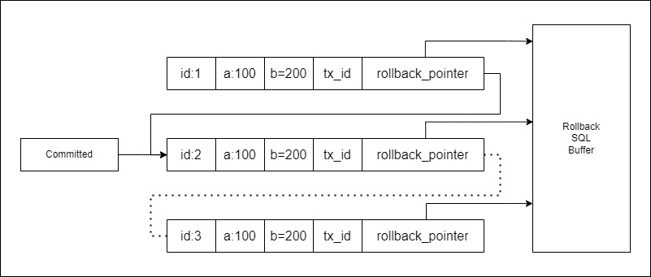
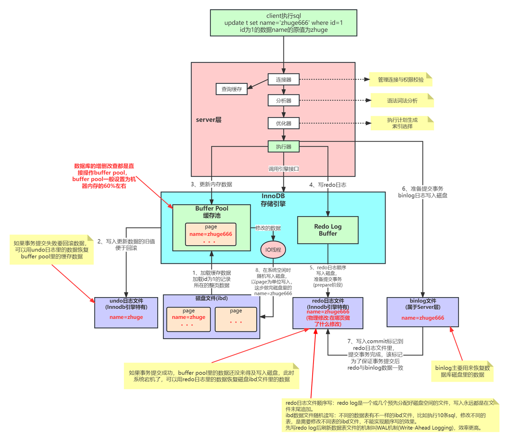

# MySQL事务原理与优化最佳实践

## 事务概况

**什么是事务？**事务是数据库中一个重要概念，一组操作要么全部成功，要么全部失败，最终目的就是保证数据的一致性，从上面这段描述就能看出事务的四大特点，简称ACID：

1. **原子性（Atomicity）**：一组操作被纳入一个事务中就具有了原子性，要么同时执行成功，要么同时执行失败。原子性是由**undo log日志**来实现的。
2. **一致性（Consistency）**：这是使用事务的最终目的，由其他三个特性及其对应的业务代码正确逻辑来实现。
3. **隔离性（Isolation）**：当有多个事务并发执行时，它们内部的操作不能对其他事务进行干扰，隔离性是由MySQL的各种**锁**以及**MVCC机制**来保证的。
4. **持久性（Durability）**：一旦提交了事务，对数据库的改变就是永久的，即磁盘本地化。持久性是由**redo log日志**来实现的。

在上面四个特点中，最值得深究的就是事务的隔离性，隔离性解决的主要问题就是事务并发，事务并发可能会导致以下四种情况：

1. **脏写（Dirty Write）**：当多个事务选择修改同一行数据时，可能会发生更新丢失的问题，即最后提交（或回滚）的事务更新覆盖了之前提交的事务更新。

   ```mermaid
   sequenceDiagram
       participant A as 事务 A
       participant DB as 数据库
       participant B as 事务 B
   
       A->>DB: 读取数据 (value = 10)
       B->>DB: 读取数据 (value = 10)
       
       A->>DB: 修改数据 (value = 20)
       A->>DB: 提交事务 (commit)
       
       B->>DB: 修改数据 (value = 30)
       B->>DB: 提交事务 (commit)
       
       DB->>A: 更新丢失 (value = 30)
       DB->>B: 最终数据被覆盖 (value = 30)
   ```

2. **脏读（Dirty Reads）**：事务A读取到了事务B已经修改但尚未提交的数据。

   ```mermaid
   sequenceDiagram
       participant A as 事务 A
       participant DB as 数据库
       participant B as 事务 B
   
       B->>DB: 修改数据 (value = 20)
       A->>DB: 读取数据 (value = 20)  -- 脏读
       B->>DB: 回滚修改 (rollback)
       
       DB->>A: 数据被撤销 (value = 10)
   ```

3. **不可重复读（Non-Repeatable Reads）**：事务A内部相同的查询语句在不同时刻读出来的结果不一致。

   ```mermaid
   sequenceDiagram
       participant A as 事务 A
       participant DB as 数据库
       participant B as 事务 B
   
       A->>DB: 读取数据 (value = 10)
       B->>DB: 修改数据 (value = 20)
       B->>DB: 提交事务 (commit)
       A->>DB: 再次读取数据 (value = 20)
       
       DB->>A: 结果不一致 (第一次读取 10, 第二次读取 20)
   ```

4. **幻读（Phantom Reads）**：事务A中读取到了事务B所提交的新增数据。

   ```mermaid
   sequenceDiagram
       participant A as 事务 A
       participant DB as 数据库
       participant B as 事务 B
   
       A->>DB: 读取数据集 (values = [10, 20])
       B->>DB: 插入新数据 (value = 30)
       B->>DB: 提交事务 (commit)
       A->>DB: 再次读取数据集 (values = [10, 20, 30])
       
       DB->>A: 结果不一致 (第一次读取 [10, 20], 第二次读取 [10, 20, 30])
   ```

为了解决或者部分解决以上四种情况，InnoDB引擎中定义了四种隔离级别，从上往下隔离性是从第到高的：

- **Read Uncommit（读未提交）**

  该隔离级别是四种级别中隔离性最弱的，针对上面四种情况都无法解决。

  见名知意，A事务可以读取到B事务中没有提交的修改数据，即天然**会出现脏读**；

  当A事务将N值从10修改成20，但未提交（无论是否提交），B事务读取N值都会是20，再对其进行修改也是在20的基础上进行修改，所以**不会出现脏写**，但是这是由于脏读导致的；

  当A事务第一次读取N值为10，但未提交（无论是否提交），在其第二次读取N值之前，B事务修改N值为20，无论是否提交，当A事务再一次读取时N值就变成了20，即**会出现不可重复读**；

  当A事务读取N表为[10,20]，但未提交（无论是否提交），B事务在N表新增数据M值30，也未提交，A事务再次读取N表结果为[10,20,30]，即**会出现幻读**。

- ==**Read Commit（读已提交）**==

  该隔离级别是最常用的隔离级别之一，它是Oracle数据库默认的事务隔离级别。

  又是见名知意，A事务可以读取到B事务中已经提交的修改数据，但是不能读取没有提交的修改数据，所以**不会出现脏读**；

  当A事务将N值从10修改成20，但未提交，B事务读取N值只会是10，再对其进行修改成30并且马上提交，随后A事务再提交，那么A事务中20这个结果就把B事务中30这个结果覆盖了，所以**会出现脏写**；

  当A事务第一次读取N值为10，但未提交，在其第二次读取N值之前，B事务修改N值为20，并且马上提交，当A事务再一次读取时N值就变成了20，即**会出现不可重复读**；

  当A事务读取N表为[10,20]，但未提交，B事务在N表新增数据M值30，并且马上提交，A事务再次读取N表结果为[10,20,30]，即**会出现幻读**。

- ==**Repeatable Read（可重复读）**==

  该隔离级别是最常用的隔离级别之一，它是MySQL数据库默认的事务隔离级别，同时也是最复杂的隔离级别，在讨论它之前需要额外弄清楚一些概念：

  - **快照读**：针对Repeatable Read（可重复读）这种隔离级别，在它其中执行的SELECT操作针对的是数据库历史版本，也就是所谓的快照，但它并不是以时间为唯一记录标准的，通常来说当时事务开启那一刻就形成了一个库快照，这里命名为A快照，在事务中没执行INSERT、UPDATE以及DELETE等修改操作之前的SELECT操作都是读取A快照的数据，这里假设读取N值为10，M值为20，但是一旦发生了修改操作，比如把N值修改成30，就会在被修改的记录上形成一个或者一组行快照，这里命名为B快照，随即B快照会覆盖A快照上的对应行记录，最后形成一个C快照，此时N值为30，M值为20，这个C快照就会成为最新的查询参考历史版本。这里值得注意的是，上面所提到的所有修改操作都没有生效，因为整个事务还没有提交。
  - **当前读**：针对Repeatable Read（可重复读）这种隔离级别，当前读是对上面快照读的一种补充说明，因为在快照读中提到的修改操作本质也是会读取数据库数据的，此时修改操作中读取的是数据库的实时最新数据，即修改操作是基于数据库最新数据进行的，当然就包括其他事务提交的数据。

  下面使用时序图进一步形象说明：

  ```mermaid
  sequenceDiagram
      participant A as 事务 A
      participant DB as 数据库初始化[N=10,M=20]
      participant B as 事务 B
      participant C as 语句 C
  
      A->>DB: 开启事务形成A1快照[N=10,M=20]<br>并读取数据 ==> 【快照读】
      DB-->>A: 实际返回N=10,M=20
      B->>DB: 开启事务形成A2快照[N=10,M=20]<br>并读取数据 ==> 【快照读】
      DB-->>B: 实际返回N=10,M=20
      C->>DB: 修改N值为30<br>此时数据库真实数据为[N=30,M=20]
      A->>DB: 修改N值为N+30 ==> 【当前读】<br>形成B1快照[N=60,M=20]
      B->>DB: 读取数据 ==> 【快照读】<br>此时依旧返回A2快照数据
      DB-->>B: 实际返回N=10,M=20
      A->>DB: 读取数据 ==> 【快照读】<br>此时返回B1快照数据
      DB-->>A: 实际返回N=60，M=20
      B->>DB: 提交事务<br>此时数据库真实数据为[N=30,M=20]
      A->>DB: 提交事务<br>此时数据库真实数据为[N=60,M=20]
  ```

  请详细理解上面的概念之后再尝试思考四种并发情况在Repeatable Read（可重复读）隔离级别中的展现形式。

  A事务可以读取到B事务中已经提交的修改数据，但是不能读取没有提交的修改数据，所以**不会出现脏读**；

  当A事务将N值从10修改成20，但未提交，B事务读取N值只会是10，再对其进行修改成30并且马上提交，随后A事务再提交，那么A事务中20这个结果就把B事务中30这个结果覆盖了，所以**会出现脏写**；

  当A事务第一次读取N值为10，但未提交，在其第二次读取N值之前，B事务修改N值为20，并且马上提交，当A事务再一次读取时会进行快照读，由于和第一次读取操作之间没有修改操作，所以读取的数据和第一次一样，N值为10，即**不会出现不可重复读**；

  对于幻读，有人说可重复读解决了幻读，但是有人说没有解决幻读：

  1. 解决了幻读：当A事务读取N表为[a=10,b=20]，但未提交，B事务在N表新增数据c值30，并且马上提交，A事务再次快照读，读取N表结果为[a=10,b=20]，即**不会出现幻读**。
  2. 没有解决幻读：当A事务读取N表为[a=10,b=20]，但未提交，B事务在N表新增数据c值30，并且马上提交，A事务再次*快照读*，读取N表结果为[a=10,b=20]，然后A事务再把c值修改成60，此时数据库会显示影响一行记录，表明修改操作*当前读*生效，即**会出现幻读**。

  普遍来说，业内现在还是认可可重复读会出现幻读现象，并没有根本被解决。

- **Serializable（串行化）**

  该隔离级别是最严格的隔离级别，它可以解决所有并发问题，即谁先开启事务，谁就先执行，谁就先提交，其他事务阻塞等待，所以这里不用说明上面四种并发情况，因为根本就不会出现并发，而且这种隔离级别会导致严重的性能问题，无法支持大数据量的读写。

从上面的描述来看最常用的Read Commit（读已提交）和Repeatable Read（可重复读）都会出现脏写问题，针对不同的隔离级别都有不同的方案，方案就基于一个原则，即只要修改操作中读取的数据一直是数据库的最新数据，那么修改之后就会是最新的：

- **Read Commit（读已提交）处理脏写问题**：

  借助CAS乐观锁，以查询版本号的形式进行辅助读取并修改数据库中最新记录。

- **Repeatable Read（可重复读）处理脏写问题**：

  1、借助CAS乐观锁，以查询版本号的形式进行辅助读取并修改数据库中最新记录。

  2、借助操作中当前读的特性，每次修改数值时让MySQL自己去计算实现，这里说明一下：当A事务中查询到N值为10，如果想给N值更新成20，那么不要在Java中构造类似`update table set n = 20`这样的语句，而是构造类似`update table set n = n + 10`这样的语句避免覆盖其他已经提交的结果。

其实这里的脏写只考虑了因事务成功提交先后结果冲突的情况，其实还有一种情况是其中某个事务失败回滚而导致其他事务结果失效的情况，但是这种情况仅会在Read Uncommitted（读未提交）隔离级别中存在，其他隔离级别MySQL都会有默认使用锁的方案，所以这个情况就不做讨论。

最后归纳一下：

| 隔离级别 | 脏写（更新丢失） | 脏读   | 不可重复读 | 幻读   |
| -------- | ---------------- | ------ | ---------- | ------ |
| 读未提交 | 不可能           | 可能   | 可能       | 可能   |
| 读已提交 | 可能             | 不可能 | 可能       | 可能   |
| 可重复读 | 可能             | 不可能 | 不可能     | 可能   |
| 串行化   | 不可能           | 不可能 | 不可能     | 不可能 |

**查询操作方法需要使用事务吗？**

这个问题需要看实际业务情况是否允许重复读，如果事务隔离级别是Read Commit（读已提交），那么查询方法上是否使用事务都不影响查询的结果，因为该级别会发生不可重复读的情况，一旦读取数据，都是读之前所有事务已经提交的数据；如果事务隔离级别是Repeatable Read（可重复读），那么就建议加上读事务（readOnly=true），因为该级别可重复读，即事务内读取数据是快照读，这就保证了数据在时间维度上的一致性，如果不用事务，那么就和Read Commit（读已提交）没什么本质区别。

## MVCC机制对事务的影响

上面说到最常用的Read Commit（读已提交）和Repeatable Read（可重复读）隔离级别非常重要，它们底层实现的原理是基于**MVCC（Multi-Version Concurrency Control）机制，即多版本并发控制**，这个机制在之后的章节中会有着重讨论，但是这里只是说明一下其对事务的影响。

见名知意，MVCC是基于多版本的特性去控制并发，它可以做到读写不阻塞，且避免了类似脏读这样的问题。底层主要通过undo log日志链去实现的。

undo log日志链中包含了被修改的数据记录信息以及其对应的事务ID、回滚指针以及回滚语句，此外还有一个提交指针，示意图（在后面的章节中会看到这个图片的详细版本）如下：



上述图例就表示有三个事务，每个事务都只去修改了一下id值，并且图示情况只提交了两个事务，正在执行第三个事务，每个事务无论是否提交都会在undo log日志中生成一条能够还原当前事务操作的SQL语句，假设第三个事务需要回滚，那么就由rollback_pointer指针从undo log日志中找到对应的反SQL语句进行执行即可，注意这个日志链在长时间不接收事务的情况下会被销毁。

## 事务持久性

下图是MySQL执行的一个详细流程图，这里只讨论和持久性相关的部分。MySQL引入了redo log，Buffer Pool内存写完了，然后会写一份redo log文件。即便MySQL在突然挂了，还可以根据redo log来对数据进行恢复。redo log通常被看作只有一个文件，生成日志就是在文件末尾追加数据，是顺序写的，写入速度很快。并且它记录的是物理修改（某某某页做了某某某修改），文件的体积很小，恢复速度也很快。



## 大事务的影响

1、大事务通常意味着长时间占用连接，但数据库连接池有限，高并发情况下连接池就容易被撑爆；

2、大事务通常涉及的记录数量会很大，执行的时候会锁定太多的数据，造成大量的阻塞和锁超时；

3、在主从复制的环境下，大事务执行时间长，容易造成主从延迟；

4、大事务通常回滚所需要的时间比较长；

5、大事务存在时间通常会很长，在高并发情况下，undo log日志会急剧膨胀；

6、容易导致死锁。

## 事务优化

1、将查询等数据准备操作放到事务外；

2、事务中避免远程调用，远程调用要设置超时，防止事务等待时间太久；

3、事务中避免一次性处理太多数据，可以拆分成多个事务分次处理；

4、更新等涉及加锁的操作尽可能放在事务靠后的位置；

5、能异步处理的尽量异步处理；

6、应用侧（业务代码）保证数据一致性，非事务执行（优化而已，实际情况下不会采用，因为一旦涉及到回滚操作，就需要自己写代码）。
