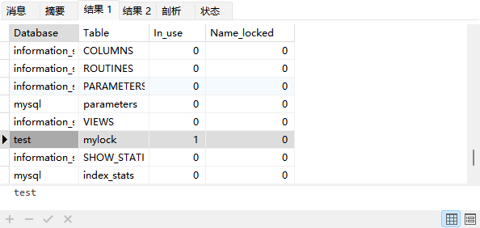
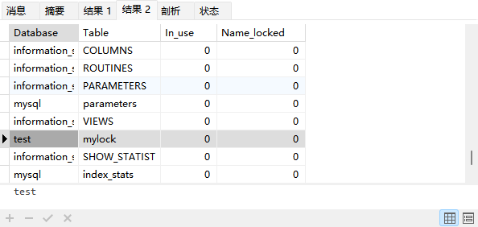

# MySQL锁机制与优化实践以及MVCC底层原理剖析

## 锁机制详解

锁就是计算机中协调多个进程或者线程并发访问某一资源的机制，在数据库中如何保持数据并发访问的一致性和有效性是必须解决的一个问题，锁冲突也是影响数据库并发访问性能的一个重要因素。

### 锁的分类

1、从性能上被分为**乐观锁（CAS机制）**和**悲观锁**，乐观锁适合读操作比较多的场景，而悲观锁就适合写操作比较多的场景。这里特别提一下，如果在写比较多的场景下使用乐观锁，性能效果很可能会事倍功半，因为乐观锁主要还是依靠版本字段（version）去判断当前修改操作是否是最新记录，如果写比较多，那么就很可能导致当前修改操作始终不是最新记录，进而引发多次尝试修改，降低效率。

2、从对数据操作粒度分为**表锁**、页锁和**行锁**。

3、从对数据库操作的类型分为**读锁**和**写锁**，两者都属于悲观锁，此外还有意向锁。

接下来就将上面某些锁进行逐一说明或者分析。

### 表锁、行锁和页锁

#### 表锁

每次操作会锁住整张表，其他对于该表的操作都会被阻塞。表锁相对来说开销小，加锁快（相对行锁，不用去扫描确定具体行位置），不会出现死锁现象。但是由于上锁粒度大，发生锁冲突的概率是最高的，并发度也是最低的，在整张表数据迁移的场景下会主动使用表锁。表锁的操作SQL如下：

```sql
# 在当前会话中给表加读锁（读锁后续会讨论）
LOCK TABLE `表名` READ;
# 在当前会话中给表加写锁（写锁后续会讨论）
LOCK TABLE `表名` WRITE;
# 在当前会话中给多张表加读、写锁
LOCK TABLE `表名1` READ, `表名2` WRITE;
# 给当前会话加的表锁全部解开
UNLOCK TABLES;
```

示例如下：

```sql
# 建表SQL
CREATE TABLE `mylock` ( 
	`id` INT NOT NULL AUTO_INCREMENT, 
	`NAME` VARCHAR(20) DEFAULT NULL, 
    PRIMARY KEY (`id`)
) 
ENGINE = MyISAM DEFAULT CHARSET = utf8;

# 在当前会话中写锁
LOCK TABLE `mylock` WRITE;

# 在当前会话中插入一条数据（成功插入）
INSERT INTO `mylock` (`id`,`name`) VALUES (`1`,`antony`);

# 查询当前数据库中表的锁状态
SHOW OPEN TABLES;

# 在当前会话中解锁
UNLOCK TABLES;

# 再次查询当前数据库中表的锁状态
SHOW OPEN TABLES;
```

上面两次查询结果如下：





#### 页锁

**只有BDB存储引擎支持页锁**，页锁就是在数据页的粒度上进行锁定，可以把这个数据页理解成索引B+树中每个叶子节点中的数据页，这么看来，页锁比行锁锁定的数据资源要多，但是比表锁少，页锁开销也就介于行锁和表锁之间，所以也会出现死锁。并发度也一般。

#### 行锁（⭐）

行锁在实际业务开发过程中最常见的，它相对表锁来说开销大，加锁慢，同时会出现死锁现象。因为锁定粒度最小，所以发生所冲突的概率最低，并发度也是最高的。

InnoDB引擎对比Myisam引擎两大不同点就是：InnoDB支持事务以及InnoDB支持行锁，但是一定要注意InnoDB引擎中的行锁实际上是针对索引树加的锁，即在索引对应的索引项上做标识，并不是对表整行记录加锁。

### 读锁、写锁和意向锁

#### 读锁

读锁也被称为共享锁（**S**hared，S锁），针对同一条数据，多个读操作可以同时进行互不受影响，但是无法对该数据进行写操作，具体加锁SQL语句如下：

```sql
SELECT * FROM T WHERE id=1 LOCK IN SHARE MODE;
```

#### 写锁

写锁也被称为排它锁（e**X**clusive，X锁），一般是指当前写操作没有完成之前，会阻塞其他写操作和读操作。在MySQL中，数据修改操作都会加写锁，查询操作也可以通过如下SQL语句加写锁：

```sql
SELECT * FROM T WHERE id=1 FOR UPDATE;
```

读操作被加写锁和写操作被加写锁效果是一样的。

#### 意向锁

意向锁（Intention Lock）主要针对表锁，由于表锁在实际业务使用较少，所以这个可以当作一个概念进行了解，意向锁主要为了提高加表锁的效率，是MySQL数据库自有的特性。当有事务给表中的数据加了写锁或者读锁时，同时会给表设置一个意向标识，表示该表已经有了行锁，其他事务想要对表加表锁时就不用逐行扫描是否存在行锁与表锁冲突，而是直接读取这个标识就可以确定自己是否加表锁。特别是表中记录特别多的时候，逐行判断加表锁的方式效率会很低，这个意向标识就是意向锁。意向锁也被分为意向共享锁和意向排它锁，分别针对对整个表加共享锁或排它锁前的锁冲突判断。