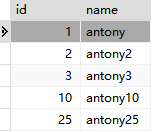
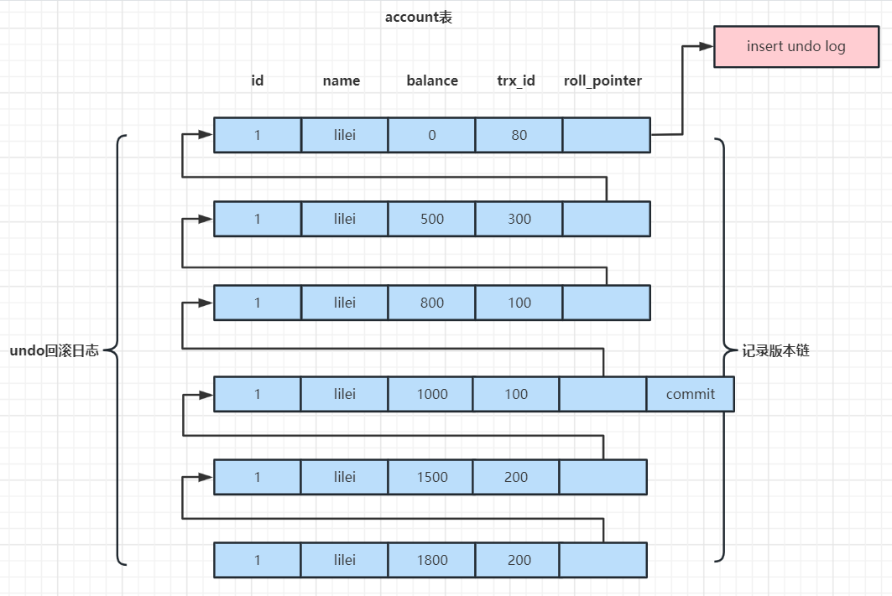
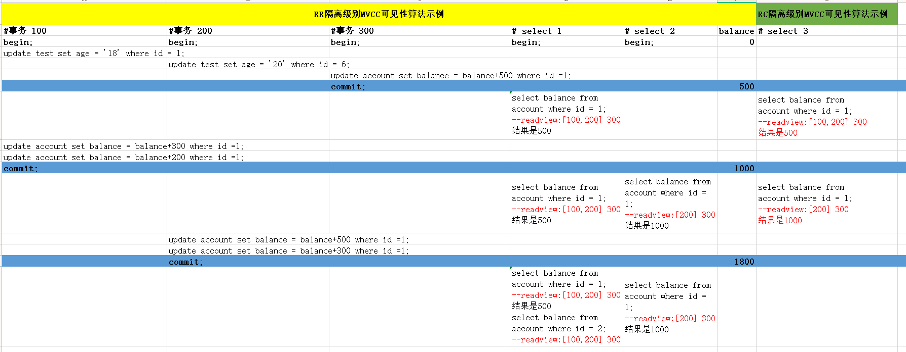

# MySQL锁机制与优化实践以及MVCC底层原理剖析

## 锁机制详解

锁就是计算机中协调多个进程或者线程并发访问某一资源的机制，在数据库中如何保持数据并发访问的一致性和有效性是必须解决的一个问题，锁冲突也是影响数据库并发访问性能的一个重要因素。

### 锁的分类

1、从性能上被分为**乐观锁（CAS机制）**和**悲观锁**，乐观锁适合读操作比较多的场景，而悲观锁就适合写操作比较多的场景。这里特别提一下，如果在写比较多的场景下使用乐观锁，性能效果很可能会事倍功半，因为乐观锁主要还是依靠版本字段（version）去判断当前修改操作是否是最新记录，如果写比较多，那么就很可能导致当前修改操作始终不是最新记录，进而引发多次尝试修改，降低效率。

2、从对数据操作粒度分为**表锁**、页锁和**行锁**。

3、从对数据库操作的类型分为**读锁**和**写锁**，两者都属于悲观锁，此外还有意向锁。

接下来就将上面某些锁进行逐一说明或者分析。

### 表锁、行锁和页锁

#### 前置数据准备

```sql
# 建表SQL
CREATE TABLE `mylock` ( 
	`id` INT NOT NULL AUTO_INCREMENT, 
	`name` VARCHAR(20) DEFAULT NULL, 
    PRIMARY KEY (`id`)
) 
ENGINE = InnoDB DEFAULT CHARSET = utf8;
```

#### 表锁

每次操作会锁住整张表，其他对于该表的操作都会被阻塞。表锁相对来说开销小，加锁快（相对行锁，不用去扫描确定具体行位置），不会出现死锁现象。但是由于上锁粒度大，发生锁冲突的概率是最高的，并发度也是最低的，在整张表数据迁移的场景下会主动使用表锁。表锁的操作SQL如下：

```sql
# 在当前会话中给表加读锁（读锁后续会讨论）
LOCK TABLE `表名` READ;
# 在当前会话中给表加写锁（写锁后续会讨论）
LOCK TABLE `表名` WRITE;
# 在当前会话中给多张表加读、写锁
LOCK TABLE `表名1` READ, `表名2` WRITE;
# 给当前会话加的表锁全部解开
UNLOCK TABLES;
```

示例如下：

```sql
# 在当前会话中写锁
LOCK TABLE `mylock` WRITE;

# 在当前会话中插入一条数据（成功插入）
INSERT INTO `mylock` (`id`,`name`) VALUES (`1`,`antony`);

# 查询当前数据库中表的锁状态
SHOW OPEN TABLES;

# 在当前会话中解锁
UNLOCK TABLES;

# 再次查询当前数据库中表的锁状态
SHOW OPEN TABLES;
```

上面两次查询结果如下：


#### 页锁

**只有BDB存储引擎支持页锁**，页锁就是在数据页的粒度上进行锁定，可以把这个数据页理解成索引B+树中每个叶子节点中的数据页，这么看来，页锁比行锁锁定的数据资源要多，但是比表锁少，页锁开销也就介于行锁和表锁之间，所以也会出现死锁。并发度也一般。

#### 行锁（⭐）

行锁在实际业务开发过程中最常见的，它相对表锁来说开销大，加锁慢，同时会出现死锁现象。因为锁定粒度最小，所以发生所冲突的概率最低，并发度也是最高的。

InnoDB引擎对比MyISAM引擎两大不同点就是：InnoDB支持事务以及InnoDB支持行锁，但是一定要注意InnoDB引擎中的行锁实际上是根据条件针对索引树加的锁，即在索引对应的索引项上做标识，并不是对表整行记录加锁。下面这个是**针对Repeatable Read（可重复读）隔离级别提出的一种特殊情况：如果条件无法走索引，那么会从加行锁升级为加表锁**，怎么理解呢？请看下面这个示例：

```sql
BEGIN;
# FOR UPDATE会强制给查询操作上一把读锁
SELECT * FROM mylock WHERE `id` = 1 FOR UPDATE;
COMMIT;
```

这个SQL语句由于走了索引（主键索引），无论MySQL版本如何，都会上行锁，在事务提交之前其他事务对该条记录无法进行任何操作，但是可以对表中其他记录进行操作，再对比下面这个示例：

```sql
BEGIN;
# FOR UPDATE会强制给查询上一把读锁
SELECT * FROM mylock WHERE `name` = 'antony' FOR UPDATE;
COMMIT;
```

由于这条SQL语句进行全表扫描，没有走索引，那么在Repeatable Read（可重复读）隔离级别中，它就会把行锁升级为表锁，即在事务提交之前其他事务对表中所有记录都无法进行操作。

**为什么Repeatable Read（可重复读）隔离级别行锁会被升级为表锁呢？**

因为在Repeatable Read（可重复读）隔离级别下，需要解决不可重复读和幻读问题，所以在遍历扫描聚集索引记录时，为了防止扫描过的索引被其它事务修改（不可重复读问题）或间隙被其它事务插入记录（幻读问题），从而导致数据不一致，所以MySQL的解决方案就是把所有扫描过的索引记录和间隙都锁上（这里说的是间隙锁，还有一个临键锁，这两种锁下面会讨论到），这里要注意，并不是直接将整张表加表锁，因为不一定能加上表锁，可能会有其它事务锁住了表里的其它行记录。

**什么是间隙锁？什么是临键锁？**

由于MySQL 8对于间隙锁进行了优化，下面先以MySQL 5.7版本为例对两种锁进行解释，然后再针对MySQL 8优化点进行说明。

间隙锁，顾名思义就是对两个值之间的间隙上锁，要注意间隙锁只会在Repeatable Read（可重复读）隔离级别中走索引的情况下生效。主要是为了尽可能解决幻读问题，假设表中数据如下：



id列是主键索引，所以明显所谓的间隙就是id值为（3,10），（10,25），（25，无穷大）这三个**开区间**，即如果在A会话中执行以下SQL语句：

```sql
SELECT * FROM `mylock` WHERE id = 20 FOR UPDATE;
```

那么MySQL会在（10，25）这个数据范围进行加锁，其他会话操作在有锁情况下被阻塞。

临键锁是行锁和间隙锁的一种组合，也只会在Repeatable Read（可重复读）隔离级别中走索引的情况下生效，一般出现在范围查询中，即如果A会话中执行以下SQL语句：

```sql
SELECT * FROM `mylock` WHERE id >= 3 AND id <= 25 FOR UPDATE;
```

此时被锁住的范围是 [3，10]，（10，25] 这样的**半开半闭或者半闭区间**，这种锁就叫临键锁。

以上都是MySQL 5.7版本中会出现的情况，但是在MySQL 8版本中对其进行了优化：

- 在MySQL 8默认的事务隔离级别 **可重复读（REPEATABLE READ）**中：
  - **间隙锁的使用场景减少**：在 `SELECT ... FOR UPDATE`、`DELETE`、`INSERT` 或 `UPDATE` 的操作中，InnoDB 会尽量只加行锁，而不是加间隙锁，**除非明确有必要防止幻读**。
  - **自动间隙锁减少**：在范围查询的情况下，如果 InnoDB 可以明确确定查询结果不涉及幻读，则不会加间隙锁。例如，对一个唯一索引的等值查询（即使是范围查询）不会再加间隙锁。
- MySQL 8中引入了 **隐式锁** 和 **临时锁优化**，进一步减少不必要的间隙锁，提升并发性能。

一定要注意，MySQL 8并不是不使用间隙锁或者临键锁，而是先会对查询情况进行优化，迫不得已的情况下才使用间隙锁或者临键锁。

#### 总结

InnoDB存储引擎由于实现了行级锁定，虽然在锁定机制的实现方面所带来的性能损耗可能比表级锁定会要更高一下，但是在整体并发处理能力方面要远远优于MYISAM的表级锁定的。当系统并发量高的时候，InnoDB的整体性能和MYISAM相比就会有比较明显的优势了。

但是，InnoDB的行级锁定同样也有其脆弱的一面，当我们使用不当的时候，可能会让InnoDB的整体性能表现不仅不能比MYISAM高，甚至可能会更差。

### 读锁、写锁和意向锁

#### 读锁

读锁也被称为共享锁（**S**hared，S锁），针对同一条数据，多个读操作可以同时进行互不受影响，但是无法对该数据进行写操作，具体加锁SQL语句如下：

```sql
SELECT * FROM T WHERE id=1 LOCK IN SHARE MODE;
```

#### 写锁

写锁也被称为排它锁（e**X**clusive，X锁），一般是指当前写操作没有完成之前，会阻塞其他写操作和读操作。在MySQL中，数据修改操作都会加写锁，查询操作也可以通过如下SQL语句加写锁：

```sql
SELECT * FROM T WHERE id=1 FOR UPDATE;
```

读操作被加写锁和写操作被加写锁效果是一样的。

#### 意向锁

意向锁（Intention Lock）主要针对表锁，由于表锁在实际业务使用较少，所以这个可以当作一个概念进行了解，意向锁主要为了提高加表锁的效率，是MySQL数据库自有的特性。当有事务给表中的数据加了写锁或者读锁时，同时会给表设置一个意向标识，表示该表已经有了行锁，其他事务想要对表加表锁时就不用逐行扫描是否存在行锁与表锁冲突，而是直接读取这个标识就可以确定自己是否加表锁。特别是表中记录特别多的时候，逐行判断加表锁的方式效率会很低，这个意向标识就是意向锁。意向锁也被分为意向共享锁和意向排它锁，分别针对对整个表加共享锁或排它锁前的锁冲突判断。

#### 总结

MyISAM在执行查询语句SELECT前，会自动给涉及的所有表加读锁，在执行update、insert、delete操作会自动给涉及的表加写锁。

InnoDB在执行查询语句SELECT时（非串行隔离级别），默认不会加锁（也可以手动加）。但是update、insert、delete操作会加行锁。

另外，读锁会阻塞写，但是不会阻塞读。而写锁则会把读和写都阻塞。

### 锁等待分析

1、通过检查InnoDB_row_lock状态变量来分析系统上的行锁的争夺情况：

```sql
SHOW STATUS LIKE 'innodb_row_lock%';

# 对各个状态量的说明如下：
# Innodb_row_lock_current_waits: 当前正在等待锁定的数量
# Innodb_row_lock_time: 从系统启动到现在锁定总时间长度（重要）
# Innodb_row_lock_time_avg: 每次等待所花平均时间（重要）
# Innodb_row_lock_time_max：从系统启动到现在等待最长的一次所花时间
# Innodb_row_lock_waits: 系统启动后到现在总共等待的次数（重要）
```

尤其是当等待次数很高，而且每次等待时长也不小的时候，我们就需要分析系统中为什么会有如此多的等待，然后根据分析结果着手制定优化计划。

2、查看INFORMATION_SCHEMA系统库锁相关数据表：

```sql
# 查看事务
SELECT * FROM INFORMATION_SCHEMA.INNODB_TRX;
# 查看锁，MySQL 5.7需要换成这张表INFORMATION_SCHEMA.INNODB_LOCKS
SELECT * FROM PERFORMANCE_SCHEMA.DATA_LOCKS;
# 查看锁等待，MySQL 5.7需要换成这张表INFORMATION_SCHEMA.INNODB_LOCK_WAITS
SELECT * FROM PERFORMANCE_SCHEMA.DATA_LOCK_WAITS;
# 释放锁，trx_mysql_thread_id可以从INNODB_TRX表里查看到
KILL trx_mysql_thread_id
```

### 死锁问题分析

死锁现象复现：

```sql
SET SESSION TRANSACTION ISOLATION LEVEL REPEATABLE READ;
# Session_1执行：
SELECT * FROM `mylock` WHERE id=1 FOR UPDATE;
# Session_2执行：
SELECT * FROM `mylock` WHERE id=2 FOR UPDATE;
# Session_1执行：
SELECT * FROM `mylock` WHERE id=2 FOR UPDATE;
# Session_2执行：
SELECT * FROM `mylock` WHERE id=1 FOR UPDATE;
# 查看近期死锁日志信息：
SHOW ENGINE INNODB STATUS;
```

大多数情况MySQL可以自动检测死锁并回滚产生死锁的那个事务，但是有些情况MySQL没法自动检测死锁，这种情况我们可以通过日志分析找到对应事务线程id，可以通过KILL杀掉。

**锁优化实践：**

- 尽可能让所有数据检索都通过索引来完成，避免无索引行锁升级为表锁；
- 合理设计索引，尽量缩小锁的范围；
- 尽可能减少检索条件范围，避免间隙锁；
- 尽量控制事务大小，减少锁定资源量和时间长度，涉及事务加锁的SQL尽量放在事务最后执行；
- 尽可能用低的事务隔离级别。

## MVCC机制详解

MVCC（Multi-Version Concurrency Control）机制，即多版本并发控制机制，在上一章节中有讨论过MVCC机制对Read Commit（读已提交）和Repeatable Read（可重复读）两种隔离级别事务的影响，接下来还是以这两种隔离级别为例进行该机制运行逻辑的具体叙述。

首先需要了解两个概念：

1. **undo log日志版本链**

   这个在上一章中有一个示意简图，但是接下来会有一张更为具体的图片搭配讨论，其实数据库中每一条记录都会包含trx_id和roll_pointer两个隐藏字段，前者用来标识该条记录的事务ID，后者用来指向undo log日志中针对记录修改操作的反SQL语句。而**undo log日志版本链就是由这一条条包含在事务中的修改操作完成后的记录按照时间顺序一依次接构成的**，下面有一张详细一点的示例示意图，待会儿会结合这张图讨论MVCC机制运行过程。

   

2. **read view一致性视图**

   在Repeatable Read（可重复读）隔离级别中，当事务开启后，执行任意一条查询SQL语句时都会产生当前事务的一致性视图read-view，**该视图在事务结束前一直不会改变**。**这个视图由执行查询SQL语句时所有未提交事务ID数组（MySQL中事务ID是递增的，数组中最小事务ID为min_id）和已经创建的最大事务ID（max_id）组成**。事务里的任何查询结果都需要从对应undo log日志版本链里的最新数据开始跟read-view做对比，进而获得最终的快照结果。

   在Read Commit（读已提交）隔离级别中，对比Repeatable Read（可重复读），区别就在于**每执行一条查询SQL语句就会根据当前最新数据生成一个全新的一致性视图**。

   至于怎么做对比呢？下面就会分情况来描述，最后得到的结果就是版本链中数据是否可见，所以对比过程也叫**可见性算法**：

   1、如果被对比日志版本行满足trx_id < min_id，表示这个版本是已提交的事务生成的，这个数据是可见的；

   2、如果被对比日志版本行满足trx_id > max_id，表示这个版本是之后启动的事务生成的，这个数据是不可见的；

   3、如果被对比日志版本行满足min_id <= trx_id <= max_id，就要又要分以下三种：

   （1）如果trx_id就是当前事务ID，则这个数据是可见的。

   （2）如果trx_id在read-view视图的未提交事务ID数组中，则这个数据是不可见的；

   （3）如果trx_id不在read-view视图的未提交事务ID数组中，则这个数据是可见的。

接下来根据undo log日志版本链中的图，下图中表格时序图能说明上述问题：



对于删除的情况可以认为是update的特殊情况，会将版本链上最新的数据复制一份，然后将trx_id修改成删除操作的trx_id，同时在该条记录的头信息（record header）里的（deleted_flag）标记位写上true，来表示当前记录已经被删除，在查询时按照上面的规则查到对应的记录如果delete_flag标记位为true，意味着记录已被删除，则不返回数据。

**关于read view一致性视图和可见性算法的总结：**

readview和可见性算法其实就是记录了sql查询那个时刻数据库里提交和未提交所有事务的状态。

要实现RR隔离级别，事务里每次执行查询操作readview都是使用第一次查询时生成的readview，也就是都是以第一次查询时当时数据库里所有事务提交状态来比对数据是否可见，当然可以实现每次查询的可重复读的效果了。

要实现RC隔离级别，事务里每次执行查询操作readview都会按照数据库当前状态重新生成readview，也就是每次查询都是跟数据库里当前所有事务提交状态来比对数据是否可见，当然实现的就是每次都能查到已提交的最新数据效果了。

**注意：**

begin/start transaction 命令并不是一个事务的起点，在执行到它们之后的第一个修改操作或加排它锁操作(比如select...for update)的语句，事务才真正启动，才会向mysql申请真正的事务id，mysql内部是严格按照事务的启动顺序来分配事务id的。