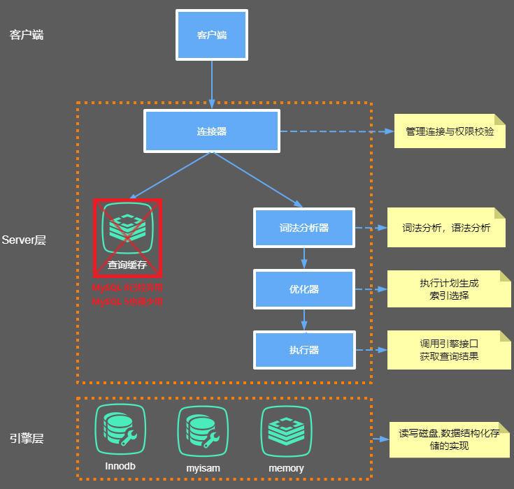
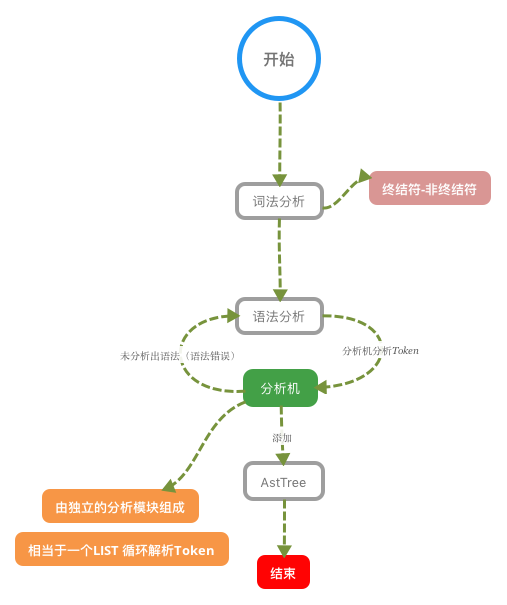
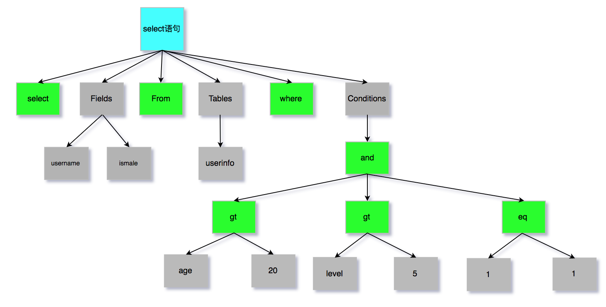
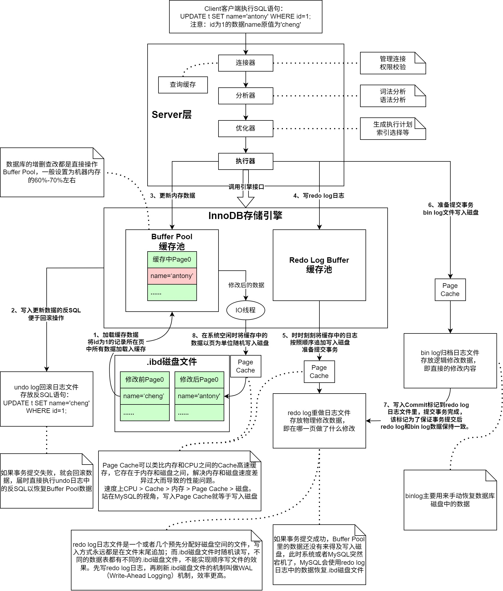
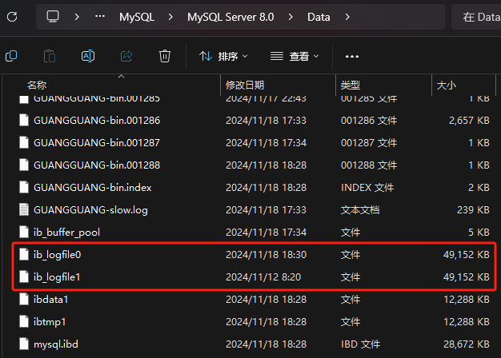
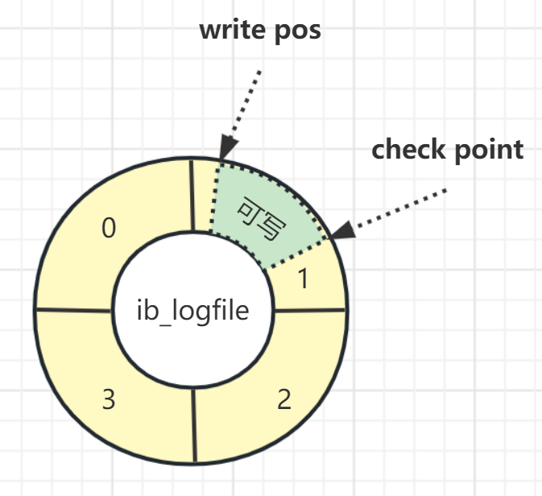
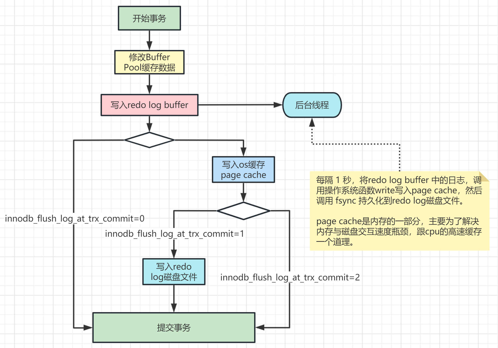
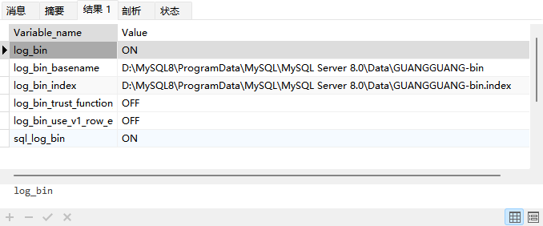
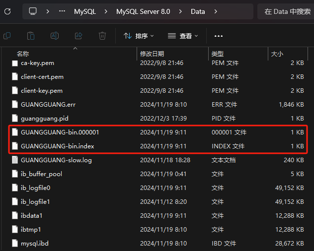

# InnoDB底层原理与MySQL日志机制深入剖析

## MySQL的内部组件结构

下面给出了MySQL中大致的内部组件结构，主要包括Server层以及引擎层两部分：



**Server层：**

该层主要包括连接器、查询缓存（可以忽略）、分析器、优化器以及执行器等。它们涵盖了MySQL的大多数核心服务功能，以及所有的内置函数（包括日期、时间、数学和加密等），所有存储引擎的公共功能都在这一层实现，比如存储过程、触发器以及视图等。**其实Server层中这些主要组件就是狭义上的MySQL组件**。

**引擎层：**

引擎层特指存储引擎，负责数据的存储和提取，其架构模式是插件式的，即可以随时更换，支持InnoDB、MyISAM、Memory等多种存储引擎。现在最常用的存储引擎就是InnoDB，从MySQL 5.5版本开始成为MySQL的默认存储引擎。

接下来就针对Server层中五个组件进行具体描述。

### 连接器

众所周知，Navicat、JDBC等一众MySQL客户端都需要先和MySQL建立通信连接才能进行数据交互，而连接器主要负责的就是建立客户端与MySQL之间的连接。通过下面这条SQL语句就能够建立TCP连接并且认证你的身份和权限：

```shell
mysql -h host -P port -u root -p password
```

如果用户名或者密码不对，就会收到"Access denied for user"的错误提示，随后结束程序；

如果用户名和密码认证通过之后，连接器就会在权限表中查询登录用户所拥有的权限。之后，该连接中的权限判断逻辑都会依赖于此时读取到的权限数据。这就意味着一个用户成功建立连接后，即使你用管理员账号对这个用户的权限做了修改，也不会影响已经存在连接的权限。修改完成后，只有再新建的连接才会使用新的权限设置。

### 查询缓存（可忽略）

先说明，**目前用得最多的MySQL 8已经弃用了查询缓存，而MySQL 5在绝大多数场景下也不会用到查询缓存**。下面都是基于MySQL 5进行的讨论。

MySQL拿到一个查询请求后，会先到查询缓存看看，之前是不是执行过这条语句。之前执行过的语句及其结果可能会以key-value对的形式，被直接缓存在内存中。key是查询的语句，value是查询的结果。如果你的查询能够直接在这个缓存中找到key，那么这个value就会被直接返回给客户端。

如果语句不在查询缓存中，就会继续后面的执行阶段。执行完成后，执行结果会被存入查询缓存中。你可以看到，如果查询命中缓存，MySQL不需要执行后面的复杂操作，就可以直接返回结果，这个效率会很高。

但是**大多数情况下这个查询缓存就是一个鸡肋**，原因是查询缓存的失效非常频繁，只要对数据库中任何一个表进行了更新，这个表中的所有查询缓存都会被清空，对于更新压力大的业务场景来说，查询缓存的命中率会非常低。但是MySQL也提供了一种按需使用的查询方式，前提是要在MySQL配置文件my.cnf中将query_cache_type参数设置成DEMAND：

```properties
#query_cache_type有3个值 0代表关闭查询缓存OFF，1代表开启ON，2（DEMAND）代表当SQL语句中有SQL_CACHE关键词时才缓存
query_cache_type=2
```

这样对于默认的查询SQL语句都不会使用查询缓存，而对于用户确定需要查询缓存的语句，可以使用SQL_CACHE显式进行指定：

```sql
SELECT SQL_CACHE * FROM text WHERE id = 5;
```

如果想要查看当前MySQL是否开启了查询缓存机制，执行以下查询语句：

```sql
SHOW GLOBAL VARIABLES LIKE "%query_cache_type%";
```

**一定一定要记住，MySQL 8中已经移除了查询缓存功能！**

### 分析器

如果没有开启查询缓存或者没有命中查询缓存，那么就会真正执行语句，分析器首先会做词法分析，即MySQL需要识别出一条SQL语句中的字符串分别是什么，代表什么，比如把"SELECT"识别为关键字，把"id"识别成列ID等。

词法分析之后就要接着做语法分析，根据词法分析的结果和语法规则判断输入的这条SQL语句是否满足MySQL语法，如果语法不对，那就会收到"You have an error in your SQL syntax"的错误提醒。

下面用一张图片来完整描述分析器对SQL语句的分析过程：



其中分析机会把SQL语句拆分成一颗AstTree，即语法树，具体大致如下图：



至此分析器的工作也基本完成了，接下来会进入优化器。

### 优化器

其实优化器的优化阶段在[MySQL索引优化实战（1）](../3.MySQL索引优化实战（1）/README.md)章节内容中已经讨论过了，具体使用trace工具类对一条SQL语句详情进行展示。优化阶段主要就是让MySQL知道这条SQL语句要做什么？怎么做？特别是表中存在多个索引时，优化阶段需要计算每个索引生效所要付出的代价（cost）来决定使用哪个索引；或者在一条SQL语句中有多表联查时，决定各个表之间的连接顺序；以及MySQL内部的一些优化机制。

### 执行器

在开始执行的时候，需要先判断一下当前用户对这个表是否有执行的权限，如果没有就会返回没有权限的提示，如果有权限就会打开表继续执行，具体一些就是根据表的引擎定义去底层使用当前引擎所提供的接口。

## InnoDB底层原理和MySQL日志机制

首先直接来看示意图，从第1步到第8步形成一条SQL语句在InnoDB引擎中完整的执行机制：



### redo log重做日志关键参数

#### innodb_log_buffer_size

设置redo log buffer大小参数，默认16M ，最大值是4096M，最小值为1M。

```sql
SHOW VARIABLES LIKE '%innodb_log_buffer_size%';
```

#### innodb_log_group_home_dir

设置redo log文件存储位置参数，默认值为"./"，即innodb数据文件存储位置，其中的 ib_logfile0 和 ib_logfile1 即为redo log文件。

```sql
SHOW VARIABLES LIKE '%innodb_log_group_home_dir%';
```



#### innodb_log_files_in_group

设置redo log文件的个数，命名方式如: ib_logfile0, iblogfile1... iblogfileN。默认2个，最大100个。

```sql
SHOW VARIABLES LIKE '%innodb_log_files_in_group%';
```

**redo log 写入磁盘过程分析：**

redo log从头开始写，写完一个文件继续写另一个文件，写到最后一个文件末尾就又回到第一个文件开头循环写，如下面这个图所示。



**write pos**是当前记录的位置，一边写一边后移，写到第3号文件末尾后就回到0号文件开头；

**check point**是当前要擦除的位置，也是往后推移并且循环的，擦除记录前要把记录更新到数据文件里；

write pos和check point之间的部分就是空着的可写部分，可以用来记录新的操作。如果write pos追上check point，表示redo log写满了，这时候不能再执行新的更新，得停下来先擦掉一些记录，把check point往后推进一下。

#### innodb_log_file_size

设置单个redo log文件大小，默认值为48M。最大值为512G，注意最大值指的是整个 redo log系列文件之和，即(innodb_log_files_in_group * innodb_log_file_size)不能大于最大值512G。

```sql
SHOW VARIABLES LIKE '%innodb_log_file_size%';
```

#### innodb_flush_log_at_trx_commit

这个参数控制redo log的写入策略，它有三种可能取值。

- 设置为0：表示每次事务提交时都只是把redo log留在redo log buffer中，数据库宕机可能会丢失数据。
- 设置为1（默认值）：表示每次事务提交时都将redo log直接持久化到磁盘，数据最安全，不会因为数据库宕机丢失数据，但是效率稍微差一点，线上系统推荐这个设置。
- 设置为2：表示每次事务提交时都只是把redo log写到操作系统的缓存Page cache里，这种情况如果数据库宕机是不会丢失数据的，但是操作系统如果宕机了，Page cache里的数据还没来得及写入磁盘文件的话就会丢失数据。

InnoDB有一个后台线程，每隔1秒，就会把redo log buffer中的日志，调用 操作系统函数write写到文件系统的Page cache，然后调用操作系统函数fsync()持久化到磁盘文件。

```sql
# 查看innodb_flush_log_at_trx_commit参数值：
SHOW VARIABLES LIKE 'innodb_flush_log_at_trx_commit';
# 设置innodb_flush_log_at_trx_commit参数值(也可以在my.ini或my.cnf文件里配置)：
SET GLOBAL innodb_flush_log_at_trx_commit = 1;
```

redo log日志写入策略参看下图：



### bin log二进制归档日志

bin log二进制日志记录保存了所有执行过的修改操作语句，不保存查询操作。如果MySQL服务意外停止，可通过二进制日志文件排查，用户操作或表结构操作，从而来恢复数据库数据。

启动bin log记录功能，会影响服务器性能，但如果需要恢复数据或主从复制功能，则好处则大于对服务器的影响。

```sql
# 查看binlog相关参数
SHOW VARIABLES LIKE '%log_bin%';

# log_bin：binlog日志是否打开状态
# log_bin_basename：是binlog日志的基本文件名，后面会追加标识来表示每一个文件，binlog日志文件会滚动增加
# log_bin_index：指定的是binlog文件的索引文件，这个文件管理了所有的binlog文件的目录。
# sql_log_bin：sql语句是否写入binlog文件，ON代表需要写入，OFF代表不需要写入。如果想在主库上执行一些操作，但不复制到slave库上，可以通过修改参数sql_log_bin来实现。比如说，模拟主从同步复制异常。
```



MySQL 5版本中，bin log默认是关闭的，MySQL 8版本默认是打开的。上图中log_bin的值是ON就代表bin log是开启状态，如果要关闭bin log功能，需要修改配置文件my.ini（windows）或my.cnf（linux），然后重启数据库。

如果要从关闭状态改为开启状态，在配置文件中的"[mysqld]"部分增加如下配置：

```properties
# log‐bin设置binlog的存放位置，可以是绝对路径，也可以是相对路径，这里写的相对路径，则binlog文件默认会放在data数据目录下
log‐bin=GUANGGUANG‐binlog
# Server Id是数据库服务器id，随便写一个数都可以，这个id用来在mysql集群环境中标记唯一mysql服务器，集群环境中每台mysql服务器的id不能一样，不加启动会报错
server‐id=1
# 其他配置
# 日志文件格式，下面会详细解释
binlog_format = row
# 执行自动删除binlog日志文件的天数， 默认为0， 表示不自动删除
expire_logs_days = 15
# 单个binlog日志文件的大小限制，默认为 1GB
max_binlog_size = 200M
```

bin.XXXXXX就是bin log日志文件，index文件是bin log文件的索引文件，这个文件管理了所有的bin log文件的目录。



当然也可以执行命令查看有多少bin log文件：

```sql
SHOW BINARY LOGS;
```

#### bin log的日志格式

用参数binlog_format可以设置bin log日志的记录格式，MySQL支持三种格式类型：

1、**statement**：基于SQL语句的复制，每一条会修改数据SQL都会记录到master机器的bin log中，这种方式日志量小，节约IO开销，提高性能，但是对于一些执行过程中才能确定结果的函数，比如UUID()、SYSDATE()等函数如果随SQL同步到slave机器去执行，则结果跟master机器执行的不一样。

2、**row**：基于行的复制，日志中会记录成每一行数据被修改的形式，然后在slave端再对相同的数据进行修改记录下每一行数据修改的细节，可以解决函数、存储过程等在slave机器的复制问题，但这种方式日志量较大，性能不如statement。举个例子，假设UPDATE语句更新10行数据，statement方式就记录这条UPDATE语句，row方式会记录被修改的10行数据。

3、**mixed**：混合模式复制，实际就是前两种模式的结合，在Mixed模式下，MySQL会根据执行的每一条具体的SQL语句来区分对待记录的日志形式，也就是在statement和row之间选择一种，如果SQL里有函数或一些在执行时才知道结果的情况，会选择row，其它情况选择statement，推荐使用这一种。

#### bin log写入磁盘机制

bin log写入磁盘机制主要通过sync_binlog参数控制，默认值是0：

1、为0的时候，表示每次提交事务都只写到Page cache，由系统自行判断什么时候执行fsync()函数写入磁盘。虽然性能得到提升，但是机器宕机，Page cache里面的bin log会丢失。

2、为1的时候，表示每次提交事务都会执行fsync()函数写入磁盘，这种方式最安全。

3、还有一种折中方式，可以设置为N(N>1)，表示每次提交事务都写到Page cache，但累积N个事务后才fsync()函数写入磁盘，这种如果机器宕机会丢失N个事务的bin log。

发生以下任何事件时，bin log日志文件会重新生成：

- 服务器启动或重新启动；
- 服务器刷新日志，执行命令`flush logs`；
- 日志文件大小达到 max_binlog_size 值，默认值为 1GB。

#### 查看bin log日志文件

bin log日志文件在实际存储中是以二进制的形式进行的，但是MySQL自带了一个命令工具——mysqlbinlog，用来直接查看bin log日志内容。使用这个工具不需要登录到MySQL中就能直接使用，命令如下：

```shell
# 查询bin log二进制文件（不带查询条件）
mysqlbinlog --no-defaults -v --base64-output=decode-rows "D:/MySQL8/ProgramData/MySQL/MySQL Server 8.0/Data/GUANGGUANG-bin.000001"
```

执行上面的命令之后，显示出来的bin log日志文件内容如下：

```sql
# The proper term is pseudo_replica_mode, but we use this compatibility alias
# to make the statement usable on server versions 8.0.24 and older.
/*!50530 SET @@SESSION.PSEUDO_SLAVE_MODE=1*/;
/*!50003 SET @OLD_COMPLETION_TYPE=@@COMPLETION_TYPE,COMPLETION_TYPE=0*/;
DELIMITER /*!*/;
# at 4
#241119  9:11:36 server id 1  end_log_pos 126 CRC32 0xfbd91b5e  Start: binlog v 4, server v 8.0.28 created 241119  9:11:36 at startup
# Warning: this binlog is either in use or was not closed properly.
ROLLBACK/*!*/;
# at 126
#241119  9:11:36 server id 1  end_log_pos 157 CRC32 0x27292cb4  Previous-GTIDs
# [empty]
# at 157
#241119  9:15:11 server id 1  end_log_pos 236 CRC32 0x7ed5b852  Anonymous_GTID  last_committed=0        sequence_number=1       rbr_only=no     original_committed_timestamp=1731978911028543   immediate_commit_timestamp=1731978911028543    transaction_length=304
# original_commit_timestamp=1731978911028543 (2024-11-19 09:15:11.028543 中国标准时间)
# immediate_commit_timestamp=1731978911028543 (2024-11-19 09:15:11.028543 中国标准时间)
/*!80001 SET @@session.original_commit_timestamp=1731978911028543*//*!*/;
/*!80014 SET @@session.original_server_version=80028*//*!*/;
/*!80014 SET @@session.immediate_server_version=80028*//*!*/;
SET @@SESSION.GTID_NEXT= 'ANONYMOUS'/*!*/;
# at 236
#241119  9:15:11 server id 1  end_log_pos 461 CRC32 0x83c6e1cb  Query   thread_id=9     exec_time=0     error_code=0   Xid = 33
use `test`/*!*/;
SET TIMESTAMP=1731978911/*!*/;
SET @@session.pseudo_thread_id=9/*!*/;
SET @@session.foreign_key_checks=1, @@session.sql_auto_is_null=0, @@session.unique_checks=1, @@session.autocommit=1/*!*/;
SET @@session.sql_mode=1075838976/*!*/;
SET @@session.auto_increment_increment=1, @@session.auto_increment_offset=1/*!*/;
/*!\C utf8mb4 *//*!*/;
SET @@session.character_set_client=255,@@session.collation_connection=255,@@session.collation_server=255/*!*/;
SET @@session.lc_time_names=0/*!*/;
SET @@session.collation_database=DEFAULT/*!*/;
/*!80011 SET @@session.default_collation_for_utf8mb4=255*//*!*/;
/*!80013 SET @@session.sql_require_primary_key=0*//*!*/;
CREATE TABLE `test`.`test`  (
  `id` int NOT NULL COMMENT 'id',
  `name` varchar(255) NULL COMMENT 'username',
  PRIMARY KEY (`id`)
)
/*!*/;
# at 461
#241119  9:15:24 server id 1  end_log_pos 540 CRC32 0x358331d8  Anonymous_GTID  last_committed=1        sequence_number=2       rbr_only=yes    original_committed_timestamp=1731978924736929   immediate_commit_timestamp=1731978924736929    transaction_length=289
/*!50718 SET TRANSACTION ISOLATION LEVEL READ COMMITTED*//*!*/;
# original_commit_timestamp=1731978924736929 (2024-11-19 09:15:24.736929 中国标准时间)
# immediate_commit_timestamp=1731978924736929 (2024-11-19 09:15:24.736929 中国标准时间)
/*!80001 SET @@session.original_commit_timestamp=1731978924736929*//*!*/;
/*!80014 SET @@session.original_server_version=80028*//*!*/;
/*!80014 SET @@session.immediate_server_version=80028*//*!*/;
SET @@SESSION.GTID_NEXT= 'ANONYMOUS'/*!*/;
# at 540
#241119  9:15:24 server id 1  end_log_pos 615 CRC32 0xa1d5bdfa  Query   thread_id=9     exec_time=0     error_code=0
SET TIMESTAMP=1731978924/*!*/;
BEGIN
/*!*/;
# at 615
#241119  9:15:24 server id 1  end_log_pos 671 CRC32 0x2e2ea3df  Table_map: `test`.`test` mapped to number 117
# at 671
#241119  9:15:24 server id 1  end_log_pos 719 CRC32 0xaa55def7  Write_rows: table id 117 flags: STMT_END_F
### INSERT INTO `test`.`test`
### SET
###   @1=1
###   @2='antony'
# at 719
#241119  9:15:24 server id 1  end_log_pos 750 CRC32 0x4a9d9df6  Xid = 48
COMMIT/*!*/;
# at 750
#241119  9:15:29 server id 1  end_log_pos 829 CRC32 0x21ad744c  Anonymous_GTID  last_committed=2        sequence_number=3       rbr_only=yes    original_committed_timestamp=1731978929189416   immediate_commit_timestamp=1731978929189416    transaction_length=288
/*!50718 SET TRANSACTION ISOLATION LEVEL READ COMMITTED*//*!*/;
# original_commit_timestamp=1731978929189416 (2024-11-19 09:15:29.189416 中国标准时间)
# immediate_commit_timestamp=1731978929189416 (2024-11-19 09:15:29.189416 中国标准时间)
/*!80001 SET @@session.original_commit_timestamp=1731978929189416*//*!*/;
/*!80014 SET @@session.original_server_version=80028*//*!*/;
/*!80014 SET @@session.immediate_server_version=80028*//*!*/;
SET @@SESSION.GTID_NEXT= 'ANONYMOUS'/*!*/;
# at 829
#241119  9:15:29 server id 1  end_log_pos 904 CRC32 0xe492a47f  Query   thread_id=9     exec_time=0     error_code=0
SET TIMESTAMP=1731978929/*!*/;
BEGIN
/*!*/;
# at 904
#241119  9:15:29 server id 1  end_log_pos 960 CRC32 0xb2ae17e1  Table_map: `test`.`test` mapped to number 117
# at 960
#241119  9:15:29 server id 1  end_log_pos 1007 CRC32 0x02c78438         Write_rows: table id 117 flags: STMT_END_F
### INSERT INTO `test`.`test`
### SET
###   @1=2
###   @2='cheng'
# at 1007
#241119  9:15:29 server id 1  end_log_pos 1038 CRC32 0x34c82846         Xid = 50
COMMIT/*!*/;
SET @@SESSION.GTID_NEXT= 'AUTOMATIC' /* added by mysqlbinlog */ /*!*/;
DELIMITER ;
# End of log file
/*!50003 SET COMPLETION_TYPE=@OLD_COMPLETION_TYPE*/;
/*!50530 SET @@SESSION.PSEUDO_SLAVE_MODE=0*/;
```

从上面的日志可以看出有一个test表被创建，随后向表中插入了`{id=1,name='antony'}`和`{id=2,name='cheng'}`两条数据，其中经常出现一个`at xxx`，这个表示此刻的日志偏移量position的值。借助这个值和实际时间，来条件查询一下该日志：

```shell
# 查询bin log二进制文件（带查询条件）
mysqlbinlog --no-defaults -v --base64-output=decode-rows "D:/MySQL8/ProgramData/MySQL/MySQL Server 8.0/Data/GUANGGUANG-bin.000001" --start-datetime="2024-11-19 00:00:00" --stop-datetime="2024-11-19 10:00:00" --start-position="540" --stop-position="750"
```

两个datetime参数只是限制一下今天的时间，两个position参数才是应该关注的重点，查询结果如下：

```sql
# The proper term is pseudo_replica_mode, but we use this compatibility alias
# to make the statement usable on server versions 8.0.24 and older.
/*!50530 SET @@SESSION.PSEUDO_SLAVE_MODE=1*/;
/*!50003 SET @OLD_COMPLETION_TYPE=@@COMPLETION_TYPE,COMPLETION_TYPE=0*/;
DELIMITER /*!*/;
# at 157
#241119  9:11:36 server id 1  end_log_pos 126 CRC32 0xfbd91b5e  Start: binlog v 4, server v 8.0.28 created 241119  9:11:36 at startup
# Warning: this binlog is either in use or was not closed properly.
ROLLBACK/*!*/;
# at 540
#241119  9:15:24 server id 1  end_log_pos 615 CRC32 0xa1d5bdfa  Query   thread_id=9     exec_time=0     error_code=0
SET TIMESTAMP=1731978924/*!*/;
SET @@session.pseudo_thread_id=9/*!*/;
SET @@session.foreign_key_checks=1, @@session.sql_auto_is_null=0, @@session.unique_checks=1, @@session.autocommit=1/*!*/;
SET @@session.sql_mode=1075838976/*!*/;
SET @@session.auto_increment_increment=1, @@session.auto_increment_offset=1/*!*/;
/*!\C utf8mb4 *//*!*/;
SET @@session.character_set_client=255,@@session.collation_connection=255,@@session.collation_server=255/*!*/;
SET @@session.lc_time_names=0/*!*/;
SET @@session.collation_database=DEFAULT/*!*/;
/*!80011 SET @@session.default_collation_for_utf8mb4=255*//*!*/;
BEGIN
/*!*/;
# at 615
#241119  9:15:24 server id 1  end_log_pos 671 CRC32 0x2e2ea3df  Table_map: `test`.`test` mapped to number 117
# at 671
#241119  9:15:24 server id 1  end_log_pos 719 CRC32 0xaa55def7  Write_rows: table id 117 flags: STMT_END_F
### INSERT INTO `test`.`test`
### SET
###   @1=1
###   @2='antony'
# at 719
#241119  9:15:24 server id 1  end_log_pos 750 CRC32 0x4a9d9df6  Xid = 48
COMMIT/*!*/;
SET @@SESSION.GTID_NEXT= 'AUTOMATIC' /* added by mysqlbinlog */ /*!*/;
DELIMITER ;
# End of log file
/*!50003 SET COMPLETION_TYPE=@OLD_COMPLETION_TYPE*/;
/*!50530 SET @@SESSION.PSEUDO_SLAVE_MODE=0*/;
```

从上面的结果来看，这两个position之间（[540,750]）包含了一条完整的插入`{id=1,name=antony}`语句，即有BEGIN和COMMIT关键字。

#### bin log日志恢复数据

从上面的内容已经可以看出插入`{id=1,name=antony}`语句的开始和结束的偏移位置是`[540,750]`，现在先给这条记录删除：


使用下面这条命令先验证一下删除记录是否生效：

```shell
mysqlbinlog --no-defaults -v --base64-output=decode-rows "D:/MySQL8/ProgramData/MySQL/MySQL Server 8.0/Data/GUANGGUANG-bin.000001"
```

部分结果如下：

```sql
......
# at 540
#241119  9:15:24 server id 1  end_log_pos 615 CRC32 0xa1d5bdfa  Query   thread_id=9     exec_time=0     error_code=0
SET TIMESTAMP=1731978924/*!*/;
BEGIN
/*!*/;
# at 615
#241119  9:15:24 server id 1  end_log_pos 671 CRC32 0x2e2ea3df  Table_map: `test`.`test` mapped to number 117
# at 671
#241119  9:15:24 server id 1  end_log_pos 719 CRC32 0xaa55def7  Write_rows: table id 117 flags: STMT_END_F
### INSERT INTO `test`.`test`
### SET
###   @1=1
###   @2='antony'
# at 719
#241119  9:15:24 server id 1  end_log_pos 750 CRC32 0x4a9d9df6  Xid = 48
COMMIT/*!*/;
# at 750
#241119  9:15:29 server id 1  end_log_pos 829 CRC32 0x21ad744c  Anonymous_GTID  last_committed=2        sequence_number=3       rbr_only=yes    original_committed_timestamp=1731978929189416   immediate_commit_timestamp=1731978929189416    transaction_length=288
/*!50718 SET TRANSACTION ISOLATION LEVEL READ COMMITTED*//*!*/;
# original_commit_timestamp=1731978929189416 (2024-11-19 09:15:29.189416 中国标准时间)
# immediate_commit_timestamp=1731978929189416 (2024-11-19 09:15:29.189416 中国标准时间)
/*!80001 SET @@session.original_commit_timestamp=1731978929189416*//*!*/;
/*!80014 SET @@session.original_server_version=80028*//*!*/;
/*!80014 SET @@session.immediate_server_version=80028*//*!*/;
SET @@SESSION.GTID_NEXT= 'ANONYMOUS'/*!*/;
# at 829
#241119  9:15:29 server id 1  end_log_pos 904 CRC32 0xe492a47f  Query   thread_id=9     exec_time=0     error_code=0
SET TIMESTAMP=1731978929/*!*/;
BEGIN
/*!*/;
# at 904
#241119  9:15:29 server id 1  end_log_pos 960 CRC32 0xb2ae17e1  Table_map: `test`.`test` mapped to number 117
# at 960
#241119  9:15:29 server id 1  end_log_pos 1007 CRC32 0x02c78438         Write_rows: table id 117 flags: STMT_END_F
### INSERT INTO `test`.`test`
### SET
###   @1=2
###   @2='cheng'
# at 1007
#241119  9:15:29 server id 1  end_log_pos 1038 CRC32 0x34c82846         Xid = 50
COMMIT/*!*/;
# at 1038
#241119  9:38:18 server id 1  end_log_pos 1117 CRC32 0x96d3fa28         Anonymous_GTID  last_committed=3        sequence_number=4       rbr_only=yes    original_committed_timestamp=1731980298938656   immediate_commit_timestamp=1731980298938656     transaction_length=289
/*!50718 SET TRANSACTION ISOLATION LEVEL READ COMMITTED*//*!*/;
# original_commit_timestamp=1731980298938656 (2024-11-19 09:38:18.938656 中国标准时间)
# immediate_commit_timestamp=1731980298938656 (2024-11-19 09:38:18.938656 中国标准时间)
/*!80001 SET @@session.original_commit_timestamp=1731980298938656*//*!*/;
/*!80014 SET @@session.original_server_version=80028*//*!*/;
/*!80014 SET @@session.immediate_server_version=80028*//*!*/;
SET @@SESSION.GTID_NEXT= 'ANONYMOUS'/*!*/;
# at 1117
#241119  9:38:18 server id 1  end_log_pos 1192 CRC32 0xce279f54         Query   thread_id=9     exec_time=0     error_code=0
SET TIMESTAMP=1731980298/*!*/;
BEGIN
/*!*/;
# at 1192
#241119  9:38:18 server id 1  end_log_pos 1248 CRC32 0xdf2da4f0         Table_map: `test`.`test` mapped to number 117
# at 1248
#241119  9:38:18 server id 1  end_log_pos 1296 CRC32 0xfa412bf1         Delete_rows: table id 117 flags: STMT_END_F
### DELETE FROM `test`.`test`
### WHERE
###   @1=1
###   @2='antony'
# at 1296
#241119  9:38:18 server id 1  end_log_pos 1327 CRC32 0x328451e4         Xid = 52
COMMIT/*!*/;
SET @@SESSION.GTID_NEXT= 'AUTOMATIC' /* added by mysqlbinlog */ /*!*/;
DELIMITER ;
# End of log file
/*!50003 SET COMPLETION_TYPE=@OLD_COMPLETION_TYPE*/;
/*!50530 SET @@SESSION.PSEUDO_SLAVE_MODE=0*/;
```

显而易见，删除操作也被记录在日志中。接下来使用position来恢复这条语句，即找到插入操作日志记录进行回放，具体命令如下：

```shell
mysqlbinlog --no-defaults -v --base64-output=decode-rows "D:/MySQL8/ProgramData/MySQL/MySQL Server 8.0/Data/GUANGGUANG-bin.000001" --start-position="540" --stop-position="719" | mysql -uroot -p123456 -v test
```

此时被删除数据就会被恢复。

**注意**：如果要恢复大量数据，比如针对删库跑路的话题，假设数据库所有数据都被删除了该怎么恢复呢？如果从bin log第一个文件逐个恢复，工作量巨大，而且早期的bin log文件默认会被定期删除，所以不可行。此时数据库备份工作就显得非常重要。

一般推荐每天凌晨（2：00~4：00）做一次全量数据库备份操作，那么一旦发生删除跑路的情况，恢复数据库就可以使用最近的一次全量备份数据外加备份时间节点之后的bin log日志来恢复数据，备份数据库一般可以用mysqldump命令工具来实现：

```shell
#备份整个数据库
mysqldump ‐u root 数据库名>备份文件名
#备份整个表
mysqldump ‐u root 数据库名 表名字>备份文件名
```

如果想要恢复数据库，执行以下命令即可：

```shell
#恢复整个数据库，test为数据库名称，需要自己先建一个数据库test
mysql ‐u root test < 备份文件名
```

**疑问：为什么会有redo log和bin log两份可恢复日志呢？**

因为最开始MySQL里并没有InnoDB引擎。MySQL自带的引擎是MyISAM，但是MyISAM没有crash-safe的能力，bin log日志只能用于归档。而InnoDB是另一个公司以插件形式引入MySQL的，既然只依靠bin log是没有crash-safe能力的，所以InnoDB使用另外一套日志系统——也就是redo log来实现 crash-safe 能力。有了redo log，InnoDB就可以保证即使数据库发生异常重启，之前提交的记录都不会丢失，这个能力称为crash-safe。

### undo log回滚日志

InnoDB对undo log文件的管理采用段的方式，也就是回滚段（rollback segment） 。每个回滚段记录了1024个undo log segment，每个事务只会使用一个undo log segment。

在MySQL 5.5的时候，只有一个回滚段，那么最大同时支持的事务数量为1024个。在MySQL 5.6开始，InnoDB支持最大128个回滚段，故其支持同时在线的事务限制提高到了128*1024。它有一些参数可以设置：

```properties
innodb_undo_directory: 设置undo log文件所在的路径。该参数的默认值为"./"，即innodb数据文件存储位置，目录下ibdata1文件就是undo log存储的位置。
innodb_undo_logs: 设置undo log文件内部回滚段的个数，默认值为128。
innodb_undo_tablespaces: 设置undo log文件的数量，这样回滚段可以较为平均地分布在多个文件中。设置该参数后，会在路径innodb_undo_directory看到undo为前缀的文件。
```

**undo log日志什么时候被删除？**

关于新增类型的日志，在事务提交之后就可以清除掉了。

关于修改类型的日志，事务提交之后不能立即清除掉，这些日志会用于MVCC机制。只有当没有事务用到该版本信息时才可以清除。

**为什么MySQL不能直接更新磁盘上的数据而且设置这么一套复杂的机制来执行SQL了？**

因为来一个请求就直接对磁盘文件进行随机读写，然后更新磁盘文件里的数据性能可能相当差。

因为磁盘随机读写的性能是非常差的，所以直接更新磁盘文件是不能让数据库抗住很高并发的。

Mysql这套机制看起来复杂，但它可以保证每个更新请求都是更新内存BufferPool，然后顺序写日志文件，同时还能保证各种异常情况下的数据一致性。

更新内存的性能是极高的，然后顺序写磁盘上的日志文件的性能也是非常高的，要远高于随机读写磁盘文件。

正是通过这套机制，才能让我们的MySQL数据库在较高配置的机器上每秒可以抗下几干甚至上万的读写请求。

### 错误日志

Mysql还有一个比较重要的日志是错误日志，它记录了数据库启动和停止，以及运行过程中发生任何严重错误时的相关信息。当数据库出现任何故障导致无法正常使用时，建议首先查看此日志。

在MySQL数据库中，错误日志功能是默认开启的，而且无法被关闭。

```sql
# 查看错误日志存放位置
SHOW VARIABLES LIKE '%log_error%';
```

### 通用查询日志

通用查询日志记录用户的所有操作，包括启动和关闭MySQL服务、所有用户的连接开始时间和截止时间、发给MySQL 数据库服务器的所有 SQL 指令等，如select、show等，无论SQL的语法正确还是错误、也无论SQL执行成功还是失败，MySQL都会将其记录下来。

通用查询日志用来还原操作时的具体场景，可以帮助我们准确定位一些疑难问题，比如重复支付等问题。

general_log：是否开启日志参数，默认为OFF，处于关闭状态，因为开启会消耗系统资源并且占用磁盘空间。一般不建议开启，只在需要调试查询问题时开启。

general_log_file：通用查询日志记录的位置参数。

```sql
SHOW VARIABLES LIKE '%general_log%';
# 打开通用查询日志
SET GLOBAL general_log=on;
```
