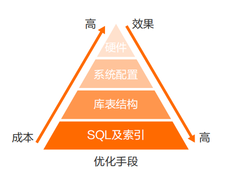
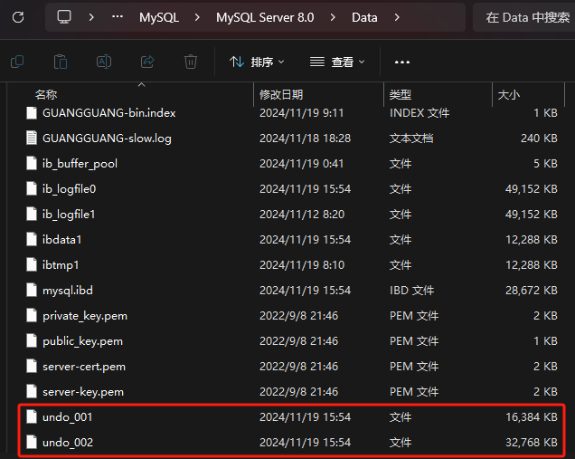
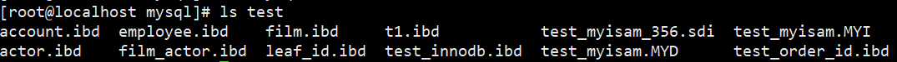
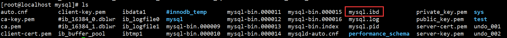

# MySQL全局优化与MySQL 8.0新增特性详解

## MySQL全局优化

对于优化来说，可用的手段或者方向大概有四种：SQL及索引、库表结构、系统配置以及硬件。针对优化它们有一张简图：



从上图就可以看出SQL及索引的优化可以说是事半功倍的，通常在业务开发过程中谈及到的数据库调优就是优化SQL及索引，这些在以前的章节中就有部分重点详细的介绍，接下来会补充一些配置文件（my.ini或my.cnf）的全局配置参数介绍。

**假设目前有一台服务器的配置是32核心CPU、64GB内存以及2TB固态硬盘，用其专门做一台MySQL服务器**，以这台机器为例来详解一下配置文件中"[mysqld]"标签下的配置项的合理值。

**max_connections**

max_connections就是MySQL最大连接数量，业务上说到的支持多少多少并发，指的是每秒请求数（QPS）就和这个参数值密切相关。一个连接的创建和销毁都需要系统资源，比如内存、文件句柄等，一个连接最少占用内存是256KB，最大占用内存64MB，如果一个连接的请求数据超过了64MB，就会申请临时空间，放至硬盘上。当然计算内存不能直接使用最小值或者最大值进行计算，一般来说一个连接正常内存开销会在1MB~5MB左右，复杂查询的内存消耗可能会达到10MB或更高，这里就取2.5MB。还记得InnoDB中会有一个Buffer Pool缓冲池，一般将其设置成物理机内存的60%~70%，这里也就是40GB左右，所以还有24GB可以用来处理连接产生的内存需求，但是还要排除掉操作系统所需要的内存占比，将MySQL最大连接数量设置成3000是比较合理的，内存占用即3000*2.5MB=7500MB≈7.32GB。总之清楚一点，如果内存占用一旦超过物理机内存64GB，就会产生额外的磁盘交换（SWAP），此时就会影响性能。

```ini
[mysqld]
......
max_connection=3000
......
```

**max_user_connections**

max_user_connections是允许用户连接的最大数量，不能超过max_connection值，所以可以设置成2980，剩下的20个连接留给DBA进行管理。

```ini
[mysqld]
......
max_user_connections=2980
......
```

**back_log**

back_log就是能够暂存的连接数量，如果MySQL的连接数达到max_connections时，新的请求就会被存到堆栈中，等待连接资源的释放。该堆栈数量就是back_log，但是如果等待连接的数量超过back_log，就会被拒绝，这个值不宜过大，占max_connection的10%即可。

```ini
[mysqld]
......
back_log=300
......
```

**wait_timeout**

wait_timeout就是App通过类似JDBC这一类协议连接MySQL进行操作完毕后，空闲多少秒自动断开，默认是28800秒，即8个小时。一般不需要这么久，设置为300秒即可。

```ini
[mysqld]
......
wait_timeout=300
......
```

**interactive_timeout**

interactive_timeout就是类似Navicat这一类Client连接MySQL进行操作完毕后，空闲多少秒自动断开，默认是28800秒，即8个小时。一般也不需要这么久，设置为300秒即可。

```ini
[mysqld]
......
interactive_timeout=300
......
```

**innodb_thread_concurrency**

innodb_thread_concurrency用来设置InnoDB线程的并发数，默认值为0表示不被限制，一般设置与服务器的CPU核心数相同即可，如果超过配置并发数，则需要排队，这个值不宜太大，不然可能会导致线程之间锁争用严重，影响性能。

```ini
[mysqld]
......
innodb_thread_concurrency=64
......
```

**innodb_buffer_pool_size**

innodb_buffer_pool_size就是上面以及上一章提到的InnoDB Buffer Pool缓冲池大小，一般设置为物理机内存的60%~70%。

```ini
[mysqld]
......
innodb_buffer_pool_size=40G
......
```

**innodb_lock_wait_timeout**

innodb_lock_wait_timeout就是行锁锁定时间，默认为50s，但是实际应该根据公司业务情况而定，没有标准值，这里就设置为10秒。

```ini
[mysqld]
......
innodb_lock_wait_timeout=10
......
```

**innodb_flush_log_at_trx_commit**

innodb_flush_log_at_trx_commit就是redo log日志文件写入磁盘的策略，这里就使用默认的1即可，表示实时写入磁盘，不暂存到Page cache或Buffer pool中。

```ini
[mysqld]
......
innodb_flush_log_at_trx_commit=1
......
```

**sync_binlog**

sync_binlog就是bin log日志写入磁盘策略，和innodb_flush_log_at_trx_commit类似，使用默认值即可。

```ini
[mysqld]
......
sync_binlog=1
......
```

**sort_buffer_size**

sort_buffer_size就是给需要排序的线程分配一块缓冲区的大小。增加该值可以加速ORDER BY或者GROUP BY操作。该参数是一个连接（connection）级别的参数，每个连接或者会话第一次需要使用这个Buffer时，MySQL会一次性分配设置的内存。但是这个值并不是越大越好，由于是连接级别的参数，值越大，在并发高的情况下会可能耗尽系统的内存资源。这里根据实际物理机情况可以设置为4MB。

```ini
[mysqld]
......
sort_buffer_size=4M
......
```

**join_buffer_size**

join_buffer_size和sort_buffer_size类似，只不过用于JOIN关联表语句，设置和sort_buffer_size相同的值即可。

```ini
[mysqld]
......
join_buffer_size=4M
......
```

## MySQL 8.0新特性

这里的MySQL 8.0主要指MySQL 8.0.17之后的版本，因为更新的内容会比较多。下面主要选择和实际开发息息相关的一些新特性进行讨论和演示。

### 新增降序索引

MySQL在语法上很早就已经支持降序索引，但实际上创建的仍然是升序索引，如下MySQL 5.7 所示，c2字段降序，但是从SHOW CREATE TABLE看c2字段仍然是升序。8.0可以看到，c2字段降序。只有InnoDB存储引擎支持降序索引。

```shell
# ====MySQL 5.7演示====
mysql> create table t1(c1 int,c2 int,index idx_c1_c2(c1,c2 desc));
Query OK, 0 rows affected (0.04 sec)

mysql> insert into t1 (c1,c2) values(1, 10),(2,50),(3,50),(4,100),(5,80);
Query OK, 5 rows affected (0.02 sec)

mysql> show create table t1\G
*************************** 1. row ***************************
       Table: t1
Create Table: CREATE TABLE `t1` (
  `c1` int(11) DEFAULT NULL,
  `c2` int(11) DEFAULT NULL,
  KEY `idx_c1_c2` (`c1`,`c2`)    --注意这里，c2字段是升序
) ENGINE=InnoDB DEFAULT CHARSET=latin1
1 row in set (0.00 sec)

mysql> explain select * from t1 order by c1,c2 desc;  --5.7也会使用索引，但是Extra字段里有filesort文件排序
+----+-------------+-------+------------+-------+---------------+-----------+---------+------+------+----------+-----------------------------+
| id | select_type | table | partitions | type  | possible_keys | key       | key_len | ref  | rows | filtered | Extra                       |
+----+-------------+-------+------------+-------+---------------+-----------+---------+------+------+----------+-----------------------------+
|  1 | SIMPLE      | t1    | NULL       | index | NULL          | idx_c1_c2 | 10      | NULL |    1 |   100.00 | Using index; Using filesort |
+----+-------------+-------+------------+-------+---------------+-----------+---------+------+------+----------+-----------------------------+
1 row in set, 1 warning (0.01 sec)


# ====MySQL 8.0演示====
mysql> create table t1(c1 int,c2 int,index idx_c1_c2(c1,c2 desc));
Query OK, 0 rows affected (0.02 sec)

mysql> insert into t1 (c1,c2) values(1, 10),(2,50),(3,50),(4,100),(5,80);
Query OK, 5 rows affected (0.02 sec)

mysql> show create table t1\G
*************************** 1. row ***************************
       Table: t1
Create Table: CREATE TABLE `t1` (
  `c1` int DEFAULT NULL,
  `c2` int DEFAULT NULL,
  KEY `idx_c1_c2` (`c1`,`c2` DESC)  --注意这里的区别，降序索引生效了
) ENGINE=InnoDB DEFAULT CHARSET=utf8mb4 COLLATE=utf8mb4_0900_ai_ci
1 row in set (0.00 sec)

mysql> explain select * from t1 order by c1,c2 desc;  --Extra字段里没有filesort文件排序，充分利用了降序索引
+----+-------------+-------+------------+-------+---------------+-----------+---------+------+------+----------+-------------+
| id | select_type | table | partitions | type  | possible_keys | key       | key_len | ref  | rows | filtered | Extra       |
+----+-------------+-------+------------+-------+---------------+-----------+---------+------+------+----------+-------------+
|  1 | SIMPLE      | t1    | NULL       | index | NULL          | idx_c1_c2 | 10      | NULL |    1 |   100.00 | Using index |
+----+-------------+-------+------------+-------+---------------+-----------+---------+------+------+----------+-------------+
1 row in set, 1 warning (0.00 sec)

mysql> explain select * from t1 order by c1 desc,c2;  --Extra字段里有Backward index scan，意思是反向扫描索引;
+----+-------------+-------+------------+-------+---------------+-----------+---------+------+------+----------+----------------------------------+
| id | select_type | table | partitions | type  | possible_keys | key       | key_len | ref  | rows | filtered | Extra                            |
+----+-------------+-------+------------+-------+---------------+-----------+---------+------+------+----------+----------------------------------+
|  1 | SIMPLE      | t1    | NULL       | index | NULL          | idx_c1_c2 | 10      | NULL |    1 |   100.00 | Backward index scan; Using index |
+----+-------------+-------+------------+-------+---------------+-----------+---------+------+------+----------+----------------------------------+
1 row in set, 1 warning (0.00 sec)

mysql> explain select * from t1 order by c1 desc,c2 desc;  --Extra字段里有filesort文件排序，排序必须按照每个字段定义的排序或按相反顺序才能充分利用索引
+----+-------------+-------+------------+-------+---------------+-----------+---------+------+------+----------+-----------------------------+
| id | select_type | table | partitions | type  | possible_keys | key       | key_len | ref  | rows | filtered | Extra                       |
+----+-------------+-------+------------+-------+---------------+-----------+---------+------+------+----------+-----------------------------+
|  1 | SIMPLE      | t1    | NULL       | index | NULL          | idx_c1_c2 | 10      | NULL |    1 |   100.00 | Using index; Using filesort |
+----+-------------+-------+------------+-------+---------------+-----------+---------+------+------+----------+-----------------------------+
1 row in set, 1 warning (0.00 sec)

mysql> explain select * from t1 order by c1,c2;    --Extra字段里有filesort文件排序，排序必须按照每个字段定义的排序或按相反顺序才能充分利用索引
+----+-------------+-------+------------+-------+---------------+-----------+---------+------+------+----------+-----------------------------+
| id | select_type | table | partitions | type  | possible_keys | key       | key_len | ref  | rows | filtered | Extra                       |
+----+-------------+-------+------------+-------+---------------+-----------+---------+------+------+----------+-----------------------------+
|  1 | SIMPLE      | t1    | NULL       | index | NULL          | idx_c1_c2 | 10      | NULL |    1 |   100.00 | Using index; Using filesort |
+----+-------------+-------+------------+-------+---------------+-----------+---------+------+------+----------+-----------------------------+
1 row in set, 1 warning (0.00 sec)
```

### GROUP BY不再隐式排序

MySQL 8.0对于GROUP BY字段不再隐式排序，如需要排序，必须显式加上ORDER BY子句。

```shell
# ====MySQL 5.7演示====
mysql> select count(*),c2 from t1 group by c2;
+----------+------+
| count(*) | c2   |
+----------+------+
|        1 |   10 |
|        2 |   50 |
|        1 |   80 |
|        1 |  100 |
+----------+------+
4 rows in set (0.00 sec)


# ====MySQL 8.0演示====
mysql> select count(*),c2 from t1 group by c2;   --8.0版本group by不再默认排序
+----------+------+
| count(*) | c2   |
+----------+------+
|        1 |   10 |
|        2 |   50 |
|        1 |  100 |
|        1 |   80 |
+----------+------+
4 rows in set (0.00 sec)

mysql> select count(*),c2 from t1 group by c2 order by c2;  --8.0版本group by不再默认排序，需要自己加order by
+----------+------+
| count(*) | c2   |
+----------+------+
|        1 |   10 |
|        2 |   50 |
|        1 |   80 |
|        1 |  100 |
+----------+------+
4 rows in set (0.00 sec)
```

### 新增隐藏索引

使用INVISIBLE关键字在创建表或者进行表变更中设置索引为隐藏索引。索引隐藏只是不可见，但是数据库后台还是会维护隐藏索引的，在查询时优化器不使用该索引，即使用FORCE INDEX，优化器也不会使用该索引，同时优化器也不会报索引不存在的错误，因为索引仍然真实存在，必要时，也可以把隐藏索引快速恢复成可见。注意主键不能设置为INVISIBLE。

软删除就可以使用隐藏索引，比如我们觉得某个索引没用了，删除后发现这个索引在某些时候还是有用的，于是又得把这个索引加回来，如果表数据量很大的话，这种操作耗费时间是很多的，成本很高，这时，我们可以将索引先设置为隐藏索引，等到真的确认索引没用了再删除。

```shell
# 创建t2表，里面的c2字段为隐藏索引
mysql> create table t2(c1 int, c2 int, index idx_c1(c1), index idx_c2(c2) invisible);
Query OK, 0 rows affected (0.02 sec)

mysql> show index from t2\G
*************************** 1. row ***************************
        Table: t2
   Non_unique: 1
     Key_name: idx_c1
 Seq_in_index: 1
  Column_name: c1
    Collation: A
  Cardinality: 0
     Sub_part: NULL
       Packed: NULL
         Null: YES
   Index_type: BTREE
      Comment: 
Index_comment: 
      Visible: YES
   Expression: NULL
*************************** 2. row ***************************
        Table: t2
   Non_unique: 1
     Key_name: idx_c2
 Seq_in_index: 1
  Column_name: c2
    Collation: A
  Cardinality: 0
     Sub_part: NULL
       Packed: NULL
         Null: YES
   Index_type: BTREE
      Comment: 
Index_comment: 
      Visible: NO   --隐藏索引不可见
   Expression: NULL
2 rows in set (0.00 sec)

mysql> explain select * from t2 where c1=1;
+----+-------------+-------+------------+------+---------------+--------+---------+-------+------+----------+-------+
| id | select_type | table | partitions | type | possible_keys | key    | key_len | ref   | rows | filtered | Extra |
+----+-------------+-------+------------+------+---------------+--------+---------+-------+------+----------+-------+
|  1 | SIMPLE      | t2    | NULL       | ref  | idx_c1        | idx_c1 | 5       | const |    1 |   100.00 | NULL  |
+----+-------------+-------+------------+------+---------------+--------+---------+-------+------+----------+-------+
1 row in set, 1 warning (0.00 sec)

mysql> explain select * from t2 where c2=1;  --隐藏索引c2不会被使用
+----+-------------+-------+------------+------+---------------+------+---------+------+------+----------+-------------+
| id | select_type | table | partitions | type | possible_keys | key  | key_len | ref  | rows | filtered | Extra       |
+----+-------------+-------+------------+------+---------------+------+---------+------+------+----------+-------------+
|  1 | SIMPLE      | t2    | NULL       | ALL  | NULL          | NULL | NULL    | NULL |    1 |   100.00 | Using where |
+----+-------------+-------+------------+------+---------------+------+---------+------+------+----------+-------------+
1 row in set, 1 warning (0.00 sec)

mysql> select @@optimizer_switch\G   --查看各种参数
*************************** 1. row ***************************
@@optimizer_switch: index_merge=on,index_merge_union=on,index_merge_sort_union=on,index_merge_intersection=on,engine_condition_pushdown=on,index_condition_pushdown=on,mrr=on,mrr_cost_based=on,block_nested_loop=on,batched_key_access=off,materialization=on,semijoin=on,loosescan=on,firstmatch=on,duplicateweedout=on,subquery_materialization_cost_based=on,use_index_extensions=on,condition_fanout_filter=on,derived_merge=on,use_invisible_indexes=off,skip_scan=on,hash_join=on
1 row in set (0.00 sec)

mysql> set session optimizer_switch="use_invisible_indexes=on";  ----在会话级别设置查询优化器可以看到隐藏索引
Query OK, 0 rows affected (0.00 sec)

mysql> select @@optimizer_switch\G
*************************** 1. row ***************************
@@optimizer_switch: index_merge=on,index_merge_union=on,index_merge_sort_union=on,index_merge_intersection=on,engine_condition_pushdown=on,index_condition_pushdown=on,mrr=on,mrr_cost_based=on,block_nested_loop=on,batched_key_access=off,materialization=on,semijoin=on,loosescan=on,firstmatch=on,duplicateweedout=on,subquery_materialization_cost_based=on,use_index_extensions=on,condition_fanout_filter=on,derived_merge=on,use_invisible_indexes=on,skip_scan=on,hash_join=on
1 row in set (0.00 sec)

mysql> explain select * from t2 where c2=1;
+----+-------------+-------+------------+------+---------------+--------+---------+-------+------+----------+-------+
| id | select_type | table | partitions | type | possible_keys | key    | key_len | ref   | rows | filtered | Extra |
+----+-------------+-------+------------+------+---------------+--------+---------+-------+------+----------+-------+
|  1 | SIMPLE      | t2    | NULL       | ref  | idx_c2        | idx_c2 | 5       | const |    1 |   100.00 | NULL  |
+----+-------------+-------+------------+------+---------------+--------+---------+-------+------+----------+-------+
1 row in set, 1 warning (0.00 sec)

mysql> alter table t2 alter index idx_c2 visible;
Query OK, 0 rows affected (0.02 sec)
Records: 0  Duplicates: 0  Warnings: 0

mysql> alter table t2 alter index idx_c2 invisible;
Query OK, 0 rows affected (0.01 sec)
Records: 0  Duplicates: 0  Warnings: 0
```

### 新增函数索引

之前我们知道，如果在查询中加入了函数，索引不生效，所以MySQL 8引入了函数索引，MySQL 8.0.13开始支持在索引中使用函数（表达式）的值。

函数索引基于虚拟列功能实现，在MySQL中相当于新增了一个列，这个列会根据你的函数来进行计算结果，然后使用函数索引的时候就会用这个计算后的列作为索引。

```shell
mysql> create table t3(c1 varchar(10),c2 varchar(10));
Query OK, 0 rows affected (0.02 sec)

mysql> create index idx_c1 on t3(c1);     --创建普通索引
Query OK, 0 rows affected (0.03 sec)
Records: 0  Duplicates: 0  Warnings: 0

mysql> create index func_idx on t3((UPPER(c2)));  --创建一个大写的函数索引
Query OK, 0 rows affected (0.03 sec)
Records: 0  Duplicates: 0  Warnings: 0

mysql> show index from t3\G
*************************** 1. row ***************************
        Table: t3
   Non_unique: 1
     Key_name: idx_c1
 Seq_in_index: 1
  Column_name: c1
    Collation: A
  Cardinality: 0
     Sub_part: NULL
       Packed: NULL
         Null: YES
   Index_type: BTREE
      Comment: 
Index_comment: 
      Visible: YES
   Expression: NULL
*************************** 2. row ***************************
        Table: t3
   Non_unique: 1
     Key_name: func_idx
 Seq_in_index: 1
  Column_name: NULL
    Collation: A
  Cardinality: 0
     Sub_part: NULL
       Packed: NULL
         Null: YES
   Index_type: BTREE
      Comment: 
Index_comment: 
      Visible: YES
   Expression: upper(`c2`)    --函数表达式
2 rows in set (0.00 sec)

mysql> explain select * from t3 where upper(c1)='ZHUGE';
+----+-------------+-------+------------+------+---------------+------+---------+------+------+----------+-------------+
| id | select_type | table | partitions | type | possible_keys | key  | key_len | ref  | rows | filtered | Extra       |
+----+-------------+-------+------------+------+---------------+------+---------+------+------+----------+-------------+
|  1 | SIMPLE      | t3    | NULL       | ALL  | NULL          | NULL | NULL    | NULL |    1 |   100.00 | Using where |
+----+-------------+-------+------------+------+---------------+------+---------+------+------+----------+-------------+
1 row in set, 1 warning (0.00 sec)

mysql> explain select * from t3 where upper(c2)='ZHUGE';  --使用了函数索引
+----+-------------+-------+------------+------+---------------+----------+---------+-------+------+----------+-------+
| id | select_type | table | partitions | type | possible_keys | key      | key_len | ref   | rows | filtered | Extra |
+----+-------------+-------+------------+------+---------------+----------+---------+-------+------+----------+-------+
|  1 | SIMPLE      | t3    | NULL       | ref  | func_idx      | func_idx | 43      | const |    1 |   100.00 | NULL  |
+----+-------------+-------+------------+------+---------------+----------+---------+-------+------+----------+-------+
1 row in set, 1 warning (0.00 sec)
```

### InnoDB引擎跳过锁等待

对于SELECT ... FOR SHARE（8.0新增加查询共享锁的语法）或SELECT ... FOR UPDATE，在语句后面添加NOWAIT、SKIP LOCKED语法可以跳过锁等待，或者跳过锁定。

在5.7及之前的版本，SELECT ... FOR UPDATE，如果获取不到锁，会一直等待，直到innodb_lock_wait_timeout超时。

在8.0版本，通过添加NOWAIT，SKIP LOCKED语法，能够立即返回。如果查询的行已经加锁，那么NOWAIT会立即报错返回，而SKIP LOCKED也会立即返回，只是返回的结果中不包含被锁定的行。

应用场景比如查询余票记录，如果某些记录已经被锁定，用SKIP LOCKED可以跳过被锁定的记录，只返回没有锁定的记录，提高系统性能。

```shell
# 先打开一个session1:
mysql> select * from t1;
+------+------+
| c1   | c2   |
+------+------+
|    1 |   10 |
|    2 |   50 |
|    3 |   50 |
|    4 |  100 |
|    5 |   80 |
+------+------+
5 rows in set (0.00 sec)
    
mysql> begin;
Query OK, 0 rows affected (0.00 sec)

mysql> update t1 set c2 = 60 where c1 = 2;     --锁定第二条记录
Query OK, 1 row affected (0.00 sec)
Rows matched: 1  Changed: 1  Warnings: 0


# 另外一个session2:    
mysql> select * from t1 where c1 = 2 for update;   --等待超时
ERROR 1205 (HY000): Lock wait timeout exceeded; try restarting transaction

mysql> select * from t1 where c1 = 2 for update nowait;   --查询立即返回
ERROR 3572 (HY000): Statement aborted because lock(s) could not be acquired immediately and NOWAIT is set.

mysql> select * from t1 for update skip locked;  --查询立即返回，过滤掉了第二行记录
+------+------+
| c1   | c2   |
+------+------+
|    1 |   10 |
|    3 |   50 |
|    4 |  100 |
|    5 |   80 |
+------+------+
4 rows in set (0.00 sec)
```

### innodb_dedicated_server参数

能够让InnoDB根据服务器上检测到的内存大小自动配置innodb_buffer_pool_size，innodb_log_file_size等参数，会尽可能多的占用系统可占用资源提升性能。解决非专业人员安装数据库后默认初始化数据库参数默认值偏低的问题，前提是服务器是专用来给MySQL数据库的，如果还有其他软件或者资源或者多实例MySQL使用，不建议开启该参数，不然会影响其它程序。

```shell
mysql> show variables like '%innodb_dedicated_server%';   --默认是OFF关闭，修改为ON打开
+-------------------------+-------+
| Variable_name           | Value |
+-------------------------+-------+
| innodb_dedicated_server | OFF   |
+-------------------------+-------+
1 row in set (0.02 sec)
```

### 死锁检查控制

MySQL 8.0 （MySQL 5.7.15）增加了一个新的动态变量innodb_deadlock_detect，用于控制系统是否执行InnoDB死锁检查，默认是打开的。死锁检测会耗费数据库性能的，对于高并发的系统，我们可以关闭死锁检测功能，提高系统性能。但是我们要确保系统极少情况会发生死锁，同时要将锁等待超时参数调小一点，以防出现死锁等待过久的情况。

```shell
mysql> show variables like '%innodb_deadlock_detect%';  --默认是打开的
+------------------------+-------+
| Variable_name          | Value |
+------------------------+-------+
| innodb_deadlock_detect | ON    |
+------------------------+-------+
1 row in set, 1 warning (0.01 sec)
```

### undo文件不再使用系统表空间

默认创建2个UNDO表空间，不再使用系统表空间。



### bin log日志过期时间精确到秒

在MySQL 8.0版本之前，bin log日志过期时间设置都是设置expire_logs_days参数，而在8.0版本中，MySQL默认使用binlog_expire_logs_seconds参数。

### 窗口函数（Window Functions）

从MySQL 8.0开始，新增了一个叫窗口函数的概念，它可以用来实现若干新的查询方式。窗口函数与SUM()、COUNT()这种分组聚合函数类似，在聚合函数后面加上over()就变成窗口函数了，在括号里可以加上PARTITION BY等分组关键字指定如何分组，窗口函数即便分组也不会将多行查询结果合并为一行，而是将结果放回多行当中，即窗口函数不需要再使用GROUP BY。

```shell
# 创建一张账户余额表
CREATE TABLE `account_channel` (
  `id` int NOT NULL AUTO_INCREMENT,
  `name` varchar(255) CHARACTER SET utf8mb4 COLLATE utf8mb4_0900_ai_ci DEFAULT NULL COMMENT '姓名',
  `channel` varchar(20) CHARACTER SET utf8mb4 COLLATE utf8mb4_0900_ai_ci DEFAULT NULL COMMENT '账户渠道',
  `balance` int DEFAULT NULL COMMENT '余额',
  PRIMARY KEY (`id`)
) ENGINE=InnoDB

# 插入一些示例数据
INSERT INTO `test`.`account_channel` (`id`, `name`, `channel`, `balance`) VALUES ('1', 'zhuge', 'wx', '100');
INSERT INTO `test`.`account_channel` (`id`, `name`, `channel`, `balance`) VALUES ('2', 'zhuge', 'alipay', '200');
INSERT INTO `test`.`account_channel` (`id`, `name`, `channel`, `balance`) VALUES ('3', 'zhuge', 'yinhang', '300');
INSERT INTO `test`.`account_channel` (`id`, `name`, `channel`, `balance`) VALUES ('4', 'lilei', 'wx', '200');
INSERT INTO `test`.`account_channel` (`id`, `name`, `channel`, `balance`) VALUES ('5', 'lilei', 'alipay', '100');
INSERT INTO `test`.`account_channel` (`id`, `name`, `channel`, `balance`) VALUES ('6', 'hanmeimei', 'wx', '500');

mysql> select * from account_channel;
+----+-----------+---------+---------+
| id | name      | channel | balance |
+----+-----------+---------+---------+
|  1 | zhuge     | wx      |     100 |
|  2 | zhuge     | alipay  |     200 |
|  3 | zhuge     | yinhang |     300 |
|  4 | lilei     | wx      |     200 |
|  5 | lilei     | alipay  |     100 |
|  6 | hanmeimei | wx      |     500 |
+----+-----------+---------+---------+
6 rows in set (0.00 sec)

mysql> select name,sum(balance) from account_channel group by name;
+-----------+--------------+
| name      | sum(balance) |
+-----------+--------------+
| zhuge     |          600 |
| lilei     |          300 |
| hanmeimei |          500 |
+-----------+--------------+
3 rows in set (0.00 sec)

# 在聚合函数后面加上over()就变成分析函数了，后面可以不用再加group by制定分组，因为在over里已经用partition关键字指明了如何分组计算，这种可以保留原有表数据的结构，不会像分组聚合函数那样每组只返回一条数据
mysql> select name,channel,balance,sum(balance) over(partition by name) as sum_balance from account_channel;
+-----------+---------+---------+-------------+
| name      | channel | balance | sum_balance |
+-----------+---------+---------+-------------+
| hanmeimei | wx      |     500 |         500 |
| lilei     | wx      |     200 |         300 |
| lilei     | alipay  |     100 |         300 |
| zhuge     | wx      |     100 |         600 |
| zhuge     | alipay  |     200 |         600 |
| zhuge     | yinhang |     300 |         600 |
+-----------+---------+---------+-------------+
6 rows in set (0.00 sec)

mysql> select name,channel,balance,sum(balance) over(partition by name order by balance) as sum_balance from account_channel;
+-----------+---------+---------+-------------+
| name      | channel | balance | sum_balance |
+-----------+---------+---------+-------------+
| hanmeimei | wx      |     500 |         500 |
| lilei     | alipay  |     100 |         100 |
| lilei     | wx      |     200 |         300 |
| zhuge     | wx      |     100 |         100 |
| zhuge     | alipay  |     200 |         300 |
| zhuge     | yinhang |     300 |         600 |
+-----------+---------+---------+-------------+
6 rows in set (0.00 sec)


# over()里如果不加条件，则默认使用整个表的数据做运算
mysql> select name,channel,balance,sum(balance) over() as sum_balance from account_channel;
+-----------+---------+---------+-------------+
| name      | channel | balance | sum_balance |
+-----------+---------+---------+-------------+
| zhuge     | wx      |     100 |        1400 |
| zhuge     | alipay  |     200 |        1400 |
| zhuge     | yinhang |     300 |        1400 |
| lilei     | wx      |     200 |        1400 |
| lilei     | alipay  |     100 |        1400 |
| hanmeimei | wx      |     500 |        1400 |
+-----------+---------+---------+-------------+
6 rows in set (0.00 sec)

mysql> select name,channel,balance,avg(balance) over(partition by name) as avg_balance from account_channel;
+-----------+---------+---------+-------------+
| name      | channel | balance | avg_balance |
+-----------+---------+---------+-------------+
| hanmeimei | wx      |     500 |    500.0000 |
| lilei     | wx      |     200 |    150.0000 |
| lilei     | alipay  |     100 |    150.0000 |
| zhuge     | wx      |     100 |    200.0000 |
| zhuge     | alipay  |     200 |    200.0000 |
| zhuge     | yinhang |     300 |    200.0000 |
+-----------+---------+---------+-------------+
6 rows in set (0.00 sec)
```

**专用窗口函数：**

- 序号函数：ROW_NUMBER()、RANK()、DENSE_RANK()
- 分布函数：PERCENT_RANK()、CUME_DIST()
- 前后函数：LAG()、LEAD()
- 头尾函数：FIRST_VALUE()、LAST_VALUE()
- 其它函数：NTH_VALUE()、NTILE()

```shell
# 按照balance字段排序，展示序号
mysql> select name,channel,balance,row_number() over(order by balance) as row_number1 from account_channel;
+-----------+---------+---------+-------------+
| name      | channel | balance | row_number1 |
+-----------+---------+---------+-------------+
| zhuge     | wx      |     100 |           1 |
| lilei     | alipay  |     100 |           2 |
| zhuge     | alipay  |     200 |           3 |
| lilei     | wx      |     200 |           4 |
| zhuge     | yinhang |     300 |           5 |
| hanmeimei | wx      |     500 |           6 |
+-----------+---------+---------+-------------+
6 rows in set (0.00 sec)

# 按照balance字段排序，first_value()选出排第一的余额
mysql> select name,channel,balance,first_value(balance) over(order by balance) as first1 from account_channel;
+-----------+---------+---------+--------+
| name      | channel | balance | first1 |
+-----------+---------+---------+--------+
| zhuge     | wx      |     100 |    100 |
| lilei     | alipay  |     100 |    100 |
| zhuge     | alipay  |     200 |    100 |
| lilei     | wx      |     200 |    100 |
| zhuge     | yinhang |     300 |    100 |
| hanmeimei | wx      |     500 |    100 |
+-----------+---------+---------+--------+
6 rows in set (0.01 sec)
```

### 默认字符集变为utf8mb4

在MySQL 8.0版本之前，默认字符集为latin1，utf8指向的是utf8mb3，MySQL 8.0版本默认字符集为utf8mb4，utf8默认指向的也是utf8mb4。

### 系统表全部换成InnoDB引擎

将系统表（sys、mysql、information_schema、performance_schema）和数据字典表全部改为InnoDB存储引擎，默认的MySQL实例将不包含MyISAM表，除非手动创建MyISAM表。

### 元数据存储变动

MySQL 8.0删除了之前版本的元数据文件，例如表结构.frm等文件，全部集中放入mysql.ibd文件里。可以看见下图test库文件夹里已经没有了.frm文件。





### 自增变量持久化

在MySQL 8.0之前的版本，自增主键AUTO_INCREMENT的值如果大于max(primary key)+1，在MySQL重启后，会重置AUTO_INCREMENT=max(primary key)+1，这种现象在某些情况下会导致业务主键冲突或者其他难以发现的问题。自增主键重启重置的问题很早就被发现(https://bugs.mysql.com/bug.php?id=199)，一直到MySQL 8.0才被解决，MySQL 8.0版本将会对AUTO_INCREMENT值进行持久化，MySQL重启后，该值将不会改变。

```shell
# ====MySQL 5.7演示====
mysql> create table t(id int auto_increment primary key,c1 varchar(20));
Query OK, 0 rows affected (0.03 sec)

mysql> insert into t(c1) values('zhuge1'),('zhuge2'),('zhuge3');
Query OK, 3 rows affected (0.00 sec)
Records: 3  Duplicates: 0  Warnings: 0

mysql> select * from t;
+----+--------+
| id | c1     |
+----+--------+
|  1 | zhuge1 |
|  2 | zhuge2 |
|  3 | zhuge3 |
+----+--------+
3 rows in set (0.00 sec)

mysql> delete from t where id = 3;
Query OK, 1 row affected (0.01 sec)

mysql> select * from t;
+----+--------+
| id | c1     |
+----+--------+
|  1 | zhuge1 |
|  2 | zhuge2 |
+----+--------+
2 rows in set (0.00 sec)

mysql> exit;
Bye

# 重启MySQL服务，并重新连接MySQL
mysql> insert into t(c1) values('zhuge4');
Query OK, 1 row affected (0.01 sec)

mysql> select * from t;
+----+--------+
| id | c1     |
+----+--------+
|  1 | zhuge1 |
|  2 | zhuge2 |
|  3 | zhuge4 |
+----+--------+
3 rows in set (0.00 sec)

mysql> update t set id = 5 where c1 = 'zhuge1';
Query OK, 1 row affected (0.01 sec)
Rows matched: 1  Changed: 1  Warnings: 0

mysql> select * from t;
+----+--------+
| id | c1     |
+----+--------+
|  2 | zhuge2 |
|  3 | zhuge4 |
|  5 | zhuge1 |
+----+--------+
3 rows in set (0.00 sec)

mysql> insert into t(c1) values('zhuge5');
Query OK, 1 row affected (0.01 sec)

mysql> select * from t;
+----+--------+
| id | c1     |
+----+--------+
|  2 | zhuge2 |
|  3 | zhuge4 |
|  4 | zhuge5 |
|  5 | zhuge1 |
+----+--------+
4 rows in set (0.00 sec)

mysql> insert into t(c1) values('zhuge6');
ERROR 1062 (23000): Duplicate entry '5' for key 'PRIMARY'


# ====MySQL 8.0演示====
mysql> create table t(id int auto_increment primary key,c1 varchar(20));
Query OK, 0 rows affected (0.02 sec)

mysql> insert into t(c1) values('zhuge1'),('zhuge2'),('zhuge3');
Query OK, 3 rows affected (0.00 sec)
Records: 3  Duplicates: 0  Warnings: 0

mysql> select * from t;
+----+--------+
| id | c1     |
+----+--------+
|  1 | zhuge1 |
|  2 | zhuge2 |
|  3 | zhuge3 |
+----+--------+
3 rows in set (0.00 sec)

mysql> delete from t where id = 3;
Query OK, 1 row affected (0.01 sec)

mysql> select * from t;
+----+--------+
| id | c1     |
+----+--------+
|  1 | zhuge1 |
|  2 | zhuge2 |
+----+--------+
2 rows in set (0.00 sec)

mysql> exit;
Bye
[root@localhost ~]# service mysqld restart
Shutting down MySQL.... SUCCESS! 
Starting MySQL... SUCCESS! 

# 重新连接MySQL
mysql> insert into t(c1) values('zhuge4');
Query OK, 1 row affected (0.00 sec)

mysql> select * from t;  --生成的id为4，不是3
+----+--------+
| id | c1     |
+----+--------+
|  1 | zhuge1 |
|  2 | zhuge2 |
|  4 | zhuge4 |
+----+--------+
3 rows in set (0.00 sec)

mysql> update t set id = 5 where c1 = 'zhuge1';
Query OK, 1 row affected (0.01 sec)
Rows matched: 1  Changed: 1  Warnings: 0

mysql> select * from t;
+----+--------+
| id | c1     |
+----+--------+
|  2 | zhuge2 |
|  4 | zhuge4 |
|  5 | zhuge1 |
+----+--------+
3 rows in set (0.00 sec)

mysql> insert into t(c1) values('zhuge5');
Query OK, 1 row affected (0.00 sec)

mysql> select * from t;
+----+--------+
| id | c1     |
+----+--------+
|  2 | zhuge2 |
|  4 | zhuge4 |
|  5 | zhuge1 |
|  6 | zhuge5 |
+----+--------+
4 rows in set (0.00 sec)
```

### DDL原子化

InnoDB表的DDL支持事务完整性，要么成功要么回滚。

MySQL 8.0开始支持原子DDL操作，其中与表相关的原子DDL只支持InnoDB存储引擎。一个原子DDL操作内容包括：更新数据字典，存储引擎层的操作，在bin log中记录DDL操作。支持与表相关的DDL：数据库、表空间、表、索引的CREATE、ALTER、DROP以及TRUNCATE TABLE。支持的其它DDL：存储程序、触发器、视图、UDF的CREATE、DROP以及ALTER语句。支持账户管理相关的DDL：用户和角色的CREATE、ALTER、DROP以及适用的RENAME等等。

```shell
# MySQL 5.7
mysql> show tables;
+----------------+
| Tables_in_test |
+----------------+
| account        |
| actor          |
| employee       |
| film           |
| film_actor     |
| leaf_id        |
| t1             |
| test_innodb    |
| test_myisam    |
| test_order_id  |
+----------------+
10 rows in set (0.01 sec)

mysql> drop table t1,t2;  //删除表报错不会回滚，t1表会被删除
ERROR 1051 (42S02): Unknown table 'test.t2'
mysql> show tables;
+----------------+
| Tables_in_test |
+----------------+
| account        |
| actor          |
| employee       |
| film           |
| film_actor     |
| leaf_id        |
| test_innodb    |
| test_myisam    |
| test_order_id  |
+----------------+
9 rows in set (0.00 sec)


# MySQL 8.0  
mysql> show tables;
+----------------+
| Tables_in_test |
+----------------+
| account        |
| actor          |
| employee       |
| film           |
| film_actor     |
| leaf_id        |
| t1             |
| test_innodb    |
| test_myisam    |
| test_order_id  |
+----------------+
10 rows in set (0.00 sec)

mysql> drop table t1,t2;  //删除表报错会回滚，t1表依然还在
ERROR 1051 (42S02): Unknown table 'test.t2'
mysql> show tables;  
+----------------+
| Tables_in_test |
+----------------+
| account        |
| actor          |
| employee       |
| film           |
| film_actor     |
| leaf_id        |
| t1             |
| test_innodb    |
| test_myisam    |
| test_order_id  |
+----------------+
10 rows in set (0.00 sec)
```

### 参数修改持久化

MySQL 8.0版本支持在线修改全局参数并持久化，通过加上PERSIST关键字，可以将修改的参数持久化到新的配置文件（mysqld-auto.cnf）中，重启MySQL时，可以从该配置文件获取到最新的配置参数。SET GLOBAL设置的变量参数在MySQL重启后会失效。

```shell
mysql> set persist innodb_lock_wait_timeout=25;
# 系统会在数据目录下生成一个包含json格式的mysqld-auto.cnf 的文件，格式化后如下所示，当my.cnf 和mysqld-auto.cnf 同时存在时，后者具有更高优先级。
{
	"Version": 1,
	"mysql_server": {
		"innodb_lock_wait_timeout": {
			"Value": "25",
			"Metadata": {
				"Timestamp": 1675290252103863,
				"User": "root",
				"Host": "localhost"
			}
		}
	}
}
```

