# 从JDK源码级别彻底剖析JVM类加载机制

## 类加载器运行全过程

当`java`命令运行某个类的main()主函数启动程序时，首先会通过**类加载器**把主类加载到JVM中。例如下面这个类：

```java
package top.sharehome.jvmloader;

/**
 * 数学类
 *
 * @author AntonyCheng
 */
public class Math {
    public static final int INIT_NUM = 1900;
    /**
     * 外部类实例化
     */
    public static User user = new User();
    /**
     * 加法方法
     */
    public int computeAdditionAndMultiplyBy10(int a, int b) {
        int numA = a;
        int numB = b;
        int res = (numA + numB) * 10;
        return res;
    }
    /**
     * 主函数
     */
    public static void main(String[] args) {
        Math math = new Math();
        math.computeAdditionAndMultiplyBy10(10,10);
    }
}
```

通过`java`命令执行代码的大致流程如下：

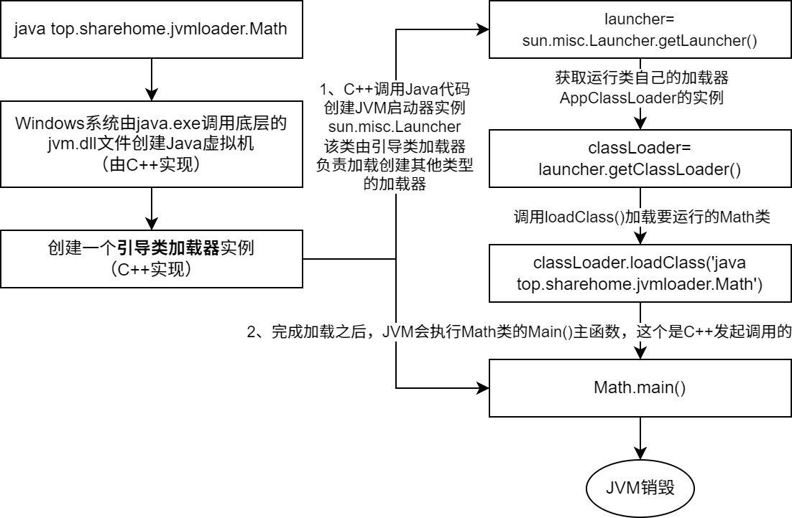

从上图可以看出一个Java程序能执行是脱离不开C/C++程序的（jvm.dll可以看作C/C++的“JAR”包），如果想要了解具体一些的类加载过程，就必须知道Hotspot（JVM的一种实现）源码中如何启动JVM，如下图：

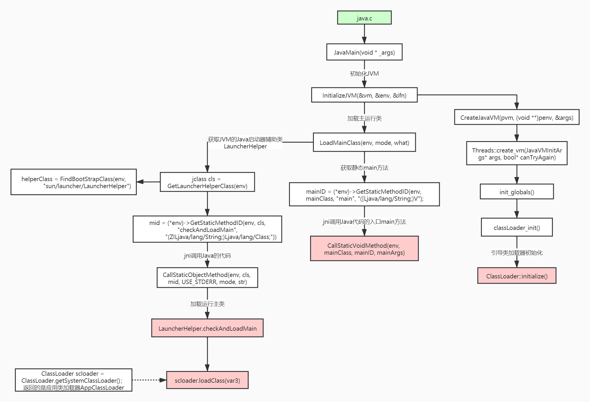

其中最重要的一个方法就是loadClass()，它是加载类的核心方法，其中的运行过程有如下几步：

**加载 ==> 验证 ==> 准备 ==> 解析 ==> 初始化** ==> 使用 ==> 卸载

1. 加载：就是在硬盘上查找并通过磁盘I/O读取字节码文件。要注意**只有使用到类的时候才会加载，并且每个类只会被加载一次**，例如调用类的main()方法或者new新对象等。在加载阶段会在内存中生成一个代表这个类的java.lang.Class对象作为这个类在方法区上各种数据的访问入口。

2. 验证：校验字节码文件的正确性。

3. 准备：给类的静态变量分配内存并赋予默认值。

4. 解析：将**符号引用替换为直接引用**，该阶段会把一些静态方法，比如main()方法，替换为指向数据所存内存的指针或句柄，这就是所谓的**静态链接过程**（类加载期间完成）。还有一个**动态链接过程**，即在程序运行期间将符号引用替换为直接引用（这些下一章节会进行讨论）。如何理解这段话？我们需要前往字节码文件内容中具体看看，使用`javap -v Math.class`命令查看字节码文件部分内容：

   ```java
   ......
   public class top.sharehome.jvmloader.Math
     minor version: 0
     major version: 52
     flags: (0x0021) ACC_PUBLIC, ACC_SUPER
     this_class: #2                          // top/sharehome/jvmloader/Math
     super_class: #8                         // java/lang/Object
     interfaces: 0, fields: 2, methods: 4, attributes: 1
   Constant pool:
      #1 = Methodref          #8.#37         // java/lang/Object."<init>":()V
      #2 = Class              #38            // top/sharehome/jvmloader/Math
      #3 = Methodref          #2.#37         // top/sharehome/jvmloader/Math."<init>":()V
      #4 = Methodref          #2.#39         // top/sharehome/jvmloader/Math.computeAdditionAndMultiplyBy10:(II)I
      #5 = Class              #40            // top/sharehome/jvmloader/User
      #6 = Methodref          #5.#37         // top/sharehome/jvmloader/User."<init>":()V
      #7 = Fieldref           #2.#41         // top/sharehome/jvmloader/Math.user:Ltop/sharehome/jvmloader/User;
      #8 = Class              #42            // java/lang/Object
      #9 = Utf8               INIT_NUM
     #10 = Utf8               I
     #11 = Utf8               ConstantValue
     #12 = Integer            1900
     #13 = Utf8               user
     #14 = Utf8               Ltop/sharehome/jvmloader/User;
     #15 = Utf8               <init>
     #16 = Utf8               ()V
     #17 = Utf8               Code
     #18 = Utf8               LineNumberTable
     #19 = Utf8               LocalVariableTable
     #20 = Utf8               this
     #21 = Utf8               Ltop/sharehome/jvmloader/Math;
     #22 = Utf8               computeAdditionAndMultiplyBy10
     #23 = Utf8               (II)I
     #24 = Utf8               a
     #25 = Utf8               b
     #26 = Utf8               numA
     #27 = Utf8               numB
      ......
   {
     public static final int INIT_NUM;
       descriptor: I
       flags: (0x0019) ACC_PUBLIC, ACC_STATIC, ACC_FINAL
       ConstantValue: int 1900
   
     public static top.sharehome.jvmloader.User user;
       descriptor: Ltop/sharehome/jvmloader/User;
       flags: (0x0009) ACC_PUBLIC, ACC_STATIC
   
     public top.sharehome.jvmloader.Math();
       descriptor: ()V
       flags: (0x0001) ACC_PUBLIC
       Code:
         stack=1, locals=1, args_size=1
            0: aload_0
            1: invokespecial #1                  // Method java/lang/Object."<init>":()V
            4: return
         LineNumberTable:
           line 8: 0
         LocalVariableTable:
           Start  Length  Slot  Name   Signature
               0       5     0  this   Ltop/sharehome/jvmloader/Math;
     ......
   }
   SourceFile: "Math.java"
   ```

   从上面内容可以看出每个所谓的符号（"numA"、"numB"等）都会被映射称为一个个代号（"#21"、"#22"等），而JVM把这个字节码文件加载进入内存之后就是通过一个个代号去查询可以直接访问的实际数据所在内存位置，这就是将符号引用转换成直接引用。

5. 初始化：对类的静态变量初始化为指定的值（例如"INIT_NUM = 1900"），并执行静态代码块。

loadClass()方法具体运行流程图如下：

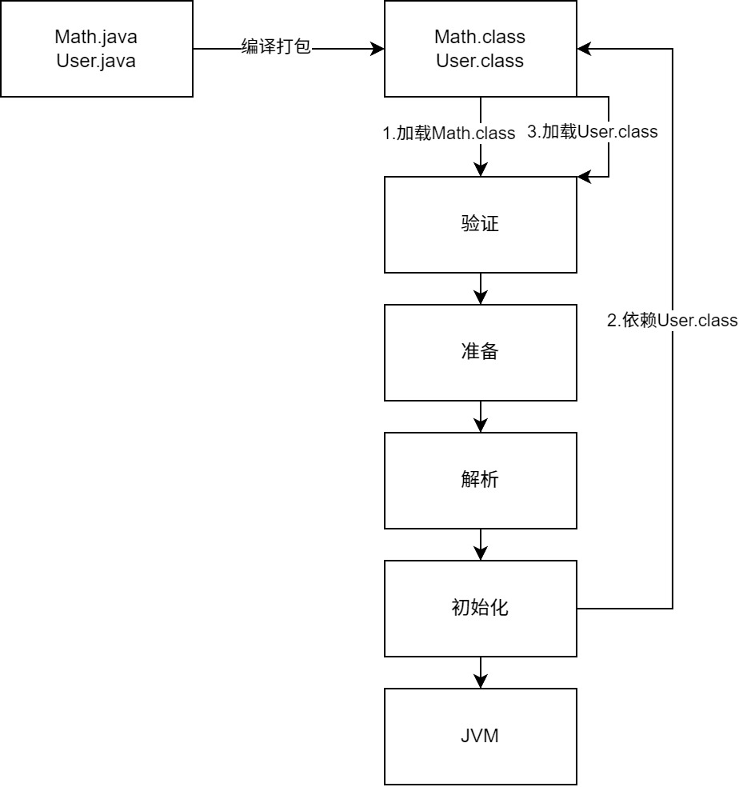

类被加载到方法区中后主要包含**运行时常量池、类型信息、字段信息、方法信息、类加载器的引用、对应类实例的引用**等信息。

- 类加载器的引用：这个类到类加载器实例的引用；
- 对应类实例的引用：类加载器在加载类信息放到方法区中后，会创建一个对应的类型的对象实例放到堆(Heap)中, 作为开发人员访问方法区中类定义的入口和切入点。

**注意**：主类在运行过程中如果使用到其它类，会逐步加载这些类。类似的JAR包或WAR包里的类不是一次性全部加载的，是使用到时才加载。具体看看以下示例代码：

```java
package top.sharehome.jvmloader;

/**
 * 动态加载类
 *
 * @author AntonyCheng
 */
public class DynamicLoad {
    static {
        System.out.println("静态代码块");
    }

    public static void main(String[] args) {
        A a = new A();
        System.out.println("主类方法");
        B b = null;
    }
}

class A {
    static {
        System.out.println("A类的静态代码块");
    }

    public A() {
        System.out.println("初始化A类");
    }
}

class B {
    static {
        System.out.println("B类的静态代码块");
    }

    public B() {
        System.out.println("初始化B类");
    }
}
```

运行结果如下：

```shell
静态代码块
A类的静态代码块
初始化A类
主类方法
```

从运行结果上看确实是用到哪个类才会加载并初始化哪个类。

## 类加载器和双亲委派机制

上面描述的类加载过程主要是通过类加载器来实现的，Java中一般有4种类型的类加载器：

1、引导类加载器（BootstrapClassLoader）：负责加载支撑JVM基本运行的，位于JRE的lib目录下的核心类库，比如rt.jar、charsets.jar等。

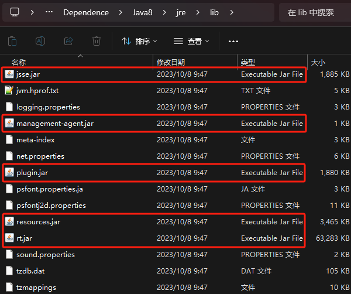

2、扩展类加载器（ExtClassLoader）：负责加载支撑JVM基本运行的，位于JRE的lib目录下的ext扩展目录中的库库。

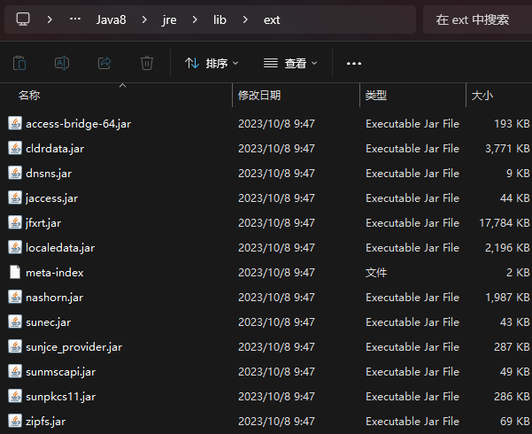

3、应用程序类加载器（AppClassLoader）：负责加载ClassPath路径下的类库，简而言之就是开发人员自己编写的那些类。

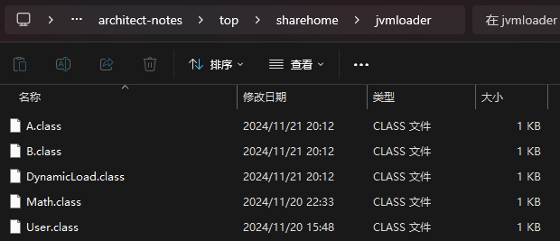

4、自定义加载器：负责加载用户指定路径下的类包，在下面会以打破“双亲委派机制”为例来讨论自定义加载器。

### 类加载器初始化过程

先来看一个类加载器示例代码：

```java
package top.sharehome.jvmloader;

import com.sun.crypto.provider.AESKeyGenerator;
import sun.misc.Launcher;

import java.net.URL;
import java.util.Arrays;
import java.util.Objects;
import java.util.stream.Collectors;

/**
 * 类加载示例
 *
 * @author AntonyCheng
 */
public class LoadClassExample {

    public static void main(String[] args) {
        System.out.println("=======================加载器=======================");
        ClassLoader bootstrapClassLoader = String.class.getClassLoader();
        System.out.println("String类属于核心类库，使用" + bootstrapClassLoader + "加载器");
        ClassLoader extClassLoader = AESKeyGenerator.class.getClassLoader();
        System.out.println("AESKeyGenerator类属于扩展类库，使用" + extClassLoader + "加载器");
        ClassLoader appClassLoader = LoadClassExample.class.getClassLoader();
        System.out.println("LoadClassExample类属于类路径类库，使用" + appClassLoader + "加载器");

        System.out.println("\n===================系统默认加载器====================");
        ClassLoader systemClassLoader = ClassLoader.getSystemClassLoader();
        System.out.println("系统默认加载器：" + systemClassLoader);

        System.out.println("\n======================父加载器======================");
        Object bootstrapClassLoaderParent = Objects.isNull(bootstrapClassLoader) ? "无父加载器" : bootstrapClassLoader.getParent();
        System.out.println("引导类加载器父类是：" + bootstrapClassLoaderParent);
        ClassLoader extClassLoaderParent = extClassLoader.getParent();
        System.out.println("扩展类加载器父类是：" + extClassLoaderParent);
        ClassLoader appClassLoaderParent = appClassLoader.getParent();
        System.out.println("应用类加载器父类是：" + appClassLoaderParent);

        System.out.println("\n=====================加载文件夹=====================");
        String bootstrapClassLoaderPath = Arrays.stream(Launcher.getBootstrapClassPath().getURLs()).map(URL::toString).collect(Collectors.joining(","));
        System.out.println("引导类加载器加载文件夹如下：" + bootstrapClassLoaderPath);
        String extClassLoaderPath = System.getProperty("java.ext.dirs");
        System.out.println("扩展类加载器加载文件夹如下：" + extClassLoaderPath);
        String appClassLoaderPath = System.getProperty("java.class.path");
        System.out.println("应用类加载器加载文件夹如下：" + appClassLoaderPath);
    }

}
```

运行结果如下：

```
=======================加载器=======================
String类属于核心类库，使用null加载器
AESKeyGenerator类属于扩展类库，使用sun.misc.Launcher$ExtClassLoader@5b2133b1加载器
LoadClassExample类属于类路径类库，使用sun.misc.Launcher$AppClassLoader@18b4aac2加载器

===================系统默认加载器====================
系统默认加载器：sun.misc.Launcher$AppClassLoader@18b4aac2

======================父加载器======================
引导类加载器父类是：无父加载器
扩展类加载器父类是：null
应用类加载器父类是：sun.misc.Launcher$ExtClassLoader@5b2133b1

=====================加载文件夹=====================
引导类加载器加载文件夹如下：file:/D:/Dependence/Java8/jre/lib/resources.jar,file:/D:/Dependence/Java8/jre/lib/rt.jar,file:/D:/Dependence/Java8/jre/lib/sunrsasign.jar,file:/D:/Dependence/Java8/jre/lib/jsse.jar,file:/D:/Dependence/Java8/jre/lib/jce.jar,file:/D:/Dependence/Java8/jre/lib/charsets.jar,file:/D:/Dependence/Java8/jre/lib/jfr.jar,file:/D:/Dependence/Java8/jre/classes
扩展类加载器加载文件夹如下：D:\Dependence\Java8\jre\lib\ext;C:\WINDOWS\Sun\Java\lib\ext
应用类加载器加载文件夹如下：D:\Dependence\Java8\jre\lib\charsets.jar;D:\Dependence\Java8\jre\lib\deploy.jar;D:\Dependence\Java8\jre\lib\ext\access-bridge-64.jar;D:\Dependence\Java8\jre\lib\ext\cldrdata.jar;D:\Dependence\Java8\jre\lib\ext\dnsns.jar;D:\Dependence\Java8\jre\lib\ext\jaccess.jar;D:\Dependence\Java8\jre\lib\ext\jfxrt.jar;D:\Dependence\Java8\jre\lib\ext\localedata.jar;D:\Dependence\Java8\jre\lib\ext\nashorn.jar;D:\Dependence\Java8\jre\lib\ext\sunec.jar;D:\Dependence\Java8\jre\lib\ext\sunjce_provider.jar;D:\Dependence\Java8\jre\lib\ext\sunmscapi.jar;D:\Dependence\Java8\jre\lib\ext\sunpkcs11.jar;D:\Dependence\Java8\jre\lib\ext\zipfs.jar;D:\Dependence\Java8\jre\lib\javaws.jar;D:\Dependence\Java8\jre\lib\jce.jar;D:\Dependence\Java8\jre\lib\jfr.jar;D:\Dependence\Java8\jre\lib\jfxswt.jar;D:\Dependence\Java8\jre\lib\jsse.jar;D:\Dependence\Java8\jre\lib\management-agent.jar;D:\Dependence\Java8\jre\lib\plugin.jar;D:\Dependence\Java8\jre\lib\resources.jar;D:\Dependence\Java8\jre\lib\rt.jar;D:\Desktop\github\architect-notes\out\production\architect-notes;D:\JetBrain\IntelliJ IDEA 2023.1.1\lib\idea_rt.jar
```

从运行结果看，有下面三个特点：

1、系统默认加载器是AppClassLoader（不用纠结为什么，这个点不重要）。

2、可以看出它们三个加载器之间存在”父子关系“，即BootstrapClassLoader > ExtClassLoader > AppClassLoader，这种”父子关系“不是类继承关系，而是代码逻辑上的”父子关系“。

3、AppClassLoader最终负责加载的文件夹包括了BootstrapClassLoader和ExtClassLoader两者负责加载的文件夹（==AppClassLoader实际只加载类路径下的类库==）。

接下来就从源码角度讨论一下类加载器初始化问题，上面类运行加载流程图中会创建一个JVM启动器实例sun.misc.Launcher，它初始化使用了单例模式设计，保证一个JVM虚拟机中只有一个sun.misc.Launcher实例。在其构造方法内部会创建两个加载器，分别是ExtClassLoader和AppClassLoader。而JVM默认使用Launcher.getClassLoader()返回AppClassLoader加载我们自己写的应用程序，具体源码如下：

```java
public class Launcher {
    ......
    // 这里可以看出Launcher类初始化时就会实例化一个静态对象，保证其单例特性
    private static Launcher launcher = new Launcher();
    ......
    // 默认类加载器
    private ClassLoader loader;
    ......
    // Launcher构造器
    public Launcher() {
        ExtClassLoader var1;
        try {
            // 构造扩展类加载器，在构造过程中会将其父加载器设置为null
            var1 = Launcher.ExtClassLoader.getExtClassLoader();
        } catch (IOException var10) {
            throw new InternalError("Could not create extension class loader", var10);
        }

        try {
            // 构造应用类加载器，在构造过程中会将其父加载器设置为ExtClassLoader，并且将该值赋值给默认类加载器
            this.loader = Launcher.AppClassLoader.getAppClassLoader(var1);
        } catch (IOException var9) {
            throw new InternalError("Could not create application class loader", var9);
        }
		......
    }

    // 返回默认类加载器，即AppClassLoader
    public ClassLoader getClassLoader() {
        return this.loader;
    }
    ......
}
```

### 双亲委派机制

从刚才源码中就能看出系统默认加载器是AppClassLoader，接下来需要讨论一下它们之间存在的”父子关系“，结合上面运行结果和双亲委派机制原理可以画出如下时序图：

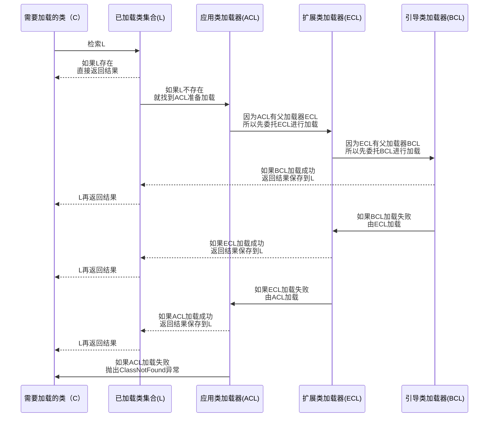

如果再将自定义加载器涵括进流程图，那么简图就如下：

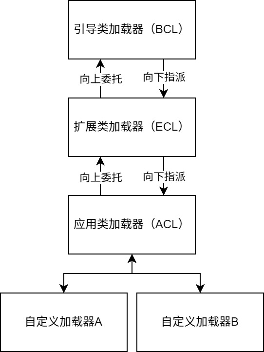

现在对双亲委派机制做一个文字描述：加载某个类时会先委托父加载器寻找目标类，找不到再委托上层父加载器加载，如果所有父加载器在自己的加载类路径下都找不到目标类，则在自己的类加载路径中查找并载入目标类。

举个例子，就比如我们自己写的那个Math类，最先会找应用类加载器准备加载，应用程序类加载器会先委托扩展类加载器加载，扩展类加载器再委托引导类加载器，顶层引导类加载器在自己的类加载路径里找了半天没找到Math类，则向下退回加载Math类的请求，扩展类加载器收到回复就自己加载，在自己的类加载路径里找了半天也没找到Math类，又向下退回Math类的加载请求给应用类加载器，应用类加载器在自己的类加载路径里找Math类，结果就自己加载了。

说简单点就是：**双亲委派机制就是先找到父加载器加载，如果没有父加载器或者父加载器加载不了就会回退指派子加载器加载，如果最终也没加载成功，那就抛出类找不到异常。**

接下来看一下双亲委派机制的源码，具体位置就是`ClassLoader.loadClass(String name,boolean resolve)`方法：

```java
protected Class<?> loadClass(String name, boolean resolve)
    throws ClassNotFoundException
{
    synchronized (getClassLoadingLock(name)) {
        // 检查当前类加载器是否已经加载了该类
        Class<?> c = findLoadedClass(name);
        if (c == null) {
            long t0 = System.nanoTime();
            try {
                if (parent != null) {
                    // 如果当前加载器父加载器不为空则委托父加载器加载该类
                    c = parent.loadClass(name, false);
                } else {
                    // 如果当前加载器父加载器为空则委托引导类加载器加载该类
                    c = findBootstrapClassOrNull(name);
                }
            } catch (ClassNotFoundException e) {
                // 如果最终也没有加载到类，那么就表示c为空
            }

            if (c == null) {
                long t1 = System.nanoTime();
                // 加载器都会调用URLClassLoader的findClass方法在对应路径里查找并加载该类
                c = findClass(name);

                sun.misc.PerfCounter.getParentDelegationTime().addTime(t1 - t0);
                sun.misc.PerfCounter.getFindClassTime().addElapsedTimeFrom(t1);
                sun.misc.PerfCounter.getFindClasses().increment();
            }
        }
        if (resolve) {
            resolveClass(c);
        }
        return c;
    }
}
```

大白话解释一下：

1、首先检查一下指定名称的类是否已经加载过，如果加载过了，就不需要再加载，直接返回。

2、如果此类没有加载过，那么再判断一下是否有父加载器；如果有父加载器，则由父加载器加载（即调用`parent.loadClass(name, false)`）或者是调用引导类加载器来加载。

3、如果父加载器或引导类加载器都没有找到指定的类，那么调用当前类加载器的`findClass()`方法来完成类加载。

**为什么要设计双亲委派机制？**从流程图中就能看出加载类需要经历从子加载器到父加载器再到子加载器的过程，为什么不直接从子加载器到父加载器或者从父加载器到子加载器呢？

1、沙箱安全机制：举个例子，我们自己写的`java.lang.String`类就不会被加载，因为先要委托到父加载器进行加载，父加载器加载的都是属于Java语言自有的核心或扩展类库，这样一来一回就可以防止核心API库被随意修改。另外加载之前还会进行非常多的文件安全校验，进一步保证语言的安全。

2、避免类的重复加载：当父加载器已经加载了该类时，就没有必要子加载器再加载一次，保证被加载类的唯一性。

接下来写一个`java.lang.String`看看运行结果是什么：

```java
package java.lang;

/**
 * 字符串类
 *
 * @author AntonyCheng
 */
public class String {

    public static void main(String[] args) {
        System.out.println("Hello World");
    }

}
```

运行结果如下：

```
错误: 在类 java.lang.String 中找不到 main 方法, 请将 main 方法定义为:
   public static void main(String[] args)
否则 JavaFX 应用程序类必须扩展javafx.application.Application
```

### 全盘负责委托机制

这个了解即可，意思就是当A加载器加载一个类时，除非显式使用另一个类加载器，该类所依赖及引用的类也由A加载器加载。

### 自定义类加载器

自定义类加载器只需要继承java.lang.ClassLoader类，该类有两个核心方法，一个是loadClass(String, boolean)，实现了双亲委派机制，还有一个方法是findClass，默认实现是空方法，所以我们自定义类加载器主要是重写findClass方法。

```java
package top.sharehome.jvmloader;

import java.io.FileInputStream;
import java.io.IOException;
import java.lang.reflect.InvocationTargetException;
import java.lang.reflect.Method;

/**
 * 自定义类加载器
 *
 * @author AntonyCheng
 */
public class CustomizeClassLoader extends ClassLoader {

    private String classPath;

    public CustomizeClassLoader(String classPath) {
        this.classPath = classPath;
    }

    private byte[] loadByte(String name) throws IOException {
        name = name.replaceAll("\\.", "/");
        FileInputStream fileInputStream = new FileInputStream(classPath + "/" + name + ".class");
        byte[] bytes = new byte[fileInputStream.available()];
        fileInputStream.read(bytes);
        fileInputStream.close();
        return bytes;
    }

    @Override
    protected Class<?> findClass(String name) throws ClassNotFoundException {
        try {
            byte[] bytes = loadByte(name);
            // defineClass将一个字节数组转为Class对象，这个字节数组是class文件读取后最终的字节数组。
            return defineClass(name, bytes, 0, bytes.length);
        } catch (IOException e) {
            throw new RuntimeException(e);
        }
    }

    public static void main(String[] args) throws ClassNotFoundException, InstantiationException, IllegalAccessException, NoSuchMethodException, InvocationTargetException {
        // 这里需要把Math.class文件提前放在D:/Desktop/test/top/sharehome/jvmloader目录下
        // 而且要保证类路径、jre相关路径下没有top.sharehome.jvmloader.Math类文件
        CustomizeClassLoader customizeClassLoader = new CustomizeClassLoader("D:/Desktop/test");
        Class<?> clazz = customizeClassLoader.loadClass("top.sharehome.jvmloader.Math");
        System.out.println("加载top.sharehome.jvmloader.Math类的自定义加载器为：" + clazz.getClassLoader().getClass().getName());
        Object obj = clazz.newInstance();
        Method computeAdditionAndMultiplyBy10 = clazz.getDeclaredMethod("computeAdditionAndMultiplyBy10", int.class, int.class);
        Object res = computeAdditionAndMultiplyBy10.invoke(obj, 1, 1);
        System.out.println("调用Math对象的computeAdditionAndMultiplyBy10方法结果为：" + res);
    }

}
```

运行结果如下：

```
加载top.sharehome.jvmloader.Math类的自定义加载器为：top.sharehome.jvmloader.CustomizeClassLoader
调用Math对象的computeAdditionAndMultiplyBy10方法结果为：20
```

### 打破双亲委派机制

自定义类加载器还有一个功能就是可以用其打破双亲委派机制，因为这里不仅可以重写findClass方法，还可以重写loadClass方法，而双亲委派机制的相关代码就是在这个方法中出现的，接下来用自定义类加载器来加载刚刚自己实现的top.sharehome.jvmloader.Math类。

这个和上面有什么区别呢？注意上面示例中有一行重要的注释，即”`要保证类路径、jre相关路径下没有top.sharehome.jvmloader.Math类文件`“，如果没有打破双亲委派机制的情况下需要保证父加载器不能加载到这个文件，才能使用上自定义加载器。如果打破了双亲委派机制，无论类路径或者jre相关路径下是否包含目标类文件都不会被加载。但是要注意：**由于JVM自身安全校验的机制存在，依旧无法打破双亲委派机制去实现类似java.lang.String这样的核心或者拓展类**。打破双亲委派机制代码如下：

```java
package top.sharehome.jvmloader;

import java.io.FileInputStream;
import java.io.IOException;
import java.lang.reflect.InvocationTargetException;
import java.lang.reflect.Method;

/**
 * 帮助打破双亲委派机制的类加载器
 *
 * @author AntonyCheng
 */
public class GodClassLoader extends ClassLoader {

    private final String classPath;

    public GodClassLoader(String classPath) {
        this.classPath = classPath;
    }

    private byte[] loadByte(String name) throws IOException {
        name = name.replaceAll("\\.", "/");
        FileInputStream fileInputStream = new FileInputStream(classPath + "/" + name + ".class");
        byte[] bytes = new byte[fileInputStream.available()];
        fileInputStream.read(bytes);
        fileInputStream.close();
        return bytes;
    }

    @Override
    protected Class<?> findClass(String name) throws ClassNotFoundException {
        try {
            byte[] bytes = loadByte(name);
            // defineClass将一个字节数组转为Class对象，这个字节数组是class文件读取后最终的字节数组。
            return defineClass(name, bytes, 0, bytes.length);
        } catch (IOException e) {
            throw new RuntimeException(e);
        }
    }

    @Override
    protected Class<?> loadClass(String name, boolean resolve) throws ClassNotFoundException {
        synchronized (getClassLoadingLock(name)) {
            // First, check if the class has already been loaded
            Class<?> c = findLoadedClass(name);
            if (c == null) {
                long t0 = System.nanoTime();
                // 打破双亲委派机制，选择直接注释掉这个部分的代码
                // try {
                //     if (parent != null) {
                //         c = parent.loadClass(name, false);
                //     } else {
                //         c = findBootstrapClassOrNull(name);
                //     }
                // } catch (ClassNotFoundException e) {
                //     // ClassNotFoundException thrown if class not found
                //     // from the non-null parent class loader
                // }

                long t1 = System.nanoTime();
                // 由于JVM安全校验机制存在，除了目标类的包下的类，其他类加载依旧遵循双亲委派机制
                if (name.startsWith("top.sharehome.jvmloader")) {
                    c = this.findClass(name);
                } else {
                    c = super.getParent().loadClass(name);
                }
                sun.misc.PerfCounter.getParentDelegationTime().addTime(t1 - t0);
                sun.misc.PerfCounter.getFindClassTime().addElapsedTimeFrom(t1);
                sun.misc.PerfCounter.getFindClasses().increment();
            }
            if (resolve) {
                resolveClass(c);
            }
            return c;
        }
    }

    public static void main(String[] args) throws ClassNotFoundException, InstantiationException, IllegalAccessException, NoSuchMethodException, InvocationTargetException {
        // 这里需要把Math.class文件提前放在D:/Desktop/test/top/sharehome/jvmloader目录下
        GodClassLoader godClassLoader = new GodClassLoader("D:/Desktop/test");
        Class<?> clazz = godClassLoader.loadClass("top.sharehome.jvmloader.Math");
        System.out.println("加载top.sharehome.jvmloader.Math类的自定义加载器为：" + clazz.getClassLoader().getClass().getName());
        Object obj = clazz.newInstance();
        Method computeAdditionAndMultiplyBy10 = clazz.getDeclaredMethod("computeAdditionAndMultiplyBy10", int.class, int.class);
        Object res = computeAdditionAndMultiplyBy10.invoke(obj, 1, 1);
        System.out.println("调用Math对象的computeAdditionAndMultiplyBy10方法结果为：" + res);
    }
}
```

再来确认一次类路径和目标类所在路径的内容，即要求Math.class和User.class（需要User.class文件是因为Math类中依赖User类，根据全盘负责委托机制同样需要打破双亲委派机制）文件都存在。

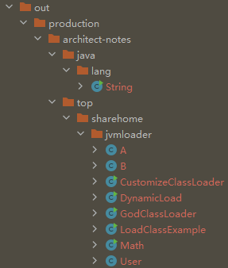

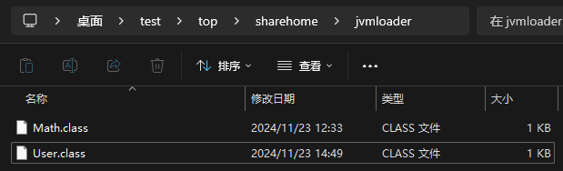

运行效果如下：

```
加载top.sharehome.jvmloader.Math类的自定义加载器为：top.sharehome.jvmloader.GodClassLoader
调用Math对象的computeAdditionAndMultiplyBy10方法结果为：20
```

依旧使用的是GodClassLoader加载器，说明打破双亲委派机制成功。

### Tomcat打破双亲委派机制

先来思考一下，Tomcat是一个Web应用容器，那么它要解决什么问题呢？

1、一个Web应用容器可能需要部署多个应用程序，不同的应用程序可能会依赖同一个第三方类库的不同版本。因此需要保证每个应用程序的类库都是独立且相互隔离的。

2、部署在同一个Web应用容器中的相同类库的相同版本是可以共享的，否则相同重复类库的加载会给服务器带来巨大的运行压力。

3、Web应用容器也有自己所依赖的类库，不能和应用程序的类库混淆。基于安全的考虑，应该让容器类库和程序类库隔离开来。

4、Web应用容器应该支持类似于JSP的文件热加载，即修改相关代码之后不需要重启Web应用容器即可生效。

Tomcat如果使用默认的双亲委派类加载机制行不行？那必然是不行，因为会面临两个问题：

1、如果使用默认的类加载器机制，那么是无法加载两个相同类库的不同版本的，默认的类加器是不管你是什么版本的，只在乎你的全限定类名，并且只有一份。

2、要怎么实现文件热加载呢？以JSP文件为例，JSP文件其实也就是class文件，那么如果修改了，但类名还是一样，类加载器会直接取方法区中已经存在的，修改后的JSP是不会重新加载的。但可以让每个JSP文件对应一个唯一的类加载器，当一个JSP文件修改了，就直接卸载这个JSP类加载器。

Tomcat自定义类加载器简图如下：

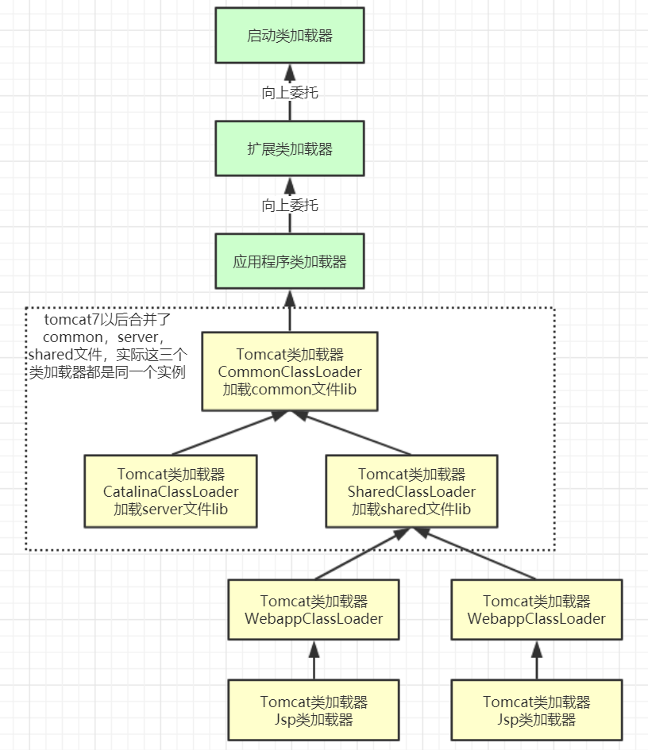

Tomcat的几个主要类加载器：

- CommonLoader：Tomcat最基本的类加载器，加载路径中的class可以被Tomcat容器本身以及各个Webapp访问；
- CatalinaLoader：Tomcat容器私有的类加载器，加载路径中的class对于Webapp不可见；
- SharedLoader：各个Webapp共享的类加载器，加载路径中的class对于所有Webapp可见，但是对于Tomcat容器不可见；
- WebappClassLoader：各个Webapp私有的类加载器，加载路径中的class只对当前Webapp可见，比如加载war包里相关的类，每个war包应用都有自己的WebappClassLoader，实现相互隔离，比如不同war包应用引入了不同的Spring版本，这样实现就能加载各自的Spring版本；

从图中的委派关系中可以看出：

CommonClassLoader能加载的类都可以被CatalinaClassLoader和SharedClassLoader使用，从而实现了公有类库的共用，而CatalinaClassLoader和SharedClassLoader自己能加载的类则与对方相互隔离。

WebAppClassLoader可以使用SharedClassLoader加载到的类，但各个WebAppClassLoader实例之间相互隔离。

而JasperLoader的加载范围仅仅是这个JSP文件所编译出来的那一个.Class文件，它出现的目的就是为了被丢弃：当Web容器检测到JSP文件被修改时，会替换掉目前的JasperLoader的实例，并通过再建立一个新的Jsp类加载器来实现JSP文件的热加载功能。

所以Tomcat这种加载机制违背了Java双亲委派模型了吗？答案是违背了，每个WebappClassLoader加载自己的目录下的class文件，不会传递给父类加载器，打破了双亲委派机制。

如果真要我们自己来实现一个类似的打破双亲委派机制的场景，其实在上一节中就已经完成了，代码是完全可以复用的，但是所要准备的文件有所不同。准备如下图类文件：

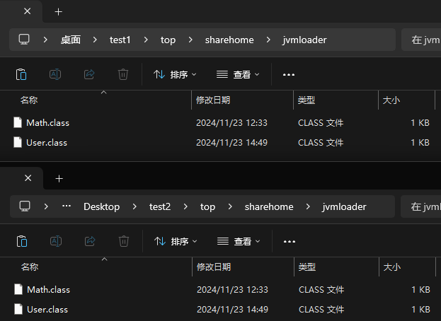

其中Math类有两个版本，一个是：

```java
public class Math {
	......

    static {
        System.out.println("1234567890");
    }
    
    ......
}
```

另一个是：

```java
public class Math {
	......

    static {
        System.out.println("abcdefghij");
    }
    
    ......
}
```

示例代码如下：

```java
package top.sharehome.jvmloader;

import java.io.FileInputStream;
import java.io.IOException;
import java.lang.reflect.InvocationTargetException;
import java.lang.reflect.Method;

/**
 * 自定义类加载器
 *
 * @author AntonyCheng
 */
public class CustomizeClassLoader extends ClassLoader {

    private final String classPath;

    public CustomizeClassLoader(String classPath) {
        this.classPath = classPath;
    }

    private byte[] loadByte(String name) throws IOException {
        name = name.replaceAll("\\.", "/");
        FileInputStream fileInputStream = new FileInputStream(classPath + "/" + name + ".class");
        byte[] bytes = new byte[fileInputStream.available()];
        fileInputStream.read(bytes);
        fileInputStream.close();
        return bytes;
    }

    @Override
    protected Class<?> findClass(String name) throws ClassNotFoundException {
        try {
            byte[] bytes = loadByte(name);
            // defineClass将一个字节数组转为Class对象，这个字节数组是class文件读取后最终的字节数组。
            return defineClass(name, bytes, 0, bytes.length);
        } catch (IOException e) {
            throw new RuntimeException(e);
        }
    }

    public static void main(String[] args) throws ClassNotFoundException, InstantiationException, IllegalAccessException, NoSuchMethodException, InvocationTargetException {
        // 这里需要把Math.class文件提前放在D:/Desktop/test/top/sharehome/jvmloader目录下
        // 而且要保证类路径、jre相关路径下没有top.sharehome.jvmloader.Math类文件
        CustomizeClassLoader customizeClassLoader1 = new CustomizeClassLoader("D:/Desktop/test1");
        Class<?> clazz1 = customizeClassLoader1.loadClass("top.sharehome.jvmloader.Math");
        System.out.println("加载top.sharehome.jvmloader.Math类的自定义加载器为：" + clazz1.getClassLoader().getClass().getName());
        Object obj1 = clazz1.newInstance();
        Method method1 = clazz1.getDeclaredMethod("computeAdditionAndMultiplyBy10", int.class, int.class);
        Object res1 = method1.invoke(obj1, 1, 1);
        System.out.println("调用Math对象的computeAdditionAndMultiplyBy10方法结果为：" + res1);

        System.out.println("=============================================================================");

        CustomizeClassLoader customizeClassLoader2 = new CustomizeClassLoader("D:/Desktop/test2");
        Class<?> clazz2 = customizeClassLoader2.loadClass("top.sharehome.jvmloader.Math");
        System.out.println("加载top.sharehome.jvmloader.Math类的自定义加载器为：" + clazz2.getClassLoader().getClass().getName());
        Object obj2 = clazz2.newInstance();
        Method method2 = clazz2.getDeclaredMethod("computeAdditionAndMultiplyBy10", int.class, int.class);
        Object res2 = method2.invoke(obj2, 1, 1);
        System.out.println("调用Math对象的computeAdditionAndMultiplyBy10方法结果为：" + res2);
    }

}
```

运行效果如下：

```
加载top.sharehome.jvmloader.Math类的自定义加载器为：top.sharehome.jvmloader.CustomizeClassLoader
1234567890
调用Math对象的computeAdditionAndMultiplyBy10方法结果为：20
=============================================================================
加载top.sharehome.jvmloader.Math类的自定义加载器为：top.sharehome.jvmloader.CustomizeClassLoader
abcdefghij
调用Math对象的computeAdditionAndMultiplyBy10方法结果为：20
```

两个静态方法打印结果不同，所以证明运行的是两个同全类名的不同版本的类，简单实现了Tomcat打破双亲委派机制。
